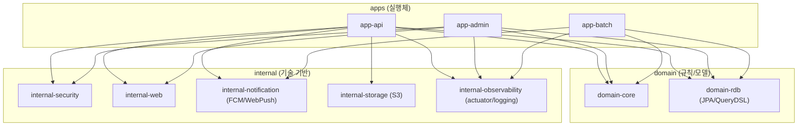

# 우리 프로젝트(tasteam-be)에 멀티 모듈 아키텍처가 필요한 이유

이 문서는 `tasteam-be`(현재 `app-api` 단일 모듈 구성)에서 **멀티 모듈 아키텍처**를 도입해야 하는 근거를 정리한다.
멀티 모듈 자체의 일반론은 `docs/multi-module-architecture.md`에 정리되어 있으며, 본 문서는 “왜 지금 우리에게 필요한가”에 집중한다.

- 배경 문서: `docs/multi-module-architecture.md`

---

## 0) 결론(한 문장)

우리는 **기능별 서버 분리(어드민/배치/API)** 를 전제로 제품을 확장해야 하고, 그 과정에서 **빌드/배포 독립성**, **의존성 폭발 방지**, **역할·책임의 경계 강제**, **다인 협업의 충돌 감소**를 동시에 달성해야 한다.  
멀티 모듈은 이 네 가지 요구를 “폴더 규칙”이 아니라 **빌드/의존성 단위의 구조**로 해결하는 가장 현실적인 선택지다.

---

## 1) 현재 상태(단일 모듈)의 구조적 한계

현재 레포는 Gradle 멀티 프로젝트 형태이긴 하지만, 실제로는 `settings.gradle`에서 `app-api` 하나만 포함한다.
즉, “하나의 실행체에 모든 책임이 들어있는” 상태다.

### 1-1. 서버 분리가 시작되는 순간, 복제/결합이 동시에 발생한다

우리가 원하는 그림은 대략 이렇다.

- API 서버: 외부 사용자 트래픽 처리, REST API 제공
- 어드민 서버: 운영/관리 기능 제공(관리자 권한, 별도 UI/권한 정책)
- 배치 서버: 스케줄/비동기성 작업(정산, 정리, 통계, 알림 발송 등)

단일 모듈 상태에서 위 실행체들을 “별도 프로젝트”로 늘리면,
도메인/정책/공통 로직이 프로젝트마다 복제될 가능성이 높다(나중에는 규칙이 어긋나기 시작).

반대로, 하나의 모듈에 계속 누적하면,
서버별로 필요한 기능/설정/의존성이 뒤섞이며 “어드민 변경이 API 서버에 영향을 주는” 구조가 된다.

우리가 원하는 것은 **실행체는 분리**되되, **도메인 규칙은 한 곳에서 공유**되고,
**서버별 변경이 다른 서버의 빌드/교체에 전염되지 않는** 구조다.

### 1-2. 의존성의 폭발은 곧 운영 리스크다

현재 `app-api`는 Web/Security/OAuth2/JPA/Flyway/QueryDSL/Actuator/OpenAPI/FCM/WebPush/S3 등
여러 성격의 의존성을 한데 갖고 있다.

이 상태에서 배치/어드민까지 같은 모듈에 포함되면:

- “배치만 필요”한 실행체도 웹/스웨거/보안 웹 설정을 같이 끌고 오거나
- 반대로 “API 서버만 필요”한 실행체도 스케줄러/배치 관련 설정이 섞이거나
- Spring Boot의 자동 설정(클래스패스 기반)이 불필요하게 발동해 예측성이 떨어질 수 있다

의존성은 단순히 jar 개수가 아니라 “동작의 표면적”이다.
실행체가 늘어날수록, 단일 모듈의 의존성 누적은 곧 운영 리스크 증가로 이어진다.

### 1-3. 역할·책임 경계가 “의도”로만 남는다

현재도 패키지 레벨에서 `domain`, `infra`, `global` 등을 구분하고 있지만,
패키지 경계는 “원하면 언제든지 깨질 수 있는” 규칙이다.

예를 들어:

- 도메인 규칙이 컨트롤러/서비스에 새어 나가도 컴파일은 된다
- 배치 로직이 API 모듈의 빈/설정에 기대기 시작해도 막기 어렵다
- 어드민 전용 정책이 API의 전역 보안 설정에 섞여도(혹은 반대로) 리뷰로만 막아야 한다

즉, 단일 모듈은 경계를 “권고”할 수는 있어도 “강제”하기 어렵다.

### 1-4. 다인 협업에서는 충돌 비용이 눈덩이처럼 커진다

서버/도메인/인프라가 한 프로젝트에 섞인 상태에서 사람이 늘면:

- 같은 파일/패키지에 대한 수정 빈도가 높아져 충돌(merge conflict) 증가
- 리뷰 범위가 커져 PR당 인지 부하가 상승
- “어디까지가 내 책임인가”가 모호해져 코드 오너십이 약해짐

멀티 모듈은 협업 문제를 “사람이 조심하자”가 아니라, **구조로 분리해 충돌 면적을 줄이는 방식**으로 해결한다.

---

## 2) 우리 니즈에 대한 멀티 모듈의 직접적인 해답

요구사항(니즈)을 하나씩 “구조로 어떻게 해결하는지”로 매핑한다.

### 2-1. 기능별 서버 분리(어드민/배치/API) + 빌드/배포 독립성

요구:

- 어드민 서버, 배치 서버, API 서버로 분리해야 한다
- A 서버 변경이 B 서버 빌드/교체에 영향을 주면 안 된다

멀티 모듈 해법:

- 실행체를 각각 **별도 Application 모듈**로 만든다.
  - `app-api`, `app-admin`, `app-batch` (예시)
- 공통 도메인 규칙은 **Domain 모듈**에서 공유한다.
- 서버별 설정/의존성은 각 app 모듈에만 둔다.

이 구조가 되면:

- 어드민 기능 추가/수정은 기본적으로 `app-admin`만 변경한다
- 배치 스케줄/잡 수정은 `app-batch`만 변경한다
- API 엔드포인트 변경은 `app-api`만 변경한다

그리고 CI/CD에서도:

- 변경된 모듈만 빌드/테스트/배포하는 파이프라인을 구성할 수 있다(선택적 빌드).

### 2-2. 의존성 관리와 빌드 관리

요구:

- 서버별 필요한 의존성이 다르다
- 불필요한 의존성 전파를 막고 싶다
- 빌드 시간이 커지는 것을 통제하고 싶다

멀티 모듈 해법:

- “도메인 규칙”은 `domain-*` 모듈로 분리하고, web/security 같은 실행체 의존성을 끊는다.
- 외부 연동(S3/FCM/WebPush 등)은 `internal-*` 또는 `infra-*` 모듈로 분리한다.
- Gradle의 `api`/`implementation`로 “전이 의존 노출”을 통제한다.
  - 특히 app 모듈에서는 `implementation`을 중심으로 “조립자의 디테일이 바깥으로 새지 않게” 설계할 수 있다.

결과:

- 배치 서버가 웹/스웨거 의존성을 갖지 않아도 된다
- API 서버가 배치 스케줄러 관련 의존성을 갖지 않아도 된다
- 의존성이 줄어들면 Spring Boot 자동 설정의 발동 범위도 줄어 예측성이 좋아진다

### 2-3. 역할·책임 분리(모듈 경계로 강제)

요구:

- “도메인/인프라/실행체”의 책임이 섞이지 않게 하고 싶다
- 공통 모듈이 비대해지지 않게 통제하고 싶다

멀티 모듈 해법:

- 모듈 경계를 “컴파일/의존성 단위”로 만들면 규칙을 강제하기 쉬워진다.
- 예를 들어 다음 원칙을 구조로 강제할 수 있다.
  - `domain-*`은 `app-*`를 의존하지 못한다(실행 디테일 차단)
  - `internal-*`은 `domain-*`을 의존하지 못한다(기술 기반이 도메인 규칙을 끌어안지 않게)
  - `common`은 최소 기반만(“없을수록 좋다” 원칙)

패키지 규칙은 깨기 쉽지만, 모듈 규칙은 깨면 “빌드가 깨진다”.
즉, 리뷰/합의만으로 지키던 원칙을 시스템적으로 강제할 수 있다.

### 2-4. 여러 사람의 공동 작업(오너십/충돌/리뷰 비용)

요구:

- 여러 사람이 동시에 기능을 개발해야 한다
- 서로의 작업이 불필요하게 충돌하지 않아야 한다
- 리뷰 범위를 줄이고, 변경 영향 범위를 모듈로 가늠할 수 있어야 한다

멀티 모듈 해법:

- 모듈 단위로 “작업의 단위”가 나뉘면, 파일 충돌 면적이 줄어든다.
- 모듈별 README/역할 정의로 오너십이 생기고, 리뷰 기준도 명확해진다.
- 변경 영향 범위를 “어떤 모듈이 바뀌었나”로 1차 필터링 할 수 있다.

---

## 3) 우리 프로젝트에 맞는 목표 구조(제안)

지금 당장 완벽한 5계층을 만드는 것보다, “서버 분리”와 “의존성/책임 경계”를 먼저 달성하는 것이 현실적이다.
아래는 우리 니즈에 맞춘 최소 구조 제안이다.

### 3-1. 제안 모듈 트리(초기)

설명:

- `app-*`는 실행체 단위(서버 단위)로 분리한다.
- `domain-*`는 비즈니스 규칙을 모은다. (특히 “웹/스케줄/외부연동” 의존을 끊는다)
- `internal-*`는 기술 기반을 모은다. (단, `domain-*` 의존 금지)

이 구조를 기준으로 “어드민/배치/API” 분리를 시작하면,
도메인 복제 없이 실행체를 늘릴 수 있고, 의존성도 서버별로 분리할 수 있다.

### 3-2. 도메인 쪼개기(확장 단계)

초기에는 `domain-core`, `domain-rdb` 정도로 시작하되,
도메인이 커지면 `domain-member`, `domain-group` 등으로 **업무 도메인 기준 분리**를 고려할 수 있다.

주의:

- 너무 이른 과도한 분리는 오히려 개발 속도를 늦춘다.
- 모듈 분리는 “지금의 팀 규모/배포 단위/변경 빈도”에 맞춰 점진적으로 하는 것이 좋다.

---

## 4) 도입 효과를 “검증 가능”하게 만들기(성공 기준)

문서가 설득력 있으려면 “좋다”가 아니라 “검증 가능”해야 한다.
멀티 모듈 도입 후 아래 항목이 개선되는지 추적하자.

1. 서버 분리 독립성
   - 배치 변경이 API 서버 배포에 영향을 주지 않는가?
   - 어드민 변경이 API 서버 배포에 영향을 주지 않는가?
2. 빌드/테스트 시간
   - 변경 모듈만 빌드/테스트하도록 파이프라인을 분리했는가?
3. 의존성 표면적
   - 배치 서버가 web/openapi 의존성을 제거했는가?
   - API 서버가 배치 스케줄러/잡 의존성을 제거했는가?
4. 협업 비용
   - 충돌 빈도/리뷰 크기(변경 파일 수, 영향 범위)가 줄었는가?

---

## 5) 리스크와 대응

멀티 모듈은 만능이 아니다. 원문에서도 “common이 비대해지는 실패”를 강조한다.
우리 프로젝트에서도 아래 리스크를 의식적으로 관리해야 한다.

1. 과도한 모듈 분리
   - 대응: “서버 분리 + 핵심 경계”부터, 점진적 분리
2. 순환 의존(Cyclic Dependency)
   - 대응: 의존 매트릭스(허용/금지) 문서화 + Gradle로 강제
3. 공통 모듈 비대화
   - 대응: `common`은 최소 기반만(가능하면 외부 의존성 0)
4. 지식 단절(모듈이 늘면 오히려 이해가 어려움)
   - 대응: 모듈 README, 의존 규칙, 예제/가이드 문서 유지

---

## 6) 다음 액션(문서 관점)

이 문서는 “필요성”을 정리한 근거 문서다.
다음 문서가 이어지면 멀티 모듈 도입이 실행 가능한 계획으로 바뀐다.

- (다음 문서 후보) `tasteam-be` 멀티 모듈 전환 로드맵(단계별 모듈 분리 계획)
- (다음 문서 후보) 모듈 의존 규칙 및 네이밍 컨벤션(allow/deny 리스트)
- (다음 문서 후보) CI/CD에서 “변경 모듈만 빌드/배포”하는 전략
