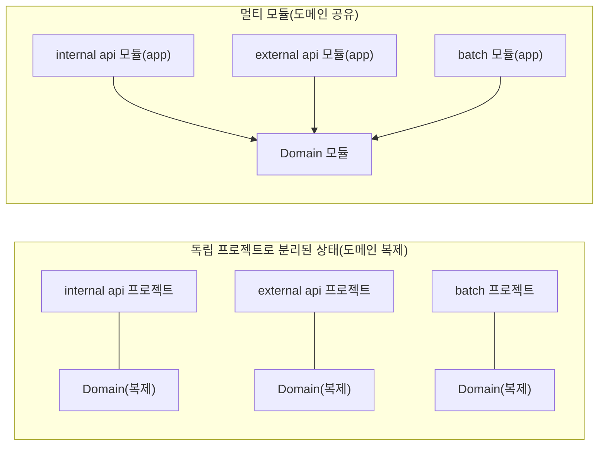
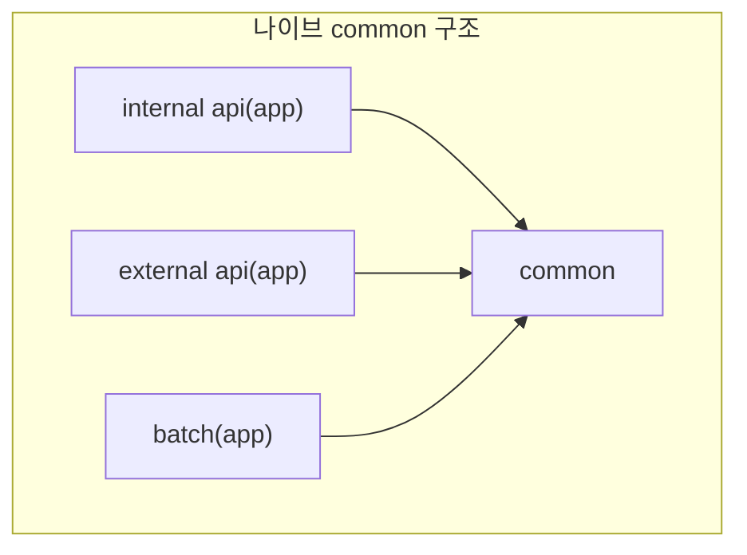
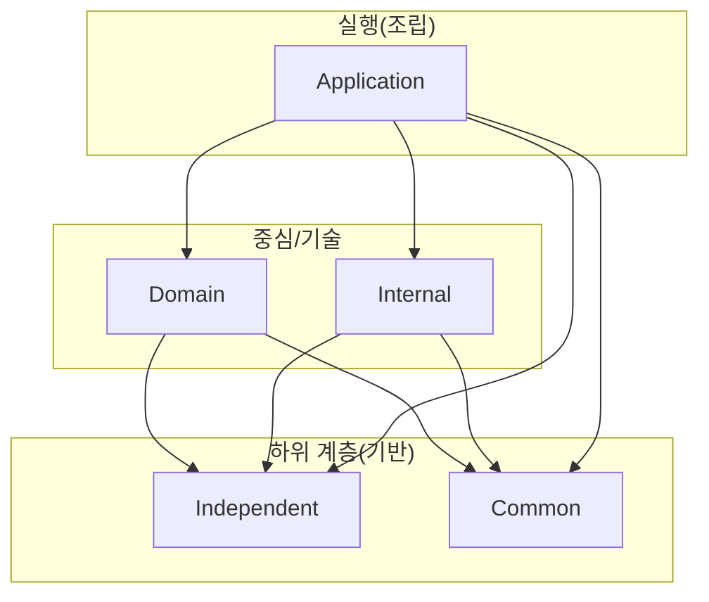
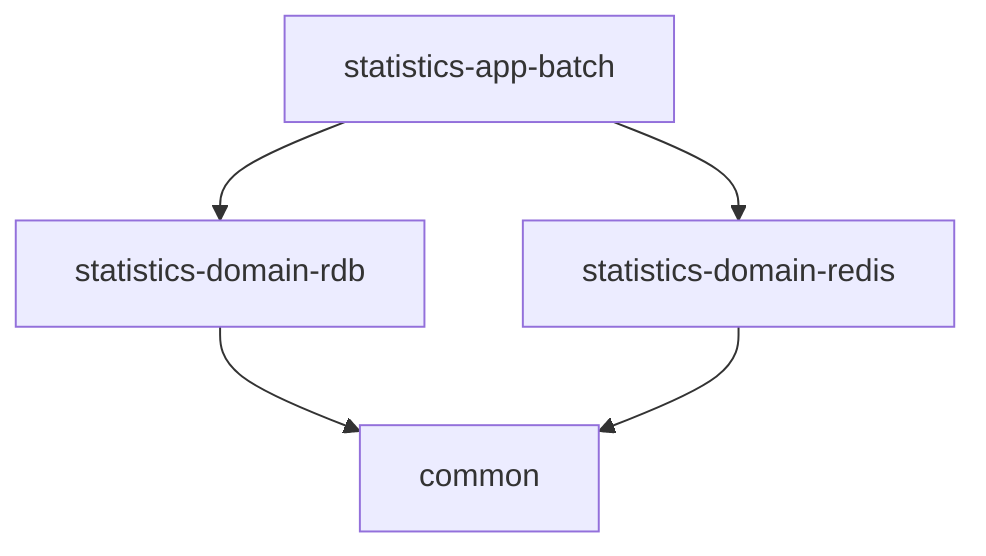
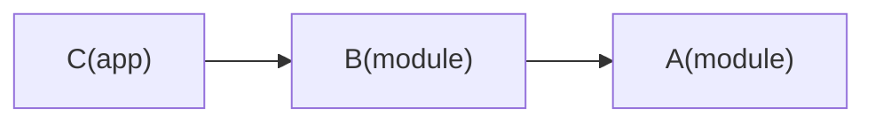

# 멀티 모듈 아키텍처: 상세 분석과 설계/운영 가이드

이 문서는 우아한형제들 기술블로그의 「멀티모듈 설계 이야기 with Spring, Gradle」(2019-07-01, 권용근)을 기반으로 한다.

원문: https://techblog.woowahan.com/2637/

---

## 1) 멀티 모듈 프로젝트란?

멀티 모듈 프로젝트는 **하나의 시스템(System)** 을 여러 **모듈(Module)** 로 나눠 한 레포(한 빌드)에서 함께 운영하는 방식이다.
실무에서는 보통 “서로 다른 실행체”들이 하나의 도메인 규칙을 공유해야 하는 상황에서 출발한다.

예를 들어 아래처럼 내부/외부 API, 배치가 각각 별도의 프로젝트로 존재하면:

- `member internal api`
- `member external api`
- `member batch`

각 프로젝트가 자기 방식으로 `Domain`을 구현/복사하면서 도메인 규칙이 쉽게 어긋난다.
멀티 모듈은 이를 “실행 모듈은 나누되, 도메인 모듈은 공유”하는 구조로 바꿔서 일관성을 확보한다.



---

## 2) 실패한 멀티 모듈: `common`의 저주

멀티 모듈을 처음 적용할 때 가장 흔한 접근은 “공통 코드를 `common`에 모으자”다.
하지만 원문은 이 접근이 멀티 모듈의 장점을 지우고, 오히려 더 큰 결합도를 만든다고 경고한다.



### 2-1. 스파게티 코드

공통 모듈에 무엇이든 넣기 시작하면, 호출 흐름이 `common`을 중심으로 얽히기 쉽다.
리팩터링이나 기능 제거(F/O)를 하려 하면 “영향 범위가 어디까지인가?”가 항상 문제다.
대개 답은 “전체 시스템”이 된다.

원문에서 이야기하는 스파게티의 핵심은 **모듈 경계가 ‘기술적/도메인적’ 의미를 잃는 것**이다.
즉, `common`이 “공통”이 아니라 “대부분의 비즈니스가 들어있는 장소”로 변한다.

### 2-2. 의존성 덩어리(Dependency Heap)

`common`이 커질수록 의존성도 같이 커진다.
웹/JPA/Redis 등 여러 의존성이 한 모듈에 합쳐지고, 그 모듈을 의존하는 모든 실행체는
필요 없는 의존성까지 같이 가져가게 된다.

Spring Boot에서는 “의존성의 존재”만으로도 자동 설정이 발동하는 경우가 많아,
불필요한 의존성 전파는 곧:

- 불필요한 빈 생성
- 불필요한 설정 로딩/충돌
- 예상치 못한 런타임 동작

으로 이어질 수 있다.

### 2-3. 공통 설정(Common Config)의 함정

공통 모듈에 설정까지 몰면 더 위험해진다.
예를 들어 connection pool, thread pool 같은 자원을 “가장 빡센 실행체 기준”으로 잡아두면:

- DB를 쓰지 않는 앱이 DB 커넥션을 소비하거나
- 특정 앱에 맞춘 설정이 다른 앱에 부작용을 내거나
- 실행체별 튜닝이 사실상 불가능해진다

결론: 멀티 모듈의 핵심은 “공통을 모으기”가 아니라 **책임 경계와 의존 방향을 설계하는 것**이다.

---

## 3) “레이어드 아키텍처”와 “모듈 아키텍처”는 관점이 다르다

원문은 멀티 모듈을 “레이어드 아키텍처(Controller/Service/Repository)처럼 수평 관점으로만” 보면 실패한다고 말한다.

- 레이어드 아키텍처: 코드 구조를 수평으로 분리(패키지/클래스 레벨)
- 멀티 모듈 아키텍처: 시스템을 모듈(프로젝트) 단위로 수직 분해(빌드/배포/의존성 레벨)

그래서 “레이어를 모듈로 그대로 옮기자”가 아니라,
**모듈이 무엇을 의미하는지(역할/책임/추상화 수준/의존 관계)** 를 먼저 합의해야 한다.

---

## 4) 모듈(Module)의 특성(원문이 제시하는 기준)

원문은 모듈을 단순 폴더/패키지가 아니라, 다음과 같은 특성을 가진 단위로 본다.

1. **모듈 자체의 의미가 있어야 한다**
   - 이름만 나뉜 ‘빈 껍데기’가 아니라, 책임과 목적이 분명해야 한다.
2. **계층적으로 추상화되어 있어야 한다**
   - 모듈마다 추상화 수준이 있고(상/하위), 상위는 하위를 조립하며 하위는 상위를 모른다.
3. **구현(의존) 관계가 명확해야 한다**
   - “어디가 어디를 참조할 수 있는지”가 규칙으로 정해져야 한다(그리고 강제할 수 있어야 한다).

이 기준이 없으면 멀티 모듈은 결국 “폴더만 나뉜 단일 프로젝트”가 되거나, “`common` 덩어리”로 회귀한다.

---

## 5) 5계층 멀티 모듈 아키텍처(원문 핵심)

원문은 멀티 모듈을 아래 5계층으로 나누어 책임과 의존성을 분리한다.

- 독립 모듈 계층(Independent)
- 공통 모듈 계층(Common)
- 도메인 모듈 계층(Domain)
- 내부 모듈 계층(Internal)
- 어플리케이션 모듈 계층(Application)

### 5-1. 허용 의존성 매트릭스(O/X)

원문은 “각 계층이 어떤 모듈을 사용할 수 있는가”를 O/X로 정리한다.
표를 문서용으로 다시 풀어쓰면 아래와 같다.

| 모듈 계층(나) \\ 의존 대상(사용) | Application | Internal | Domain | Independent | Common |
| --- | --- | --- | --- | --- | --- |
| Independent | X | X | X | X | X |
| Common | X | X | X | X | X |
| Domain | X | X | O | O | O |
| Internal | X | O | X | O | O |
| Application | X | O | O | O | O |

여기서 중요한 메시지:

- **Independent/Common은 어떤 모듈에도 의존하지 않는다.** (가장 아래의 기반)
- **Domain은 Internal/Application을 의존하지 않는다.** (비즈니스/실행 디테일이 도메인에 들어오지 않게)
- **Internal은 Domain을 의존하지 않는다.** (기술 기반이 도메인 규칙을 끌어안지 않게)
- **Application만이 조립자**로서 Domain/Internal 등을 함께 사용한다.

### 5-2. 의존 흐름(그림)



---

## 6) 계층별 역할/규칙/예시(디테일)

### 6-1. 독립 모듈(Independent)

**한 줄 정의**
- 시스템과 무관하게 “라이브러리처럼” 분리 가능한 모듈

**규칙**
- 다른 모듈을 의존하지 않는다(프로젝트 내에서 독립).
- 범용성이 높아야 하며, 마음먹으면 별도 저장소로 옮길 수 있어야 한다.

**원문 예시**
- `yaml-importer`
- `data-dynamo-reactive`

**왜 필요한가**
- 프로젝트 안에서 재사용되는 도구 중 “도메인/시스템 지식이 필요 없는 것”을 분리해
  시스템 변화(도메인 변경)와 독립적으로 발전시키기 위함이다.

### 6-2. 공통 모듈(Common)

**한 줄 정의**
- “정말 최소한”의 공통 타입/유틸만 담는 얇은 모듈

**규칙(강하게)**
- 외부 라이브러리 의존성을 넣지 않는다.
- 가능하면 오직 Java 코드(클래스/인터페이스) 수준으로 유지한다.

원문은 공통 모듈을 이렇게까지 얇게 만들기 위해, 예시로 `dependencies { }`가 비어있는 형태를 보여준다.

```gradle
// common/build.gradle (개념 예시)
dependencies {
  // intentionally empty
}
```

**주의**
- 공통 모듈은 “공통 기능”을 담기 시작하는 순간, 2장에서 말한 스파게티/의존성 덩어리/공통 설정 문제가 재발한다.

### 6-3. 도메인 모듈(Domain)

**한 줄 정의**
- 시스템의 중심 도메인 모델/규칙을 담는 계층

**원문 메시지**
- 도메인 모듈은 서비스 비즈니스를 몰라도 이해될 수 있어야 한다(도메인 자체의 규칙).
- 그리고 도메인 모듈은 인프라스트럭처 조합이 복잡해질수록 “더 잘 쪼개야” 한다.

#### 6-3-1. “하나의 도메인 모듈 = 하나의 인프라” 원칙

원문은 도메인 모듈이 여러 인프라를 한꺼번에 책임지지 않게 제한한다.

예시 시나리오(원문 흐름 재구성):

- 통계(Statistics)를 만들고 싶다
- 요구 사항:
  - 스케줄링으로 일정 주기마다 계산
  - 결과는 MySQL에 저장
  - “중간 상태”는 Redis에 임시 저장

이걸 한 도메인 모듈에 몰아넣으면:
- MySQL 의존 + Redis 의존 + 스케줄링 의존이 한 덩어리가 되고,
- 재사용/교체/테스트/운영 모두 복잡해진다.

그래서 원문은 인프라별로 분리하는 방향을 권한다(이름은 예시).



#### 6-3-2. 도메인 모듈 내부 구성 요소(개념)

원문은 도메인 모듈을 대략 아래 구성으로 바라본다.

- Domain Model: 엔티티/값 객체/도메인 규칙
- Repository: 영속화 경계(저장/조회)
- Domain Service: 단일 엔티티로 표현하기 어려운 도메인 규칙

그리고 Domain Service에 대해, 실무에서 많이 모이는 책임들을 예로 든다.

- 트랜잭션 경계(커밋/롤백)
- 요청 값 유효성 검증
- 도메인 이벤트 발행

포인트는 “이 책임을 무조건 도메인에 넣어라”가 아니라,
도메인이 앱 모듈로 새어 나가면 결국 다시 복제/불일치가 시작된다는 점이다.

### 6-4. 내부 모듈(Internal)

**한 줄 정의**
- 시스템 전반을 보조하는 “기술 기반” 모듈(웹 공통 설정, 외부 연동 클라이언트, 이벤트 퍼블리셔 등)

**규칙(매우 중요)**
- 도메인/비즈니스 의존을 금지한다.
- 도메인 모듈을 의존하지 않는다.

왜냐하면 Internal이 Domain을 의존하는 순간:

- Internal이 사실상 “공통 비즈니스 모듈(common)”처럼 변하고
- Internal을 재사용/교체하기 어렵고
- 시스템 결합도가 다시 올라가기 때문이다

### 6-5. 어플리케이션 모듈(Application)

**한 줄 정의**
- 실제로 실행되는 모듈(배치, internal/external API 등)

**규칙**
- 조립자(Assembler)로서 하위 모듈(Domain/Internal/Independent/Common)을 선택적으로 결합한다.
- 가능한 `-app-` 같은 접미사로 실행 모듈임을 드러낸다.

---

## 7) 멀티 모듈 구성 효과(원문이 강조한 2가지)

### 7-1. 명확한 추상화 경계

모듈 계층별 책임이 명확하면 다음이 쉬워진다.

- 코드를 어디에 두어야 하는지 결정
- 리팩터링 영향 범위 파악
- 기능 제거(F/O) 시 안전한 제거 단위 설정

즉, 멀티 모듈은 “새 구조를 만든다”기보다 “변화 비용을 낮춘다”는 효과에 가깝다.

### 7-2. 최소 의존성

모듈마다 필요한 의존성만 포함하면:

- 불필요한 AutoConfiguration 발동을 줄이고
- 설정 충돌 확률을 낮추고
- 실행체별로 “예측 가능한 환경”을 만든다

Spring Boot 기반 시스템에서 의존성은 곧 동작이다.
그래서 의존성 최소화는 성능 최적화가 아니라 **안정성과 예측 가능성**에 더 가까운 가치다.

---

## 8) 의존 관계를 ‘완성’시키는 운영 디테일(실무 포인트)

원문은 “모듈만 잘 나눠서는 끝이 아니다”라고 말한다.
멀티 모듈을 실제로 쓰기 좋게 만들려면 다음 운영 디테일이 함께 갖춰져야 한다.

### 8-1. 모듈 의존성만 추가하면 설정도 따라오게 만들기 (Configuration Property)

현실의 문제:

- `application.yml`에 모듈이 늘 때마다 `spring.profiles.include` 등을 추가해야 한다
- 즉, “모듈을 의존했는데 동작은 안 함(설정까지 켜야 함)”이 반복된다

원문은 이를 해결하기 위해:

- 모듈이 제공하는 YAML을
- 애플리케이션 부팅 초기에 자동으로 environment에 주입

하는 아이디어를 제시한다.

구현 힌트로는:

- `EnvironmentPostProcessor`를 사용
- 그리고 이 클래스는 `spring.factories`로 등록해, 앱에서 별도 설정 없이도 동작하게

같은 포인트를 언급한다.

핵심은 “프로필 토글”이 아니라, **모듈 의존성만으로 설정까지 구성되는 경험**을 만드는 것이다.

### 8-2. 컴포넌트 스캔도 ‘모듈 추가만으로’ 끝내기 (Component Scan)

원문은 컴포넌트 스캔/자동 등록을 위해 고려할 수 있는 방법들을 언급한다.

- `spring.factories`로 자동 로딩(주로 시스템과 무관한/범용 모듈에 적합)
- `@SpringBootApplication(scanBasePackages=...)`로 스캔 범위 확장(하지만 모듈 추가 때마다 수정이 발생)

그리고 실무적으로는 “컨벤션으로 해결”을 선택한다.

- 모든 모듈이 동일 상위 패키지(예: `com.baemin.xxx`) 아래에 있도록 구성
- 실행 모듈의 `@SpringBootApplication` 클래스를 그 상위에 배치

이렇게 하면:

- 모듈이 추가되어도
- 스캔 설정은 건드리지 않고
- 자연스럽게 빈이 스캔된다

### 8-3. 접근 개방/폐쇄(Open/Close): Gradle `api` vs `implementation`

원문은 모듈 경계를 “사람이 지키는 규칙”으로만 두지 말고,
Gradle의 의존성 전파 규칙으로 강제하는 방법을 소개한다.

핵심 그림은 다음 질문으로 요약된다.

- “A를 쓰고 싶어서 B를 의존했는데, B가 의존하는 A까지 C(상위)가 마음대로 써도 되는가?”

Gradle에서는:

- `api`로 의존하면 전이 의존이 외부로 노출된다
- `implementation`으로 의존하면 전이 의존이 숨겨진다

예를 들어:



`B`가 `A`를 `api`로 노출하면 `C`는 `A` 타입을 직접 사용할 수 있고,
`implementation`이면 `C`는 `A`에 직접 접근하기 어렵다(전이 의존이 숨겨짐).

Gradle 예시로 풀면 아래 차이다.

```gradle
// B/build.gradle
dependencies {
  api(project(":A"))            // C는 A의 타입을 직접 참조 가능(전이 노출)
  // implementation(project(":A")) // C는 A를 직접 쓰려면 C가 A를 명시적으로 의존해야 함(전이 숨김)
}
```

즉 `implementation`은 “내부 구현 디테일을 바깥으로 새지 않게” 하는 장치로 볼 수 있다.

원문은 이 특성을 활용해:

- 특히 **Application 계층은 `implementation`을 적극 사용**하여
- “조립자(app)가 참조하는 하위 디테일이 외부로 새지 않게” 만드는 방향을 제시한다.

### 8-4. 모듈별 README는 필수(지식의 경계도 함께)

멀티 모듈은 구조가 정교해질수록 “처음 보는 사람”에게 어렵다.
원문은 각 모듈에 README를 두어, 의도와 규칙을 모듈 단위로 유지하는 것을 강조한다.

README에 담을 최소 항목 예시:

- 역할/책임(무엇을 하고 무엇을 하지 않는지)
- 제공하는 빈/설정(자동 로딩 여부 포함)
- 공개 API(외부에서 써도 되는 패키지/클래스)
- 확장 포인트(override/customizer)

### 8-5. 확장과 사용자 정의 여지 개방(Override / Customizer)

원문은 하위 모듈이 기본 구현을 제공하되,
상위 모듈에서 요구가 있을 때 “안전하게 교체/확장”할 수 있는 지점을 마련하라고 말한다.

대표 패턴:

- `@ConditionalOnMissingBean`으로 기본 빈 제공 + 상위에서 오버라이드 허용
- Customizer 패턴(특정 동작을 바꾸기 위한 커스터마이저 인터페이스를 열어두고, 상위가 구현을 제공)

개념 예시(패턴 설명용):

```java
// internal 모듈: 기본 제공
@Configuration
class WebDefaults {
  @Bean
  @ConditionalOnMissingBean
  public HeaderPolicy headerPolicy() {
    return HeaderPolicy.strict();
  }
}

// app 모듈: 필요하면 교체
@Configuration
class AppOverrides {
  @Bean
  public HeaderPolicy headerPolicy() {
    return HeaderPolicy.relaxed();
  }
}
```

Customizer 패턴은 보통 이런 모양이 된다(원문은 Jackson 커스터마이저를 예로 든다).

```java
public interface SomethingCustomizer {
  void customize(SomethingBuilder builder);
}

@Configuration
class SomethingAutoConfiguration {
  @Bean
  public Something something(List<SomethingCustomizer> customizers) {
    SomethingBuilder builder = new SomethingBuilder();
    for (SomethingCustomizer c : customizers) {
      c.customize(builder);
    }
    return builder.build();
  }
}
```

이 방식의 장점은:

- 기본 동작은 internal/domain에서 책임지고
- “예외 케이스”만 app에서 제한적으로 확장

하게 만들어, 공통 모듈이 다시 비대해지는 것을 막는 데 도움이 된다.

---

## 9) 결론: 멀티 모듈의 본질은 ‘공유’가 아니라 ‘경계’

원문이 실제 여러 프로젝트 경험에서 끌어낸 결론은 명확하다.

- 멀티 모듈을 “공통을 모으는 구조”로 이해하면 실패한다.
- 멀티 모듈은 “시스템을 책임 단위로 분해하고, 의존 방향을 제어하는 구조”다.
- 구조만 만들고 끝내면 반쪽짜리다. 설정 로딩, 컴포넌트 스캔, 의존성 전파 제어,
  모듈 README, 확장 포인트까지 포함해 “사용 경험”을 완성해야 한다.

---

## 참고 링크(원문에서 함께 언급)

- 원문(우아한형제들 기술블로그): https://techblog.woowahan.com/2637/
- 멀티 프로젝트 관련 글(원문에 함께 링크됨): https://jojoldu.tistory.com/123
