| 항목 | 내용 |
|---|---|
| 문서 제목 | 비동기 이벤트 드리븐 아키텍처 개선 허브 |
| 문서 목적 | 현재 백엔드의 알림, 사용자 이벤트 수집, MQ 소비, 멱등성, outbox 구조에서 개선이 필요한 지점을 코드 기준으로 정리하고 우선순위를 고정한다. |
| 작성 및 관리 | Backend Team |
| 최초 작성일 | 2026.03.10 |
| 최종 수정일 | 2026.03.10 |
| 문서 버전 | v1.0 |

 

# 비동기 이벤트 드리븐 아키텍처 개선 허브

---

# **[1] 배경과 목표 (Background & Objective)**

## **[1-1] 배경**

- 현재 비동기 구조는 알림과 사용자 이벤트 수집을 중심으로 빠르게 확장되었다.
- `notification`, `message-queue`, `user-activity` 모듈이 각각 역할을 나눠 가지고 있지만, 실제 런타임 경로는 `AFTER_COMMIT` listener, outbox, MQ, direct async listener가 섞여 있다.
- 구조는 이미 운영 가능한 수준까지 올라왔지만, 원자성, 중복 억제, 부분 실패 복구, 환경별 완결성, 식별자 계약 같은 운영 핵심 보장이 아직 균일하지 않다.

## **[1-2] 목표**

- 현재 구현 기준으로 개선이 필요한 지점을 코드/설정/테이블 단위로 분해한다.
- 현재 구조와 목표 구조를 분리해 후속 구현 우선순위를 고정한다.
- 알림, 사용자 이벤트, MQ 소비, 멱등성 계약을 하나의 문서군으로 묶어 개별 모듈 문서 사이에 흩어진 개선 포인트를 수렴시킨다.

## **[1-3] 범위**

범위:
- `com.tasteam.domain.notification`
- `com.tasteam.domain.analytics`
- `com.tasteam.infra.messagequeue`
- 관련 설정(`application.yml`)과 Flyway 마이그레이션

비범위:
- Kafka provider 실제 구현
- 외부 분석 sink 다중화
- 알림 템플릿/콘텐츠 정책 자체 개편

---

# **[2] 모듈 구조 (Module Structure)**

## **[2-1] 문서 구성**

| 문서 | 목적 |
|---|---|
| `README.md` | 개선 허브, 우선순위, 런타임 흐름, 설정 계약 |
| `transactional-outbox-atomicity.md` | 비즈니스 변경과 outbox 적재 원자성 개선 |
| `notification-pipeline-unification.md` | 알림 비동기 경로 단일화 개선 |
| `mq-retry-dlq-reclaim.md` | MQ 재처리, DLQ, pending reclaim 개선 |
| `user-activity-completeness.md` | 사용자 이벤트 수집 완결성 개선 |
| `event-id-idempotency.md` | 이벤트 ID, request ID, delivery ID, 멱등성 계약 개선 |

## **[2-2] 현재 코드 경계**

| 영역 | 주요 패키지/클래스 | 현재 책임 |
|---|---|---|
| 알림 요청 생성 | `NotificationEventListener`, `NotificationDomainEventListener`, `ChatNotificationEventListener` | 도메인 이벤트를 알림 생성/발행 경로로 연결 |
| 알림 outbox / 발행 | `NotificationOutboxService`, `NotificationOutboxScanner` | `notification_outbox` 적재와 MQ 발행 |
| 알림 소비 / 전달 | `NotificationMessageQueueConsumer`, `NotificationDispatcher` | MQ 요청 소비와 채널별 발송 |
| 레거시 알림 경로 | `GroupMemberJoinedMessageQueuePublisher`, `NotificationMessageQueueConsumerRegistrar` | 그룹 가입 전용 별도 MQ 경로 |
| 사용자 이벤트 수집 | `ActivityDomainEventListener`, `ActivityEventOrchestrator`, `UserActivitySourceOutboxSink`, `UserActivityS3SinkPublisher` | 도메인 이벤트 -> source outbox / MQ 발행 |
| 사용자 이벤트 최종 저장 | `Kafka Connect S3 Sink Connector`, `UserActivityEventStoreService` | `user_activity_event` 최종 저장 |
| 외부 분석 전송 | `UserActivityDispatchOutboxEnqueueHook`, `UserActivityDispatchOutboxDispatcher` | PostHog dispatch 격리 |
| MQ 인프라 | `RedisStreamMessageQueueConsumer`, `RedisStreamMessageQueueProducer` | Redis Stream 기반 발행/구독 |

## **[2-3] 현재 구조**

```mermaid
flowchart LR
    classDef primary fill:#f8fafc,stroke:#334155,color:#0f172a,stroke-width:1px
    classDef accent fill:#dbeafe,stroke:#1d4ed8,color:#1e3a8a,stroke-width:1px
    classDef warn fill:#fee2e2,stroke:#dc2626,color:#991b1b,stroke-width:1px

    A["GroupEventPublisher <br /> ReviewEventPublisher"]:::primary --> B["afterCommit publish"]:::warn
    B --> C["NotificationDomainEventListener"]:::accent
    B --> D["ActivityDomainEventListener"]:::accent
    C --> E["NotificationOutboxService"]:::accent
    E --> F["notification_outbox"]:::primary
    F --> G["NotificationOutboxScanner"]:::accent
    G --> H["Redis Stream"]:::primary
    H --> I["NotificationMessageQueueConsumer"]:::accent
    I --> J["NotificationDispatcher"]:::accent
    B --> K["NotificationEventListener <br /> MQ off"]:::warn
    B --> L["GroupMemberJoinedMessageQueuePublisher"]:::warn
    L --> M["NotificationMessageQueueConsumerRegistrar"]:::warn
    B --> N["ActivityEventOrchestrator"]:::accent
    N --> O["UserActivitySourceOutboxSink"]:::accent
    O --> P["user_activity_source_outbox"]:::primary
    N --> Q["UserActivityS3SinkPublisher"]:::accent
    Q --> H
    H --> R["Kafka Connect S3 Sink Connector"]:::accent
    R --> S["UserActivityEventStoreService"]:::accent
    S --> T["user_activity_event"]:::primary
    S --> U["UserActivityDispatchOutboxEnqueueHook"]:::accent
    U --> V["user_activity_dispatch_outbox"]:::primary
```

---

# **[3] 런타임 흐름 (Runtime Flow)**

## **[3-1] 현재 상태 요약**

| 단계 | 현재 상태 | 남는 문제 |
|---|---|---|
| 이벤트 생성 | `afterCommit()` publish 또는 direct async listener | 비즈니스 commit 직후 유실 구간 존재 |
| outbox 적재 | 일부는 `AFTER_COMMIT` listener에서 적재 | strict transactional outbox 아님 |
| MQ 소비 | 성공 시 ack, 실패 시 로그 | reclaim / 영속 retry 상태 부족 |
| 알림 전달 | event-level dedupe 후 채널별 발송 | partial failure 재처리 어려움 |
| 사용자 이벤트 저장 | client ingest는 direct store, server event는 MQ 의존 | MQ off 시 완결성 차이 |
| 식별자 | 경로별 UUID 생성 시점 상이 | business event 단위 멱등성 약함 |

## **[3-2] 우선순위**

1. transactional outbox 원자성
2. 알림 파이프라인 단일화
3. MQ 재처리 / pending reclaim / DLQ
4. 이벤트 ID · 멱등성 계약 정리
5. 사용자 이벤트 수집 완결성 고정

## **[3-3] 세부 문서**

- [transactional-outbox-atomicity.md](./transactional-outbox-atomicity.md)
- [notification-pipeline-unification.md](./notification-pipeline-unification.md)
- [mq-retry-dlq-reclaim.md](./mq-retry-dlq-reclaim.md)
- [user-activity-completeness.md](./user-activity-completeness.md)
- [event-id-idempotency.md](./event-id-idempotency.md)

---

# **[4] 설정 계약 (Configuration Contract)**

| 설정 키 | 기본값 | 현재 의미 |
|---|---|---|
| `tasteam.message-queue.enabled` | `false` | 기본 실행은 MQ off |
| `tasteam.message-queue.provider` | `none` | MQ provider 미설정 시 비활성 경로 |
| `tasteam.notification.outbox.scan-delay` | `30000` | 알림 outbox scanner 주기 |
| `tasteam.notification.outbox.batch-size` | `100` | 알림 outbox 배치 크기 |
| `tasteam.message-queue.max-retries` | `3` | 알림 MQ 소비 재시도 상한 |
| `tasteam.analytics.ingest.enabled` | `true` | client ingest 기본 활성 |
| `tasteam.analytics.posthog.enabled` | `false` | 외부 PostHog dispatch 기본 비활성 |
| `tasteam.analytics.outbox.enabled` | `true` | server-side source outbox sink 기본 활성 |

목표 원칙:
- local/test: fallback 허용
- dev/stg/prod: MQ와 운영 경로 명시적 강제
- request outbox, delivery 상태, consumer retry 상태를 환경과 무관하게 조회 가능하게 유지

---

# **[5] 확장 / 마이그레이션 전략 (Extension / Migration Strategy)**

1. 서비스 트랜잭션 내부 outbox append 경로 추가
2. 알림 request / delivery 분리 테이블 도입
3. Redis Stream pending reclaim과 영속 retry 상태 도입
4. event/request/delivery 식별자 계약 분리
5. local/test fallback, dev/stg/prod fail-fast 정책 고정

원칙:
- 기존 outbox 테이블은 최대한 재사용
- listener 기반 경로와 서비스 내부 append 경로를 잠시 병행해 차이 확인
- backlog, pending age, dead count, completeness delta를 먼저 운영 대시보드에 노출

---

# **[6] 리뷰 체크리스트 (Review Checklist)**

- 현재 구조와 목표 구조가 실제 클래스/설정과 일치하는가
- `afterCommit()` 또는 `AFTER_COMMIT` 기반 경로가 어디까지 남아 있는가
- request 단위와 delivery 단위 식별자가 분리되어 있는가
- partial failure가 event-level consumed로 덮이지 않는가
- MQ pending reclaim과 DLQ 기준이 프로세스 메모리에 의존하지 않는가
- local/test와 dev/stg/prod의 완결성 정책이 문서와 코드에서 일치하는가
