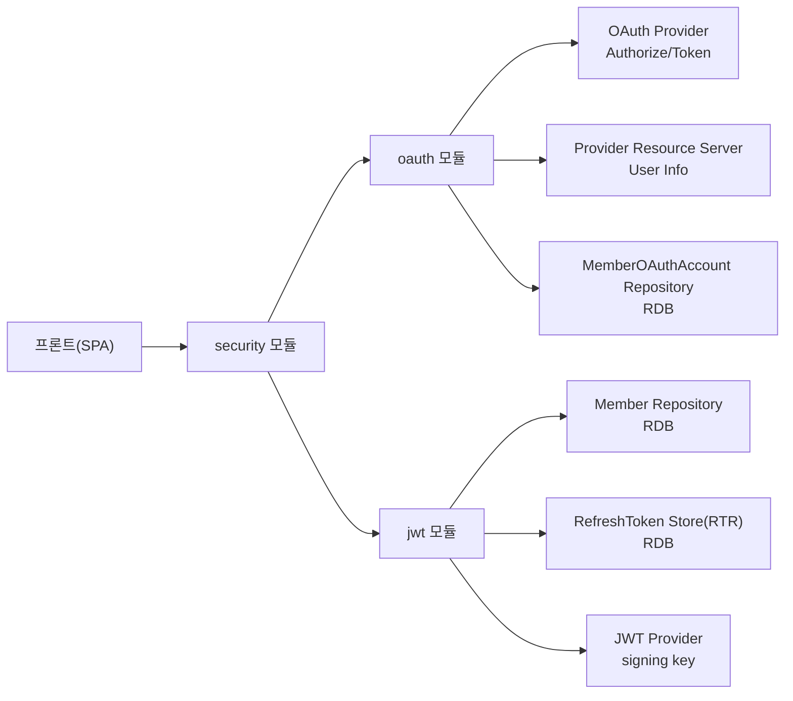
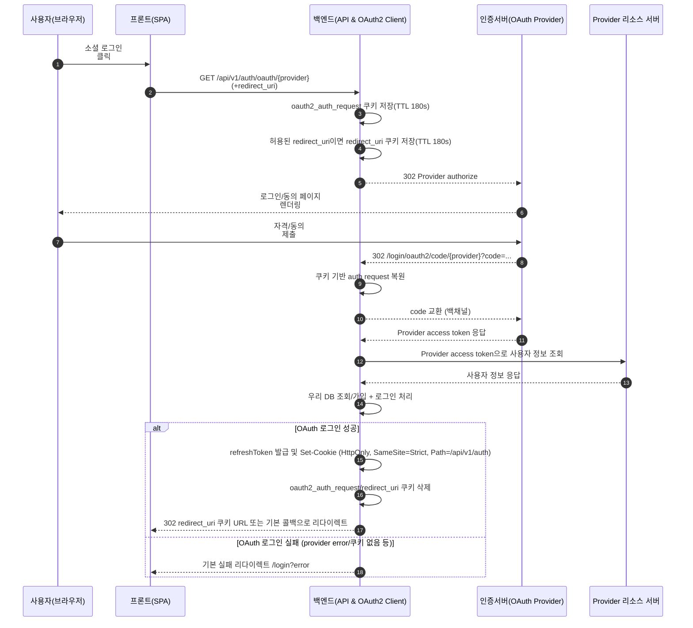
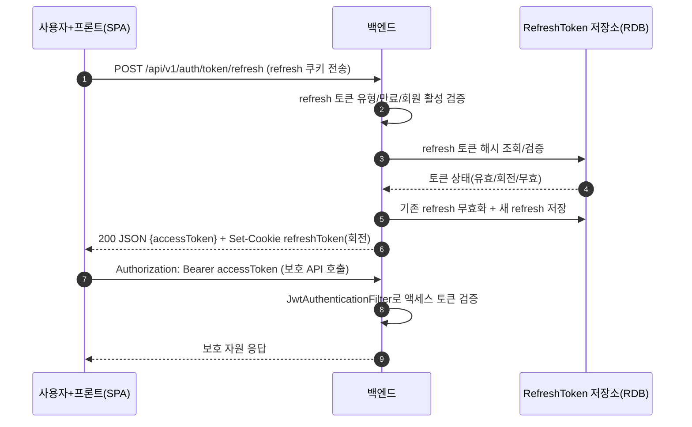
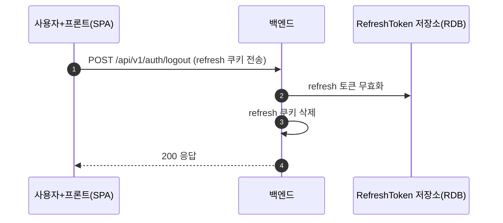
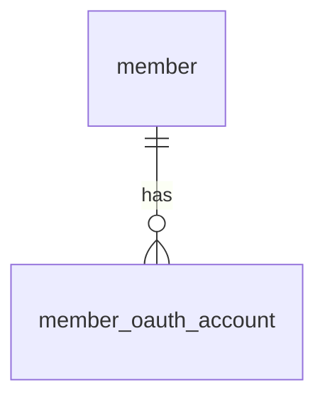

| 항목 | 내용 |
|---|---|
| 문서 제목 | 인증(Auth) 테크 스펙 |
| 문서 목적 | 인증/인가 도메인의 요구사항·데이터 모델·API 계약·보안 정책을 정의하여 구현/리뷰/테스트 기준으로 활용한다. |
| 작성 및 관리 | Backend Team |
| 최초 작성일 | 2026.01.12 |
| 최종 수정일 | 2026.01.17 |
| 문서 버전 | v1.6 |


<br>

# 인증(Auth) - BE 테크스펙

---

# **[1] 배경 (Background)**

## **[1-1] 프로젝트 목표 (Objective)**

세션 기반 인증의 확장/운영 복잡도를 줄이고, OAuth2 Authorization Code + JWT 기반 인증으로 **사용자 보안(토큰 탈취 대비/무효화/강제 로그아웃)** 과 **서비스 확장성(Stateless)** 을 확보한다.

**목표 적절성(검증)**
- 확장성: 세션 스토어/스티키 세션/동기화 부담 없이 수평 확장 가능(AccessToken stateless).
- 보안/대응: “로그아웃/강제 만료/기기 분실” 요구를 RefreshToken RTR(회전+재사용 감지)로 충족.
- 공격면 축소: OAuth `code` 교환/검증을 백엔드로 집중시켜 프론트가 provider 토큰을 직접 다루지 않게 한다.

<br>


## **[1-2] 문제 정의 (Problem)**

- 서버 세션 기반 인증은 수평 확장 시 세션 동기화 비용과 운영 복잡도를 증가시킨다.
- 단일 토큰 방식은 탈취 시 피해 범위가 크고, 강제 로그아웃/기기 분실 대응이 어렵다.
- OAuth2 로그인에서 프론트가 `code/provider` 토큰을 직접 다루면 공격면이 커진다.
- 토큰 기반 인증에서도 “로그아웃/강제 만료” 요구는 반드시 발생한다.

<br>


## **[1-3] 가설 (Hypothesis)**

인증을 백엔드 중심(OAuth code 교환/토큰 발급/검증)으로 통제하고 RefreshToken RTR(회전+재사용 감지) 정책을 적용하면, 확장성과 보안/운영 대응력이 개선된다.

<br>

---

# **[2] 목표가 아닌 것 (Non-goals)**

<!--
이 섹션에 무엇을 작성하나요?
- “이번에 하지 않는 것”을 기능/업무 단위로 명시합니다.

주의할 점
- “추후 논의”처럼 모호한 표현만 적지 말고, 제외 사유/경계(어디까지가 이번 범위인지)를 함께 씁니다.
-->

**이번 작업에서 다루지 않는 내용:**

- MFA(다단계 인증) 도입<br>
  -> 1차 범위는 OAuth2+JWT 로그인/재발급 안정화에 집중, MFA는 후속 보안 단계에서 별도 설계
- SSO 확장<br>
  -> 현재 단일 도메인 기준, 다중 서비스/프로바이더 통합은 추후 SSO 과제로 분리
- 권한(Role/Permission) 모델 전면 개편<br>
  -> 현행 ROLE 기반을 유지, RBAC/ABAC 재설계는 인증 범위 밖
- 관측성 대시보드/알람 운영 체계<br>
  -> 런타임 모니터링/알람은 운영 단계에서 별도 프로젝트로 정의

<br>

---

# **[3] 설계 및 기술 자료 (Architecture and Technical Documentation)**

<!--
이 섹션에 무엇을 작성하나요?
- 인증 관련 정책/모델/데이터/흐름/API를 한 문서에서 “구현 가능한 수준”으로 고정합니다.
-->

## **[3-1] 인증 모델 개요**

- 사용자 식별 방식: OAuth2 Authorization Code + JWT(Access)
- 인증 주체: `member.id`
- 권한 모델: Role 기반 (`member.role`)
- 시간 표준: 서버 저장은 ISO TIMESTAMP(UTC), 외부 표시는 클라이언트 로컬 시간(국가/타임존)
- 아키텍처 요약
    - AccessToken: Stateless, `Authorization: Bearer {token}`
    - RefreshToken: 서버 통제(RTR: 회전+재사용 감지, DB에 최신 토큰 해시 저장), HttpOnly Cookie로 전달
    - OAuth2 Authorization Request는 쿠키에 저장(단기 TTL, HMAC 서명) 후 콜백에서 복원
    - Spring Security Filter Chain에서 JWT 검증 후 `SecurityContext` 세팅

<br>

## **[3-2] 인증 필터/예외 설계 (JWT/OAuth2)**

- 필터 체인 배치
    - `FilterChainExceptionFilter`: 전역 필터 예외 캐치 → 공통 500 JSON 응답
    - `JwtAuthenticationFilter`: `Authorization: Bearer <access>` 검증 후 `SecurityContext` 설정 (유효하지 않으면 로그만 남기고 통과)
    - OAuth2 클라이언트 필터(스프링 내장): `/api/v1/auth/oauth/{provider}` 시작 → `/login/oauth2/code/{provider}` 콜백 처리
- 예외 처리
    - 401: `CustomAuthenticationEntryPoint` (JSON 에러)
    - 403: `CustomAccessDeniedHandler`
    - 필터 체인 예외: `FilterChainExceptionFilter`
- 범위
    - 일반 로그인(이메일/비밀번호) 필터는 현 단계 문서에서 의도적으로 제외

<br>

## **[3-3] 모듈 구성**

- security 모듈
    - 필터 체인 구성, 예외 처리, 공통 상수/유틸, 권한 규칙 조립
- jwt 모듈
    - Access/Refresh 발급·검증, RefreshToken RTR 저장/검증(회전+재사용 감지)
- oauth 모듈
    - OAuth2 로그인 플로우, provider user info 조회, 로그인 성공/실패 처리
- Persistence
    - 회원 조회/생성: `member`, `member_oauth_account`
    - RefreshToken RTR 저장소: RDB(최신 토큰 해시 저장, 만료/회전/무효화 관리)
- External/Infra
    - OAuth Provider: code 교환/token/userinfo


### **의존성 개요**



### **OAuth2 Provider 확장성**
- Provider 추상화: `OAuthUserInfo` 인터페이스 + 팩토리(`OAuthUserInfoFactory`)로 구현. 현재 `google`, `github` 구현체 존재.
- 확장 방법: 새 provider 추가 시 팩토리 분기 + Provider별 `*UserInfo` 구현체 추가로 user-info 파싱만 확장하면 된다.
- 엔드포인트는 공통(`/api/v1/auth/oauth/{provider}` / `/login/oauth2/code/{provider}`)을 재사용하므로 Swagger 문서만 추가하면 된다.


<br>

---

## **[3-4] 토큰/세션 정책**

### **Access Token**

| 항목 | 내용 |
|---|---|
| 포맷 | JWT |
| 만료 | 10~30분(운영값 확정 필요) |
| 전달 | `Authorization` Header |
| 검증 | 서명/만료/issuer/audience(사용 시) |
| 블랙리스트 | 정책에 따라 적용<br/>- 기본: 블랙리스트 미사용(현 구현), 짧은 TTL로 피해 최소화<br/>- 필요 시: `jti` 기반 블랙리스트(저장소는 RDB/Redis 전환 가능) |
| 클레임 | `memberId`, `role`, `iat`, `exp`, `jti` |

<br>

### **Refresh Token**

| 항목 | 내용 |
|---|---|
| 포맷 | JWT |
| 만료 | 14~30일(운영값 확정 필요) |
| 전달 | HttpOnly Cookie |
| 쿠키 | `refreshToken`<br/>- `HttpOnly`<br/>- `SameSite=Strict`<br/>- `Path=/api/v1/auth`<br/>- `Secure`: 운영 필수(환경별 적용) |
| 서버 신뢰(통제) | RTR(회전+재사용 감지) 기반 통제: 최신 RefreshToken 해시를 DB에 저장하고, 재사용/탈취 감지 시 토큰 패밀리 무효화 |
| 저장 | RDB에 refresh 토큰 해시 저장(평문 미저장), `expires_at/rotated_at/revoked_at`로 상태 관리 |

<br>

## **[3-5]로그아웃/세션 종료**

- 무효화 범위: 단일 디바이스
- 처리: RefreshToken RTR 저장소에서 토큰 무효화 + 클라이언트 쿠키 삭제


<br>

---

## **[3-6] 인증 핵심 Flow**

### **OAuth2 로그인**

아래 다이어그램은 OAuth2 로그인 완료까지의 전체 흐름을 요약한다.
사용자 자격 입력은 Provider 로그인/동의 페이지에서 이루어지고,
Provider와의 토큰 교환/사용자 정보 조회는 백엔드에서만 수행된다.



<br>

- API: `GET /api/v1/auth/oauth/{provider}` → `GET /login/oauth2/code/{provider}`
- 처리(mermaid 번호 기준)
    1. (1~2) 사용자가 프론트에서 소셜 로그인을 시작하고, 프론트가 `/api/v1/auth/oauth/{provider}`를 호출한다.
    2. (3) 백엔드는 `oauth2_auth_request` 쿠키를 저장한다(TTL 180s, HttpOnly + SameSite=Lax + HMAC 서명).
    3. (4) `redirect_uri`가 허용 오리진일 때만 `redirect_uri` 쿠키에 저장한다(TTL 180s). 불일치 시 400.
    4. (5) Provider authorize URL로 302 리다이렉트한다.
    5. (6~7) 사용자는 Provider 로그인/동의 페이지에서 자격·동의를 제출한다.
    6. (8) Provider가 `/login/oauth2/code/{provider}?code=...`로 콜백한다.
    7. (9~11) 백엔드는 쿠키 기반 auth request를 복원하고, code를 Provider 토큰 엔드포인트로 교환해 access token을 받는다.
    8. (12~13) Provider 리소스 서버에서 사용자 정보를 조회한다.
    9. (14) `member`/`member_oauth_account`를 조회·생성하고 로그인 처리를 완료한다.
    10. (15~17) RefreshToken을 발급해 쿠키로 전달하고, `oauth2_auth_request`/`redirect_uri` 쿠키를 삭제한 뒤 프론트로 리다이렉트한다.
- DB 변경
    - `member`, `member_oauth_account`
    - refresh RTR 저장소(`refresh_token`)
- 비고
    - Provider access token은 user info 조회에만 사용하며 프론트로 전달하지 않는다.
    - 실패 시 실패 핸들러가 쿠키를 정리하고 `/login?error`로 리다이렉트한다.

<br>

### **토큰 재발급(Refresh)**

로그인 성공 후 프론트는 Refresh 쿠키를 가진 상태로 `/api/v1/auth/token/refresh`를 호출한다.
RTR 저장소는 RDB에 유지한다.



1. (1) `/api/v1/auth/token/refresh` 호출 시 쿠키에서 `refreshToken`을 추출한다.
2. (2) refresh 토큰 유형/만료/회원 활성 여부를 검증한다.
3. (3~4) DB에서 refresh 토큰 해시를 조회하고 유효/회전 여부를 검증한다(무효/회전이면 401).
4. (5~6) 재사용 감지 시 토큰 패밀리를 무효화하고 401을 반환한다.
5. (7~8) 기존 refresh를 무효화하고 새 refresh를 발급/저장한 뒤 쿠키를 재설정한다.
6. (9~11) 이후 보호 API 호출 시 `JwtAuthenticationFilter`가 Access 토큰을 검증한다.
- 실패/복구
    - 재사용 감지/무효/만료/서명불일치: 401
- 비고
    - 발급된 Access 토큰은 동일 백엔드의 보호 API 호출에 사용된다.

<br>

### **로그아웃**



1. (1) `/api/v1/auth/logout` 요청에서 `refreshToken`을 식별한다.
2. (2) refresh 토큰을 RTR 저장소에서 무효화한다.
3. (3) refresh 쿠키를 삭제한다.
4. (4) 200 응답을 반환한다.
- 비고
    - AccessToken은 TTL 만료 전까지 자연 만료

<br>

---

## **[3-7] 데이터베이스 스키마 (ERD)**

- ERD Cloud: [ERD Cloud](https://www.erdcloud.com/d/TXZ3CApePpKwEyacT)
- ERD 테이블 정의서: [ERD 테이블 정의서](https://github.com/100-hours-a-week/3-team-tasteam-wiki/wiki/%5BERD%5D-%ED%85%8C%EC%9D%B4%EB%B8%94-%EC%A0%95%EC%9D%98%EC%84%9C)

<br>

**주요 테이블 요약**

| 테이블 | 설명 | 비고 |
|---|---|---|
| `member` | 서비스 회원(인증 주체) | `status`, `role` 기반 권한 |
| `member_oauth_account` | OAuth 계정 연동 정보(`member` ↔ provider) |  `UNIQUE(provider, provider_user_id)` |
| `notification` | (참고) 알림 테이블 | 인증 도메인 소유 아님 |

**관계 요약**

| From 테이블 | From 컬럼 | 관계 | To 테이블 | To 컬럼 | 삭제 정책 | 비고 |
|---|---|---|---|---|---|---|
| `member_oauth_account` | `member_id` | `N:1` | `member` | `id` | `RESTRICT(기본)` | DDL에 `ON DELETE` 미기재 |

<br>

**테이블 정의서**

## 주요 테이블


### `member`

| 컬럼 | 타입 | Nullable | 키 | 기본값 | 인덱스/제약 | 설명 |
|---|---|---|---|---|---|---|
| `id` | BIGINT | N | PK | AUTO_INCREMENT | - | 사용자 식별자 |
| `email` | VARCHAR(255) | N | UNIQUE | - | UNIQUE | 로그인 이메일 |
| `password` | VARCHAR(255) | N | - | - | - | 암호화된 비밀번호 |
| `nickname` | VARCHAR(50) | N | - | - | - | 표시 이름 |
| `profile_image_url` | VARCHAR(500) | Y | - | - | - | 프로필 이미지 URL |
| `status` | VARCHAR(20) | N | - | - | - | 계정 상태 (`ACTIVE`/`BLOCKED`/`DELETED`) |
| `role` | VARCHAR(20) | N | - | - | - | 권한 (`USER`/`ADMIN`) |
| `last_login_at` | TIMESTAMP | Y | - | - | - | 마지막 로그인 시각 |
| `agreed_terms_at` | TIMESTAMP | Y | - | - | - | 약관 동의 시각 |
| `agreed_privacy_at` | TIMESTAMP | Y | - | - | - | 개인정보 동의 시각 |
| `created_at` | TIMESTAMP | N | - | - | - | 생성 시각 |
| `updated_at` | TIMESTAMP | N | - | - | - | 수정 시각 |
| `deleted_at` | TIMESTAMP | Y | - | - | - | soft delete 시각(SQL.sql 기준) |

<br>

### `member_oauth_account`

| 컬럼 | 타입 | Nullable | 키 | 기본값 | 인덱스/제약 | 설명 |
|---|---|---|---|---|---|---|
| `id` | BIGINT | N | PK | SEQUENCE | - | 식별자 |
| `member_id` | BIGINT | N | FK | - | FK(`member.id`) | 회원 |
| `provider` | VARCHAR(20) | N | - | - | - | provider(`KAKAO|GOOGLE`) |
| `provider_user_id` | VARCHAR(100) | N | - | - |  UNIQUE | provider 사용자 식별자 |
| `provider_user_email` | VARCHAR(255) | Y | - | - | - | provider 이메일 |
| `created_at` | TIMESTAMP | N | - | - | - | 생성 시각 |

<br>

## RefreshToken RTR 저장 구조

- **기본 구현:** RDB 테이블 `refresh_token`
    - 컬럼 예시: `id(PK)`, `member_id(BIGINT)`, `token_hash(VARCHAR, UNIQUE)`, `token_family_id(VARCHAR)`, `expires_at(TIMESTAMP)`, `rotated_at(TIMESTAMP, Nullable)`, `revoked_at(TIMESTAMP, Nullable)`, `created_at(TIMESTAMP)`
    - 인덱스: `token_hash` unique, `member_id`, `token_family_id`, `expires_at`
    - 정책: 평문 저장 금지(sha256/HMAC), 회전 시 `rotated_at` 기록, 재사용 감지 시 `token_family_id` 전체 무효화


<br>

**ERD(Mermaid, 선택)**



---

## **[3-8] API 명세 (API Specifications)**

- **목차:**
  - [3-8-1 카카오 OAuth 인증 시작 (GET /api/v1/auth/oauth/{provider})](#3-8-1-카카오-oauth-인증-시작)
  - [3-8-2 카카오 OAuth 인증 완료 (GET /login/oauth2/code/{provider})](#3-8-2-카카오-oauth-인증-완료)
  - [3-8-3 액세스 토큰 재발급 (POST /api/v1/auth/token/refresh)](#3-8-3-액세스-토큰-재발급)
  - [3-8-4 로그아웃 (DELETE /api/v1/auth/token)](#3-8-4-로그아웃)
  - [3-8-5 OAuth2 인증 시작(내부) (GET /api/v1/auth/oauth/{provider})](#3-8-5-oauth2-인증-시작내부)
  - [3-8-6 OAuth2 콜백(내부) (GET /login/oauth2/code/{provider})](#3-8-6-oauth2-콜백내부)


<br>

### **[3-8-1] 카카오 OAuth 인증 시작**

- **API 명세:**
  - `GET /api/v1/auth/oauth/{provider}`
  - API 문서 링크: (API 명세서 미기재, 구현 엔드포인트)
- **권한:** `PUBLIC`
- **구현 상세:**
  - **요청**
    - **Query Params:**
      - `redirect_uri`: string (선택, 기본값: 없음) - 로그인 완료 후 프론트 redirect 목적지(allowlist 검증 필요)
  - **응답**
    - status: `302`
    - headers:
      - `Location`: provider authorize URL
      - `Set-Cookie`: `oauth2_auth_request`,  `redirect_uri` (TTL 180s)
  - **처리 로직:**
    1. `redirect_uri`가 있으면 allowlist 기준으로 검증한다(불일치 시 400).
    2. OAuth2 Authorization Request 정보를 쿠키에 저장한다(TTL 180s).
    3.  `redirect_uri`도 쿠키에 저장한다(TTL 180s).
    4. OAuth Provider authorize로 302 리다이렉트한다.
  - **트랜잭션 관리:** 없음
  - **동시성/멱등성(필요시):** 동일 요청 반복은 허용(단, rate limit 적용)
  - **에러 코드(주요):** `INVALID_REQUEST`(400), `UNAUTHORIZED`(401), `OAUTH_LOGIN_FAILED`(401), `TOO_MANY_REQUESTS`(429), `INTERNAL_SERVER_ERROR`(500)

<br>

### **[3-8-2] 카카오 OAuth 인증 완료**

- **API 명세:**
  - `GET /login/oauth2/code/{provider}` (Spring Security 내부 엔드포인트)
  - API 문서 링크: (API 명세서 미기재, Spring OAuth2 콜백 엔드포인트)
- **권한:** `PUBLIC`
- **구현 상세:**
  - **요청**
    - **Query Params:**
      - `code`: string (필수, provider가 전달) - Authorization Code
      - `state`: string (필수, provider가 전달) - CSRF 방지/요청 매칭
    - **Cookies:**
      - `oauth2_auth_request`: string (필수, TTL 180s) - Authorization Request 복원용
      - `redirect_uri`: string (선택, TTL 180s) - 로그인 완료 후 redirect 목적지
  - **응답**
    - status: `302`
    - headers:
      - `Location`: 프론트 redirect(`redirect_uri` 또는 기본 경로)
      - `Set-Cookie`: `refreshToken`(또는 `refresh_token`, 정책/구현에 따라) + `oauth2_auth_request`, `redirect_uri` 삭제
  - **처리 로직:**
    1. 쿠키에서 OAuth2 Authorization Request를 복원한다(TTL 만료면 실패).
    2. authorization code를 provider token endpoint로 교환한다(백엔드에서만 수행).
    3. provider user info를 조회한다.
    4. `member` 조회/생성하고 `member_oauth_account`를 upsert한다.
    5. RefreshToken을 발급하고 Set-Cookie로 전달한다(보안 옵션은 “토큰/세션 정책”을 따른다).
    6. `oauth2_auth_request`, `redirect_uri` 쿠키를 삭제한다.
    7. 프론트 redirect(`redirect_uri` 또는 기본 경로)로 302 응답한다.
  - **트랜잭션 관리:**
    - `member` + `member_oauth_account` upsert는 DB 단일 트랜잭션으로 처리한다.
    - 외부 연동(provider) 실패는 트랜잭션 시작 전/또는 예외로 전체 실패로 처리한다(부분 저장 방지).
  - **동시성/멱등성(필요시):**
    - 동일 `provider_user_id`로 동시 가입/로그인이 들어오면 `UNIQUE(provider, provider_user_id)`로 중복 생성을 방지한다(충돌 시 재조회).
  - **에러 코드(주요):** `INVALID_REQUEST`(400), `OAUTH_TOKEN_ISSUE_FAILED`(500), `OAUTH_USER_INFO_FETCH_FAILED`(500), `OAUTH_PROVIDER_ERROR`(502), `TOO_MANY_REQUESTS`(429), `INTERNAL_SERVER_ERROR`(500). 실패 시 실패 핸들러가 인가 요청/redirect 쿠키를 삭제하고 `/login?error`로 리다이렉트한다.

<br>

### **[3-8-3] 액세스 토큰 재발급**

- **API 명세:**
  - `POST /api/v1/auth/token/refresh`
  - API 문서 링크: [API 명세서(3-8)](https://github.com/100-hours-a-week/3-team-tasteam-wiki/wiki/%5BBE-%E2%80%90-API%5D-API-%EB%AA%85%EC%84%B8%EC%84%9C#user-content-api-2)
- **권한:** `PUBLIC` (단, Refresh Token Cookie 필요)
- **구현 상세:**
  - **요청**
    - **Cookies:**
      - `refreshToken`: string (필수) - Refresh Token(쿠키명 정합성 확정 필요)
    - **Headers:**
      - `Authorization`: string (선택) - `Bearer {accessToken}`
    - 예시
      ```
      POST /api/v1/auth/token/refresh
      Cookie: refresh_token={jwt}
      ```
  - **응답**
    - status: `201`(API 명세서) / `200`(문서/구현 표기)
    - body 스키마(문서 기준)
      - `data.accessToken`: string (JWT), 보호 API 호출용 Access 토큰
      - `message`: string 
    - 예시(JSON, 문서 기준)
      ```json
      {
        "data": {
          "accessToken": "{jwt}"
        },
        "message": "OK"
      }
      ```
  - **처리 로직:**
    1. Cookie에서 `refreshToken`을 추출한다(없으면 401).
    2. refresh 토큰 형식/서명/만료를 검증한다.
    3. RTR 저장소에서 토큰 해시를 조회하고 유효 여부를 확인한다(무효/회전이면 401).
    4. 재사용 감지(존재하지 않음/이미 회전됨) 시 토큰 패밀리를 무효화하고 401을 반환한다.
    5. 토큰의 `memberId`로 회원을 조회하고 `ACTIVE`만 허용한다.
    6. 기존 refresh를 무효화하고 새 refresh/AccessToken을 발급해 쿠키와 JSON으로 응답한다.
  - **트랜잭션 관리:**
    - refresh 회전(기존 무효화 + 신규 저장)은 DB 단일 트랜잭션으로 처리한다.
  - **동시성/멱등성(필요시):**
    - 동일 RT로 동시 요청 시 1개만 성공하고 나머지는 실패 처리한다.
  - **에러 코드(주요):** `INVALID_REQUEST`(400), `AUTHENTICATION_REQUIRED`(401), `UNAUTHORIZED`(401), `ACCESS_DENIED`(403), `REFRESH_TOKEN_INVALID`(401), `REFRESH_TOKEN_EXPIRED`(401), `REFRESH_TOKEN_REUSED`(401), `TOO_MANY_REQUESTS`(429), `INTERNAL_SERVER_ERROR`(500)

<br>

### **[3-8-4] 로그아웃**

- **API 명세:**
  - `DELETE /api/v1/auth/token` (API 명세서)
  - `POST /api/v1/auth/logout` (구현/문서 표기)
  - API 문서 링크: [API 명세서(3-3)](https://github.com/100-hours-a-week/3-team-tasteam-wiki/wiki/%5BBE-%E2%80%90-API%5D-API-%EB%AA%85%EC%84%B8%EC%84%9C#user-content-api-3)
- **권한:** `USER`(API 명세서) / RefreshToken 필요(구현 표기, 정책 확정)
- **구현 상세:**
  - **요청**
    - **Headers:**
      - `Authorization`: string (필수) - `Bearer {accessToken}`
    - **Cookies:**
      - `refresh_token` 또는 `refreshToken`: string (선택, 정책 확정) - Refresh Token(로그아웃 무효화 범위/정책에 따라 사용)
    - 예시(API 명세서)
      ```
      DELETE /api/v1/auth/token
      Authorization: Bearer {accessToken}
      ```
  - **응답**
    - status: `201`(API 명세서) / `200 또는 204`(문서/구현 표기)
    - headers: `Set-Cookie`(refresh 쿠키 삭제, 구현 시)
  - **처리 로직:**
    1. Cookie에서 `refreshToken`을 추출한다(없으면 401 또는 204 멱등 처리; 정책 확정).
    2. RTR 저장소에서 refresh 토큰을 무효화한다(이미 무효화되어 있어도 멱등하게 처리).
    3. `refreshToken` 쿠키를 삭제한다.
    4. 200 또는 204로 응답한다.
  - **트랜잭션 관리:** refresh 토큰 무효화는 DB 단일 트랜잭션
  - **동시성/멱등성(필요시):** 동일 RT로 중복 로그아웃 호출은 204 또는 200으로 멱등 처리
  - **에러 코드(주요):** `INVALID_REQUEST`(400), `AUTHENTICATION_REQUIRED`(401), `UNAUTHORIZED`(401), `ACCESS_DENIED`(403), `REFRESH_TOKEN_INVALID`(401), `TOO_MANY_REQUESTS`(429), `INTERNAL_SERVER_ERROR`(500)

<br>

### **[3-8-5] OAuth2 인증 시작(내부)**

- **API 명세:**
  - `GET /api/v1/auth/oauth/{provider}`
  - API 문서 링크: (API 명세서 미기재, 내부 라우팅)
- **권한:** `PUBLIC`
- **구현 상세:** Spring OAuth2 Client 엔드포인트(실제 공개/노출 방식은 라우팅 정책에 따름)

<br>

### **[3-8-6] OAuth2 콜백(내부)**

- **API 명세:**
  - `GET /login/oauth2/code/{provider}`
  - API 문서 링크: (API 명세서 미기재, 내부 라우팅)
- **권한:** `PUBLIC`
- **구현 상세:** Spring OAuth2 Client 콜백 엔드포인트(실제 처리 흐름은 “핵심 흐름/Flow” 참고)


<br>

---

## **[3-9] 도메인 에러 코드(공통 정의)**

> API 섹션에서는 “이 API에서 쓰는 코드”만 나열하고, 의미/재시도/UX는 아래 정의를 따른다.

| code | status | 의미(요약) | retryable | 비고 |
|---|---:|---|---|---|
| `INVALID_REQUEST` | 400 | validation 실패/redirect_uri 불일치 등 | no | `errors[]` 포함 |
| `UNAUTHORIZED` | 401 | 인증 실패(토큰 없음/만료/검증 실패) | no | 공통 |
| `AUTHENTICATION_REQUIRED` | 401 | 로그인 필요(토큰/쿠키 미제공) | no | API 명세에 존재 |
| `FORBIDDEN` | 403 | 권한 없음(예: ADMIN 전용) | no | 공통 |
| `ACCESS_DENIED` | 403 | 접근 권한 필요 | no | API 명세에 존재(403 표준 코드와 관계 정리 필요) |
| `TOO_MANY_REQUESTS` | 429 | 비정상적으로 많은 요청 | yes | API 명세에 존재 |
| `OAUTH_LOGIN_FAILED` | 401 | OAuth 로그인 실패 | no | API 명세에 존재 |
| `OAUTH_TOKEN_ISSUE_FAILED` | 500 | provider access token 발급 실패 | yes | API 명세에 존재 |
| `OAUTH_USER_INFO_FETCH_FAILED` | 500 | provider user info 조회 실패 | yes | API 명세에 존재 |
| `OAUTH_PROVIDER_ERROR` | 502 | provider 연동 실패(code 교환/userinfo) | yes | timeout/retry 정책 적용 |
| `REFRESH_TOKEN_INVALID` | 401 | refresh 토큰 위변조/형식 오류/무효 | no | 로그아웃 유도 |
| `REFRESH_TOKEN_EXPIRED` | 401 | refresh 만료 | no | 재로그인 유도 |
| `REFRESH_TOKEN_REUSED` | 401 | RTR 재사용 감지(토큰 패밀리 무효화) | no | 재로그인 유도 |
| `INTERNAL_SERVER_ERROR` | 500 | 예기치 못한 서버 오류 | yes | 관측/알람 |


<br>

---

## **[3-10] 기술 스택 (Technology Stack)**

- **Backend:** Spring Boot 3, Spring Security(OAuth2 Client), JPA
- **Database:** RDB (프로젝트 표준)
- **Cache:** Redis(선택: RTR 동시성 제어/캐시 활용)
- **Async/Queue:** Redis Streams(기본), 필요 시 Kafka
- **Infrastructure:** AWS(운영 기준)
- **외부 연동:** OAuth Provider(예: Kakao/Google)

---

# **[4] 이외 고려사항들 (Other Considerations)**

## **[4-1] 고려사항 체크리스트(성능/외부연동/정합성/보안/운영)**

- [ ] **인가(Authorization)**
    - Role 정의(ERD): `USER`, `ADMIN` (`ADMIN`은 운영 관리자)
    - 인증 도메인의 책임: 토큰 유효성 검증 및 `memberId/role` 제공
    - 책임이 아닌 것: 그룹 소유자/서브그룹 관리자 등 도메인별 권한 판단은 각 도메인에서 수행
- [ ] **보안 체크리스트(구현 기준)**
    - HTTPS 강제(운영): 적용
    - CSRF
        - `refreshToken`이 Cookie이므로 refresh endpoint의 CSRF 방어 방식을 고정해야 한다(정책 확정 필요)
        - 쿠키 정책(초안)
            - `oauth2_auth_request`, `redirect_uri`: HttpOnly + SameSite=Lax + TTL 180s
            - `refreshToken`: HttpOnly + SameSite=Strict + Path=/api/v1/auth + Secure(운영 필수)
    - 시크릿 관리
        - OAuth client secret/JWT signing key는 리포지토리 저장 금지(Secret Manager 사용)
        - signing key 교체(회전) 시 “기발급 토큰 검증” 전략 포함(키 버전/키셋 등)
        - 민감정보 로깅 금지
        - token/cookie/authorization 헤더는 로그 마스킹(원문 저장 금지)
    - 공격 대응
        - RTR 재사용 감지 시 토큰 패밀리 무효화/강제 로그아웃 정책 정의
        - rate limit(특히 authorize/callback/refresh)
- [ ] **성능/확장성**
    - 보호 API는 DB 조회 없이 AccessToken 검증만 수행(Stateless).
    - refresh 요청만 저장소 접근(RTR).
    - RTR 저장소는 RDB(필수).
- [ ] **관측성**
    - 주요 키: `memberId`, `provider`, `oauth_error_code`, `request_id/trace_id`
    - 범위: 본 문서(MVP)는 “보안/확장성” 구현이 목적이며, 아래 항목은 **추후 운영 단계에서 필요한 관측성 가이드** 이다.
    - 대시보드(추후 권장)
        - `POST /api/v1/auth/token/refresh`: 요청수/5xx 비율, 401 비율(원인 코드별 `REFRESH_TOKEN_*`), p95/p99 지연
        - 보호 API: `Authorization` 헤더 존재 요청 중 401 비율
        - OAuth 콜백: `OAUTH_*` 에러 코드 분포, `OAUTH_PROVIDER_ERROR` 비율
        - 429 발생량(authorize/callback/refresh)
    - 알람(추후 권장)
        - refresh 5xx 비율 급증
        - 보호 API “auth-present 401” 급증
        - `OAUTH_PROVIDER_ERROR` 급증
- [ ] **장애 시나리오**
    - DB 장애: refresh 불가 → 재로그인 유도
    - provider 장애: 로그인 재시도 유도
- [ ] **결정 기록(Decision Log)**
    - `DEC-01` Stateless 인증 채택: 세션 미사용, AccessToken은 짧은 TTL로만 보호
    - `DEC-02` RefreshToken은 서버 통제: RTR(회전+재사용 감지) + DB 저장
    - `DEC-03` RefreshToken 전달: HttpOnly Cookie 채택(PWA 고려)

<br>

## **[4-2] 리스크 및 대응 (Risks & Mitigations)**

- **RTR 저장소 장애**: refresh 검증/회전이 DB 의존이므로 장애 시 재발급이 불가하다.
  - 대응: DB 이중화/장애 대응 및 재로그인 UX 가이드를 준비한다.
- **CSRF 방어 방식 미확정(Refresh Endpoint)**: SameSite만으로 충분한지/추가 토큰이 필요한지에 따라 클라이언트 계약이 달라진다
  - 대응: SameSite=Strict + Origin 검증 + (필요 시) double-submit CSRF 토큰 중 하나로 고정한다.
- **OAuth Provider 장애 전파**: 로그인 성공률이 외부 장애에 직접 영향을 받는다
  - 대응: timeout/retry/backoff 정책 + 에러 코드 표준화(`OAUTH_PROVIDER_ERROR`) + 알람 + 운영 수동 대응 가이드(필요 시)를 정의한다.

<br>

---

# **[5] 테스트 (Testing)**

- OAuth 로그인: provider 장애/지연, 쿠키 TTL 만료, redirect_uri allowlist 실패 시나리오
- 토큰 재발급: refresh RTR(회전+재사용 감지), CSRF 방어(정책 확정 후) 시나리오
- 로그아웃: refresh 무효화, 쿠키 삭제 멱등 시나리오
- 보안: 토큰/쿠키 로그 마스킹, 키/시크릿 미노출, rate limit 적용 시나리오

<br>

---

# **[6] 함께 논의하고 싶은 내용 (Open Questions)**

1. **[CSRF 방어 방식(Refresh Endpoint)]**
   - Cookie 기반 refresh 호출의 CSRF 방어 방식을 확정해야 한다(SameSite=Strict만으로 충분한지, Origin 검증, CSRF 토큰 필요 여부). ([관련자: @TBD])
2. **[PWA 환경 쿠키 정책]**
   - SameSite/Domain/Path 정책이 PWA/인앱 브라우저에서 문제 없는지 최종 결정이 필요하다. ([관련자: @TBD])
3. **[PKCE 도입 여부]**
   - provider/클라이언트 환경에 따라 PKCE 적용 필요 여부를 결정한다. ([관련자: @TBD])
4. **[다중 디바이스 RefreshToken 전략]**
   - deviceId 도입 여부, 단일/다중 RT 정책, 로그아웃 범위(단일/전체) 확정이 필요하다. ([관련자: @TBD])
5. **[AccessToken 전달 계약]**
   - OAuth 콜백에서 AccessToken을 직접 전달할지, refresh로만 발급받게 할지 계약을 확정한다. ([관련자: @TBD])
6. **[API 스펙-테크스펙 불일치 정리]**
- `/api/v1/auth/oauth/kakao`의 `redirect_uri` 지원 여부(현재 API 명세 미기재)
- `/login/oauth2/code/kakao`의 `code` 전달 방식(body/query)(현재 API 명세 미기재)
   - `/api/v1/auth/token/refresh` 응답 계약(`data.accessToken` vs `data: {}`)(현재 API 명세 불명확) ([관련자: @TBD])
7. **[에러 코드 표준화]**
   - `FORBIDDEN` vs `ACCESS_DENIED`(403), OAuth 관련 code(`OAUTH_PROVIDER_ERROR` vs `OAUTH_*_FAILED`)를 문서/코드/API 명세에서 1개 체계로 고정한다. ([관련자: @TBD])

<br>

---

# **[7] 용어 정의 (Glossary)**

- **도메인 상태 (Domain Status):**
    - `ACTIVE`: 정상 사용자
    - `BLOCKED`: 차단 사용자
    - `WITHDRAWN`: 탈퇴 사용자
- **Role:**
    - `USER`: 일반 사용자
    - `ADMIN`: 관리자
- **Access Token:** 보호 API 호출 시 `Authorization: Bearer`로 전달되는 JWT
- **Refresh Token:** AccessToken 재발급을 위해 사용하는 장기 토큰(서버 통제, HttpOnly Cookie 전달)
- **Rotation(회전):** refresh 재발급 시 기존 RT를 폐기하고 신규 RT를 발급하는 정책
- **RTR(Refresh Token Rotation):** refresh 재발급 시 토큰을 회전하고 재사용을 감지해 토큰 패밀리를 무효화하는 정책
- **PKCE:** Authorization Code 흐름에서 코드 탈취 공격을 완화하기 위한 확장(도입 여부 Open)

<br>

---

# **[8] 변경이력**

| 버전 | 일자 | 작성자 | 변경 내역 | 비고 |
|---|---|---|---|---|
| v1.0 | 2026.01.12 | Devon(우승화) - Backend | 인증 테크 스펙 문서 템플릿 양식으로 마이그레이션 | - |
| v1.1 | 2026.01.13 | Devon(우승화) - Backend | 배경 섹션 헤더화, 시간 표준 확정사항 반영, 의존성 그래프/공통 에러 정의/리스크 섹션 추가, Open Questions 번호화 | - |
| v1.2 | 2026.01.13 | Devon(우승화) - Backend | API별 요청/응답/에러 코드 보강, API 명세 불일치 항목을 Open Questions로 명시, 에러 코드 카탈로그에 API 명세 코드 반영 | - |
| v1.3 | 2026.01.14 | Devon(우승화) - Backend | OAuth 시작 경로 커스텀(`/api/v1/auth/oauth/{provider}`), OAuth 쿠키 HMAC 서명, Refresh 토큰 회전/재사용 감지/Redis 저장 반영 | - |
| v1.4 | 2026.01.14 | Devon(우승화) - Backend | OAuth/JWT 경로 정합성 수정, 인증 플로우/의존성/토큰 재발급·로그아웃 설명 최신화 | - |
| v1.5 | 2026.01.16 | Devon(우승화) - Backend | RefreshToken 정책을 “블랙리스트 우선 + 회전”으로 고정, 화이트리스트 회전/재사용 감지는 후속 단계로 분리, 저장소 기본을 RDB로 명시(어댑터로 Redis 전환 가능) | - |
| v1.6 | 2026.01.17 | Devon(우승화) - Backend | RefreshToken 전략을 RTR(회전+재사용 감지)로 전환, 저장소를 RDB 기반 refresh_token으로 명시, 관련 플로우/정책/API 문서 갱신 | - |
