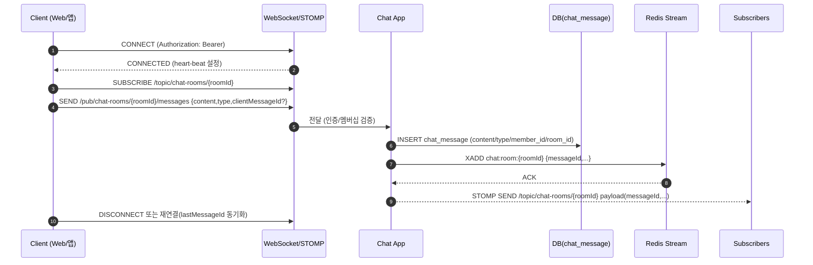

| 항목 | 내용 |
|---|---|
| 문서 제목 | 채팅(Chat) 테크 스펙 |
| 문서 목적 | 채팅 메시지 조회/전송 및 읽음 커서 갱신 기능의 요구사항·데이터 모델·API 계약·처리 흐름·운영 기준을 정의하여 구현/리뷰/테스트 기준으로 활용한다. |
| 작성 및 관리 | Backend Team |
| 최초 작성일 | 2026.01.13 |
| 최종 수정일 | 2026.01.15 |
| 문서 버전 | v1.2 |

<br>

# 채팅(Chat) - BE 테크스펙

---

# **[1] 배경 (Background)**

## **[1-1] 프로젝트 목표 (Objective)**

서브그룹(Subgroup) 단위의 채팅을 제공하여, 그룹 활동의 실시간 커뮤니케이션을 가능하게 한다. 단일/2 인스턴스 환경에서 WebSocket+STOMP로 안정적인 메시지 전달(순서/유실 최소화)을 확보한다.

- **핵심 결과 (Key Result) 1:** 채팅 메시지 목록 조회(`GET /chat-rooms/{chatRoomId}/messages`, size=20) p95 ≤ `200ms`, p99 ≤ `400ms`
- **핵심 결과 (Key Result) 2:** 메시지 전송/브로드캐스트(WS/STOMP end-to-end) 성공률 ≥ `99.9%`(5xx ≤ `0.1%`), p95 브로드캐스트 지연 ≤ `500ms`
- **핵심 결과 (Key Result) 3:** 읽음 커서 갱신(`PATCH /chat-rooms/{chatRoomId}/read-cursor`) 성공률 ≥ `99.99%` + 단조 증가 위반(역행 업데이트) `0건`
- **핵심 결과 (Key Result) 4:** 재연결 후 유실률 `0%`(표준 복구: `lastMessageId` 기반 afterId 재조회 + STOMP 구독 재개)

<br>

## **[1-2] 문제 정의 (Problem)**

- 채팅은 트래픽/동시성이 높아 “목록 페이징, 인덱스, 권한”이 명확하지 않으면 성능/정합성 문제가 발생한다.
- 메시지 전송은 중복 요청(재시도/네트워크 이슈)로 인해 중복 메시지가 쌓일 수 있다.
- 읽음 커서 정책(단조 증가/유효 범위/권한)이 불명확하면 클라이언트와 서버 간 해석 차이가 커진다.

<br>

## **[1-3] 가설 (Hypothesis)**

채팅방 접근 권한(멤버십)과 메시지 조회/전송/읽음 갱신의 DB 변경 지점을 고정하면, 구현·리뷰·테스트의 해석 차이를 줄이고 운영 안정성이 올라간다.

<br>

---

# **[2] 목표가 아닌 것 (Non-goals)**

**이번 작업에서 다루지 않는 내용:**

- 채팅방 생성/삭제/초대/강퇴(채팅방 운영 관리 기능)
- 타이핑 인디케이터, 메시지 수정/삭제(soft delete UI 포함)
- 멀티미디어(이미지/파일) 전송의 “업로드 플로우”(요청/응답 포맷은 Open Questions로 관리)
- 멤버 차단/신고, 금칙어 필터링
- 대규모 확장(대량 방/대량 동시접속) 및 강한 전달 보장(Exactly-once 등)

<br>

---

# **[3] 설계 및 기술 자료 (Architecture and Technical Documentation)**

- 인증: `Authorization: Bearer {accessToken}`
- API Prefix: `/api/v1` (기본, 단 채팅 API는 `API 명세서` 기준으로 prefix 예외: `/chat-rooms/...`)
- 소유(Owner) 테이블: `chat_room`, `chat_room_member`, `chat_message`, `chat_message_file`
- 의존(검증/조합) 테이블: `member`, `subgroup`, `subgroup_member`

## **[3-0] 실시간 채팅 전송 설계(필수)**

- 전송 채널: WebSocket + STOMP (Handshake는 HTTP + AccessToken)
    - Connect: `ws(s)://<host>/ws/chat` (예시), 헤더 `Authorization: Bearer {accessToken}`
    - Subscribe: `/topic/chat-rooms/{chatRoomId}` (방 단위 브로드캐스트)
    - Send: `/pub/chat-rooms/{chatRoomId}/messages` (메시지 전송)
- 인증/인가
    - CONNECT 시 AccessToken 검증 → `member.id` 바인딩
    - SEND/Subscribe 시 `chat_room_member.deleted_at is null` 확인(비멤버 차단)
- 메시지 흐름(단일/2 인스턴스 기준)
    1) 클라이언트 SEND → 애플리케이션 인스턴스 수신
    2) 요청 검증(멤버십/내용 길이/타입)
    3) DB insert(`chat_message` + 필요한 경우 `chat_message_file`) → 생성된 `id`를 순서 기준으로 사용
    4) Redis Stream `chat:room:{chatRoomId}`에 `{messageId, chatRoomId, senderId, type, content, createdAt}` 적재(append-only)
    5) 같은 인스턴스 또는 다른 인스턴스가 Stream consumer로 읽어 `/topic/chat-rooms/{chatRoomId}`로 브로드캐스트
- 순서/중복/유실
    - 순서: DB PK(`chat_message.id`) 기준 오름차순 전송. Stream은 append-only라 인스턴스 간 정렬 불일치 방지.
    - 중복: 클라이언트 `clientMessageId`를 optional로 받아 `UNIQUE(chat_room_id, client_message_id)`(정책 시)로 멱등 처리 가능. 기본은 서버 발급 id만 사용.
    - 유실/재전송: 재연결 시 최근 수신한 `lastMessageId`로 HTTP 조회(`GET /chat-rooms/{id}/messages?afterId=...`) 후, 이후 메시지는 STOMP로 수신. Stream consumer 장애 시 pending list 재처리.
- 조회(무한 스크롤)
    - 기본 UX: “마지막 읽은 지점(last_read_message_id)”을 기준으로 unread 구분선을 표시하고, 화면에는 최신 메시지부터 `size=20`개를 우선 로드한다.
    - 과거 메시지 로드: `cursor(=가장 오래된 메시지 id)`를 전달해 `id < cursor` 조건으로 다음 페이지(더 과거)를 가져온다.
- 동시성
    - `last_read_message_id` 업데이트는 “증가만 허용” 규칙: `UPDATE ... SET last_read_message_id = GREATEST(last_read_message_id, :newId)`.
    - 소규모(≤2 인스턴스) 기준: Redis Stream 하나 사용, consumer group은 인스턴스별 1개. 역순/중복 소비 발생 시에도 message.id 기준으로 재정렬 후 전송.
- 에러/연결 관리
    - STOMP ERROR frame: 인증 실패/멤버십 없음/유효하지 않은 payload
    - Keepalive: 서버/클라이언트 heart-beat 설정(예: 10s/10s)
    - Rate limit(간단): 메시지 크기(예: 2KB), 초당 전송 건수(예: 5req/s) 정책

**채팅 메시지 흐름 (Mermaid)**


## **[3-1] 데이터베이스 스키마 (ERD)**

- ERD/DDL 소스: `프로젝트 정의서/ERD/SQL.sql`

**주요 테이블 요약**

| 테이블 | 설명 |
|---|---|
| `chat_room` | 채팅방(서브그룹 단위) |
| `chat_room_member` | 채팅방 참여자 및 읽음 커서 |
| `chat_message` | 채팅 메시지 |
| `chat_message_file` | 메시지 첨부 파일 |

**테이블 정의서**

#### `chat_room`

| 컬럼 | 타입 | Nullable | 제약/고려사항 | 설명 |
|---|---|---|---|---|
| `id` | `BIGINT` | N | `PK`, `SEQUENCE` | 채팅방 식별자 |
| `subgroup_id` | `BIGINT` | N | `NOT NULL` | 소속 하위그룹 ID |
| `created_at` | `TIMESTAMP` | N | `DEFAULT now()` | 생성 시각 |
| `deleted_at` | `TIMESTAMP` | Y |  | soft delete 시각 |

#### `chat_room_member`

| 컬럼 | 타입 | Nullable | 제약/고려사항 | 설명 |
|---|---|---|---|---|
| `id` | `BIGINT` | N | `PK`, `SEQUENCE` | 멤버십 식별자 |
| `member_id` | `BIGINT` | N | `NOT NULL` | 참여자 회원 ID |
| `chat_room_id` | `BIGINT` | N | `NOT NULL` | 채팅방 ID |
| `last_read_message_id` | `BIGINT` | Y |  | 마지막 읽은 메시지 ID(논리 참조) |
| `created_at` | `TIMESTAMP` | N | `DEFAULT now()` | 생성 시각 |
| `updated_at` | `TIMESTAMP` | N | `DEFAULT now()` | 수정 시각 |
| `deleted_at` | `TIMESTAMP` | Y |  | soft delete 시각 |

#### `chat_message`

| 컬럼 | 타입 | Nullable | 제약/고려사항 | 설명 |
|---|---|---|---|---|
| `id` | `BIGINT` | N | `PK`, `SEQUENCE` | 메시지 식별자 |
| `chat_room_id` | `BIGINT` | N | `NOT NULL` | 채팅방 ID |
| `member_id` | `BIGINT` | Y |  | 작성자 ID(시스템 메시지는 NULL) |
| `type` | `VARCHAR(20)` | N | `CHECK(type IN ('TEXT','FILE','SYSTEM'))` | 메시지 타입 |
| `content` | `VARCHAR(500)` | Y |  | 메시지 본문(TEXT일 때) |
| `created_at` | `TIMESTAMP` | N | `DEFAULT now()` | 생성 시각 |
| `deleted_at` | `TIMESTAMP` | Y |  | soft delete 시각 |

#### `chat_message_file`

| 컬럼 | 타입 | Nullable | 제약/고려사항 | 설명 |
|---|---|---|---|---|
| `id` | `BIGINT` | N | `PK`, `SEQUENCE` | 첨부 식별자 |
| `chat_message_id` | `BIGINT` | N | `NOT NULL` | 메시지 ID |
| `file_type` | `VARCHAR(20)` | N | `CHECK(file_type IN ('IMAGE'))` | 파일 타입 |
| `file_url` | `VARCHAR(500)` | N |  | 파일 URL |
| `created_at` | `TIMESTAMP` | N | `DEFAULT now()` | 생성 시각 |
| `deleted_at` | `TIMESTAMP` | Y |  | soft delete 시각 |

<br>

## **[3-2] API 명세 (API Specifications)**

- **WebSocket/STOMP 엔드포인트**
    - Connect: `ws(s)://<host>/ws/chat` (헤더 `Authorization: Bearer {accessToken}`)
    - Subscribe: `/topic/chat-rooms/{chatRoomId}`
    - Send: `/pub/chat-rooms/{chatRoomId}/messages`
- **REST 엔드포인트** (목록/전송/커서 갱신)

- **목차:**
    - [채팅 메시지 목록 조회 (GET /chat-rooms/{chatRoomId}/messages)](#채팅-메시지-목록-조회)
    - [메시지 전송 (POST /chat-rooms/{chatRoomId}/messages)](#메시지-전송)
    - [마지막으로 읽은 메세지 아이디 갱신 (PATCH /chat-rooms/{chatRoomId}/read-cursor)](#마지막으로-읽은-메세지-아이디-갱신)

<br>

---

### **채팅 메시지 목록 조회**

- **API 명세:**
    - `GET /chat-rooms/{chatRoomId}/messages`
    - API 문서 링크: [API 명세서(3-44)](https://github.com/100-hours-a-week/3-team-tasteam-wiki/wiki/%5BBE-%E2%80%90-API%5D-API-%EB%AA%85%EC%84%B8%EC%84%9C#user-content-api-44)
- **권한:**
    - `USER` + 채팅방 멤버(`chat_room_member.deleted_at is null`)
- **구현 상세 :**
    - **요청**
        - **Path Params**
            - `chatRoomId`: number (필수) - 채팅방 ID
        - **Query Params (선택):**
            - `cursor`: string (선택, 기본값: 없음) - 다음 페이지 조회용 커서(서버 발급 opaque 권장)
            - `size`: number (선택, 기본값: `20`, 제약: `1~100`) - 페이지 크기(무한 스크롤 기본 20)
    - **응답**
        - status: `200`
        - body 스키마(요약)
            - `meta.lastReadMessageId`: number | null - 사용자의 마지막 읽은 메시지 ID(`chat_room_member.last_read_message_id`)
            - `data[]`: array
                - `id`: number
                - `memberId`: number
                - `memberNickname`: string
                - `memberProfileImageUrl`: string
                - `content`: string | null
                - `messageType`: string
                - `createdAt`: string (ISO-8601)
            - `page`: object
                - `nextCursor`: string
                - `afterCursor`: string
                - `size`: number
                - `hasNext`: boolean
        - 예시(JSON)
          ```json
          {
            "meta": {
              "lastReadMessageId": 95
            },
            "data": [
              {
                "id": 101,
                "memberId": 5,
                "memberNickname": "세이",
                "memberProfileImageUrl": "https://cdn.example.com/profile/5.png",
                "content": "점심 뭐먹죠",
                "messageType": "TEXT",
                "createdAt": "2026-01-09T11:06:00+09:00"
              }
            ],
            "page": {
              "nextCursor": "opaque",
              "afterCursor": "opaque",
              "size": 20,
              "hasNext": true
            }
          }
          ```
    - **처리 로직:**
        1. 인증(access token) 검증
        2. `chat_room` 존재 확인(`deleted_at is null`), 없으면 404(`CHAT_ROOM_NOT_FOUND`)
        3. 채팅방 멤버십 확인: `chat_room_member` 존재(`chat_room_id`, `member_id`, `deleted_at is null`), 없으면 403(`FORBIDDEN`)
        4. 메시지 조회(커서 기반)
            - 기본 정렬: `chat_message.id desc`
            - 기본 필터: `chat_room_id = :chatRoomId` AND `deleted_at is null`
            - cursor가 있으면 `chat_message.id < :cursorMessageId` 형태로 다음 페이지(과거 메시지) 조회(커서 인코딩/디코딩 정책은 Open Questions)
        5. 응답 매핑
            - `memberNickname`, `memberProfileImageUrl`은 `member` 조인(또는 배치 조회)로 구성
            - `meta.lastReadMessageId`는 `chat_room_member.last_read_message_id`를 그대로 내려 “unread 구분선” 렌더링에 사용
            - `page.nextCursor`는 `BEFORE`(과거 페이지) 조회용 커서
            - `page.afterCursor`는 `AFTER`(신규 메시지 동기화) 조회용 커서
    - **트랜잭션 관리:** read-only(또는 트랜잭션 생략)
    - **동시성/멱등성(필요시):** 조회 API는 멱등
    - **에러 코드(주요, API 명세서 기준):** `UNAUTHORIZED`(401), `FORBIDDEN`(403), `CHAT_ROOM_NOT_FOUND`(404), `TOO_MANY_REQUESTS`(429), `INTERNAL_SERVER_ERROR`(500)

<br>

### **메시지 전송**

- **API 명세:**
    - `POST /chat-rooms/{chatRoomId}/messages`
    - API 문서 링크: [API 명세서(3-45)](https://github.com/100-hours-a-week/3-team-tasteam-wiki/wiki/%5BBE-%E2%80%90-API%5D-API-%EB%AA%85%EC%84%B8%EC%84%9C#user-content-api-45)
- **권한:**
    - `USER`
- **구현 상세:**
    - **요청**
        - **Path Params**
            - `chatRoomId`: number (필수) - 채팅방 ID
        - **Request Body**
            - content-type: `application/json`
            - 스키마(요약)
                - `messageType`: string (선택, 기본값: `TEXT`) - 메시지 타입
                - `content`: string (선택, 제약: `max 500`) - `messageType=TEXT`일 때 필수
            - 예시(JSON)
              ```json
              {
                "messageType": "TEXT",
                "content": "점심 뭐먹죠"
              }
              ```
    - **응답**
        - status: `201`
        - body 스키마(요약)
            - `data.id`: number
            - `data.messageType`: string
            - `data.content`: string | null
            - `data.image`: null
            - `data.createdAt`: string (ISO-8601)
        - 예시(JSON)
          ```json
          {
            "data": {
              "id": 123,
              "messageType": "TEXT",
              "content": "점심 뭐먹죠",
              "image": null,
              "createdAt": "2026-01-09T11:06:00+09:00"
            }
          }
          ```
    - **처리 로직:**
        1. 인증(access token) 검증
        2. `chat_room` 존재 확인(`deleted_at is null`), 없으면 404
        3. (권장) 채팅방 멤버십 확인: `chat_room_member` 존재(`chat_room_id`, `member_id`, `deleted_at is null`)
        4. 요청 검증
            - `messageType=TEXT`이면 `content` 필수 + 길이(<=500) 검증
            - 그 외 타입/첨부 계약은 Open Questions로 관리
        5. `chat_message` insert
            - `chat_room_id = :chatRoomId`
            - `member_id = :currentMemberId`
            - `type` 매핑(예: `TEXT -> TEXT`, 그 외 타입은 Open Questions)
            - `content` 저장(TEXT인 경우)
        6. 201 응답 반환
    - **트랜잭션 관리:** `chat_message` 단일 트랜잭션
    - **동시성/멱등성(필요시):** 중복 전송 방지 정책은 Open Questions(기본은 중복 허용)
    - **에러 코드(주요, API 명세서 기준):** `UNAUTHORIZED`(401), `CHAT_ROOM_NOT_FOUND`(404), `TOO_MANY_REQUESTS`(429), `INTERNAL_SERVER_ERROR`(500)

<br>

### **마지막으로 읽은 메세지 아이디 갱신**

- **API 명세:**
    - `PATCH /chat-rooms/{chatRoomId}/read-cursor`
    - API 문서 링크: [API 명세서(3-46)](https://github.com/100-hours-a-week/3-team-tasteam-wiki/wiki/%5BBE-%E2%80%90-API%5D-API-%EB%AA%85%EC%84%B8%EC%84%9C#user-content-api-46)
- **권한:**
    - `USER`
- **구현 상세:**
    - **요청**
        - **Path Params**
            - `chatRoomId`: number (필수) - 채팅방 ID
        - **Request Body**
            - content-type: `application/json`
            - 스키마(요약)
                - `lastReadMessageId`: number (필수, 제약: `>= 1`) - 마지막으로 읽은 메시지 ID
            - 예시(JSON)
              ```json
              { "lastReadMessageId": 101 }
              ```
    - **응답**
        - status: `200`
        - body 스키마(요약)
            - `data.roomId`: number
            - `data.memberId`: number
            - `data.lastReadMessageId`: number
            - `data.updatedAt`: string (ISO-8601)
        - 예시(JSON)
          ```json
          {
            "data": {
              "roomId": 10,
              "memberId": 5,
              "lastReadMessageId": 101,
              "updatedAt": "2026-01-11T17:05:10+09:00"
            }
          }
          ```
    - **처리 로직:**
        1. 인증(access token) 검증
        2. `chat_room` 존재 확인(`deleted_at is null`), 없으면 404
        3. (권장) 채팅방 멤버십 확인: `chat_room_member` 존재(`chat_room_id`, `member_id`, `deleted_at is null`)
        4. `lastReadMessageId` 검증
            - (권장) 해당 `chatRoomId`의 메시지인지 확인(`chat_message.chat_room_id = :chatRoomId`)
            - 단조 증가 정책: 기존 `chat_room_member.last_read_message_id`보다 작은 값은 무시(GREATEST) 또는 409 처리(정책 확정 필요)
        5. `chat_room_member` 업데이트
            - `last_read_message_id = GREATEST(current, :lastReadMessageId)` (단조 증가)
            - `updated_at = now()`
        6. 200 응답 반환
    - **트랜잭션 관리:** `chat_room_member` update 단일 트랜잭션
    - **동시성/멱등성(필요시):** 동일/더 작은 `lastReadMessageId` 요청은 멱등 처리(GREATEST) 권장
    - **에러 코드(주요, API 명세서 기준):** `UNAUTHORIZED`(401), `CHAT_ROOM_NOT_FOUND`(404), `TOO_MANY_REQUESTS`(429), `INTERNAL_SERVER_ERROR`(500)

<br>

## **[3-3] 도메인 에러 코드(공통 정의)**

| code | status | 의미(요약) | retryable | 비고 |
|---|---:|---|---|---|
| `INVALID_REQUEST` | 400 | validation 실패 | no | 공통 포맷(명세서 [1-4]) |
| `UNAUTHORIZED` | 401 | 인증 실패 | no | API 명세서/공통 |
| `FORBIDDEN` | 403 | 권한 없음 | no | API 명세서/공통 |
| `CHAT_ROOM_NOT_FOUND` | 404 | 채팅방 없음/삭제됨 | no | API 명세서 |
| `TOO_MANY_REQUESTS` | 429 | 요청 과다 | yes | rate limit |
| `INTERNAL_SERVER_ERROR` | 500 | 서버 오류 | yes | 관측/알람 |

<br>

## **[3-4] 기술 스택 (Technology Stack)**

- **Backend:** Spring Boot 3, JPA
- **Database:** PostgreSQL
- **Cache:** Redis
- **Async/Queue:** Redis Streams(기본), 필요 시 Kafka
- **Infrastructure:** AWS(S3, CloudFront)
- **외부 연동:** (선택) Upload 도메인(이미지/파일)

<br>

---

# **[4] 이외 고려사항들 (Other Considerations)**

## **[4-1] 고려사항 체크리스트(성능/외부연동/정합성/보안)**

- **성능:**
    - 메시지 목록은 커서 기반 페이징을 기본으로 하며, `size` 기본 10 / 최대 100으로 제한한다.
    - 목록 응답의 작성자 정보 조인으로 N+1이 발생하지 않도록, 단일 조인 또는 배치 조회 중 하나로 구현 방식을 고정한다.
    - 권장 인덱스: `chat_message(chat_room_id, id)` 및 멤버십 확인용 `chat_room_member(chat_room_id, member_id)`
- **실시간(WebSocket/STOMP):**
    - Handshake 인증 필수(AccessToken), heart-beat 설정(예: 10s/10s), 오류 시 ERROR frame 반환.
    - 재연결 시 `lastMessageId` 기반 HTTP 재조회 경로를 표준으로 제공해 유실을 방지한다.
    - Redis Stream 소비자는 1 consumer group(인스턴스당 1 consumer)로 단순화, pending 재처리로 유실/중복 방지.
- **외부 연동(업로드/푸시 등):**
    - 파일 전송/첨부 계약은 Open Questions로 관리한다.
- **데이터 정합성:**
    - soft delete된 채팅방/멤버십/메시지는 조회/권한 체크에서 제외한다.
    - 읽음 커서는 단조 증가(GREATEST 또는 조건부 업데이트)로 “뒤로 가는 업데이트”를 방지한다.
- **보안:**
    - 로그/모니터링에는 토큰/민감정보를 남기지 않고, `memberId`, `chatRoomId`, `messageId`, `requestId/traceId`만 키로 남긴다.
    - `content`는 길이 제한/공백 검증 등 최소 검증을 서버에서 수행한다(렌더링 XSS 정책은 클라이언트와 합의 필요).

<br>

---

## **[4-2] 리스크 및 대응 (Risks & Mitigations)**

- **리스크:** `chat_room_member`에 `(chat_room_id, member_id)` 유니크가 없으면 중복 row로 인해 권한/읽음 커서가 꼬일 수 있다.  
  **제안:** 유니크 제약(또는 애플리케이션 레벨 upsert 정책)으로 단일 row를 보장한다.  
  **관측:** 중복 데이터 탐지 쿼리 + 403/404 분포 모니터링 -> **대응:** 마이그레이션/정리 스크립트 실행 (Owner: `@Backend`, Due: `TBD`)

- **리스크:** 메시지 목록 조회에서 작성자 정보 조합 시 N+1이 발생하면 p95가 쉽게 무너진다.  
  **제안:** 단일 조인 쿼리 또는 배치 조회로 구현을 고정하고, 인덱스/쿼리 플랜을 검증한다.  
  **관측:** p95/p99 + DB slow query 로그 -> **대응:** 인덱스 추가/쿼리 개선 (Owner: `@Backend`, Due: `TBD`)

- **리스크:** 읽음 커서 동시 갱신에서 단조 증가 정책이 없으면 “커서가 뒤로 이동”할 수 있다.  
  **제안:** `GREATEST` 기반 업데이트 또는 조건부 업데이트로 단조 증가를 보장한다.  
  **관측:** `last_read_message_id` 감소 탐지(로그/지표) -> **대응:** 핫픽스(조건부 업데이트) (Owner: `@Backend`, Due: `TBD`)

- **리스크:** WebSocket 연결/재연결 시 메시지 유실 또는 중복 전달  
  **제안:** `lastMessageId` 기준 HTTP 재조회(REST afterId) + Redis Stream pending 재처리 + 서버에서 message.id 정렬 후 송신  
  **관측:** 재연결 직후 클라이언트 누락 신고/메시지 불일치 지표 -> **대응:** 재조회 API/Stream consumer 리플레이 검증, 알람 (Owner: `@Backend`, Due: `TBD`)

<br>

---

# **[4-3] 추후 확장 및 고도화 (Future Enhancements)**

- **멱등/중복 방지 강화:** `clientMessageId`를 필수로 받고 `UNIQUE(chat_room_id, client_message_id)`로 재전송 중복을 서버가 흡수
- **저장↔브로드캐스트 원자성:** Outbox 패턴(메시지 저장과 Stream publish를 트랜잭션적으로 연결) + 재처리 표준화
- **규모 확장:** 방 단위 파티셔닝(단일 writer), 필요 시 Kafka 등으로 전환
- **오프라인/유실 복구 고도화:** gap 탐지(누락 구간 감지) + 자동 resync
- **운영/관측:** consumer lag/pending 모니터링, DLQ, rate limit 고도화

<br>

# **[5] 테스트 (Testing)**

- **공통 테스트 규약 링크**
    - (추가 예정) 프로젝트 테스트 컨벤션 문서

- **이 도메인에서 테스트해야 하는 것**
    - 권한: 채팅방 멤버가 아닌 사용자의 403
    - 페이징: 커서/size 경계값(1, 100, 초과 시 400) + nextCursor/hasNext 동작
    - 전송: `TEXT` 메시지 정상 저장/반환 + 길이 500 초과/공백 content 검증
    - 읽음 커서: 단조 증가(GREATEST) 동작 + 잘못된 chatRoomId/messageId 조합 처리
    - soft delete: 삭제된 `chat_room`/`chat_message`가 조회에서 제외되는지

- **테스트에 필요한 준비물(추가해야 하는 것)**
    - 테스트 데이터(seed): `member`, `subgroup`, `chat_room`, `chat_room_member`, `chat_message`
    - 테스트 유틸: 로그인 컨텍스트 세팅(토큰/인증) + 메시지/룸 생성 빌더

<br>

---

# **[6] 함께 논의하고 싶은 내용 (Open Questions)**

- 질문: 채팅 API가 `/api/v1` prefix 예외로 유지되는가? (`/api/v1/chat-rooms/...` vs `/chat-rooms/...`)  
  배경/제약: `API 명세서`의 API Prefix 기본값과 채팅 엔드포인트 표기 불일치 가능성  
  대안: (A) 예외 유지 (B) `/api/v1`로 통일 + 클라 수정  
  결정 필요일: `TBD` / 관련자: `@Backend`

- 질문: 커서(cursor) 포맷을 무엇으로 고정할까? (`id` 기반 plain vs base64 encoding)  
  배경/제약: 클라이언트 조작 방지 및 페이지네이션 정합성  
  대안: `plain(id)` / `opaque(base64+sign)`  
  결정 필요일: `TBD` / 관련자: `@Backend`

- 질문: 메시지 전송에서 `messageType`/`content` 필수 규칙을 어떻게 고정할까?  
  배경/제약: `API 명세서(3-45)`의 필수 표기가 N이지만, TEXT 메시지는 content 필수로 보임  
  대안: (A) `messageType` 기본 TEXT + content 필수 (B) 타입별 조건부 필수 (C) 스펙 표기 수정  
  결정 필요일: `TBD` / 관련자: `@Backend`

- 질문: 파일/이미지 메시지의 계약을 어떻게 정의할까?
    - 업로드 도메인 연동: `imageId` 기반 조합 vs `fileUrl` 직접 전달
    - 응답의 `image` 필드 구조(`null | [{id,url,width,height}]` 등)
      결정 필요일: `TBD` / 관련자: `@Backend`

- 질문: 읽음 커서 갱신 정책에서 “작아지는 값” 요청을 200(유지)로 멱등 처리할지, 409로 막을지  
  배경/제약: 동시 갱신/역순 요청 처리  
  결정 필요일: `TBD` / 관련자: `@Backend`

<br>

---

# **[7] 용어 정의 (Glossary)**

- **ChatRoom(채팅방):** 서브그룹 단위의 채팅 공간. ERD 기준 `chat_room.subgroup_id`로 `subgroup`와 연결된다.
- **ChatRoomMember(채팅방 멤버):** 채팅방에 참여하는 사용자. `last_read_message_id`로 읽음 커서를 관리한다.
- **Read Cursor(읽음 커서):** 사용자가 마지막으로 읽은 메시지의 식별자(`last_read_message_id`).
- **MessageType(메시지 타입):** DB 기준 `TEXT | FILE | SYSTEM` (`chat_message.type`).

<br>

---

# **[8] 변경이력**

| 버전 | 일자 | 작성자 | 변경 내역 | 비고 |
|---|---|---|---|---|
| v1.1 | 2026.01.13 | Backend Team | 채팅(Chat) 테크스펙 초안 작성 | - |
| v1.2 | 2026.01.15 | Backend Team | 템플릿([1]~[8]) 구조 정렬 + `API 명세서` 기준으로 API 링크/경로 반영 | - |
