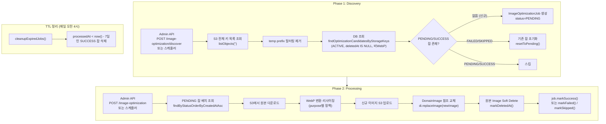
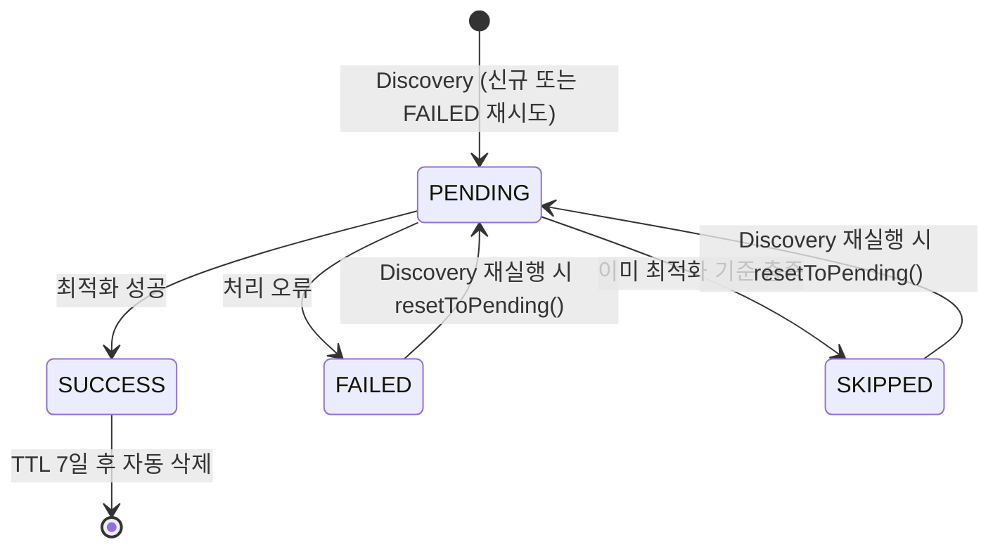

| 항목 | 내용 |
|---|---|
| 문서 제목 | 이미지 최적화 배치 테크 스펙 |
| 문서 목적 | 이미지 최적화 배치 시스템의 아키텍처·구현 흐름·설정·운영 정책을 명시하여 구현/리뷰/운영 기준으로 활용한다 |
| 작성 및 관리 | Backend Team |
| 최초 작성일 | 2026.02.27 |
| 최종 수정일 | 2026.02.27 |
| 문서 버전 | v1.0 |

<br>

# 이미지 최적화 배치 - BE 테크스펙

---

# **[1] 배경 (Background)**

## **[1-1] 프로젝트 목표 (Objective)**

S3에 업로드된 모든 이미지를 WebP로 변환·리사이징하여 전송 대역폭과 스토리지 비용을 절감하고, 최적화 작업 상태를 추적 가능하게 한다.

- **핵심 결과 (Key Result) 1:** S3에 존재하는 ACTIVE 이미지 중 WebP가 아닌 이미지를 100% 탐지하여 PENDING 잡으로 등록한다.
- **핵심 결과 (Key Result) 2:** PENDING 잡을 배치 처리하여 WebP 변환 완료 후 DomainImage 참조를 신규 이미지로 교체하고, 원본 이미지는 Soft Delete 처리한다.
- **핵심 결과 (Key Result) 3:** 완료된 잡(SUCCESS)을 7일 후 자동 삭제하여 `image_optimization_job` 테이블 무한 증가를 방지한다.

<br>

## **[1-2] 문제 정의 (Problem)**

기존 단일 단계 아키텍처는 세 가지 구조적 결함을 가지고 있었다.

| 문제 | 기존 코드 | 영향 |
|---|---|---|
| DomainImage 의존 탐색 | `SELECT di FROM DomainImage di JOIN FETCH di.image` | DomainImage에 연결되지 않은 오펀(orphan) ACTIVE 이미지 누락 |
| NOT IN 상태 무필터 | `NOT IN (SELECT j.image.id FROM ImageOptimizationJob j)` | FAILED/SKIPPED 잡도 다음 배치에서 제외되어 재처리 불가 |
| TTL 미적용 | SUCCESS 레코드 영구 보존 | 테이블 무한 증가 및 NOT IN 서브쿼리 성능 저하 |

<br>

## **[1-3] 가설 (Hypothesis)**

"S3 전체 스캔 → 후보 이미지 DB 조회 → PENDING 잡 등록" 의 Discovery 단계를 분리하면, DomainImage 연결 여부와 무관하게 모든 ACTIVE 이미지를 탐지할 수 있다. 잡 상태 필터(PENDING/SUCCESS만 중복 방지, FAILED는 재시도 허용)와 TTL 정리를 추가하면 세 가지 문제를 모두 해소할 수 있다.

<br>

---

# **[2] 목표가 아닌 것 (Non-goals)**

- 실시간 업로드 시점 자동 최적화 — 최적화는 배치(스케줄러·수동 API) 방식으로만 처리한다.
- 동영상·음성·문서 등 이미지 이외 파일 형식 처리
- 손실 없는(lossless) 변환 — 품질 0.85 고정, 추가 품질 정책은 이번 범위 밖이다.
- CDN 캐시 퍼지(invalidation) — 신규 WebP 이미지 업로드 후 CDN 캐시는 별도 정책으로 처리한다.

---

# **[3] 설계 및 기술 자료 (Architecture and Technical Documentation)**

## **[3-1] 2단계 아키텍처 개요**



<br>

## **[3-2] 이미지 최적화 정책 (purpose별)**

| FilePurpose | 변환 방식 | 최대 크기 | 비고 |
|---|---|---|---|
| `PROFILE_IMAGE`, `GROUP_IMAGE` | 정사각형 크롭 후 리사이징 | 100×100px | 중앙 기준 크롭 |
| `RESTAURANT_IMAGE` | 너비 기준 축소 (비율 유지) | 최대 너비 2048px | 초과 시만 리사이징 |
| `REVIEW_IMAGE`, `MENU_IMAGE`, `CHAT_IMAGE` | 너비 기준 축소 (비율 유지) | 최대 너비 768px | 초과 시만 리사이징 |
| `COMMON_ASSET` | 원본 비율 유지 그대로 WebP 변환 | 제한 없음 | - |

- **출력 포맷:** WebP (MIME: `image/webp`)
- **품질:** 0.85 (고정)
- **최적화 스킵 조건:** 이미 `image/webp`이고 크기 기준 이하인 경우

<br>

## **[3-3] 데이터베이스 스키마**

### `image_optimization_job`

| 컬럼 | 타입 | Nullable | 설명 |
|---|---|---|---|
| `id` | `bigint` | N | PK |
| `image_id` | `bigint` | N | `Image.id` FK, UNIQUE |
| `status` | `varchar(32)` | N | `PENDING`, `SUCCESS`, `FAILED`, `SKIPPED` |
| `original_size` | `bigint` | Y | 원본 파일 크기(bytes) |
| `optimized_size` | `bigint` | Y | 최적화 파일 크기(bytes) |
| `original_width` | `int` | Y | 원본 이미지 너비(px) |
| `original_height` | `int` | Y | 원본 이미지 높이(px) |
| `optimized_width` | `int` | Y | 최적화 이미지 너비(px) |
| `optimized_height` | `int` | Y | 최적화 이미지 높이(px) |
| `error_message` | `text` | Y | 실패/스킵 사유 |
| `created_at` | `timestamptz` | N | 잡 생성 시각 (PENDING 등록 시) |
| `processed_at` | `timestamptz` | Y | 처리 완료 시각 (SUCCESS/FAILED/SKIPPED) |

**제약:**
- `image_id` UNIQUE → 동일 이미지에 잡 중복 생성 불가
- TTL 대상: `status = 'SUCCESS' AND processed_at < now() - interval '7 days'`

<br>

### 잡 상태 전이



<br>

## **[3-4] 핵심 컴포넌트**

### `StorageClient.listObjects(String prefix)`

S3 ListObjectsV2를 사용하여 버킷 전체 키 목록을 페이지네이션으로 수집한다. `prefix = ""`로 호출하면 전체 오브젝트를 조회한다. `DummyStorageClient`는 빈 리스트를 반환한다.

### `ImageOptimizationService.discoverOptimizationTargets()`

1. `storageClient.listObjects("")`로 전체 S3 키 조회
2. `tempUploadPrefix`(기본값 `uploads/temp`) 시작 키 제외
3. 500개씩 배치로 `imageRepository.findOptimizationCandidatesByStorageKeys()` 호출
   - 조건: `status = 'ACTIVE' AND deletedAt IS NULL AND LOWER(fileType) <> 'image/webp'`
4. `findAlreadyEnqueuedImageIds()`로 이미 PENDING/SUCCESS인 이미지 ID 조회 (스킵 대상)
5. FAILED/SKIPPED 잡이 있는 이미지는 `resetToPending()`으로 초기화
6. 잡이 없는 이미지는 `ImageOptimizationJob.createPending(image)` 신규 생성

### `ImageOptimizationService.processOptimizationBatch(int batchSize)`

1. `findByStatusOrderByCreatedAtAsc(PENDING, PageRequest.of(0, batchSize))`로 PENDING 잡 조회
2. 잡별로 `processSingleJob(job)` 호출
3. SUCCESS/FAILED/SKIPPED 카운트 집계 후 `OptimizationResult` 반환

### `ImageOptimizationScheduler`

- `runOptimization()`: 매일 오전 3시 (`IMAGE_OPTIMIZATION_CRON` 환경 변수로 조정) - PENDING 잡 배치 처리
- `cleanupExpiredJobs()`: 매일 오전 4시 (`IMAGE_OPTIMIZATION_CLEANUP_CRON`) - SUCCESS 잡 7일 TTL 삭제
- `tasteam.image.optimization.enabled=true`일 때만 활성화

<br>

## **[3-5] Admin API**

> Base: `/api/v1/admin/jobs`

| 메서드 | 경로 | 설명 | 응답 |
|---|---|---|---|
| `POST` | `/image-optimization/discover` | S3 스캔 후 PENDING 잡 생성 | `200 AdminJobResponse` |
| `GET` | `/image-optimization/pending` | PENDING 잡 목록 조회 (`?limit=100`) | `200 List<AdminPendingJobResponse>` |
| `POST` | `/image-optimization` | PENDING 잡 배치 처리 (`?batchSize=100`) | `200 AdminJobResponse` |
| `DELETE` | `/image-optimization` | 잡 테이블 전체 삭제 (리셋용) | `204` |

### 권장 운영 순서

```
1. POST /discover     → PENDING 잡 등록 확인 (successCount > 0)
2. GET  /pending      → 등록된 잡 목록 검토
3. POST /            → 배치 처리 (successCount, failedCount 확인)
4. (문제 시) DELETE / → 전체 초기화 후 1번부터 재시작
```

### 응답 스키마

**`AdminJobResponse`**
```json
{
  "jobName": "image-optimization-discover",
  "successCount": 42,
  "failedCount": 0,
  "skippedCount": 0
}
```

**`AdminPendingJobResponse`**
```json
{
  "jobId": 1,
  "imageId": 100,
  "fileUuid": "a3f1c9e0-7a9b-4e9c-bc2e-1f2c33aa9012",
  "fileName": "photo.jpg",
  "fileSize": 1048576,
  "fileType": "image/jpeg",
  "purpose": "RESTAURANT_IMAGE",
  "jobCreatedAt": "2026-02-27T03:00:00Z"
}
```

<br>

## **[3-6] 설정 (Configuration)**

| 설정 키 | 환경 변수 | 기본값 | 설명 |
|---|---|---|---|
| `tasteam.image.optimization.enabled` | `IMAGE_OPTIMIZATION_ENABLED` | `false` | 스케줄러 활성화 여부 |
| `tasteam.image.optimization.cron` | `IMAGE_OPTIMIZATION_CRON` | `0 0 3 * * ?` | Processing 스케줄 (오전 3시) |
| `tasteam.image.optimization.batch-size` | `IMAGE_OPTIMIZATION_BATCH_SIZE` | `100` | 1회 처리 잡 수 |
| `tasteam.image.optimization.cleanup-cron` | `IMAGE_OPTIMIZATION_CLEANUP_CRON` | `0 0 4 * * ?` | TTL 정리 스케줄 (오전 4시) |
| `tasteam.storage.temp-upload-prefix` | `STORAGE_TEMP_UPLOAD_PREFIX` | `uploads/temp` | Discovery 제외 prefix |

<br>

---

# **[4] 이외 고려사항들 (Other Considerations)**

## **[4-1] 고려사항 체크리스트**

- **성능:**
  - S3 `listObjects`는 버킷 규모에 따라 수십 초 소요 가능 → Discovery는 스케줄러가 아닌 Admin API로 수동 호출을 권장하며, 대규모 운영 시 별도 prefix 분할 탐색을 검토한다.
  - `findOptimizationCandidatesByStorageKeys`는 500개 배치 단위 IN 쿼리를 사용하여 메모리 및 쿼리 크기를 제어한다.
  - `@OneToOne unique` 제약으로 동일 이미지에 잡이 중복 생성되지 않는다.

- **오펀 이미지 처리:**
  - `DomainImage`에 연결되지 않은 ACTIVE 이미지도 Discovery 대상에 포함된다.
  - `processSingleJob()`은 `domainImageRepository.findAllByImage()`로 연결된 DomainImage를 조회하며, 연결이 없어도 WebP 변환 자체는 수행한다(DomainImage 교체 단계만 스킵).

- **FAILED 잡 재시도:**
  - Discovery 재실행 시 FAILED/SKIPPED 잡은 `resetToPending()`으로 상태를 초기화하여 재처리 대상이 된다.
  - 수동 리셋이 필요하면 `DELETE /image-optimization` 후 재실행한다.

- **TTL:**
  - SUCCESS 잡만 7일 후 삭제된다.
  - FAILED/SKIPPED 잡은 TTL 대상이 아니며, Discovery 재실행 시 PENDING으로 전환된다.

- **DummyStorageClient:**
  - `listObjects()`는 빈 리스트를 반환하므로 로컬/테스트 환경에서 Discovery를 실행해도 잡이 생성되지 않는다.

<br>

## **[4-2] 리스크 및 대응 (Risks & Mitigations)**

- **리스크:** S3 listObjects 호출 중 버킷 내 오브젝트가 수만 개를 넘을 경우 Discovery 실행 시간이 길어진다.
  **대응:** Discovery를 스케줄러에 연결하지 않고 수동 Admin API로만 운영한다. 추후 prefix별 분할 탐색 또는 S3 Inventory 리포트 활용을 검토한다.

- **리스크:** 최적화 중 서비스가 재시작되면 처리 중이던 이미지가 PENDING 상태로 남아 다음 실행에서 재처리된다.
  **대응:** `processSingleJob()`은 `@Transactional`로 묶여 있어 중단 시 롤백된다. 다음 배치에서 PENDING 잡이 재처리되므로 데이터 정합성은 유지된다.

- **리스크:** `@OneToOne unique` 제약으로 인해 동일 이미지에 대해 FAILED 잡이 있는 상태에서 Discovery를 재실행하면 제약 위반이 발생할 수 있다.
  **대응:** Discovery는 기존 FAILED/SKIPPED 잡을 `resetToPending()`으로 업데이트하고, 신규 잡은 잡이 없는 이미지에만 생성한다. 두 가지 경로를 명확히 분리하여 제약 위반을 방지한다.

<br>

---

# **[5] 테스트 (Testing)**

- **Discovery:**
  - S3 키 목록에서 temp prefix 항목이 제외되는지 확인
  - ACTIVE, deletedAt IS NULL, 비WebP인 이미지만 후보로 선별되는지 확인
  - PENDING/SUCCESS 잡이 있는 이미지는 중복 등록되지 않는지 확인
  - FAILED/SKIPPED 잡이 있는 이미지는 `resetToPending()` 호출 후 상태가 PENDING으로 변경되는지 확인

- **Processing:**
  - purpose별 리사이징 결과 크기가 정책 기준 이하인지 확인
  - 변환 후 파일 포맷이 WebP인지 확인
  - DomainImage 교체 후 신규 Image가 ACTIVE, 원본 Image가 deletedAt 설정되는지 확인
  - 이미 최적화 기준을 충족한 이미지가 SKIPPED 처리되는지 확인
  - S3 다운로드/업로드 실패 시 FAILED로 마킹되는지 확인

- **TTL 정리:**
  - `processedAt`이 7일 전인 SUCCESS 잡만 삭제되는지 확인
  - FAILED/SKIPPED 잡은 삭제 대상이 아닌지 확인

- **Admin API:**
  - `POST /discover` 호출 시 `successCount`가 등록된 잡 수와 일치하는지 확인
  - `GET /pending` 응답이 PENDING 잡 목록과 일치하는지 확인
  - `DELETE /` 호출 후 테이블이 비어있는지 확인

<br>

---

# **[6] 함께 논의하고 싶은 내용 (Open Questions)**

1. **Discovery 자동화:** 현재 Discovery는 수동 Admin API로만 운영한다. 스케줄러에 연결할 경우 `listObjects` 실행 시간이 스케줄 주기보다 길어질 수 있어 신중하게 검토가 필요하다. (Owner: @Backend, Due: TBD)

2. **FAILED 잡 보관 기간:** 현재 FAILED/SKIPPED 잡은 TTL 없이 보관된다. Discovery 재실행 시 PENDING으로 초기화되지만, 장기간 해결되지 않는 FAILED 잡에 대한 별도 알람/정리 정책을 두어야 할지 논의가 필요하다. (Owner: @Backend, Due: TBD)

3. **대규모 버킷 탐색:** 오브젝트 수가 수십만 개를 넘는 경우 `listObjects` 방식보다 S3 Inventory CSV 리포트를 활용하는 것이 효율적일 수 있다. 버킷 규모에 따라 전환 시점을 고려한다. (Owner: @Backend, Due: TBD)

<br>

---

# **[7] 용어 정의 (Glossary)**

- **Discovery:** S3 전체를 스캔하여 최적화 대상 이미지를 찾고 PENDING 잡을 등록하는 1단계 과정
- **Processing:** PENDING 잡을 배치로 읽어 실제 WebP 변환을 수행하는 2단계 과정
- **PENDING:** Discovery에서 등록되어 처리를 기다리는 잡 상태
- **SUCCESS:** WebP 변환·업로드·참조 교체가 모두 완료된 잡 상태
- **FAILED:** 처리 중 오류가 발생한 잡 상태 (Discovery 재실행 시 PENDING으로 복구 가능)
- **SKIPPED:** 이미 최적화 기준을 충족하여 처리가 불필요한 잡 상태
- **TTL (Time-to-Live):** SUCCESS 잡의 `processedAt` 기준 7일 후 자동 삭제 정책
- **오펀 이미지 (Orphan Image):** `DomainImage`에 연결되지 않은 ACTIVE 상태의 이미지
- **resetToPending:** FAILED/SKIPPED 잡의 상태를 PENDING으로 초기화하는 재시도 메커니즘

<br>

---

# **[8] 변경이력**

| 버전 | 일자 | 작성자 | 변경 내역 | 비고 |
|---|---|---|---|---|
| v1.0 | 2026.02.27 | Backend Team | 이미지 최적화 배치 아키텍처 리팩터 후 테크스펙 초안 작성 | Discovery/Processing 2단계 분리, TTL 정리, Admin API |
