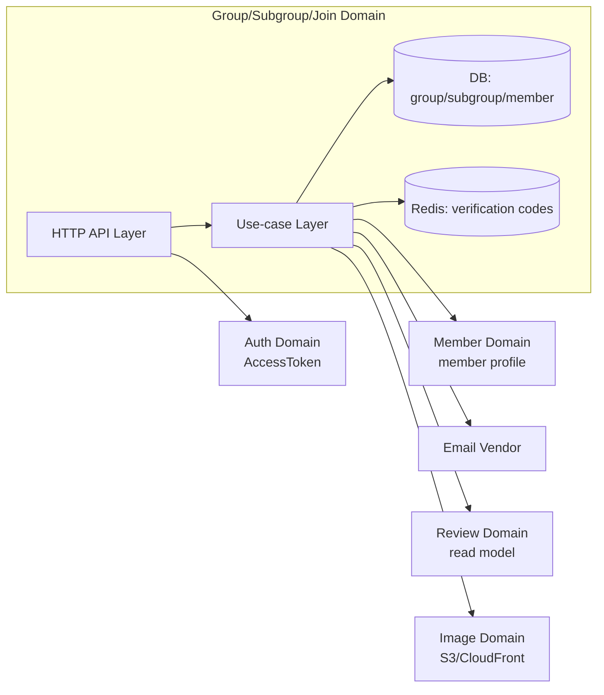
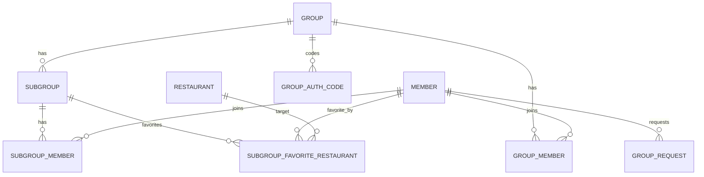

| 항목 | 내용 |
|---|---|
| 문서 제목 | 그룹/하위그룹(+그룹가입) 테크 스펙 |
| 문서 목적 | 그룹/하위그룹/가입(Join) 도메인의 요구사항·데이터 모델·API 계약·처리 흐름·운영 기준을 정의하여 구현/리뷰/테스트 <br> 기준으로 활용한다. |
| 작성 및 관리 | Backend Team |
| 최초 작성일 | 2026.01.12 |
| 최종 수정일 | 2026.01.19 |
| 문서 버전 | v1.7 |

<!--
작성 규약

- 제목/문장에 붙는 `(...)` 형태의 부연 설명은 제거한다.
- API 요청/응답은 구현 가능한 수준으로 작성한다.
  - 필드별로 `타입`, `필수 여부`, `기본값`, `제약(min/max/enum/regex)`, `설명`을 포함한다.
- 문서 구조(섹션/항목)는 변경하지 말고, 스타일/표현만 수정한다.
-->

# 그룹/하위그룹(+그룹가입) - BE 테크스펙

---

# **[1] 배경 (Background)**

<!--
이 섹션에 무엇을 작성하나요?
- 도메인이 “왜 필요한지”를 합의된 문장으로 고정합니다.
- 목표/문제/가설을 짧고 검증 가능하게 적어, 이후 설계 선택의 근거로 사용합니다.

주의할 점
- “좋아질 것이다”가 아니라 어떤 지표/현상이 어떻게 바뀌는지까지 적습니다.
- 개인 의견이 아니라 팀 합의/근거(데이터/로그/요구사항)를 우선합니다.
-->

## **[1-1] 프로젝트 목표 (Objective)**

<!--
이 섹션에 무엇을 작성하나요?
- 이번 문서/구현의 목적을 1~2문장으로 요약합니다.
- 측정 가능한 결과(Key Result)를 2~5개 정도로 제시합니다.

주의할 점
- 결과는 “정량 지표”가 우선이며, 가능하면 기준값/목표값을 함께 적습니다.
-->

사용자 커뮤니티(그룹/하위그룹) 진입 장벽을 낮추고, 운영 관리자 관점에서 안정적으로 관리 가능한 그룹 시스템을 제공한다.

- **핵심 결과 (Key Result) 1:** 그룹 가입(Join) 성공률 99% 이상 유지(코드 인증/비밀번호 검증 포함, 5분 슬라이딩 윈도우)
- **핵심 결과 (Key Result) 2:** 그룹 가입 관련 4xx/5xx 비율이 전체 요청의 0.5% 미만 유지 및 4xx/5xx 급증 시 슬랙/모니터 알람
- **핵심 결과 (Key Result) 3:** “내 그룹 조회” API p95 250ms 이하(전체 클러스터, 프로덕션 메트릭/속성 기준)

<br>

## **[1-2] 문제 정의 (Problem)**

<!--
이 섹션에 무엇을 작성하나요?
- 현재 겪는 문제(사용자/운영/성능/보안)를 사실 기반으로 나열합니다.
- 문제가 발생하는 조건(언제/어디서/얼마나 자주)을 적습니다.

주의할 점
- 해결책을 먼저 쓰지 말고, 관측 가능한 문제를 먼저 고정합니다.
-->

- 그룹/하위그룹/가입 기능이 여러 도메인에 흩어지면 멤버십 정합성(중복/탈퇴/복구)이 쉽게 깨진다.
- “내 그룹 조회”가 그룹+하위그룹을 중첩 포함하는 구조라 조회 성능/페이징 정책이 필요하다.
- 이메일 인증/외부 벤더 연동은 장애가 기본값이므로 재시도/제한/관측이 필수다.

<br>

## **[1-3] 가설 (Hypothesis)**

<!--
이 섹션에 무엇을 작성하나요?
- “무엇을 바꾸면 어떤 지표가 개선되는가”를 원인-결과로 표현합니다.
- 설계 선택(예: 캐시/인덱스/토큰 정책)의 판단 기준을 제공합니다.

주의할 점
- 너무 많은 가설을 나열하지 말고 핵심 1~3개로 제한합니다.
-->

그룹/하위그룹/가입의 책임과 데이터 변경 지점을 한 문서로 고정하고, 인증 코드/멤버십 중복/삭제 정책을 명확히 하면 구현·리뷰·테스트의 해석 차이를 줄이고 운영 안정성이 올라간다.

<br>

---

# **[2] 목표가 아닌 것 (Non-goals)**

<!--
이 섹션에 무엇을 작성하나요?
- “이번에 하지 않는 것”을 기능/업무 단위로 명시합니다.
- 스코프가 커질 여지가 큰 항목(예: 정기배송, 추천 시스템, 관리자 UI 전면 개편 등)을 미리 제외로 박아둡니다.

주의할 점
- “추후 논의”처럼 모호한 표현만 적지 말고, 제외 사유/경계(어디까지가 이번 범위인지)를 함께 씁니다.
- 범위 충돌이 예상되는 다른 도메인/팀의 책임 경계가 있으면 여기에서 선을 긋습니다.
-->

**이번 작업에서 다루지 않는 내용:**

- 그룹/하위그룹에 대한 리뷰 작성/수정(Review 도메인)
- 채팅 메시지/채팅방(채팅 도메인)
- 알림 발송/설정(알림 도메인)
- 회원 계정/프로필 변경, 로그인/토큰(인증/회원 도메인)

---

# **[3] 설계 및 기술 자료 (Architecture and Technical Documentation)**

<!--
이 섹션에 무엇을 작성하나요?
- ERD 링크/이미지 + 도메인 주요 테이블과 관계를 요약합니다.
- DDL(테이블 생성/수정)과 주요 제약조건(Unique/FK 등), 인덱스 등 “구현/리뷰에 필요한 근거”를 남깁니다.
- API는 “목차(링크) → API별 상세” 순서로, METHOD/PATH·권한·요청/응답·처리 단계·트랜잭션 경계·동시성/멱등성까지 적어 문서만 보고 구현 가능하게 합니다.

주의할 점
- 추상적인 설명(“저장한다/검증한다”)만 적으면 구현 시 해석이 갈립니다. DB 변경(어떤 테이블/컬럼)과 실패/복구(재시도/보상/롤백)까지 연결합니다.
- 외부 연동은 장애가 기본값입니다. 타임아웃/재시도/backoff/폴백과 멱등성 키 기준을 반드시 명시합니다.
-->

## **[3-1] 모듈 구성**

- HTTP 레이어
    - Public API: 그룹/하위그룹 조회, 내 그룹/내 하위그룹 조회, 탈퇴, 가입(Join), 그룹 생성 신청
    - Admin API: 그룹 수정/삭제, 그룹 멤버 조회/삭제(운영 관리자)
- Application 레이어(유스케이스)
    - 그룹 생성 신청 유스케이스: 신청 검증 → 중복 체크 → 신청 저장
    - 그룹/하위그룹 조회 유스케이스: 목록/상세 조회 + 필요한 조합(하위그룹/멤버수/리뷰 요약 등)
    - 그룹/하위그룹 변경 유스케이스: 수정/삭제/생성/탈퇴(soft delete 포함)
    - 가입(Join) 유스케이스: 이메일 인증(발송/검증) 또는 비밀번호 검증 → 멤버십 생성/복구
    - 하위그룹 찜 유스케이스: 하위그룹 내 찜 등록/삭제/조회
- Persistence 레이어
    - Group/Subgroup/Request/Membership에 대한 조회·저장 책임 분리
    - 멤버십 중복 방지(유니크/조건 조회)와 soft delete 복구 전략을 포함
- External/Infra
    - 인증 코드 저장소(Redis): 코드/TTL/시도 횟수/재발송 제한 키 관리
    - 이메일 발송 모듈: 타임아웃/재시도/실패 관측(메트릭/알람)
    - 이미지 조회/연결(정책 확정 시): 로고/프로필/썸네일의 “어떤 형태(id/url)”로 노출할지에 맞춘 조회 전략

<br>

## **[3-2] 의존성 관계 (Dependency Graph)**



<br>

## **[3-3] 정책(Policy)**

- 그룹 생성 정책
    - 그룹 생성은 관리자(ADMIN) 권한으로만 허용한다.
    - 그룹은 생성 시 가입 방식(`join_type`)을 반드시 지정해야 한다.
        - `EMAIL` : 이메일 도메인 기반 가입
        - `PASSWORD` : 비밀번호 기반 가입
    - `EMAIL` 유형 그룹 생성 시:
        - `email_domain` 값은 필수이다.
        - 가입 시 사용자의 이메일 도메인이 그룹의 `email_domain`과 일치해야 한다.
        - 이메일 인증 절차를 통과하지 못한 사용자는 가입할 수 없다.
    - `PASSWORD` 유형 그룹 생성 시:
        - 그룹 비밀번호는 필수이며, 서버에 해시 처리하여 저장한다.
        - 가입 시 입력한 비밀번호 검증 성공 시에만 가입을 허용한다.
    - 그룹은 생성 직후 기본 상태를 `ACTIVE`로 가진다.
    - 동일한 이름의 그룹 중복 생성은 허용하지 않는다(정책 기준, 제약 방식은 DB/애플리케이션 레벨에서 강제).
- 하위그룹 생성 정책
    - 하위그룹은 해당 그룹의 멤버만 생성할 수 있다.
    - 하위그룹 생성 시 반드시 **참여 방식(`join_type`)**을 지정해야 한다.
        - `OPEN` : 별도 검증 없이 즉시 참여 가능
        - `PASSWORD` : 비밀번호 검증 성공 시 참여 가능
    - `PASSWORD` 유형 하위그룹 생성 시:
        - 하위그룹 비밀번호는 필수이며, 서버에 해시 처리하여 저장한다.
    - 하위그룹은 생성 시 자동으로 `ACTIVE` 상태가 된다.
    - 동일 그룹 내에서 하위그룹 이름은 중복될 수 없다.
    - 비활성화(`INACTIVE`) 상태의 그룹에서는 하위그룹을 생성할 수 없다.
- 가입/노출 정책
    - 그룹 노출 정책
        - `status=ACTIVE` 인 그룹만 사용자에게 노출된다.
        - `INACTIVE` 그룹은 목록/검색/직접 접근 모두에서 제외된다.
    - 그룹 가입 정책
        - 그룹의 `join_type` 에 따라 가입 방식이 결정된다.
            - `EMAIL` : 지정된 이메일 도메인 인증 성공 시 가입 가능
            - `PASSWORD` : 그룹 비밀번호 검증 성공 시 가입 가능
    - 하위그룹 노출 정책
        - `status=ACTIVE` 인 하위그룹만 그룹 멤버에게 노출된다.
        - 그룹 멤버가 아닌 경우 하위그룹 목록/상세 접근이 불가능하다.
    - **하위그룹 가입 정책**
        - 그룹 멤버만 하위그룹 가입을 시도할 수 있다.
        - 하위그룹의 `join_type` 에 따라 참여 방식이 결정된다.
            - `OPEN` : 검증 없이 즉시 참여
            - `PASSWORD` : 하위그룹 비밀번호 검증 성공 시 참여
    - **공통 제한**
        - 비활성화(`INACTIVE`) 상태의 그룹/하위그룹에는 신규 가입이 불가능하다.
        - 이미 가입된 멤버의 기존 소속 정보는 유지하되, 신규 활동은 제한된다.
- 중복 방지 정책
    - **그룹 중복 방지**
        - 동일한 이름의 그룹은 중복 생성할 수 없다.
        - 그룹 이름 중복 여부는 생성 시점에 검증한다.
        - 중복 기준은 `group.name` 단일 기준으로 한다.
    - **하위그룹 중복 방지**
        - 동일 그룹 내에서 하위그룹 이름은 중복될 수 없다.
        - 중복 기준은 `(group_id, subgroup.name)` 조합이다.
        - 그룹이 다른 경우에는 동일한 하위그룹 이름을 허용한다.
    - **멤버십 중복 방지**
        - 하나의 사용자는 동일 그룹에 중복 가입할 수 없다.
        - 하나의 사용자는 동일 하위그룹에 중복 참여할 수 없다.
        - 중복 가입/참여 요청은 멱등하게 처리하거나 오류로 응답한다(정책 고정).
- 삭제/비활성 정책
    - **공통 원칙**
        - 그룹 및 하위그룹은 **물리 삭제를 수행하지 않는다.**
        - 모든 삭제 개념은 `status` 기반의 **소프트 비활성화(INACTIVE)** 로 처리한다.
    - **그룹 비활성화 정책**
        - 그룹이 `INACTIVE` 상태로 전환되면:
            - 그룹 상세/목록/검색에서 노출되지 않는다.
            - 신규 그룹 가입 및 하위그룹 생성이 불가능하다.
        - 그룹 비활성화 시, 소속된 모든 하위그룹은 자동으로 `INACTIVE` 처리된다.
    - **하위그룹 비활성화 정책**
        - 하위그룹이 `INACTIVE` 상태로 전환되면:
            - 하위그룹 목록/상세에서 노출되지 않는다.
            - 신규 하위그룹 참여가 불가능하다.
        - 기존 하위그룹 멤버십 데이터는 유지한다.
    - **멤버십 데이터 정책**
        - `group_member`, `subgroup_member` 데이터는 비활성화 시 삭제하지 않는다.
        - 상태 변경 이후에도 이력 및 참조 목적의 조회는 가능하다.
        - 활동성 판단 시에는 항상 상위 그룹/하위그룹의 `status=ACTIVE` 여부를 함께 검증한다.

---
<br>

## **[3-4] 데이터베이스 스키마 (ERD)**

- ERD: [ERD Cloud](https://www.erdcloud.com/d/TXZ3CApePpKwEyacT)
- DDL: [ERD 테이블 정의서](https://github.com/100-hours-a-week/3-team-tasteam-wiki/wiki/%5BERD%5D-%ED%85%8C%EC%9D%B4%EB%B8%94-%EC%A0%95%EC%9D%98%EC%84%9C)

**도메인 책임 요약**

- Group: 그룹 자체의 상태/정책(가입 방식/상태/주소/로고)
- Subgroup: 그룹 하위 소모임
- Membership: 그룹/하위그룹 소속(탈퇴는 soft delete)
- Join(가입): 이메일 인증 또는 비밀번호 검증을 통해 멤버십 생성
- Subgroup Favorite: 하위그룹 단위 찜(내 찜)

**주요 테이블 요약**

- `group`: 그룹 기본 정보 및 가입 정책
- `subgroup`: 하위그룹 기본 정보 및 가입 정책
- `group_member`: 회원의 그룹 소속
- `subgroup_member`: 회원의 하위그룹 소속
- `group_request`: 그룹 생성 신청
- `group_auth_code`: 그룹 가입 인증 코드
- `subgroup_favorite_restaurant`: 하위그룹 찜

**관계 요약**

- `subgroup.group_id -> group.id` (N:1, 삭제정책 `RESTRICT(기본)`, 비고: 하위그룹 소속)
- `group_member.group_id -> group.id` (N:1, 삭제정책 `RESTRICT(기본)`, 비고: 그룹 멤버십)
- `group_member.member_id -> member.id` (N:1, 삭제정책 `RESTRICT(기본)`, 비고: 회원 소속)
- `subgroup_member.subgroup_id -> subgroup.id` (N:1, 삭제정책 `RESTRICT(기본)`, 비고: 하위그룹 멤버십)
- `subgroup_member.member_id -> member.id` (N:1, 삭제정책 `RESTRICT(기본)`, 비고: 회원 소속)
- `group_request.member_id -> member.id` (N:1, 삭제정책 `RESTRICT(기본)`, 비고: 신청자)
- `group_auth_code.group_id -> group.id` (N:1, 삭제정책 `RESTRICT(기본)`, 비고: 가입 인증 코드)
- `subgroup_favorite_restaurant.subgroup_id -> subgroup.id` (N:1, 삭제정책 `RESTRICT(기본)`, 비고: 하위그룹 찜)
- `subgroup_favorite_restaurant.member_id -> member.id` (N:1, 삭제정책 `RESTRICT(기본)`, 비고: 찜한 회원)
- `subgroup_favorite_restaurant.restaurant_id -> restaurant.id` (N:1, 삭제정책 `RESTRICT(기본)`, 비고: 음식점 참조)

**ERD(Mermaid)**



**테이블 정의서**

#### `group`

| 컬럼 | 타입 | Nullable | 기본값 | 설명 | 제약/고려사항 |
|---|---|---|---|---|---|
| `id` | `BIGINT` | N | `SEQUENCE` | 그룹 식별자 | `PK_GROUP` |
| `name` | `VARCHAR(100)` | N | - | 그룹명 | - |
| `type` | `VARCHAR(20)` | N | - | 그룹 타입 | enum `OFFICIAL|UNOFFICIAL` |
| `logo_image_url` | `VARCHAR(500)` | Y | - | 로고 이미지 URL | - |
| `address` | `VARCHAR(255)` | N | - | 주소 | - |
| `detail_address` | `VARCHAR(255)` | Y | - | 상세 주소 | - |
| `location` | `geometry(Point, 4326)` | Y | - | 위치 좌표 | PostGIS(4326 WGS84) |
| `join_type` | `VARCHAR(20)` | N | - | 가입 방식 | enum `EMAIL|PASSWORD` |
| `email_domain` | `VARCHAR(100)` | Y | - | 이메일 도메인 제한 | - |
| `status` | `VARCHAR(20)` | N | `'ACTIVE'` | 상태 | enum `ACTIVE|INACTIVE` |
| `created_at` | `TIMESTAMP` | N | - | 생성 시각 | - |
| `updated_at` | `TIMESTAMP` | N | - | 수정 시각 | - |
| `deleted_at` | `TIMESTAMP` | Y | - | soft delete 시각 | - |

#### `subgroup`

| 컬럼 | 타입 | Nullable | 기본값 | 설명 | 제약/고려사항 |
|---|---|---|---|---|---|
| `id` | `BIGINT` | N | `SEQUENCE` | 하위그룹 식별자 | `PK_SUBGROUP` |
| `group_id` | `BIGINT` | N | - | 상위 그룹 ID | FK(`group.id`) |
| `name` | `VARCHAR(100)` | N | - | 하위그룹명 | - |
| `description` | `VARCHAR(500)` | Y | - | 소개 | - |
| `profile_image_url` | `VARCHAR(500)` | Y | - | 프로필 이미지 URL | - |
| `join_type` | `VARCHAR(20)` | N | - | 가입 방식 | enum `OPEN|PASSWORD` |
| `join_password` | `VARCHAR(255)` | Y | - | 비밀번호 | - |
| `status` | `VARCHAR(20)` | N | `'ACTIVE'` | 상태 | enum `ACTIVE|INACTIVE` |
| `created_at` | `TIMESTAMP` | N | - | 생성 시각 | - |
| `updated_at` | `TIMESTAMP` | N | - | 수정 시각 | - |

#### `group_member`

| 컬럼 | 타입 | Nullable | 기본값 | 설명 | 제약/고려사항 |
|---|---|---|---|---|---|
| `id` | `BIGINT` | N | `SEQUENCE` | 멤버십 식별자 | `PK_GROUP_MEMBER` |
| `group_id` | `BIGINT` | N | - | 그룹 ID | FK(`group.id`) |
| `member_id` | `BIGINT` | N | - | 회원 ID | FK(`member.id`) |
| `created_at` | `TIMESTAMP` | N | - | 가입 시각 | - |
| `deleted_at` | `TIMESTAMP` | Y | - | 탈퇴 시각(soft delete) | - |

#### `subgroup_member`

| 컬럼 | 타입 | Nullable | 기본값 | 설명 | 제약/고려사항 |
|---|---|---|---|---|---|
| `id` | `BIGINT` | N | `SEQUENCE` | 멤버십 식별자 | `PK_SUBGROUP_MEMBER` |
| `member_id` | `BIGINT` | N | - | 회원 ID | FK(`member.id`) |
| `subgroup_id` | `BIGINT` | N | - | 하위그룹 ID | FK(`subgroup.id`) |
| `created_at` | `TIMESTAMP` | N | - | 가입 시각 | - |
| `deleted_at` | `TIMESTAMP` | Y | - | 탈퇴 시각(soft delete) | - |

#### `group_request`

| 컬럼 | 타입 | Nullable | 기본값 | 설명 | 제약/고려사항 |
|---|---|---|---|---|---|
| `id` | `BIGINT` | N | `SEQUENCE` | 그룹 생성 신청 식별자 | `PK_GROUP_REQUEST` |
| `member_id` | `BIGINT` | N | - | 신청자 | FK(`member.id`) |
| `status` | `VARCHAR(20)` | N | - | 신청 상태 | enum `PENDING|APPROVED|REJECTED` |
| `email` | `VARCHAR(255)` | N | - | 신청 이메일 | - |
| `request_type` | `VARCHAR(20)` | N | - | 신청 타입 | enum `OFFICIAL|UNOFFICIAL` |
| `company_name` | `VARCHAR(30)` | N | - | 그룹명(회사명) | - |
| `address` | `VARCHAR(255)` | N | - | 주소 | - |
| `detail_address` | `VARCHAR(255)` | Y | - | 상세 주소 | - |
| `postal_code` | `VARCHAR(16)` | Y | - | 우편번호 | - |
| `agreed_terms_at` | `TIMESTAMP` | Y | - | 약관 동의 시각 | - |
| `agreed_privacy_at` | `TIMESTAMP` | Y | - | 개인정보 동의 시각 | - |
| `created_at` | `TIMESTAMP` | N | - | 생성 시각 | - |
| `request_result_group_id` | `BIGINT` | Y | - | 승인 결과 그룹 | - |

#### `group_auth_code`

| 컬럼 | 타입 | Nullable | 기본값 | 설명 | 제약/고려사항 |
|---|---|---|---|---|---|
| `id` | `BIGINT` | N | `SEQUENCE` | 코드 식별자 | `PK_GROUP_AUTH_CODE` |
| `group_id` | `BIGINT` | N | - | 그룹 ID | FK(`group.id`) |
| `code` | `VARCHAR(20)` | N | - | 인증 코드 | - |
| `expires_at` | `TIMESTAMP` | N | - | 만료 시각 | - |
| `created_at` | `TIMESTAMP` | N | - | 생성 시각 | - |

#### `subgroup_favorite_restaurant`

| 컬럼 | 타입 | Nullable | 기본값 | 설명 | 제약/고려사항 |
|---|---|---|---|---|---|
| `id` | `BIGINT` | N | `SEQUENCE` | 식별자 | `PK_SUBGROUP_FAVORITE_RESTAURANT` |
| `member_id` | `BIGINT` | N | - | 회원 ID | FK(`member.id`) |
| `subgroup_id` | `BIGINT` | N | - | 하위그룹 ID | FK(`subgroup.id`) |
| `restaurant_id` | `BIGINT` | N | - | 음식점 ID | FK(`restaurant.id`) |
| `created_at` | `TIMESTAMP` | N | - | 찜 생성 시각 | - |

**주요 인덱스(권장)**

| 테이블 | 인덱스 명 | 컬럼 | 목적 |
|---|---|---|---|
| `group` | `IDX_group_status` | `status, id` | 목록 필터/정렬 |
| `group_member` | `IDX_group_member_member_created` | `member_id, deleted_at, created_at` | 내 그룹 조회 |
| `subgroup_member` | `IDX_subgroup_member_member_created` | `member_id, deleted_at, created_at` | 내 하위그룹 조회 |
| `group_request` | `IDX_group_request_member_created` | `member_id, created_at, id` | 신청 목록 |
| `group_auth_code` | `IDX_group_auth_code_group_expires` | `group_id, expires_at` | 인증 코드 검증 |
| `subgroup_favorite_restaurant` | `IDX_subgroup_favorite_member_created` | `member_id, subgroup_id, created_at, id` | 하위그룹 찜 목록 |

## **[3-5] API 명세 (API Specifications)**

<!--
이 섹션에 무엇을 작성하나요?
- “목차(앵커 링크) → API별 상세” 순서로 작성합니다.
- 각 API는 최소한 METHOD/PATH, 권한, 요청/응답, 처리 단계, 트랜잭션 경계, 동시성/멱등성, 에러 코드를 포함합니다.

주의할 점
- API 계약이 모호하지 않도록 요청/응답 스키마를 가능한 한 명시합니다.
- 외부 연동이 있으면 타임아웃/재시도/backoff/폴백/멱등성 키까지 포함합니다.
-->

- **목차:**
    - [그룹 생성 신청](#그룹-생성-신청)
    - [그룹 생성(관리자)](#그룹-생성관리자)
    - [그룹 상세 조회](#그룹-상세-조회)
    - [그룹 정보 수정(운영 관리자)](#그룹-정보-수정운영-관리자)
    - [그룹 삭제(운영 관리자)](#그룹-삭제운영-관리자)
    - [그룹 탈퇴(본인)](#그룹-탈퇴본인)
    - [그룹 멤버 조회(운영 관리자)](#그룹-멤버-조회운영-관리자)
    - [그룹 멤버 삭제(운영 관리자)](#그룹-멤버-삭제운영-관리자)
    - [그룹 리뷰 목록 조회](#그룹-리뷰-목록-조회)
    - [내 그룹 조회](#내-그룹-조회)
    - [내 하위그룹 목록 조회](#내-하위그룹-목록-조회)
    - [하위그룹 목록 조회](#하위그룹-목록-조회)
    - [하위그룹 상세 조회](#하위그룹-상세-조회)
    - [하위그룹 생성](#하위그룹-생성)
    - [하위그룹 탈퇴(본인)](#하위그룹-탈퇴본인)
    - [하위그룹 리뷰 목록 조회](#하위그룹-리뷰-목록-조회)
    - [하위그룹 찜 목록 조회](#하위그룹-찜-목록-조회)
    - [하위그룹 찜 등록](#하위그룹-찜-등록)
    - [하위그룹 찜 삭제](#하위그룹-찜-삭제)
    - [그룹 가입: 이메일 인증번호 발송](#그룹-가입-이메일-인증번호-발송)
    - [그룹 가입: 이메일 인증번호 검증 후 가입](#그룹-가입-이메일-인증번호-검증-후-가입)
    - [그룹 가입: 비밀번호 검증 후 가입](#그룹-가입-비밀번호-검증-후-가입)

<br>

---

### **그룹 생성 신청**

- **API 명세:**
    - `POST /group-requests`
    - API 문서 링크: [API 명세서(3-18)](https://github.com/100-hours-a-week/3-team-tasteam-wiki/wiki/%5BBE-%E2%80%90-API%5D-API-%EB%AA%85%EC%84%B8%EC%84%9C#user-content-api-18)
- **권한:** 로그인 사용자
- **구현 상세:**
    - **요청**
        - **Headers:**
            - `Authorization`: string - `Bearer {accessToken}`
            - `Content-Type`: string - `application/json; charset=utf-8`
        - **Request Body**
            - content-type: `application/json`
            - 스키마(필드 정의)
                - `memberId`: number - API 명세서 예시에는 포함되어 있으나, 서버는 access token 기반으로 요청자를 식별한다.
                - `name`: string - 그룹명(회사명)
                - `joinType`: string (enum: `WORK-EMAIL|PASSWORD`) - 가입 방식(명세 기준)
                - `email`: string (형식: email) - 가입/신청 이메일
                - `address`: object - 주소 정보
                    - `address`: string - 주소
                    - `detailAddress`: string | null - 상세 주소
                    - `postalCode`: string | null - 우편번호
            - 예시(JSON)
              ```json
              {
                "memberId": 10,
                "name": "카카오",
                "joinType": "WORK-EMAIL",
                "email": "user@kakao.com",
                "address": {
                  "address": "경기 성남시 분당구 판교역로 166",
                  "detailAddress": null,
                  "postalCode": "13529"
                }
              }
              ```
    - **응답**
        - status: `201`
        - body 스키마(요약)
            - `data.id`: number - 생성된 그룹 생성 신청 식별자
            - `data.status`: string - 신청 상태(예: `PENDING`)
            - `data.createdAt`: string (ISO-8601)
        - 예시(JSON)
          ```json
          {
            "data": {
              "id": 9876,
              "status": "PENDING",
              "createdAt": "2026-01-11T02:21:10+09:00"
            }
          }
          ```
    - **처리 로직:**
        1. 요청 값 검증(형식/길이, email 유효성)
        2. 신청자(memberId) 활성 상태 확인
        3. 중복 신청 확인(정책): 동일 `email`에 대해 `PENDING` 신청이 있으면 409(`REQUEST_ALREADY_EXISTS`)
        4. `group_request` 생성
            - `company_name = name`(명세/ERD 매핑)
            - `request_type = UNOFFICIAL`
            - `status = PENDING`
        5. `201` 반환(`data.id`, `status`, `createdAt`)
    - **트랜잭션 관리:** `group_request` insert 단일 트랜잭션
    - **동시성/멱등성:** 중복 신청은 409 처리(멱등 응답으로 바꿀지 Open Questions)
    - **에러 코드(주요):** `INVALID_REQUEST`(400), `UNAUTHORIZED`(401), `REQUEST_ALREADY_EXISTS`(409), `INTERNAL_SERVER_ERROR`(500)

### **그룹 생성(관리자)**

- **API 명세:**
    - `POST /groups`
    - API 문서 링크: [API 명세서(3-19)](https://github.com/100-hours-a-week/3-team-tasteam-wiki/wiki/%5BBE-%E2%80%90-API%5D-API-%EB%AA%85%EC%84%B8%EC%84%9C#user-content-api-19)
- **권한:** 운영 관리자(`member.role=ADMIN`)
- **구현 상세:**
    - **요청**
        - **Headers:**
            - `Authorization`: string - `Bearer {accessToken}`
            - `Content-Type`: string - `application/json; charset=utf-8`
        - **Request Body**
            - content-type: `application/json`
            - 스키마(필드 정의)
                - `name`: string - 그룹명
                - `imageIds`: string - 로고 이미지 식별자(명세 예시 기준, 타입 확정 필요)
                - `address`: string - 주소
                - `detailAddress`: string | null - 상세 주소
                - `location.latitude`: number - 위도
                - `location.longitude`: number - 경도
                - `joinType`: string (enum: `PASSWORD|WORK-EMAIL`) - 가입 방식(명세 기준)
                - `emailDomain`: string | null - 이메일 가입 도메인 제한(이메일 가입 방식일 때)
            - 예시(JSON)
              ```json
              {
                "name": "카카오 부트캠프",
                "imageIds": "a3f1c9e0-7a9b...",
                "address": "경기 성남시 분당구 판교역로 166",
                "detailAddress": null,
                "location": {
                  "latitude": 37.401219,
                  "longitude": 127.108622
                },
                "joinType": "PASSWORD",
                "emailDomain": null
              }
              ```
    - **응답**
        - status: `201`
        - body 스키마(요약)
            - `data.id`: number
            - `data.status`: string (예: `ACTIVE`)
            - `data.createdAt`: string (ISO-8601)
        - 예시(JSON)
          ```json
          {
            "data": {
              "id": 98761,
              "status": "ACTIVE",
              "createdAt": "2026-01-11T02:21:10+09:00"
            }
          }
          ```
    - **처리 로직:** (관리자 생성 플로우는 명세/운영 정책 확정 후 문서에 고정)
    - **트랜잭션 관리:** `group` insert 단일 트랜잭션(예상)
    - **동시성/멱등성:** 중복 생성 방지 정책(유니크 키/검증) 확정 필요
    - **에러 코드(주요, API 명세서 기준):** `UNAUTHORIZED`(401), `GROUP_NOT_FOUND`(404), `ALREADY_EXISTS`(409), `INTERNAL_SERVER_ERROR`(500)

### **그룹 상세 조회**

- **API 명세:**
    - `GET /groups/{groupId}`
    - API 문서 링크: [API 명세서(3-20)](https://github.com/100-hours-a-week/3-team-tasteam-wiki/wiki/%5BBE-%E2%80%90-API%5D-API-%EB%AA%85%EC%84%B8%EC%84%9C#user-content-api-20)
- **권한:** 로그인 사용자
- **구현 상세:**
    - **요청**
        - **Path Params**
            - `groupId`: number
        - **Headers:**
            - `Authorization`: string - `Bearer {accessToken}`
    - **응답**
        - status: `200`
        - body 스키마(요약)
            - `data.groupId`: number
            - `data.name`: string
            - `data.logoImage.id`: string
            - `data.logoImage.url`: string
            - `data.address`: string
            - `data.detailAddress`: string | null
            - `data.emailDomain`: string | null
            - `data.status`: string
            - `data.createdAt`: string (ISO-8601)
            - `data.updatedAt`: string (ISO-8601)
        - 예시(JSON)
          ```json
          {
            "data": {
              "groupId": 10,
              "name": "카카오 부트캠프",
              "logoImage": {
                "id": "a3f1c9e0-7a9b...",
                "url": "https://cdn.xxx..."
              },
              "address": "경기 성남시 분당구 대왕판교로 660",
              "detailAddress": "유스페이스 1 A동 405호",
              "emailDomain": null,
              "status": "ACTIVE",
              "createdAt": "2026-01-01T10:00:00+09:00",
              "updatedAt": "2026-01-10T11:20:00+09:00"
            }
          }
          ```
    - **처리 로직:**
        1. `group` 조회(`deleted_at is null`)
        2. 응답 매핑(명세의 `status: active`는 `"ACTIVE"`로 정규화)
    - **트랜잭션 관리:** 없음(읽기)
    - **에러 코드(주요):** `INVALID_REQUEST`(400), `UNAUTHORIZED`(401), `GROUP_NOT_FOUND`(404), `INTERNAL_SERVER_ERROR`(500)

### **그룹 정보 수정(운영 관리자)**

- **API 명세:**
    - `PATCH /groups/{groupId}`
    - API 문서 링크: [API 명세서(3-21)](https://github.com/100-hours-a-week/3-team-tasteam-wiki/wiki/%5BBE-%E2%80%90-API%5D-API-%EB%AA%85%EC%84%B8%EC%84%9C#user-content-api-21)
- **권한:** 운영 관리자(`member.role=ADMIN`)
- **구현 상세:**
    - **요청**
        - **Request Body**
            - content-type: `application/json`
            - 스키마(필드 정의)
                - `name`: string | null - 그룹명(미포함 시 변경 없음)
                - `address`: string | null - 주소
                - `detailAddress`: string | null - 상세 주소
                - `emailDomain`: string | null - 이메일 가입 도메인 제한
                - `status`: string | null - 상태(`ACTIVE|INACTIVE`)
                - `imageIds`: string | null - 로고 이미지 식별자(명세 예시 기준, 타입 확정 필요)
    - **응답**
        - status: `204`
    - **처리 로직:**
        1. 운영 관리자 권한 확인
        2. `group` 조회(soft delete 제외)
        3. 변경 값 검증(길이/포맷/status enum)
        4. `group` update + `updated_at` 갱신
        5. 204 반환
    - **트랜잭션 관리:** update 단일 트랜잭션
    - **동시성/멱등성:** 동시 수정 충돌 정책(낙관락 등) 필요 시 도입(현재 ERD에는 version 컬럼 없음)
    - **에러 코드(주요):** `INVALID_REQUEST`(400), `UNAUTHORIZED`(401), `FORBIDDEN`(403), `GROUP_NOT_FOUND`(404), `INTERNAL_SERVER_ERROR`(500)

### **그룹 삭제(운영 관리자)**

- **API 명세:**
    - `DELETE /groups/{groupId}`
    - API 문서 링크: [API 명세서(3-22)](https://github.com/100-hours-a-week/3-team-tasteam-wiki/wiki/%5BBE-%E2%80%90-API%5D-API-%EB%AA%85%EC%84%B8%EC%84%9C#user-content-api-22)
- **권한:** 운영 관리자(`member.role=ADMIN`)
- **구현 상세:**
    - **요청**
        - **Path Params**
            - `groupId`: number
        - **Headers:**
            - `Authorization`: string - `Bearer {accessToken}`
    - **응답**
        - status: `200` *(API 명세서 기준)*
        - body: 없음
    - **처리 로직:**
        1. 운영 관리자 권한 확인
        2. `group` 조회(`deleted_at is null`)
        3. soft delete 처리: `group.deleted_at = now()`
        4. 하위 리소스 처리 정책 적용(하위그룹/멤버십을 함께 soft delete할지 결정)
        5. 204 반환
    - **트랜잭션 관리:** `group` update(+ 정책에 따른 추가 update) 단일 트랜잭션
    - **동시성/멱등성:** 이미 삭제된 그룹은 404 또는 204(멱등) 정책 확정 필요
    - **에러 코드(주요, API 명세서 기준):** `UNAUTHORIZED`(401), `GROUP_NOT_FOUND`(404), `ALREADY_EXISTS`(409), `INTERNAL_SERVER_ERROR`(500)

### **그룹 탈퇴(본인)**

- **API 명세:**
    - `DELETE /groups/{groupId}/members/me`
    - API 문서 링크: [API 명세서(3-23)](https://github.com/100-hours-a-week/3-team-tasteam-wiki/wiki/%5BBE-%E2%80%90-API%5D-API-%EB%AA%85%EC%84%B8%EC%84%9C#user-content-api-23)
- **권한:** 로그인 사용자(본인)
- **구현 상세:**
    - **요청**
        - **Path Params**
            - `groupId`: number
        - **Headers:**
            - `Authorization`: string - `Bearer {accessToken}`
    - **응답**
        - status: `200` *(API 명세서 기준)*
        - body: 없음
    - **처리 로직:**
        1. `group` 존재 확인
        2. `group_member` 조회(`group_id`, `member_id`, `deleted_at is null`)
        3. `group_member.deleted_at = now()`로 탈퇴 처리
        4. (정책) 해당 그룹의 하위그룹 멤버십도 함께 탈퇴 처리
        5. 204 반환
    - **트랜잭션 관리:** 멤버십 update(들) 단일 트랜잭션
    - **동시성/멱등성:** 중복 탈퇴 요청에 대해 204(멱등) vs 409(충돌) 정책 확정 필요
    - **에러 코드(주요, API 명세서 기준):** `UNAUTHORIZED`(401), `GROUP_NOT_FOUND`(404), `ALREADY_EXISTS`(409), `INTERNAL_SERVER_ERROR`(500)

### **그룹 멤버 조회(운영 관리자)**

- **API 명세:**
    - `GET /groups/{groupId}/members`
    - API 문서 링크: [API 명세서(3-24)](https://github.com/100-hours-a-week/3-team-tasteam-wiki/wiki/%5BBE-%E2%80%90-API%5D-API-%EB%AA%85%EC%84%B8%EC%84%9C#user-content-api-24)
- **권한:** 운영 관리자(`member.role=ADMIN`)
    - **구현 상세:**
    - **요청**
        - **Query Params:** `cursor?`, `size?`(기본 10, 최대 100)
    - **응답**
        - status: `200`
        - body 스키마(요약)
            - `data[]`: array
                - `memberId`: number
                - `nickname`: string
                - `profileImageUrl`: string | null
                - `createdAt`: string (ISO-8601)
            - `page.nextCursor`: string
            - `page.size`: number
            - `page.hasNext`: boolean
        - 예시(JSON)
          ```json
          {
            "data": [
              {
                "memberId": 5,
                "nickname": "세이",
                "profileImageUrl": "https://cdn.xxx...",
                "createdAt": "2026-01-02T09:00:00+09:00"
              }
            ],
            "page": {
              "nextCursor": "opaque",
              "size": 20,
              "hasNext": true
            }
          }
          ```
    - **처리 로직:**
        1. 운영 관리자 권한 확인
        2. `group` 존재 확인(`deleted_at is null`)
        3. `group_member`에서 `group_id`의 멤버를 cursor 기반으로 조회(`deleted_at is null`)
        4. `member` 조인으로 `nickname`, `profile_image_url` 조회
        5. `data + page(nextCursor/size/hasNext)` 반환(공통 컨벤션)
    - **트랜잭션 관리:** 없음(읽기)
    - **동시성/멱등성:** 조회 API는 멱등, cursor 기반 pagination만 일관 적용
    - **에러 코드(주요):** `UNAUTHORIZED`(401), `FORBIDDEN`(403), `GROUP_NOT_FOUND`(404), `INTERNAL_SERVER_ERROR`(500)
- **비고(명세/구현 정리):**
    - 인덱스(권장): `group_member(group_id, created_at, id)` 또는 `group_member(group_id, id)`(+ 정렬 기준 확정)
    - 명세 이슈: API 예시의 `profileImage` JSON 형식이 깨져 있음 → `profileImageUrl`(문자열)로 우선 제공하거나 이미지 모델 확정 후 `profileImage {id,url}`로 통일

### **그룹 멤버 삭제(운영 관리자)**

- **API 명세:**
    - `GET /groups/{groupId}/members/{userId}` *(API 명세서 기준)*
    - API 문서 링크: [API 명세서(3-25)](https://github.com/100-hours-a-week/3-team-tasteam-wiki/wiki/%5BBE-%E2%80%90-API%5D-API-%EB%AA%85%EC%84%B8%EC%84%9C#user-content-api-25)
- **권한:** 운영 관리자(`member.role=ADMIN`)
- **구현 상세:**
    - **요청**
        - **Path Params**
            - `groupId`: number
            - `userId`: number
        - **Headers:**
            - `Authorization`: string - `Bearer {accessToken}`
    - **응답**
        - status: `200` *(API 명세서 기준)*
        - body: 없음
    - **처리 로직:**
        1. 운영 관리자 권한 확인
        2. `group` 존재 확인
        3. 대상 사용자(`member`) 존재 확인
        4. `group_member` 조회(`group_id`, `member_id=userId`, `deleted_at is null`)
        5. `group_member.deleted_at = now()`로 탈퇴 처리
        6. (정책) 해당 그룹의 하위그룹 멤버십도 함께 탈퇴 처리
        7. 204 반환(정책)
    - **트랜잭션 관리:** 멤버십 update(들) 단일 트랜잭션(원자적 처리)
    - **동시성/멱등성:** 이미 탈퇴 상태면 404 또는 204(멱등) 정책 확정 필요
    - **에러 코드(주요, API 명세서 기준):** `UNAUTHORIZED`(401), `USER_NOT_FOUND`(404), `ALREADY_EXISTS`(409), `INTERNAL_SERVER_ERROR`(500)
- **비고(명세 이슈):**
    - 삭제 성격이므로 Method는 `DELETE`가 자연스럽지만, 현재 `API 명세서(3-25)`는 `GET`으로 정의되어 있어(불일치) 우선 명세를 따른다.

### **그룹 리뷰 목록 조회**

- **API 명세:**
    - `GET /groups/{groupId}/reviews`
    - API 문서 링크: [API 명세서(3-26)](https://github.com/100-hours-a-week/3-team-tasteam-wiki/wiki/%5BBE-%E2%80%90-API%5D-API-%EB%AA%85%EC%84%B8%EC%84%9C#user-content-api-26)
- **권한:** 로그인 사용자
    - **구현 상세:**
    - **요청**
        - **Query Params:** `cursor?`, `size?`(기본 10, 최대 100)
    - **응답**
        - status: `200`
        - body 스키마(요약)
            - `data[]`: array
                - `id`: number
                - `author.nickname`: string
                - `contentPreview`: string
                - `isRecommended`: boolean
                - `keywords[]`: array(string)
                - `thumbnailImage.id`: string
                - `thumbnailImage.url`: string
                - `createdAt`: string (ISO-8601)
            - `page.nextCursor`: string
            - `page.size`: number
            - `page.hasNext`: boolean
        - 예시(JSON)
          ```json
          {
            "data": [
              {
                "id": 555,
                "author": { "nickname": "user123" },
                "contentPreview": "리뷰 내용 ...",
                "isRecommended": true,
                "keywords": ["가성비", "점심"],
                "thumbnailImage": {
                  "id": "a3f1c9e0-7a9b...",
                  "url": "https://cdn.xxx..."
                },
                "createdAt": "2026-01-12T13:10:00Z"
              }
            ],
            "page": { "nextCursor": "opaque...", "size": 20, "hasNext": true }
          }
          ```
    - **처리 로직(권장: DB 기반 직접 조회):**
        1. `group` 존재 확인
        2. `review`에서 `group_id=groupId` AND `deleted_at is null` 조건으로 cursor 기반 조회
        3. `member` 조인으로 작성자 닉네임/프로필 조회
        4. `review_keyword` + `keyword`로 키워드 목록 조회(배치 조회)
        5. 썸네일 이미지(정책): `review_image.sort_order=0` 또는 첫 번째 이미지를 선택해 `image` 조인
        6. `data + page` 반환
    - **트랜잭션 관리:** 없음(읽기)
    - **동시성/멱등성:** 조회 API는 멱등, cursor 기반 pagination만 일관 적용
    - **에러 코드(주요):** `UNAUTHORIZED`(401), `GROUP_NOT_FOUND`(404), `INTERNAL_SERVER_ERROR`(500)
- **비고(성능):**
    - 인덱스(권장): `review(group_id, created_at, id)`, `review_keyword(review_id)`, `review_image(review_id, sort_order)`
    - 시간 표기: ISO-8601 문자열로 통일(UTC 또는 서비스 TZ는 운영 정책으로 확정)

### **내 그룹 조회**

- **API 명세:**
    - `GET /members/me/groups`
    - API 문서 링크: [API 명세서(3-27)](https://github.com/100-hours-a-week/3-team-tasteam-wiki/wiki/%5BBE-%E2%80%90-API%5D-API-%EB%AA%85%EC%84%B8%EC%84%9C#user-content-api-27)
- **권한:** 로그인 사용자
    - **구현 상세:**
    - **요청**
        - **Query Params:** `cursor?`, `size?`(기본 10, 최대 100)
    - **응답**
        - status: `200`
        - body 스키마(요약)
            - `data[]`: array
                - `groupId`: number
                - `name`: string
                - `logoImage.id`: string
                - `logoImage.url`: string
                - `address`: string
                - `detailAddress`: string | null
                - `emailDomain`: string | null
                - `status`: string
                - `createdAt`: string (ISO-8601)
                - `updatedAt`: string (ISO-8601)
                - `subgroups[]`: array
                    - `subgroupId`: number
                    - `name`: string
                    - `description`: string | null
                    - `memberCount`: number
                    - `thumbnailImage.id`: string
                    - `thumbnailImage.url`: string
                    - `createdAt`: string (ISO-8601)
            - `page.sort`: string
            - `page.nextCursor`: string
            - `page.size`: number
            - `page.hasNext`: boolean
        - 예시(JSON)
          ```json
          {
            "data": [
              {
                "groupId": 10,
                "name": "카카오 부트캠프",
                "logoImage": { "id": "a3f1c9e0-7a9b...", "url": "https://cdn.xxx..." },
                "address": "경기 성남시 분당구 대왕판교로 660",
                "detailAddress": "유스페이스 1 A동 405호",
                "emailDomain": null,
                "status": "ACTIVE",
                "createdAt": "2026-01-01T10:00:00+09:00",
                "updatedAt": "2026-01-10T11:20:00+09:00",
                "subgroups": [
                  {
                    "subgroupId": 77,
                    "name": "판교 저녁팟",
                    "description": "판교 근처 저녁 맛집 공유",
                    "memberCount": 12,
                    "thumbnailImage": { "id": "a3f1c9e0-7a9b...", "url": "https://cdn.xxx..." },
                    "createdAt": "2026-01-05T10:00:00+09:00"
                  }
                ]
              }
            ],
            "page": { "sort": "NAME_ASC_ID_ASC", "nextCursor": "opaque", "size": 20, "hasNext": true }
          }
          ```
    - **처리 로직(권장: 2-step 조회 + in-memory join):**
        1. `group_member`에서 `member_id=me`의 소속 그룹을 cursor 기반으로 조회(`deleted_at is null`)
        2. 해당 `group_id` 목록으로 `group`을 배치 조회(`deleted_at is null`)
        3. (명세 준수) 응답에 `subgroups[]`를 포함해야 하면 `subgroup`과 `memberCount`를 배치로 조회해 조합한다.
        4. `data + page` 반환
    - **트랜잭션 관리:** 없음(읽기)
    - **동시성/멱등성:** 조회 API는 멱등, cursor 기반 pagination만 일관 적용
    - **에러 코드(주요):** `UNAUTHORIZED`(401), `INTERNAL_SERVER_ERROR`(500)
- **비고(성능):** N+1 방지를 위해 group/subgroup/memberCount 배치 조회(집계 방식은 Open Questions에서 확정)

### **내 하위그룹 목록 조회**

- **API 명세:**
    - `GET /members/me/groups/{groupId}/subgroups`
    - API 문서 링크: [API 명세서(3-28)](https://github.com/100-hours-a-week/3-team-tasteam-wiki/wiki/%5BBE-%E2%80%90-API%5D-API-%EB%AA%85%EC%84%B8%EC%84%9C#user-content-api-28)
- **권한:** 로그인 사용자
    - **구현 상세:**
    - **요청**
        - **Query Params:** `cursor?`, `size?`
    - **응답**
        - status: `200`
        - body 스키마(요약)
            - `data[]`: array
                - `subgroupId`: number
                - `name`: string
                - `description`: string | null
                - `memberCount`: number
                - `thumbnailImage.id`: string
                - `thumbnailImage.url`: string
                - `createdAt`: string (ISO-8601)
            - `page.sort`: string
            - `page.nextCursor`: string
            - `page.size`: number
            - `page.hasNext`: boolean
        - 예시(JSON)
          ```json
          {
            "data": [
              {
                "subgroupId": 77,
                "name": "판교 저녁팟",
                "description": "판교 근처 저녁 맛집 공유",
                "memberCount": 12,
                "thumbnailImage": { "id": "a3f1c9e0-7a9b...", "url": "https://cdn.xxx..." },
                "createdAt": "2026-01-05T10:00:00+09:00"
              }
            ],
            "page": { "sort": "NAME_ASC_ID_ASC", "nextCursor": "opaque...", "size": 20, "hasNext": true }
          }
          ```
    - **의미:** “내가 가입한 하위그룹 중, `groupId`에 속한 하위그룹만 조회”
    - **처리 로직:**
        1. `group` 존재 확인
        2. `subgroup_member`에서 `member_id=me`의 소속 하위그룹을 조회(`deleted_at is null`)
        3. `subgroup` 조인/필터로 `subgroup.group_id=groupId` 조건 적용
        4. `data + page` 반환
    - **트랜잭션 관리:** 없음(읽기)
    - **동시성/멱등성:** 조회 API는 멱등, cursor 기반 pagination만 일관 적용
    - **에러 코드(주요):** `UNAUTHORIZED`(401), `GROUP_NOT_FOUND`(404), `INTERNAL_SERVER_ERROR`(500)

### **하위그룹 목록 조회**

- **API 명세:**
    - `GET /groups/{groupId}/subgroups`
    - API 문서 링크: [API 명세서(3-29)](https://github.com/100-hours-a-week/3-team-tasteam-wiki/wiki/%5BBE-%E2%80%90-API%5D-API-%EB%AA%85%EC%84%B8%EC%84%9C#user-content-api-29)
- **권한:** 로그인 사용자
    - **구현 상세:**
    - **요청**
        - **Query Params:** `cursor?`, `size?`
    - **응답**
        - status: `200`
        - body 스키마(요약): `내 하위그룹 목록 조회`와 동일 구조(`data[] + page`)
        - 예시(JSON)
          ```json
          {
            "data": [
              {
                "subgroupId": 77,
                "name": "판교 저녁팟",
                "description": "판교 근처 저녁 맛집 공유",
                "memberCount": 12,
                "thumbnailImage": { "id": "a3f1c9e0-7a9b...", "url": "https://cdn.xxx..." },
                "createdAt": "2026-01-05T10:00:00+09:00"
              }
            ],
            "page": { "sort": "NAME_ASC_ID_ASC", "nextCursor": "opaque...", "size": 20, "hasNext": true }
          }
          ```
    - **처리 로직:**
        1. `group` 존재 확인
        2. `subgroup`에서 `group_id=groupId` 목록을 cursor 기반으로 조회
            - 노출 정책: `status=ACTIVE`만 노출할지 확정 필요
        3. `memberCount` 집계(실시간 group by 또는 캐시/비동기 집계)
        4. `data + page` 반환
    - **트랜잭션 관리:** 없음(읽기)
    - **동시성/멱등성:** 조회 API는 멱등, cursor 기반 pagination만 일관 적용
    - **에러 코드(주요):** `UNAUTHORIZED`(401), `GROUP_NOT_FOUND`(404), `INTERNAL_SERVER_ERROR`(500)

### **하위그룹 상세 조회**

- **API 명세:**
    - `GET /subgroups/{subgroupId}`
    - API 문서 링크: [API 명세서(3-30)](https://github.com/100-hours-a-week/3-team-tasteam-wiki/wiki/%5BBE-%E2%80%90-API%5D-API-%EB%AA%85%EC%84%B8%EC%84%9C#user-content-api-30)
- **권한:** 로그인 사용자
- **구현 상세:**
    - **요청**
        - **Path Params**
            - `subgroupId`: number
        - **Headers:**
            - `Authorization`: string - `Bearer {accessToken}`
    - **응답**
        - status: `200`
        - body 스키마(요약)
            - `data.groupId`: number
            - `data.subgroupId`: number
            - `data.name`: string
            - `data.description`: string | null
            - `data.memberCount`: number
            - `data.thumbnailImage.id`: string
            - `data.thumbnailImage.url`: string
            - `data.createdAt`: string (ISO-8601)
        - 예시(JSON)
          ```json
          {
            "data": {
              "groupId": 77,
              "subgroupId": 1077,
              "name": "판교 저녁팟",
              "description": "판교 근처 저녁 맛집 공유",
              "memberCount": 12,
              "thumbnailImage": { "id": "a3f1c9e0-7a9b...", "url": "https://cdn.xxx..." },
              "createdAt": "2026-01-05T10:00:00+09:00"
            }
          }
          ```
    - **처리 로직:**
        1. `subgroup` 조회
        2. `memberCount` 조회(soft delete 제외)
        3. 응답 DTO 반환
    - **트랜잭션 관리:** 없음(읽기)
    - **동시성/멱등성:** 조회 API는 멱등
    - **에러 코드(주요):** `UNAUTHORIZED`(401), `SUBGROUP_NOT_FOUND`(404), `INTERNAL_SERVER_ERROR`(500)
- **비고(권한):** 기본은 로그인 사용자 접근 허용(비공개 하위그룹 정책이 생기면 별도 확정)

### **하위그룹 생성**

- **API 명세:**
    - `POST /groups/{groupId}/subgroups`
    - API 문서 링크: [API 명세서(3-33)](https://github.com/100-hours-a-week/3-team-tasteam-wiki/wiki/%5BBE-%E2%80%90-API%5D-API-%EB%AA%85%EC%84%B8%EC%84%9C#user-content-api-33)
- **권한:** 정책 확정 필요(후보: 그룹 멤버, 운영 관리자)
    - **구현 상세:**
    - **요청**
        - **Request Body:** body `name`, `description`, `profileImageId`, `joinType`, `groupPassword`
    - **응답**
        - status: `200` *(API 명세서 기준)*
        - body 스키마(요약)
            - `data.id`: number
            - `data.createdAt`: string (ISO-8601)
        - 예시(JSON)
          ```json
          { "data": { "id": 123, "createdAt": "2026-01-09T11:06:00+09:00" } }
          ```
    - **처리 로직:**
        1. `group` 존재 확인
        2. 권한 확인(정책)
        3. `joinType=PASSWORD`이면 `groupPassword`를 해시(BCrypt)하여 `subgroup.join_password` 저장
        4. `subgroup` insert
        5. (정책) 생성자 자동 가입 여부 결정
        6. (권장) 201 반환(`data.id`)
    - **트랜잭션 관리:** subgroup insert(+ 정책에 따른 membership insert) 단일 트랜잭션
    - **동시성/멱등성:** `(group_id, name)` 중복 허용 여부 확정 필요
    - **에러 코드(주요):** `INVALID_REQUEST`(400), `UNAUTHORIZED`(401), `FORBIDDEN`(403), `GROUP_NOT_FOUND`(404), `INTERNAL_SERVER_ERROR`(500)

### **하위그룹 탈퇴(본인)**

- **API 명세:**
    - `DELETE /subgroups/{subgroupId}/members/me`
    - API 문서 링크: [API 명세서(3-31)](https://github.com/100-hours-a-week/3-team-tasteam-wiki/wiki/%5BBE-%E2%80%90-API%5D-API-%EB%AA%85%EC%84%B8%EC%84%9C#user-content-api-31)
- **권한:** 로그인 사용자(본인)
- **구현 상세:**
    - **요청**
        - **Path Params**
            - `subgroupId`: number
        - **Headers:**
            - `Authorization`: string - `Bearer {accessToken}`
    - **응답**
        - status: `200` *(API 명세서 기준)*
        - body: 없음
    - **처리 로직:**
        1. `subgroup` 존재 확인
        2. `subgroup_member` 조회 후 `deleted_at=now()` 처리
        3. 204 반환
    - **트랜잭션 관리:** update 단일 트랜잭션
    - **동시성/멱등성:** 중복 요청 정책 확정(멱등 204 vs 409)
    - **에러 코드(주요, API 명세서 기준):** `UNAUTHORIZED`(401), `GROUP_NOT_FOUND`(404), `ALREADY_EXISTS`(409), `INTERNAL_SERVER_ERROR`(500)

### **하위그룹 리뷰 목록 조회**

- **API 명세:**
    - `GET /subgroups/{subgroupId}/reviews`
    - API 문서 링크: [API 명세서(3-32)](https://github.com/100-hours-a-week/3-team-tasteam-wiki/wiki/%5BBE-%E2%80%90-API%5D-API-%EB%AA%85%EC%84%B8%EC%84%9C#user-content-api-32)
- **권한:** 로그인 사용자
    - **구현 상세:**
    - **요청**
        - **Query Params:** `cursor?`, `size?`
    - **응답**
        - status: `200`
        - body 스키마(요약): `그룹 리뷰 목록 조회`와 동일 구조(`data[] + page`)
        - 예시(JSON)
          ```json
          {
            "data": [
              {
                "id": 555,
                "author": { "nickname": "user123" },
                "contentPreview": "리뷰 내용 ...",
                "isRecommended": true,
                "keywords": ["가성비", "점심"],
                "thumbnailImage": { "id": "a3f1c9e0-7a9b...", "url": "https://cdn.xxx..." },
                "createdAt": "2026-01-12T13:10:00Z"
              }
            ],
            "page": { "nextCursor": "opaque...", "size": 20, "hasNext": true }
          }
          ```
    - **처리 로직(권장: DB 기반 직접 조회):**
        1. `subgroup` 존재 확인
        2. `review`에서 `subgroup_id=subgroupId` AND `deleted_at is null` 조건으로 cursor 기반 조회
        3. `member`, `review_keyword`/`keyword`, `review_image`/`image`를 배치 조회해 응답 DTO 조립
        4. `data + page` 반환
    - **트랜잭션 관리:** 없음(읽기)
    - **동시성/멱등성:** 조회 API는 멱등, cursor 기반 pagination만 일관 적용
    - **에러 코드(주요):** `UNAUTHORIZED`(401), `SUBGROUP_NOT_FOUND`(404), `INTERNAL_SERVER_ERROR`(500)

### **하위그룹 찜 목록 조회**

- **API 명세:**
    - `GET /subgroups/{subgroupId}/favorites/restaurants`
- **권한:** 로그인 사용자
- **구현 상세:**
    - **요청**
        - **Path Params**
            - `subgroupId`: number
        - **Query Params:** `cursor?`, `size?`
    - **응답**
        - status: `200`
        - body 스키마(요약)
            - `data[]`: array
                - `restaurantId`: number
                - `name`: string
                - `thumbnailUrl`: string | null
                - `createdAt`: string (ISO-8601)
            - `page.*`
    - **처리 로직:**
        1. 인증(access token) 검증
        2. `subgroup` 존재 확인(`status=ACTIVE`)
        3. `subgroup_member`에서 `member_id=me AND subgroup_id=:subgroupId` 존재 확인
        4. `subgroup_favorite_restaurant`에서 `member_id=me AND subgroup_id=:subgroupId` 기준으로 조회(최신순)
        5. `restaurant` 조인으로 `name` 구성, `restaurant_image`에서 대표 1장(`sort_order asc`)으로 `thumbnailUrl` 구성
        6. 200 반환
    - **트랜잭션 관리:** 없음(읽기)
    - **동시성/멱등성:** 조회 API는 멱등, cursor 기반 pagination만 일관 적용
    - **에러 코드(주요):** `UNAUTHORIZED`(401), `FORBIDDEN`(403), `SUBGROUP_NOT_FOUND`(404), `INTERNAL_SERVER_ERROR`(500)

### **하위그룹 찜 등록**

- **API 명세:**
    - `POST /subgroups/{subgroupId}/favorites/restaurants`
- **권한:** 로그인 사용자
- **구현 상세:**
    - **요청**
        - **Path Params**
            - `subgroupId`: number
        - content-type: `application/json`
        - body
            - `restaurantId`: number
    - **응답**
        - status: `201`
        - body 스키마(요약)
            - `data.id`: number
            - `data.restaurantId`: number
            - `data.createdAt`: string (ISO-8601)
    - **처리 로직:**
        1. 인증(access token) 검증
        2. `subgroup` 존재 확인(`status=ACTIVE`)
        3. `subgroup_member`에서 `member_id=me AND subgroup_id=:subgroupId` 존재 확인
        4. `restaurant` 존재 확인(`deleted_at is null`)
        5. `subgroup_favorite_restaurant` insert
            - `(subgroup_id, member_id, restaurant_id)` 중복 시 409(`FAVORITE_ALREADY_EXISTS`)
        6. 201 반환
    - **트랜잭션 관리:** insert 단일 트랜잭션
    - **동시성/멱등성:** `UNIQUE(subgroup_id, member_id, restaurant_id)` 기반 중복 방지 권장
    - **에러 코드(주요):** `UNAUTHORIZED`(401), `FORBIDDEN`(403), `SUBGROUP_NOT_FOUND`(404), `RESTAURANT_NOT_FOUND`(404), `FAVORITE_ALREADY_EXISTS`(409), `INTERNAL_SERVER_ERROR`(500)

### **하위그룹 찜 삭제**

- **API 명세:**
    - `DELETE /subgroups/{subgroupId}/favorites/restaurants/{restaurantId}`
- **권한:** 로그인 사용자
- **구현 상세:**
    - **요청**
        - **Path Params**
            - `subgroupId`: number
            - `restaurantId`: number
    - **응답**
        - status: `200`
    - **처리 로직:**
        1. 인증(access token) 검증
        2. `subgroup` 존재 확인(`status=ACTIVE`)
        3. `subgroup_member`에서 `member_id=me AND subgroup_id=:subgroupId` 존재 확인
        4. `subgroup_favorite_restaurant`에서 `member_id=me AND subgroup_id=:subgroupId AND restaurant_id=:restaurantId` 확인 후 삭제
        5. 200 반환
    - **트랜잭션 관리:** delete 단일 트랜잭션
    - **동시성/멱등성:** 멱등 정책은 Open Questions
    - **에러 코드(주요):** `UNAUTHORIZED`(401), `FORBIDDEN`(403), `SUBGROUP_NOT_FOUND`(404), `RESTAURANT_NOT_FOUND`(404), `FAVORITE_ALREADY_DELETE`(409), `INTERNAL_SERVER_ERROR`(500)

### **그룹 가입: 이메일 인증번호 발송**

- **API 명세:**
    - `POST /groups/{groupId}/email-verifications`
    - API 문서 링크: [API 명세서(3-41)](https://github.com/100-hours-a-week/3-team-tasteam-wiki/wiki/%5BBE-%E2%80%90-API%5D-API-%EB%AA%85%EC%84%B8%EC%84%9C#user-content-api-41)
- **권한:** 로그인 사용자
- **구현 상세:**
    - **요청**
        - **Path Params**
            - `groupId`: number
        - **Headers:**
            - `Authorization`: string - `Bearer {accessToken}`
            - `Content-Type`: string - `application/json; charset=utf-8`
        - **Request Body**
            - content-type: `application/json`
            - 스키마(필드 정의)
                - `email`: string (형식: email) - 인증번호를 받을 이메일
            - 예시(JSON)
              ```json
              { "email": "user@kakao.com" }
              ```
    - **응답**
        - status: `200`
        - body 스키마(요약)
            - `data.id`: number - 인증번호 발송 식별자(명세 기준)
            - `data.createdAt`: string (ISO-8601)
            - `data.expiresAt`: string (ISO-8601)
        - 예시(JSON)
          ```json
          {
            "data": {
              "id": 9876,
              "createdAt": "2026-01-11T02:21:10+09:00",
              "expiresAt": "2026-01-12T02:21:10+09:00"
            }
          }
          ```
    - **처리 로직:**
        1. `group` 조회 및 `join_type=EMAIL` 확인
        2. email 검증
            - 정책(권장): `email == member.email`만 허용(verify 요청에 email이 없기 때문)
            - `group.email_domain`이 있으면 도메인 일치 검증
        3. 인증 코드 생성(예: 6자리), TTL 설정(예: 10분)
        4. Redis 저장: `group:join:email:{groupId}:{email} = code`(TTL)
        5. 이메일 벤더로 발송
        6. 200 반환(`data.expiresAt`)
    - **트랜잭션 관리:** 없음(외부 연동 + Redis)
    - **동시성/멱등성:** TTL 내 재발송 제한(409 `EMAIL_ALREADY_EXISTS`)
    - **외부 연동 정책(초안):** timeout 3s, retry 2회(지수 backoff), 최종 실패 시 500 + 알람
    - **에러 코드(주요):** `INVALID_REQUEST`(400), `UNAUTHORIZED`(401), `GROUP_NOT_FOUND`(404), `EMAIL_ALREADY_EXISTS`(409), `INTERNAL_SERVER_ERROR`(500)

### **그룹 가입: 이메일 인증번호 검증 후 가입**

- **API 명세:**
    - `POST /groups/{groupId}/email-authentications`
    - API 문서 링크: [API 명세서(3-42)](https://github.com/100-hours-a-week/3-team-tasteam-wiki/wiki/%5BBE-%E2%80%90-API%5D-API-%EB%AA%85%EC%84%B8%EC%84%9C#user-content-api-42)
- **권한:** 로그인 사용자
- **구현 상세:**
    - **요청**
        - **Path Params**
            - `groupId`: number
        - **Headers:**
            - `Authorization`: string - `Bearer {accessToken}`
            - `Content-Type`: string - `application/json; charset=utf-8`
        - **Request Body**
            - content-type: `application/json`
            - 스키마(필드 정의)
                - `code`: string - 이메일로 받은 인증번호
            - 예시(JSON)
              ```json
              { "code": "123456" }
              ```
    - **응답**
        - status: `201`
        - body 스키마(요약)
            - `data.verified`: boolean
            - `data.joinedAt`: string (ISO-8601)
        - 예시(JSON)
          ```json
          { "data": { "verified": true, "joinedAt": "2026-01-11T02:25:00+09:00" } }
          ```
    - **처리 로직:**
        1. `group` 조회 및 `join_type=EMAIL` 확인
        2. email 결정: `member.email` 사용(발송 단계에서 동일 email 강제)
        3. Redis에서 code 조회/비교(만료/시도 횟수 제한 포함)
        4. `group_member` 생성 또는 soft delete 복구
        5. 201 반환(`data.verified=true`, `joinedAt`)
    - **트랜잭션 관리:** 멤버십 upsert 단일 트랜잭션
    - **동시성/멱등성:** `(group_id, member_id)` 유니크로 중복 가입 방지(충돌 시 멱등 처리 여부 확정)
    - **저장소 변경:** 검증 성공 시 Redis 코드 삭제(재사용 방지)
    - **에러 코드(주요):** `INVALID_REQUEST`(400), `UNAUTHORIZED`(401), `GROUP_NOT_FOUND`(404), `EMAIL_CODE_MISMATCH`(409), `INTERNAL_SERVER_ERROR`(500)

### **그룹 가입: 비밀번호 검증 후 가입**

- **API 명세:**
    - `POST /groups/{groupId}/password-authentications`
    - API 문서 링크: [API 명세서(3-43)](https://github.com/100-hours-a-week/3-team-tasteam-wiki/wiki/%5BBE-%E2%80%90-API%5D-API-%EB%AA%85%EC%84%B8%EC%84%9C#user-content-api-43)
- **권한:** 로그인 사용자
- **구현 상세:**
    - **요청**
        - **Path Params**
            - `groupId`: number
        - **Headers:**
            - `Authorization`: string - `Bearer {accessToken}`
            - `Content-Type`: string - `application/json; charset=utf-8`
        - **Request Body**
            - content-type: `application/json`
            - 스키마(필드 정의)
                - `code`: string - 비밀번호/초대코드(명세 필드명은 `code`)
            - 예시(JSON)
              ```json
              { "code": "123456" }
              ```
    - **응답**
        - status: `201`
        - body 스키마(요약)
            - `data.verified`: boolean
            - `data.joinedAt`: string (ISO-8601)
        - 예시(JSON)
          ```json
          { "data": { "verified": true, "joinedAt": "2026-01-11T02:25:00+09:00" } }
          ```
    - **처리 로직:**
        1. `group` 조회 및 `join_type=PASSWORD` 확인
        2. 그룹 비밀번호 저장 위치/정책 확인(현재 ERD에 부재 → Open Questions)
        3. 검증 성공 시 `group_member` 생성 또는 복구
        4. 201 반환
    - **트랜잭션 관리:** 멤버십 upsert 단일 트랜잭션
    - **동시성/멱등성:** `(group_id, member_id)` 유니크로 중복 가입 방지
    - **에러 코드(주요):** `INVALID_REQUEST`(400), `UNAUTHORIZED`(401), `GROUP_NOT_FOUND`(404), `GROUP_PASSWORD_MISMATCH`(409), `INTERNAL_SERVER_ERROR`(500)

## **[3-6] 도메인 에러 코드(공통 정의)**

<!--
이 섹션에 무엇을 작성하나요?
- API 섹션에서는 endpoint별로 “이 API에서 쓰는 코드”만 나열하고,
  이 섹션에서 code/status/의미/재시도 가능 여부(retryable)를 단일 출처로 정의합니다.
-->

> API 섹션에서는 “이 API에서 쓰는 코드”만 나열하고, 의미/재시도/UX는 아래 정의를 따른다.

| code | status | 의미(요약) | retryable | 비고 |
|---|---:|---|---|---|
| `INVALID_REQUEST` | 400 | validation 실패 | no | `errors[]` 포함 |
| `UNAUTHORIZED` | 401 | 인증 실패 | no | 공통 |
| `FORBIDDEN` | 403 | 권한 없음 | no | 공통 |
| `RESOURCE_NOT_FOUND` | 404 | 일반 리소스 없음(포괄) | no | `*_NOT_FOUND`로 세분화 시 미사용 |
| `GROUP_NOT_FOUND` | 404 | 그룹 없음/삭제됨 | no |  |
| `SUBGROUP_NOT_FOUND` | 404 | 하위그룹 없음/삭제됨 | no | 명세/코드 확정 필요 |
| `USER_NOT_FOUND` | 404 | 사용자 없음/삭제됨 | no |  |
| `RESTAURANT_NOT_FOUND` | 404 | 음식점 없음/삭제됨 | no | 하위그룹 찜 대상 검증 |
| `REQUEST_ALREADY_EXISTS` | 409 | 그룹 생성 신청 중복 | no |  |
| `EMAIL_ALREADY_EXISTS` | 409 | TTL 내 재발송 제한 | yes | TTL 이후 재시도 |
| `EMAIL_CODE_MISMATCH` | 409 | 코드 불일치/만료/시도 초과 | no | 재발송 유도 |
| `GROUP_PASSWORD_MISMATCH` | 409 | 비밀번호 불일치 | no |  |
| `FAVORITE_ALREADY_EXISTS` | 409 | 이미 찜한 상태 | no | 하위그룹 찜 |
| `FAVORITE_ALREADY_DELETE` | 409 | 이미 삭제된 상태 | no | 하위그룹 찜 |
| `INTERNAL_SERVER_ERROR` | 500 | 서버 오류 | yes | 관측/알람 |

<br>

## **[3-7] 기술 스택 (Technology Stack)**

- **Backend:** Spring Boot 3, JPA
- **Database:** PostgreSQL + PostGIS (`geometry(Point, 4326)`)
- **Cache:** Redis
- **Async/Queue:** Redis Streams(기본), 필요 시 Kafka
- **Infrastructure:** AWS(S3, CloudFront)
- **외부 연동:** 이메일 벤더(인증번호 발송), FCM

---

# **[4] 이외 고려사항들 (Other Considerations)**

<!--
이 섹션에 무엇을 작성하나요?
- “확정된 설계/운영 기준”을 체크리스트 형태로 고정합니다.
- 여기의 내용은 구현에 반영되는 “결정/기준/수치”여야 하며, 논의가 끝나지 않았다면 Open Questions로 올립니다.
-->

## **[4-1] 고려사항 체크리스트(성능/외부연동/정합성/보안)**

- [ ] **성능**
    - `GET /members/me/groups`는 그룹 목록 + 하위그룹 중첩 응답으로 N+1 위험이 있어 “배치 조회 + in-memory join”을 기본으로 한다.
    - 목록 API는 cursor 기반 pagination을 적용한다(`size` 기본 10, 최대 100).
    - 하위그룹 찜 목록은 `subgroup_favorite_restaurant(member_id, subgroup_id, created_at, id)` 인덱스를 전제로 조회한다.
- [ ] **데이터 정합성**
    - 멤버십은 soft delete이므로 “재가입 시 insert vs 복구(update)” 정책을 고정한다.
    - 중복 요청(가입/탈퇴/삭제)에 대한 멱등성 정책(204 vs 409)을 통일한다.
    - 유니크 제약(권장): `group_member(group_id, member_id)`, `subgroup_member(subgroup_id, member_id)`
    - 유니크 제약(권장): `subgroup_favorite_restaurant(subgroup_id, member_id, restaurant_id)`
- [ ] **보안**
    - 운영 관리자 API는 Role 기반으로 강제한다(`member.role=ADMIN`).
    - 이메일 인증 코드는 TTL/시도 횟수 제한/재발송 제한을 둔다(브루트포스 방지).
    - verify 요청에 email이 없기 때문에(명세), 발송 단계에서 `email == member.email`을 강제한다(오용/탈취 완화).
- [ ] **트레이드오프(핵심 결정 포인트)**
    - 이메일 인증 코드 저장소
        - Redis(TTL) 사용: 만료/재발송/시도 제한 구현이 쉬움(권장), 대신 운영(키 관리/관측)이 필요
        - DB(`group_auth_code`) 사용: 감사 로그/정합성은 좋지만, 현재 스키마가 email 매핑을 못함(추가 컬럼 필요)
    - `memberCount` 계산
        - 실시간 집계: 정확하지만 목록 API에서 비용 증가
        - 캐시/비동기 집계: 빠르지만 eventual consistency 및 무효화 설계 필요
    - 중복 호출 응답 정책(멱등성)
        - 204 멱등: 클라이언트 단순, 대신 “이미 처리됨”을 구분하기 어려움
        - 409 충돌: 상태를 명확히 알 수 있으나, 클라이언트 UX가 복잡해질 수 있음

## **[4-2] 리스크 및 대응 (Risks & Mitigations)**

<!--
이 섹션에 무엇을 작성하나요?
- [4-1]의 기준을 적용해도 남는 “잔여 리스크(residual risk)”만 적습니다.
- 리스크는 장황하기보다 “무슨 문제가 생길 수 있는지”와 “생각해 본 제안”을 1~2문단으로 정리합니다.
-->

- **리스크:** 외부 메일 벤더 장애 전파로 인해 인증 코드 발송 실패가 Join 플로우 성공률/사용자 경험에 직접 영향  
  **제안:** timeout/retry/backoff + 알람 + 재발송 제한(429/409 등) + 운영 수동 처리 플로우(필요 시) 정의  
  **관측:** 발송 성공률/벤더 에러율/재시도 횟수 -> **대응:** 벤더 장애 시 발송 차단/대체 채널/공지 및 운영 대응

---

# **[5] 테스트 (Testing)**

<!--
이 섹션에 무엇을 작성하나요?
- 이 도메인에서 “무엇을 테스트해야 하는지”와, 테스트를 위해 “무엇을 추가로 준비해야 하는지(테스트 객체/데이터)”를 남깁니다.
- 테스트 프레임워크/드라이버/공통 원칙 같은 내용은 여기에서 반복하지 말고 공통 문서 링크로 대체합니다.
-->

- **공통 테스트 규약 링크**
    - `<프로젝트 테스트 컨벤션/드라이버/원칙 문서 링크>`

- **이 도메인에서 테스트해야 하는 것**
    - Group/Subgroup 목록/상세 조회에서 `deleted_at` 정책과 노출 정책(예: `status=ACTIVE`만 노출 여부)
    - Join(EMAIL/PASSWORD) 가입 처리 시 멤버십 생성 vs soft delete 복구 정책
    - 탈퇴/삭제/중복 호출 시 멱등성 정책(204 vs 409) 일관성
    - 이메일 인증 코드 발송/검증의 TTL/재발송 제한/시도 제한 및 실패 케이스 재현

- **테스트에 필요한 준비물(추가해야 하는 것)**
    - 테스트 데이터(fixture/seed): `group`, `subgroup`, `group_member`, `subgroup_member`, `group_request`, `subgroup_favorite_restaurant`
    - 테스트 더블(fake/mock/stub): 이메일 벤더 클라이언트, Redis 코드 저장소/Clock
    - 테스트 유틸/빌더: 인증 컨텍스트(로그인 사용자/운영 관리자), cursor pagination 요청 빌더

- **핵심 시나리오**
    1. 그룹 생성 신청 성공/중복(409) 시나리오
    2. EMAIL 가입: 코드 발송(재발송 제한) -> 코드 검증 -> 멤버십 생성/복구
    3. PASSWORD 가입: 비밀번호 검증 -> 멤버십 생성/복구
    4. 탈퇴/멤버 삭제 중복 호출 시 정책에 따른 응답 확인

---

# **[6] 함께 논의하고 싶은 내용 (Open Questions)**

<!--
이 섹션에 무엇을 작성하나요?
- 아직 확정되지 않은 설계/정책 중 “합의가 없으면 구현이 막히는 것(블로커)”을 질문 형태로 정리합니다.
- 우선순위/기한/관련자를 명시합니다.
-->

1. **[그룹 생성 신청 매핑]** API `joinType`(예: `WORK-EMAIL`)과 DB `request_type(OFFICIAL|UNOFFICIAL)`, `group.join_type(EMAIL|PASSWORD)`의 관계 확정 ([관련자: @TBD])
2. **[그룹 비밀번호 저장 위치]** `group.join_type=PASSWORD`일 때 비밀번호/초대코드 저장 방식(ERD 부재) 확정 ([관련자: @TBD])
3. **[이미지 모델 정합]** ERD는 URL 기반, API는 `logoImage {id,url}` 형태 → id 타입/저장 방식 확정 ([관련자: @TBD])
4. **[그룹 가입(이메일) verify 요청 스키마]** 현재 API는 `code`만 있음 → `{email, code}`로 변경할지, `email == member.email` 강제 + Redis 키 포함으로 충분한지 결정 ([관련자: @TBD])
5. **[멱등성/중복 처리 정책]** 탈퇴/가입/멤버 삭제 API 중복 호출 시 204(멱등) vs 409(충돌) 일관 정책 결정 ([관련자: @TBD])
6. **[그룹 삭제/탈퇴 하위 리소스 처리]** 하위그룹 멤버십을 일괄 정리(soft delete)할지, 조회에서만 제외할지 확정 ([관련자: @TBD])
7. **[memberCount 집계 방식]** 실시간 group by vs 캐시(TTL/무효화) vs 비동기 집계(이벤트/배치) 중 선택 및 일관성 수준 고정 ([관련자: @TBD])
8. **[NOT_FOUND 에러 코드 네이밍]** `RESOURCE_NOT_FOUND`(포괄) vs `*_NOT_FOUND`(세분화) 표준 확정 ([관련자: @TBD])

---

# **[7] 용어 정의 (Glossary)**

- **Group.status**
    - `ACTIVE`: 활성
    - `INACTIVE`: 비활성
- **Group.join_type**
    - `EMAIL`: 이메일 인증 기반 가입
    - `PASSWORD`: 비밀번호/초대 코드 기반 가입
- **Subgroup.join_type**
    - `OPEN`: 공개 가입
    - `PASSWORD`: 비밀번호 가입
- **GroupRequest.status**
    - `PENDING`: 승인 대기
    - `APPROVED`: 승인
    - `REJECTED`: 반려

---

# **[8] 변경이력**

<!--
이 섹션에 무엇을 작성하나요?
- 문서 변경 사항을 버전 단위로 기록합니다.
-->

| 버전 | 일자 | 작성자 | 변경 내역 | 비고 |
|---|---|---|---|---|
| v1.0 | 2026.01.12 | Devon(우승화) - Backend | 기본 템플릿 형식으로 재작성 | - |
| v1.1 | 2026.01.13 | Devon(우승화) - Backend | 의존성 그래프 추가, API별 에러/트랜잭션 정보 보강, 공통 에러 정의 정리 | - |
| v1.2 | 2026.01.13 | Devon(우승화) - Backend | Mermaid 파서 호환 라벨로 의존성 그래프 수정(렌더 오류 방지) | - |
| v1.3 | 2026.01.13 | Devon(우승화) - Backend | 리스크/대응 섹션 추가 및 잔여 불확실성 명시 | - |
| v1.4 | 2026.01.13 | Devon(우승화) - Backend | 리스크 중 “미결정” 항목을 Open Questions로 이동 | - |
| v1.5 | 2026.01.13 | Devon(우승화) - Backend | 구분선 `<br>` 규칙 반영, 배경 섹션 헤더화, API 섹션 가독성 리팩터링, Open Questions 번호화 | - |
| v1.6 | 2026.01.13 | Devon(우승화) - Backend | DB(PostgreSQL+PostGIS) 확정 반영 | - |
| v1.7 | 2026.01.14 | Devon(우승화) - Backend | 템플릿 반영(섹션 번호 체계 정리, ERD 정의서 보강, 테스트 섹션 추가) | - |
| v1.8 | 2026.01.19 | Sei(장윤서) - Backend | 그룹/하위그룹/멤버십 정책 정의 및 운영 기준 고정 | - |