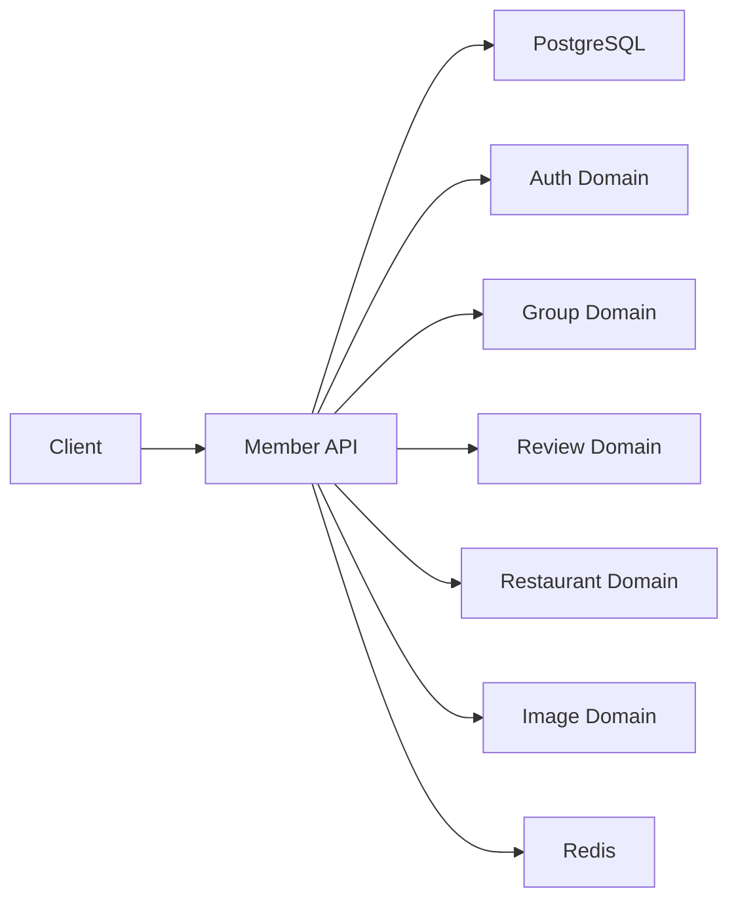
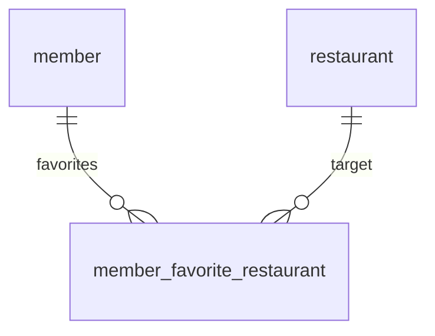

| 항목 | 내용 |
|---|---|
| 문서 제목 | 회원(Member) 테크 스펙 |
| 문서 목적 | 마이페이지(내 정보/내 활동) 및 찜(즐겨찾기) 기능의 요구사항·데이터 모델·API 계약·처리 흐름·운영 <br> 기준을 정의하여 구현/리뷰/테스트 기준으로 활용한다. |
| 작성 및 관리 | Backend Team |
| 최초 작성일 | 2026.01.13 |
| 최종 수정일 | 2026.01.15 |
| 문서 버전 | v1.1 |

<br>

# 회원(Member) - BE 테크스펙

---

# **[1] 배경 (Background)**

## **[1-1] 프로젝트 목표 (Objective)**

로그인 사용자가 “내 정보/내 활동”을 한 곳에서 확인·수정·탈퇴할 수 있고, 개인 단위로 관심 음식점을 찜(내 찜)으로 저장/해제/조회할 수 있는 회원 도메인을 제공한다.

- **핵심 결과 (Key Result) 1:** 마이페이지 `GET /api/v1/members/me` 조회 p95 `TBD`ms 달성
- **핵심 결과 (Key Result) 2:** 찜 등록/삭제 5xx 비율 `TBD`% 이하
- **핵심 결과 (Key Result) 3:** 찜/마이페이지 4xx 분포(409/403) 모니터링 및 급증 알람 운영

<br>

## **[1-2] 문제 정의 (Problem)**

- 마이페이지는 여러 도메인(그룹/리뷰)을 조합하는 “집계 API” 성격이 강해, 커서/정렬 기준과 성능(인덱스/조인)이 없으면 p95가 쉽게 무너진다.
- 찜은 중복 요청/동시 요청이 빈번해(재시도/멀티 디바이스) 중복 데이터/409 정책을 고정하지 않으면 정합성이 깨진다.
- 회원 탈퇴는 인증 토큰/권한/노출 정책과 연결되므로 “탈퇴 상태 전이”와 데이터 보관 정책이 불명확하면 운영/보안 리스크가 발생한다.

<br>

## **[1-3] 가설 (Hypothesis)**

회원(프로필/상태)과 “내 찜”(유니크/멱등) 정책을 DB 제약 + API 에러코드로 고정하고, 마이페이지 집계/목록 API의 조회 패턴(커서/인덱스)을 문서에 명시하면 구현·리뷰·테스트의 해석 차이를 줄이고 운영 안정성이 올라간다.

<br>

---

# **[2] 목표가 아닌 것 (Non-goals)**

**이번 작업에서 다루지 않는 내용:**

- 로그인/토큰 발급/재발급/로그아웃 정책(인증(Auth) 도메인)
- 회원 가입(온보딩) 및 약관/동의 UI(단, 탈퇴 시 상태 전이는 본 문서에서 다룸)
- 검색어 저장/최근 검색어(`search helper` 도메인)
- 음식점(restaurant) 자체 데이터 모델/조회/검색(음식점 도메인)
- 리뷰 작성/수정/삭제(리뷰 도메인) 및 그룹 가입/탈퇴(그룹 도메인)
- 하위그룹 단위 찜(서브그룹 찜) 및 하위그룹 찜 목록 API(그룹/서브그룹 도메인)
- 음식점 찜 상태 조회 `GET /restaurants/{restaurantId}/favorite-status`는 “음식점+리뷰 도메인”에서 read 조합 책임으로 둔다.

<br>

---

# **[3] 설계 및 기술 자료 (Architecture and Technical Documentation)**

- 인증: `Authorization: Bearer {accessToken}`
- API Prefix: `/api/v1` (기본, 단 `API 명세서` 기준으로 일부 예외 존재)
  - 마이페이지: `/api/v1/members/me/...`
  - 내 찜: `/members/me/...`, `/me/...` (prefix 예외)
- 소유(Owner) 테이블
  - 회원: `member`
  - 개인 찜: `member_favorite_restaurant`
- 의존(조회/검증/조합) 테이블
  - 음식점: `restaurant`, `restaurant_image`
  - 그룹/멤버십: `group`, `group_member`
  - 내 그룹 요청: `group_request`
  - 내 리뷰: `review`

## **[3-1] 의존성 관계 (Dependency Graph)**

- 모듈/책임 요약: `Member`(프로필/상태/탈퇴), `Favorite`(내 찜 등록/삭제/조회)
- 주요 의존성: PostgreSQL, Auth Domain(인증/토큰), Group Domain(내 그룹), Review Domain(내 리뷰), Restaurant Domain(찜 대상), Image Domain(프로필/썸네일), Redis(프리뷰 캐시)
- 핵심 흐름(요약): 마이페이지 집계, 찜 등록/삭제



<br>

## **[3-2] 데이터베이스 스키마 (ERD)**

- ERD: [ERD Cloud](https://www.erdcloud.com/d/TXZ3CApePpKwEyacT)
- DDL: [ERD 테이블 정의서](https://github.com/100-hours-a-week/3-team-tasteam-wiki/wiki/%5BERD%5D-%ED%85%8C%EC%9D%B4%EB%B8%94-%EC%A0%95%EC%9D%98%EC%84%9C)

**주요 테이블 요약**

- `member`: 회원 프로필/상태/권한
- `member_favorite_restaurant`: 개인 찜(내 찜)

**관계 요약**

- `member_favorite_restaurant.member_id -> member.id` (N:1, 삭제정책 `RESTRICT(기본)`, 비고: 내 찜)
- `member_favorite_restaurant.restaurant_id -> restaurant.id` (N:1, 삭제정책 `RESTRICT(기본)`, 비고: 음식점 참조)

**ERD(Mermaid)**



**테이블 정의서**

#### `member`

| 컬럼 | 타입 | Nullable | 기본값 | 설명 | 제약/고려사항 |
|---|---|---|---|---|---|
| `id` | `BIGINT` | N | `SEQUENCE` | 회원 식별자 | `PK_MEMBER` |
| `nickname` | `VARCHAR(50)` | N | - | 닉네임 | - |
| `email` | `VARCHAR(255)` | N | - | 이메일 | - |
| `status` | `VARCHAR(20)` | N | - | 회원 상태 | enum `ACTIVE|BLOCKED|WITHDRAWN` |
| `role` | `VARCHAR(20)` | N | - | 권한 | enum `USER|ADMIN` |
| `profile_image_url` | `VARCHAR(500)` | Y | - | 프로필 이미지 URL | - |
| `last_login_at` | `TIMESTAMP` | Y | - | 마지막 로그인 | - |
| `agreed_terms_at` | `TIMESTAMP` | Y | - | 약관 동의 시각 | - |
| `agreed_privacy_at` | `TIMESTAMP` | Y | - | 개인정보 동의 시각 | - |
| `created_at` | `TIMESTAMP` | N | - | 생성 시각 | - |
| `updated_at` | `TIMESTAMP` | N | - | 수정 시각 | - |
| `deleted_at` | `TIMESTAMP` | Y | - | soft delete 시각 | - |

#### `member_favorite_restaurant`

| 컬럼 | 타입 | Nullable | 기본값 | 설명 | 제약/고려사항 |
|---|---|---|---|---|---|
| `id` | `BIGINT` | N | `SEQUENCE` | 식별자 | `PK_MEMBER_FAVORITE_RESTAURANT` |
| `member_id` | `BIGINT` | N | - | 회원 ID | FK(`member.id`) |
| `restaurant_id` | `BIGINT` | N | - | 음식점 ID | FK(`restaurant.id`) |
| `created_at` | `TIMESTAMP` | N | - | 찜 생성 시각 | - |

<br>

## **[3-3] API 명세 (API Specifications)**

- **목차:**
  - [마이페이지 회원 정보 조회 (GET /api/v1/members/me)](#마이페이지-회원-정보-조회)
  - [회원 정보 수정 (PATCH /api/v1/members/me/profile)](#회원-정보-수정)
  - [회원 탈퇴 (DELETE /api/v1/members/me)](#회원-탈퇴)
  - [회원 그룹 목록 조회 (GET /api/v1/members/me/groups)](#회원-그룹-목록-조회)
  - [회원 그룹 요청 목록 조회 (GET /api/v1/members/me/group-requests)](#회원-그룹-요청-목록-조회)
  - [회원 음식점 리뷰 목록 조회 (GET /api/v1/members/me/reviews)](#회원-음식점-리뷰-목록-조회)
  - [내가 찜한 음식점 목록 조회 (GET /members/me/favorites/restaurants)](#내가-찜한-음식점-목록-조회)
  - [내가 찜 목록에 음식점 등록 (POST /members/me/favorites/restaurants)](#내가-찜-목록에-음식점-등록)
  - [내 찜 목록에서 음식점 삭제 (DELETE /me/favorites/restaurants/{restaurantId})](#내-찜-목록에서-음식점-삭제)

<br>

---

### **마이페이지 회원 정보 조회**

- **API 명세:**
  - `GET /api/v1/members/me`
  - API 문서 링크: [API 명세서(3-54)](https://github.com/100-hours-a-week/3-team-tasteam-wiki/wiki/%5BBE-%E2%80%90-API%5D-API-%EB%AA%85%EC%84%B8%EC%84%9C#user-content-api-54)
- **권한:**
  - `USER`
- **구현 상세:**
  - **요청**
    - Headers: `Authorization: Bearer {accessToken}`
    - Query Params: (없음/미기재)
  - **응답**
    - status: `200`
    - body 스키마(요약)
      - `data.member.nickname`: string
      - `data.member.profileImage`: object | null
        - `id`: string (UUID)
        - `url`: string
      - `data.groupRequests.data[]`: array
        - `id`: number
        - `groupName`: string
        - `groupAddress`: string
        - `status`: string
      - `data.groupRequests.page.nextCursor`: string
      - `data.groupRequests.page.size`: number
      - `data.groupRequests.page.hasNext`: boolean
      - `data.reviews.data[]`: array
        - `id`: number
        - `restaurantName`: string
        - `restaurantAddress`: string
        - `reviewContent`: string | null
      - `data.reviews.page.*`: object
    - 예시(JSON)
      ```json
      {
        "data": {
          "member": {
            "nickname": "홍길동",
            "profileImage": {
              "id": "a3f1c9e0-7a9b-4e9c-bc2e-1f2c33aa9012",
              "url": "https://..."
            }
          },
          "groupRequests": {
            "data": [
              {
                "id": 10,
                "groupName": "카카오테크부트캠프",
                "groupAddress": "성남시 분당구 대왕판교로",
                "status": "PENDING"
              }
            ],
            "page": { "nextCursor": "2019-07-04 17:21:00", "size": 1, "hasNext": true }
          },
          "reviews": {
            "data": [
              {
                "id": 10,
                "restaurantName": "버거킹 판교점",
                "restaurantAddress": "성남시 분당구 대왕판교로",
                "reviewContent": "최고의 맛집. 추천합니다."
              }
            ],
            "page": { "nextCursor": "2019-07-04 17:21:00", "size": 1, "hasNext": true }
          }
        }
      }
      ```
  - **처리 로직:**
    1. 인증(access token) 검증
    2. `member` 조회(`id=me`, `deleted_at is null`)
    3. (프리뷰) `group_request` 최신 N개 조회
       - 정렬: `created_at desc`(권장) + tie-breaker `id desc`
       - 응답 매핑: `groupName/groupAddress`는 `group_request.company_name/address` 또는 조인(정책은 Open Questions)
    4. (프리뷰) `review` 최신 N개 조회
       - 정렬: `created_at desc`(권장) + tie-breaker `id desc`
       - `restaurant` 조인으로 `restaurantName/restaurantAddress` 구성
    5. 응답 조합(명세의 `member/groupRequests/reviews` 구조 유지)
  - **트랜잭션 관리:** read-only(또는 트랜잭션 생략)
  - **동시성/멱등성(필요시):** 조회 API는 멱등
  - **에러 코드(주요, API 명세서 기준):** `AUTHENTICATION_REQUIRED`(401), `ACCESS_DENIED`(403), `TOO_MANY_REQUESTS`(429), `INTERNAL_SERVER_ERROR`(500)

<br>

### **회원 정보 수정**

- **API 명세:**
  - `PATCH /api/v1/members/me/profile`
  - API 문서 링크: [API 명세서(3-56)](https://github.com/100-hours-a-week/3-team-tasteam-wiki/wiki/%5BBE-%E2%80%90-API%5D-API-%EB%AA%85%EC%84%B8%EC%84%9C#user-content-api-56)
- **권한:**
  - `USER`
- **구현 상세:**
  - **요청**
    - content-type: `application/json`
    - 스키마(요약)
      - `profileImageId`: string | null
      - `email`: string | null
  - **응답**
    - status: `204`
  - **처리 로직:**
    1. 인증(access token) 검증
    2. `member` 조회(`id=me`, `deleted_at is null`)
    3. 요청 값 검증
       - `email`: 포맷 검증
       - `profileImageId`: UUID 형식 검증 + 업로드된 파일과 매핑
    4. `member` update(변경 필드만) + `updated_at=now()`
    5. 204 반환
  - **트랜잭션 관리:** `member` update 단일 트랜잭션
  - **동시성/멱등성(필요시):** 동일 요청 반복은 멱등(마지막 값 유지)
  - **에러 코드(주요, API 명세서 기준):** `INVALID_REQUEST`(400), `AUTHENTICATION_REQUIRED`(401), `ACCESS_DENIED`(403), `TOO_MANY_REQUESTS`(429), `INTERNAL_SERVER_ERROR`(500)

<br>

### **회원 탈퇴**

- **API 명세:**
  - `DELETE /api/v1/members/me`
  - API 문서 링크: [API 명세서(3-55)](https://github.com/100-hours-a-week/3-team-tasteam-wiki/wiki/%5BBE-%E2%80%90-API%5D-API-%EB%AA%85%EC%84%B8%EC%84%9C#user-content-api-55)
- **권한:**
  - `USER`
- **구현 상세:**
  - **요청**
    - body: 없음
  - **응답**
    - status: `204`
  - **처리 로직:**
    1. 인증(access token) 검증
    2. `member` 조회(`id=me`, `deleted_at is null`)
    3. 탈퇴 처리(상태 전이 + soft delete)
       - `status=WITHDRAWN`
       - `deleted_at=now()`, `updated_at=now()`
    4. (의존) Auth 도메인에 “토큰 무효화” 트리거(예: refresh token 폐기/블랙리스트) 실행(실패 시 재시도/알람 필요)
    5. 204 반환
  - **트랜잭션 관리:** `member` update 단일 트랜잭션(토큰 무효화는 분리 가능)
  - **동시성/멱등성(필요시):** 중복 탈퇴 요청의 멱등 처리 정책은 Open Questions
  - **에러 코드(주요, API 명세서 기준):** `AUTHENTICATION_REQUIRED`(401), `ACCESS_DENIED`(403), `TOO_MANY_REQUESTS`(429), `INTERNAL_SERVER_ERROR`(500)

<br>

### **회원 그룹 목록 조회**

- **API 명세:**
  - `GET /api/v1/members/me/groups`
  - API 문서 링크: [API 명세서(3-57)](https://github.com/100-hours-a-week/3-team-tasteam-wiki/wiki/%5BBE-%E2%80%90-API%5D-API-%EB%AA%85%EC%84%B8%EC%84%9C#user-content-api-57)
- **권한:**
  - `USER`
- **구현 상세:**
  - **요청**
    - Query Params: `cursor?: string` (명세 예시: `cursor=-`)
  - **응답**
    - status: `200`
    - body 스키마(요약)
      - `data[]`: array
        - `id`: number
        - `groupName`: string
        - `groupAddress`: string
      - `page.nextCursor`: string
      - `page.size`: number
      - `page.hasNext`: boolean
  - **처리 로직:**
    1. 인증(access token) 검증
    2. `group_member`에서 `member_id=me` 기준으로 조회(`deleted_at is null`)
    3. `group` 조인으로 `groupName/groupAddress` 구성
    4. 커서 기반 페이징 적용(cursor 해석은 Open Questions)
    5. 200 반환
  - **트랜잭션 관리:** read-only(또는 트랜잭션 생략)
  - **동시성/멱등성(필요시):** 조회 API는 멱등
  - **에러 코드(주요, API 명세서 기준):** `AUTHENTICATION_REQUIRED`(401), `ACCESS_DENIED`(403), `TOO_MANY_REQUESTS`(429), `INTERNAL_SERVER_ERROR`(500)

<br>

### **회원 그룹 요청 목록 조회**

- **API 명세:**
  - `GET /api/v1/members/me/group-requests`
  - API 문서 링크: [API 명세서(3-58)](https://github.com/100-hours-a-week/3-team-tasteam-wiki/wiki/%5BBE-%E2%80%90-API%5D-API-%EB%AA%85%EC%84%B8%EC%84%9C#user-content-api-58)
- **권한:**
  - `USER`
- **구현 상세:**
  - **요청**
    - Query Params: `cursor?: string` (명세 예시: `cursor=-`)
  - **응답**
    - status: `200`
    - body 스키마(요약)
      - `data[]`: array
        - `id`: number
        - `groupName`: string
        - `groupAddress`: string
        - `status`: string (`PENDING|APPROVED|REJECTED`)
      - `page.*`
  - **처리 로직:**
    1. 인증(access token) 검증
    2. `group_request`에서 `member_id=me` 기준으로 조회(정렬/커서 기준은 Open Questions)
    3. 응답 매핑: `groupName/groupAddress`는 `group_request.company_name/address`로 매핑(권장)
    4. 200 반환
  - **트랜잭션 관리:** read-only(또는 트랜잭션 생략)
  - **동시성/멱등성(필요시):** 조회 API는 멱등
  - **에러 코드(주요, API 명세서 기준):** `AUTHENTICATION_REQUIRED`(401), `ACCESS_DENIED`(403), `TOO_MANY_REQUESTS`(429), `INTERNAL_SERVER_ERROR`(500)

<br>

### **회원 음식점 리뷰 목록 조회**

- **API 명세:**
  - `GET /api/v1/members/me/reviews`
  - API 문서 링크: [API 명세서(3-59)](https://github.com/100-hours-a-week/3-team-tasteam-wiki/wiki/%5BBE-%E2%80%90-API%5D-API-%EB%AA%85%EC%84%B8%EC%84%9C#user-content-api-59)
- **권한:**
  - `USER`
- **구현 상세:**
  - **요청**
    - Query Params: `cursor?: string` (명세 예시: `cursor=-`)
  - **응답**
    - status: `200`
    - body 스키마(요약)
      - `data[]`: array
        - `id`: number
        - `restaurantName`: string
        - `restaurantAddress`: string
        - `reviewContent`: string | null
      - `page.*`
  - **처리 로직:**
    1. 인증(access token) 검증
    2. `review`에서 `member_id=me` 기준으로 조회(`deleted_at is null`)
    3. `restaurant` 조인으로 `restaurantName/restaurantAddress` 구성
    4. 커서 기반 페이징 적용(cursor 해석은 Open Questions)
    5. 200 반환
  - **트랜잭션 관리:** read-only(또는 트랜잭션 생략)
  - **동시성/멱등성(필요시):** 조회 API는 멱등
  - **에러 코드(주요, API 명세서 기준):** `AUTHENTICATION_REQUIRED`(401), `ACCESS_DENIED`(403), `TOO_MANY_REQUESTS`(429), `INTERNAL_SERVER_ERROR`(500)

<br>

### **내가 찜한 음식점 목록 조회**

- **API 명세:**
  - `GET /members/me/favorites/restaurants`
  - API 문서 링크: [API 명세서(3-34)](https://github.com/100-hours-a-week/3-team-tasteam-wiki/wiki/%5BBE-%E2%80%90-API%5D-API-%EB%AA%85%EC%84%B8%EC%84%9C#user-content-api-34)
- **권한:**
  - `USER`
- **구현 상세:**
  - **요청**
    - Query Params: (없음/미기재) (정책은 Open Questions)
  - **응답**
    - status: `200`
    - body 스키마(요약)
      - `data[]`: array
        - `restaurantId`: number
        - `name`: string
        - `thumbnailUrl`: string | null
        - `createdAt`: string (ISO-8601)
      - `page.*`
  - **처리 로직:**
    1. 인증(access token) 검증
    2. `member_favorite_restaurant`에서 `member_id=me` 기준으로 조회(최신순)
    3. `restaurant` 조인으로 `name` 구성
    4. `thumbnailUrl` 구성
       - (권장) `restaurant_image`에서 대표 1장(`sort_order asc`)을 조합
    5. 200 반환(빈 목록은 200 + `data=[]` 권장, 404 사용 여부는 Open Questions)
  - **트랜잭션 관리:** read-only(또는 트랜잭션 생략)
  - **동시성/멱등성(필요시):** 조회 API는 멱등
  - **에러 코드(주요, API 명세서 기준):** `UNAUTHORIZED`(401), `RESTAURANT_NOT_FOUND`(404), `INTERNAL_SERVER_ERROR`(500)

<br>

### **내가 찜 목록에 음식점 등록**

- **API 명세:**
  - `POST /members/me/favorites/restaurants`
  - API 문서 링크: [API 명세서(3-35)](https://github.com/100-hours-a-week/3-team-tasteam-wiki/wiki/%5BBE-%E2%80%90-API%5D-API-%EB%AA%85%EC%84%B8%EC%84%9C#user-content-api-35)
- **권한:**
  - `USER`
- **구현 상세:**
  - **요청**
    - content-type: `application/json`
    - body
      - `restaurantId`: number
  - **응답**
    - status: `201`
    - body 스키마(요약)
      - `data.id`: number
      - `data.restaurantId`: number
      - `data.createdAt`: string (ISO-8601)
  - **처리 로직:**
    1. 인증(access token) 검증
    2. `restaurant` 존재 확인(`deleted_at is null`), 없으면 404(`RESTAURANT_NOT_FOUND`)
    3. `member_favorite_restaurant` insert
       - 유니크 충돌 시 409(`FAVORITE_ALREADY_EXISTS`) (권장)
    4. 201 반환
  - **트랜잭션 관리:** insert 단일 트랜잭션
  - **동시성/멱등성(필요시):** `UNIQUE(member_id, restaurant_id)` 기반 중복 방지 권장
  - **에러 코드(주요, API 명세서 기준):** `UNAUTHORIZED`(401), `RESTAURANT_NOT_FOUND`(404), `FAVORITE_ALREADY_EXISTS`(409), `INTERNAL_SERVER_ERROR`(500)

<br>

### **내 찜 목록에서 음식점 삭제**

- **API 명세:**
  - `DELETE /me/favorites/restaurants/{restaurantId}`
  - API 문서 링크: [API 명세서(3-36)](https://github.com/100-hours-a-week/3-team-tasteam-wiki/wiki/%5BBE-%E2%80%90-API%5D-API-%EB%AA%85%EC%84%B8%EC%84%9C#user-content-api-36)
- **권한:**
  - `USER`
- **구현 상세:**
  - **요청**
    - Path Params
      - `restaurantId`: number
  - **응답**
    - status: `200`
  - **처리 로직:**
    1. 인증(access token) 검증
    2. (권장) `member_favorite_restaurant`에서 `member_id=me AND restaurant_id=:restaurantId` 존재 확인
    3. 삭제 정책
       - (권장) hard delete(행 삭제)
       - “이미 없는 경우”의 응답(200 멱등 vs 409)은 Open Questions
    4. 200 반환
  - **트랜잭션 관리:** delete 단일 트랜잭션
  - **동시성/멱등성(필요시):** 멱등 정책은 Open Questions
  - **에러 코드(주요, API 명세서 기준):** `UNAUTHORIZED`(401), `FORBIDDEN`(403), `RESTAURANT_NOT_FOUND`(404), `FAVORITE_ALREADY_DELETE`(409), `INTERNAL_SERVER_ERROR`(500)

<br>

## **[3-4] 도메인 에러 코드(공통 정의)**

| code | status | 의미(요약) | retryable | 비고 |
|---|---:|---|---|---|
| `INVALID_REQUEST` | 400 | validation 실패 | no | `errors[]` 포함 |
| `AUTHENTICATION_REQUIRED` | 401 | 인증 필요/만료 | no | 마이페이지 계열에서 사용 |
| `UNAUTHORIZED` | 401 | 인증 실패/만료 | no | 찜 계열에서 사용 |
| `ACCESS_DENIED` | 403 | 접근 권한 필요 | no | 마이페이지 계열에서 사용 |
| `FORBIDDEN` | 403 | 접근 권한 없음 | no | 찜 삭제에서 사용 |
| `RESTAURANT_NOT_FOUND` | 404 | 음식점 없음 | no | 찜 대상 검증/조인 실패 |
| `FAVORITE_ALREADY_EXISTS` | 409 | 이미 찜한 상태 | no | 중복 찜 |
| `FAVORITE_ALREADY_DELETE` | 409 | 이미 삭제된 상태 | no | 코드 표기(DELETE vs DELETED) 일치 필요(Open Questions) |
| `TOO_MANY_REQUESTS` | 429 | 요청 과다 | yes | rate limit |
| `INTERNAL_SERVER_ERROR` | 500 | 서버 오류 | yes | 관측/알람 |

<br>

## **[3-5] 기술 스택 (Technology Stack)**

- **Backend:** Spring Boot 3, JPA
- **Database:** PostgreSQL
- **Cache:** Redis(마이페이지 프리뷰 캐시)
- **Async/Queue:** Redis Streams(탈퇴 후속 처리/정리 작업이 필요한 경우)
- **Infrastructure:** AWS(S3, CloudFront)
- **외부 연동:** Image Domain(프로필 이미지), Auth Domain(토큰 무효화)

<br>

---

# **[4] 이외 고려사항들 (Other Considerations)**

## **[4-1] 고려사항 체크리스트(성능/외부연동/정합성/보안)**

- **성능:**
  - 목록/프리뷰는 cursor 기반 pagination을 기본으로 한다(커서 포맷/기준 컬럼은 Open Questions).
  - 마이페이지 집계(`GET /api/v1/members/me`)는 “member 단건 + 프리뷰 2개”의 쿼리 수를 고정하고, 필요한 인덱스를 사전 추가한다.
  - 찜 목록은 `member_favorite_restaurant(member_id, created_at, id)` 인덱스 전제로 조회한다.
- **외부 연동 안정성:**
  - 프로필 이미지 URL이 Upload 도메인/S3를 참조하는 경우, “이미지 존재/상태(ACTIVE)” 검증을 할지 정책을 결정한다(Open Questions).
  - 탈퇴 시 Auth 토큰 무효화 트리거가 실패하면 재시도/알람이 필요하다.
- **데이터 정합성:**
  - 찜 등록은 `UNIQUE(member_id, restaurant_id)`로 중복을 방지하고, 중복 시 409를 반환한다.
  - 찜 삭제/탈퇴는 멱등(중복 요청에도 같은 결과)으로 처리할지 정책을 고정한다(Open Questions).
- **보안:**
  - 마이페이지/찜 API는 모두 `me` 기준으로만 접근 가능해야 한다(타 사용자 조회 금지).
  - 로그에 email/프로필 URL 등 개인정보를 남길 때 마스킹 정책이 필요하다.
  - 시간 표준: API 응답은 ISO-8601(+09:00)로 통일한다.

<br>

---

## **[4-2] 리스크 및 대응 (Risks & Mitigations)**

- **리스크:** 찜 등록 동시 요청으로 중복 row 생성  
  **제안:** `UNIQUE(member_id, restaurant_id)` + 409(`FAVORITE_ALREADY_EXISTS`) 고정  
  **관측:** 동일 `(member_id, restaurant_id)` 중복 탐지 -> **대응:** 마이그레이션/정리 스크립트 (Owner: `@Backend`, Due: `TBD`)

- **리스크:** 마이페이지 집계/목록의 인덱스 부재로 p95 악화  
  **제안:** `group_request(member_id, created_at, id)`, `review(member_id, created_at, id)` 등 인덱스 마이그레이션  
  **관측:** p95/p99 + DB slow query -> **대응:** 인덱스/쿼리 개선 (Owner: `@Backend`, Due: `TBD`)

- **리스크:** 탈퇴 후 토큰이 유효하면 접근 가능  
  **제안:** Auth 도메인 토큰 무효화를 “필수 후속 처리”로 고정(실패 시 재시도/알람)  
  **관측:** 탈퇴 사용자 접근 시도 로그 -> **대응:** 핫픽스(무효화 강제) (Owner: `@Backend`, Due: `TBD`)

<br>

---

# **[5] 테스트 (Testing)**

- **공통 테스트 규약 링크**
  - (추가 예정) 프로젝트 테스트 컨벤션 문서

- **이 도메인에서 테스트해야 하는 것**
  - 내 정보 조회: `GET /api/v1/members/me` 응답 구조(member/groupRequests/reviews) 및 프리뷰 정렬
  - 프로필 수정: email 포맷 검증(400) + 정상 204
  - 탈퇴: status 전이(WITHDRAWN) + deleted_at 세팅 + 토큰 무효화 트리거 호출
  - 내 찜: 등록(201) / 중복(409) / 삭제(200) / 권한 없음(403)
  - 목록: cursor 기반 페이징(nextCursor/hasNext) 및 빈 목록 처리

- **테스트에 필요한 준비물(추가해야 하는 것)**
  - 테스트 데이터(seed): `member`, `restaurant`, `member_favorite_restaurant`, `review`, `group_member`, `group_request`
  - 테스트 유틸: 로그인 컨텍스트 세팅(토큰/인증) + fixture 빌더

<br>

---

# **[6] 함께 논의하고 싶은 내용 (Open Questions)**

- 질문: 찜/마이페이지 API의 인증 실패 코드가 `AUTHENTICATION_REQUIRED` vs `UNAUTHORIZED`로 분리된 이유는? 통일할까?  
  배경/제약: 클라이언트 에러 처리/리트라이 정책 통일 필요  
  대안: (A) 401 코드를 `UNAUTHORIZED`로 통일 (B) 현재처럼 도메인별 분리  
  결정 필요일: `TBD` / 관련자: `@Backend+FE`

- 질문: 내 찜 목록 조회(3-34)의 pagination 계약이 명확하지 않다(요청 Query 미기재인데 응답 page 존재). `cursor/size`를 표준으로 노출할까?  
  배경/제약: 무한 스크롤 UI + 성능  
  대안: (A) `cursor/size` 추가 (B) 고정 size + server-side only cursor  
  결정 필요일: `TBD` / 관련자: `@Backend+FE`

- 질문: 찜 삭제(3-36)의 “이미 없는 대상” 응답은 200(멱등) vs 409(`FAVORITE_ALREADY_DELETE`) 중 무엇을 표준으로 할까?  
  배경/제약: 재시도/중복 요청 처리  
  결정 필요일: `TBD` / 관련자: `@Backend`

- 질문: 회원 정보 수정(3-56)에서 email 유니크/수정 허용 정책은? (OAuth 계정/다중 provider)  
  배경/제약: DDL에 UNIQUE 미기재  
  결정 필요일: `TBD` / 관련자: `@Backend+PM`

- 질문: 마이페이지 집계(3-54)에서 `groupRequests.page.size`, `reviews.page.size`가 1로 고정되어 있는데, 프리뷰 size 정책을 확정할까?  
  배경/제약: FE 화면 구성/성능  
  결정 필요일: `TBD` / 관련자: `@Backend+FE`

<br>

---

# **[7] 용어 정의 (Glossary)**

- **MemberStatus:** `ACTIVE`(정상), `BLOCKED`(차단), `WITHDRAWN`(탈퇴)
- **Favorite(내 찜):** 회원이 관심 음식점을 “개인 단위로” 저장한 관계(`member_favorite_restaurant`).
- **MyPage(마이페이지):** `me` 기준으로 회원 정보 및 내 활동(그룹/요청/리뷰)을 조회하는 API 묶음.
- **Cursor Pagination:** 서버가 발급/해석하는 cursor 기반 페이지네이션.

<br>

---

# **[8] 변경이력**

| 버전 | 일자 | 작성자 | 변경 내역 | 비고 |
|---|---|---|---|---|
| v1.0 | 2026.01.13 | Backend Team | 문서 초안 작성 | - |
| v1.1 | 2026.01.15 | Backend Team | 템플릿([1]~[8]) 구조 정렬 + `API 명세서` 기준으로 API 링크/경로 반영 | - |
