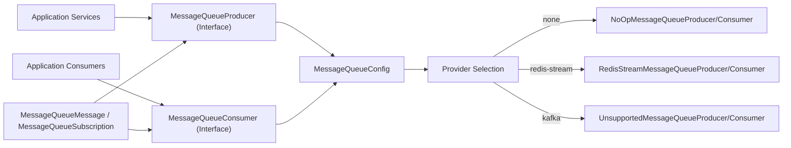
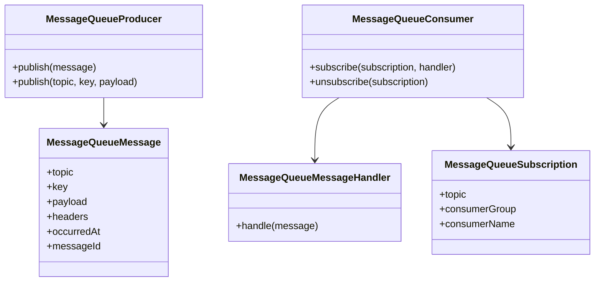
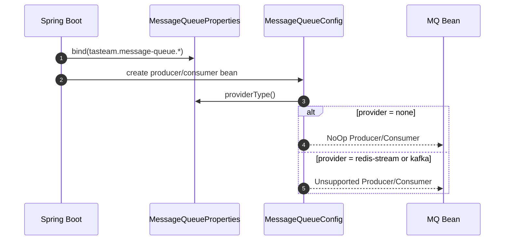
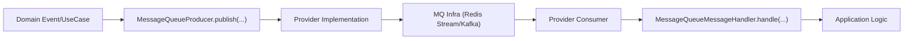

| 항목 | 내용 |
|---|---|
| 문서 제목 | 메시지 큐(Message Queue) 모듈 테크 스펙 |
| 문서 목적 | 메시지 큐 모듈의 경계, 구성 요소, 실행 흐름, 확장 전략(Redis Stream -> Kafka)을 정의한다. |
| 작성 및 관리 | Backend Team |
| 최초 작성일 | 2026.02.14 |
| 최종 수정일 | 2026.02.14 |
| 문서 버전 | v0.1 |

 

# 메시지 큐(Message Queue) - BE 테크스펙

---

# **[1] 배경 (Background)**

## **[1-1] 목표 (Objective)**

- 애플리케이션 계층이 특정 MQ 인프라 구현에 직접 결합되지 않도록 추상 경계를 고정한다.
- 초기에는 Redis Stream 기반 구현을 붙이고, 이후 Kafka로 전환/병행 가능하도록 모듈 구조를 선행한다.
- 모듈 계약(Producer/Consumer/Message/Subscription)을 팀 공통 언어로 문서화한다.

## **[1-2] 현재 상태 (As-Is)**

- `MessageQueueProducer`, `MessageQueueConsumer` 인터페이스와 메시지/구독 계약이 준비되어 있다.
- `tasteam.message-queue.provider` 값에 따라 Bean 선택이 동작한다.
- `none`은 NoOp 구현으로 안전하게 동작한다.
- `redis-stream`은 Producer/Consumer 구현이 반영되어 발행/구독이 가능하다.
- `kafka`는 현재 `Unsupported*` 구현으로 명시적 예외를 반환한다.
- `ReviewCreatedEvent`는 도메인 이벤트 -> MQ 발행 -> MQ 소비 핸들러 처리 흐름으로 연결되어 있다.

---

# **[2] 모듈 구성 (Module Structure)**

## **[2-1] 패키지 구성**

- 경로: `app-api/src/main/java/com/tasteam/infra/messagequeue`
- 핵심 파일
  - 계약: `MessageQueueProducer`, `MessageQueueConsumer`, `MessageQueueMessageHandler`
  - 데이터 계약: `MessageQueueMessage`, `MessageQueueSubscription`
  - 설정: `MessageQueueConfig`, `MessageQueueProperties`, `MessageQueueProviderType`
  - 구현체: `NoOp*`, `Unsupported*`

## **[2-2] 아키텍처 다이어그램**

## **[2-3] 계약 다이어그램**

---

# **[3] 실행 흐름 (Runtime Flow)**

## **[3-1] 설정 기반 구현체 선택**

## **[3-2] 메시지 발행/소비 개념 흐름**

---

# **[4] 설정 계약 (Configuration Contract)**

`application.yml`

- `tasteam.message-queue.enabled`
- `tasteam.message-queue.provider` (`none` | `redis-stream` | `kafka`)
- `tasteam.message-queue.topic-prefix`
- `tasteam.message-queue.default-consumer-group`
- `tasteam.message-queue.poll-timeout-millis`
- `tasteam.message-queue.max-retries`

운영 기본값은 `provider=none`으로 두고, 구현체가 준비된 환경에서만 provider를 활성화한다.

---

# **[5] 확장 전략 (Redis Stream -> Kafka)**

## **[5-1] 확장 원칙**

- 애플리케이션은 인터페이스만 의존하고 구현체를 직접 참조하지 않는다.
- provider별 구현 추가는 `MessageQueueConfig`의 선택 분기와 구현체 클래스 추가로 한정한다.
- 메시지 계약(`MessageQueueMessage`, `MessageQueueSubscription`)은 하위 호환을 우선한다.

## **[5-2] 단계**

1. Redis Stream Producer/Consumer 구현 추가
2. 통합 테스트 추가(발행/구독/재시도)
3. Kafka Producer/Consumer 구현 추가
4. provider 전환 검증(동일 애플리케이션 코드로 설정만 변경)

---

# **[6] 체크리스트 (Review Checklist)**

- 인터페이스/메서드 주석이 계약을 명확히 설명하는가
- 구현체 교체 시 애플리케이션 코드 변경이 최소화되는가
- provider 설정 변경이 빈 선택 결과와 일치하는가
- 테스트가 계약/설정 분기를 검증하는가

---

# **[7] 구현 현황 (Implementation Status)**

## **[7-1] Phase 1 완료 범위**

- 메시지큐 추상 계약(Producer/Consumer/Message/Subscription) 반영 완료
- Redis Stream provider 분기 및 Producer/Consumer 1차 구현 완료
- MQ 전용 Stream listener container 설정 추가
- 인터페이스 계약 Javadoc 반영
- MQ 모듈 테스트(설정/producer/consumer) 추가

## **[7-2] Phase 2 진행 범위 (#330)**

- 도메인 이벤트 발행 지점 연동:
  - `ReviewCreatedEvent` 수신 시 MQ 토픽(`domain.review.created`)으로 발행
- MQ consumer 핸들러 등록/수신 처리:
  - 애플리케이션 시작 시 `ReviewCreated` 구독 등록
  - 수신 payload 역직렬화 후 `RestaurantReviewAnalysisService`로 위임
- 실행 경로 정합성:
  - MQ 활성화 시 기존 `ReviewCreatedAiAnalysisEventListener` 직접 경로 비활성화
  - MQ 비활성화 시 기존 직접 경로 유지

## **[7-3] Phase 3 진행 범위 (#337, #338, #339)**

- 도메인 이벤트 발행 지점 연동:
  - `GroupMemberJoinedEvent` 수신 시 MQ 토픽(`domain.group.member-joined`)으로 발행
- MQ consumer 핸들러 등록/수신 처리:
  - 애플리케이션 시작 시 Notification 구독 등록
  - 수신 payload 역직렬화 후 `NotificationService`로 위임
- 실행 경로 정합성:
  - MQ 활성화 시 기존 `NotificationEventListener` 직접 경로 비활성화
  - MQ 비활성화 시 기존 직접 경로 유지
## **[7-4] 검증**

- `./gradlew :app-api:test --tests 'com.tasteam.infra.messagequeue.*'` 통과
- 컨텍스트 로딩 회귀 검증:
  - `./gradlew :app-api:test --tests com.tasteam.ApiApplicationTests --tests com.tasteam.config.JpaAuditingConflictTest` 통과

## **[7-5] 다음 단계**

- Group/Restaurant 도메인 이벤트 MQ 연동 확장
- 실제 구독 라이프사이클/재시도/DLQ 정책 고도화
- Kafka provider 구현 단계 진행

---

# **[8] 운영 추적 (Observability)**

## **[8-1] 발행/소비 추적 로그**

- 발행 시 `messageId` 기준 로그를 남긴다.
  - `메시지큐 발행 완료. stream, topic, messageId, key`
- 소비 시 시작/성공/실패 로그를 남긴다.
  - `메시지큐 수신 처리 시작. stream, topic, messageId, consumerGroup`
  - `메시지큐 수신 처리 성공. ... processingMillis`
  - `메시지큐 수신 처리 실패. ... processingMillis`

## **[8-2] 추적 이력 저장소**

- 테이블: `message_queue_trace_log`
- 저장 항목:
  - `message_id`, `topic`, `provider`, `stage(PUBLISH/CONSUME_SUCCESS/CONSUME_FAIL)`
  - `consumer_group`, `processing_millis`, `error_message`, `created_at`
- 목적:
  - 이벤트 생성/처리 여부를 로그가 아닌 데이터로 조회 가능
  - 운영 중 장애/누락 구간 식별

## **[8-3] 운영 조회 API**

- 경로: `GET /api/v1/admin/mq-traces`
- 권한: `ADMIN`
- 쿼리 파라미터:
  - `messageId`(optional): 특정 메시지 이력 조회
  - `limit`(optional, default `50`, max `200`)

## **[8-4] 메트릭**

- Counter
  - `mq.publish.count` (`topic`, `provider`, `result`)
  - `mq.consume.count` (`topic`, `provider`, `result`)
- Timer
  - `mq.consume.latency` (`topic`, `provider`)

## **[8-5] 관심사 분리**

- 비즈니스 클래스(`*Publisher`, `*ConsumerRegistrar`)는 도메인 로직만 담당한다.
- 관측/추적은 `TracingMessageQueueProducer`, `TracingMessageQueueConsumer` 데코레이터에서 공통 처리한다.
