| 항목 | 내용 |
|---|---|
| 문서 제목 | 비동기 이벤트 아키텍처 & AOP 메트릭 수집 설계 |
| 문서 목적 | Notification / User Activity 이벤트 파이프라인의 전체 흐름을 정의하고, AOP 기반 메트릭 수집 레이어의 설계 원칙·구현 전략·수집 목록을 고정한다. |
| 작성 및 관리 | Backend Team |
| 최초 작성일 | 2026.03.07 |
| 최종 수정일 | 2026.03.07 |
| 문서 버전 | v1.0 |

<br>

# 비동기 이벤트 아키텍처 & AOP 메트릭 수집 설계

---

# **[1] 배경 (Background)**

## **[1-1] 목표 (Objective)**

- Notification과 User Activity 두 비동기 파이프라인의 실행 흐름을 단일 문서로 정의한다.
- 메트릭 수집 책임이 비즈니스 코드에 혼재되는 SRP 위반을 제거한다.
- AOP를 적용 가능한 영역과 Collector 패턴을 유지해야 하는 영역을 명확히 구분하여 각 영역별 수집 전략을 고정한다.
- `MeterRegistry` 의존이 비즈니스 클래스에서 완전히 제거된 상태를 설계 목표로 삼는다.

## **[1-2] 문제 (As-Is Problem)**

| 문제 | 영향 |
|---|---|
| `MessageQueueTraceService`가 DB 로깅 + Prometheus 메트릭 수집을 동시에 담당 | SRP 위반, 테스트에서 MeterRegistry Mock 필수 |
| `NotificationMessageQueueConsumer`가 `metricsCollector`를 직접 주입받아 3개 메트릭 메서드를 명시적 호출 | 비즈니스 흐름과 관측 코드 혼재 |
| 메트릭 수집 누락 여부를 코드 리뷰로만 검출 | 신규 Consumer 추가 시 메트릭 누락 위험 |

## **[1-3] 해결 방향 (To-Be)**

Spring AOP(프록시 기반)를 활용하여 `@Service`/`@Component` 빈에 대한 메트릭 수집을 aspect로 분리하고, AOP가 적용 불가능한 영역(Gauge 상태 폴링, 도메인 계산값 파라미터)은 Collector 클래스 패턴을 유지한다.

---

# **[2] 이벤트 파이프라인 아키텍처**

## **[2-1] Notification 파이프라인**

Notification은 `tasteam.message-queue.enabled` 값에 따라 두 경로로 분기된다.

### MQ disabled 경로 (직접 처리)

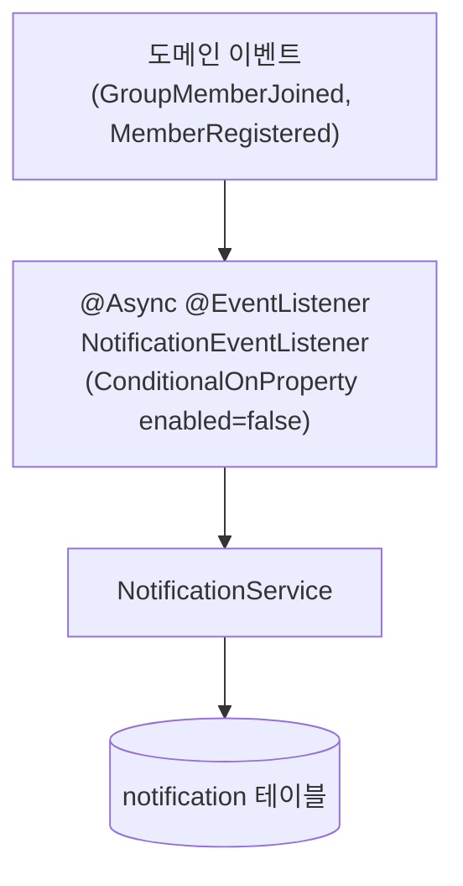

- `@Async("notificationExecutor")`로 별도 스레드에서 실행
- 실패 시 로그만 기록하고 도메인 트랜잭션은 영향받지 않음

### MQ enabled 경로 (Outbox + MQ)

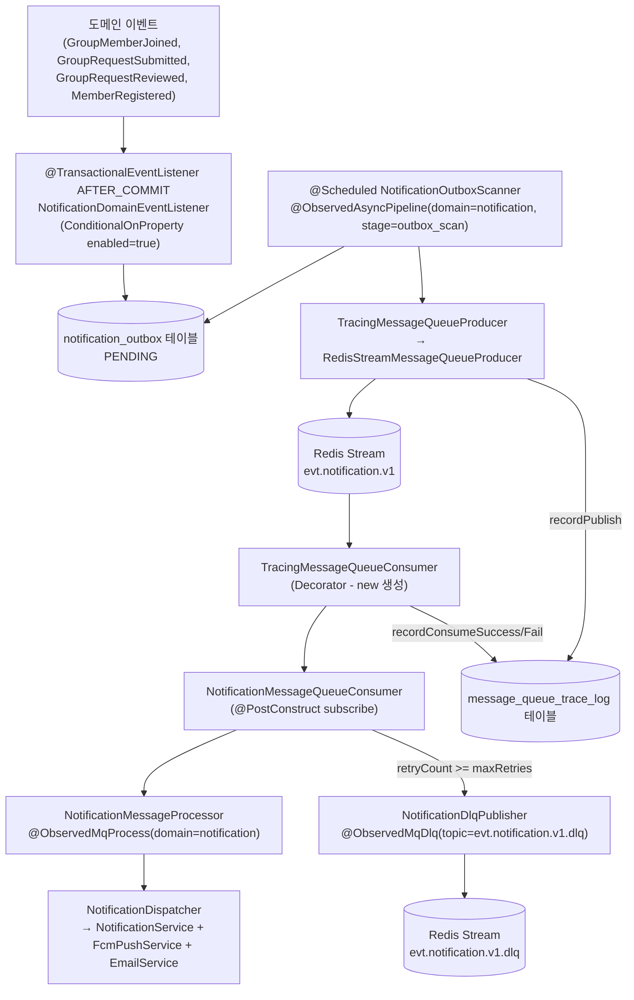

### Chat 알림 경로 (별도 처리)

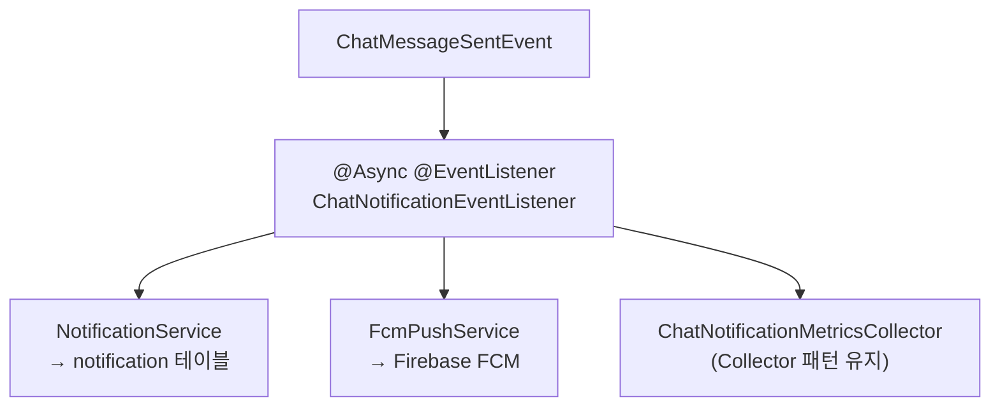

## **[2-2] User Activity 파이프라인**

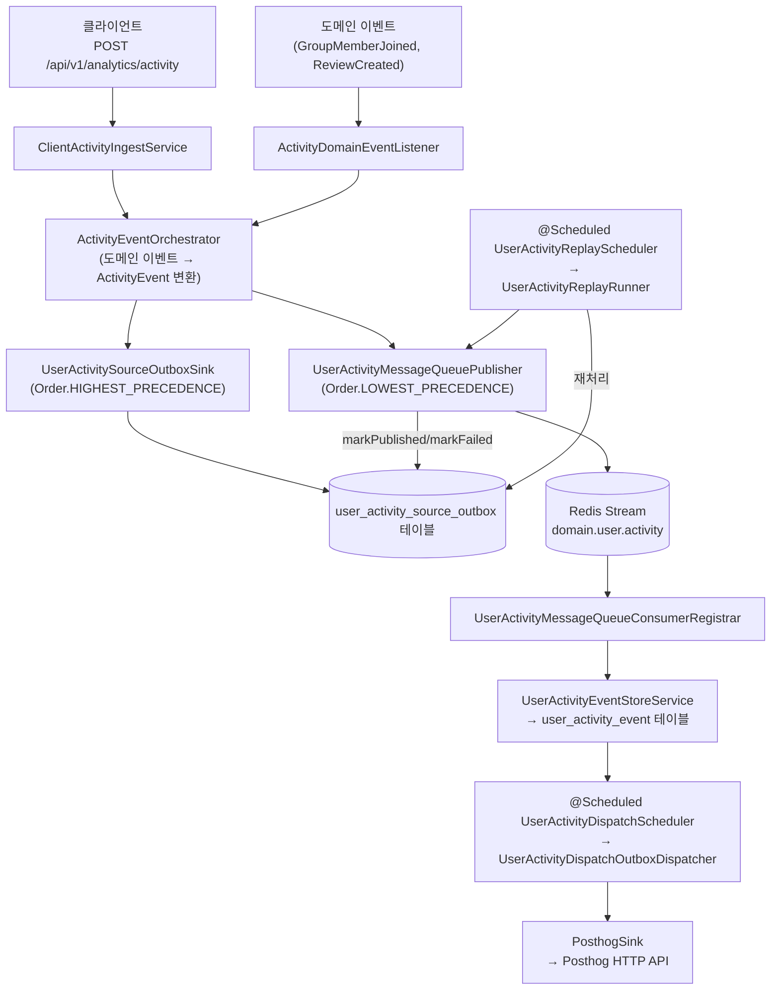

### Source Outbox 역할

User Activity에는 `Source Outbox`가 존재한다. MQ 발행 실패 시 `PENDING` 상태로 남은 항목을 `UserActivityReplayScheduler`가 주기적으로 재발행한다.

---

# **[3] AOP 메트릭 수집 설계**

## **[3-1] 적용 가능성 분류 원칙**

Spring AOP는 프록시 기반이므로 적용 가능 조건이 한정된다.

| 조건 | 결과 |
|---|---|
| `@Component` / `@Service` 빈의 public 메서드 | **AOP 적용 가능** |
| `new`로 직접 생성한 객체 (e.g. `TracingMessageQueueConsumer`) | **불가** — Spring 프록시 없음 |
| `private` 메서드 | **불가** — Spring AOP는 프록시 기반 |
| 반환 전 계산된 도메인 값이 필요한 메트릭 (e.g. 수신자 수, FCM 성공 수) | **불가** — AOP가 값 접근 불가 |
| Gauge 상태 폴링 (주기적 DB 조회 → AtomicLong) | **불가** — 상태 폴링 필요 |

## **[3-2] 전체 Aspect 구성**

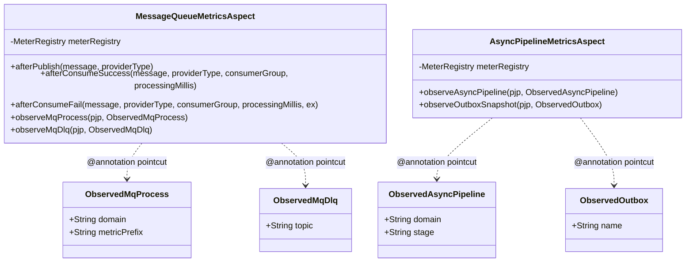

## **[3-3] MessageQueueMetricsAspect 상세**

### Phase 1 — Named Pointcut + AfterReturning (인프라 레벨)

`TracingMessageQueueConsumer`는 `new`로 생성되므로 AOP 불가. 대신 그것이 호출하는 `MessageQueueTraceService`(`@Service`)의 `record*()` 메서드를 포인트컷으로 잡는다.

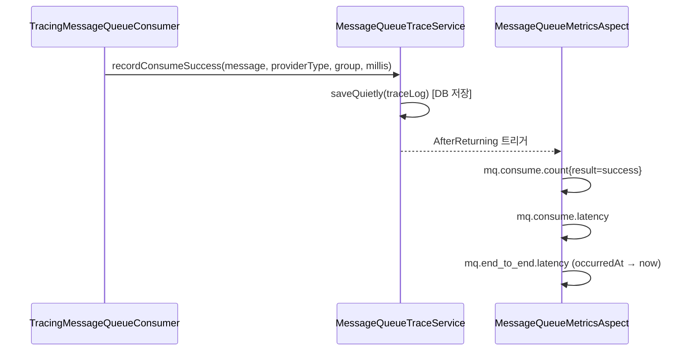

| Pointcut | Advice | 수집 메트릭 |
|---|---|---|
| `recordPublish()` | `@AfterReturning + args(message, providerType)` | `mq.publish.count{topic, provider, result=success}` |
| `recordConsumeSuccess()` | `@AfterReturning + args(message, providerType, consumerGroup, processingMillis)` | `mq.consume.count{result=success}`, `mq.consume.latency`, `mq.end_to_end.latency{result=success}` |
| `recordConsumeFail()` | `@AfterReturning + args(message, providerType, consumerGroup, processingMillis, ex)` | `mq.consume.count{result=fail}`, `mq.consume.latency`, `mq.end_to_end.latency{result=fail}` |

### Phase 2 — Annotation-based Around (비즈니스 레벨)

신규 추출 `@Component` 빈에 마커 어노테이션을 부착하여 AOP가 자동 수집.

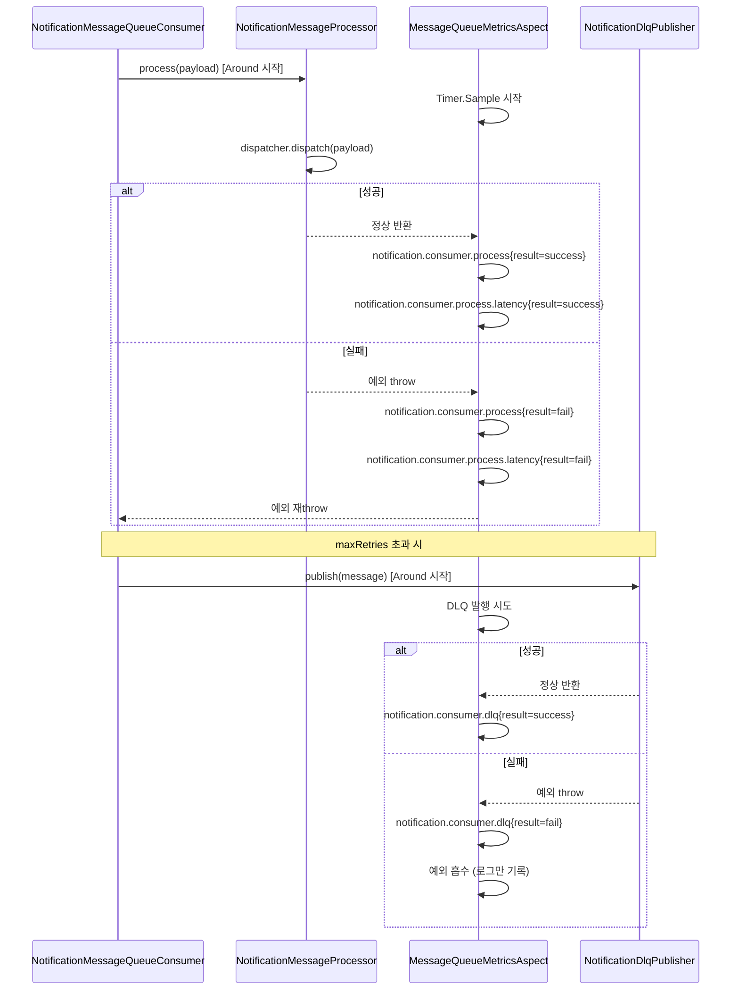

## **[3-4] AsyncPipelineMetricsAspect 상세**

`@ObservedAsyncPipeline`과 `@ObservedOutbox` 두 마커 어노테이션을 처리.

| 어노테이션 적용 위치 | 수집 메트릭 |
|---|---|
| `NotificationOutboxScanner.scan()` | `async.pipeline.notification.outbox_scan.process{result}`, `async.pipeline.notification.outbox_scan.latency{result}` |
| `NotificationOutboxService.summarize()` | `outbox.notification.snapshot{result}`, `outbox.notification.snapshot.latency{result}` |

---

# **[4] Collector 패턴 유지 영역**

AOP로 대체 불가능한 영역은 전용 `*MetricsCollector` 클래스를 유지한다.

## **[4-1] 유지 이유**

| 패턴 | 이유 |
|---|---|
| **Gauge (AtomicLong 상태 폴링)** | Gauge는 특정 순간의 상태를 읽는 pull 방식. AOP는 메서드 호출 시점에만 실행되므로 상태를 지속적으로 모니터링하는 Gauge와 맞지 않음 |
| **도메인 계산값 파라미터** | 수신자 수(`recipientIds.size()`), FCM 성공 수(`response.successCount()`) 등 비즈니스 로직에서만 알 수 있는 값은 AOP가 접근 불가 |

## **[4-2] 유지 Collector 목록**

### NotificationOutboxMetricsCollector

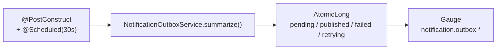

| 메트릭 | 타입 | 설명 |
|---|---|---|
| `notification.outbox.pending` | Gauge | PENDING 상태 아웃박스 수 |
| `notification.outbox.published` | Gauge | PUBLISHED 상태 수 |
| `notification.outbox.failed` | Gauge | FAILED 상태 수 |
| `notification.outbox.retrying` | Gauge | RETRYING 상태 수 |
| `notification.outbox.snapshot.error{reason}` | Counter | 스냅샷 수집 실패 카운트 |

### UserActivitySourceOutboxMetricsCollector

| 메트릭 | 타입 | 설명 |
|---|---|---|
| `analytics.user-activity.source.outbox.pending` | Gauge | PENDING 수 |
| `analytics.user-activity.source.outbox.failed` | Gauge | FAILED 수 |
| `analytics.user-activity.source.outbox.published` | Gauge | PUBLISHED 수 |
| `analytics.user-activity.source.outbox.retrying` | Gauge | RETRYING 수 |
| `analytics.user-activity.outbox.enqueue{result}` | Counter | 인큐 성공/실패 |
| `analytics.user-activity.outbox.publish{result}` | Counter | MQ 발행 성공/실패 |
| `analytics.user-activity.outbox.retry{result}` | Counter | 재시도 스케줄 횟수 |
| `analytics.user-activity.source.outbox.snapshot.error{reason}` | Counter | 스냅샷 수집 실패 |

### UserActivityReplayMetricsCollector

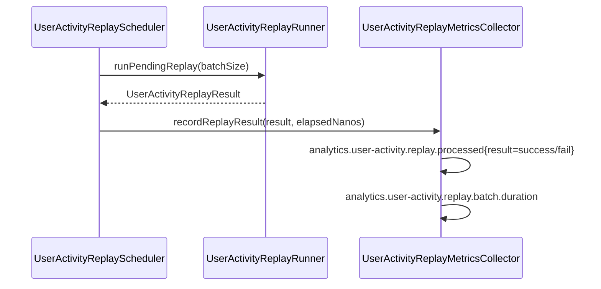

| 메트릭 | 타입 | 설명 |
|---|---|---|
| `analytics.user-activity.replay.processed{result}` | Counter | 재처리 성공/실패 건수 |
| `analytics.user-activity.replay.batch.duration` | Timer (p99) | 배치 전체 소요 시간 |

### ChatNotificationMetricsCollector

| 메트릭 | 타입 | 설명 |
|---|---|---|
| `notification.chat.created.total` | Counter | 채팅 알림 생성 건수 (N명 수신) |
| `notification.chat.push.skipped.online.total` | Counter | 온라인 상태로 FCM 생략된 건수 |
| `notification.chat.push.sent.total` | Counter | FCM 실제 발송 성공 건수 |

> **AOP 미적용 이유**: `recipientIds.size()`, `response.successCount()` 값은 비즈니스 로직 실행 중 계산되며, AOP가 해당 값에 접근할 수 없음.

---

# **[5] MetricLabelPolicy — 카디널리티 제어**

고 카디널리티 라벨이 Prometheus 메모리를 폭증시키는 것을 방지하기 위해 허용/금지 라벨을 코드로 강제한다.

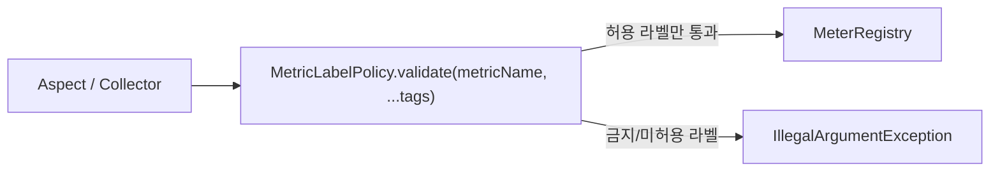

| 구분 | 라벨 |
|---|---|
| **허용 (`ALLOWED_LABELS`)** | `environment`, `instance`, `result`, `topic`, `provider`, `target`, `reason`, `executor` |
| **금지 (`FORBIDDEN_LABELS`)** | `eventId`, `memberId`, `chatRoomId` |

> 허용 라벨 추가 시 `MetricLabelPolicy.ALLOWED_LABELS`에 추가하고, 코드 리뷰에서 카디널리티 영향을 검토한다.

---

# **[6] 전체 메트릭 카탈로그**

## **[6-1] MQ 인프라 메트릭** (MessageQueueMetricsAspect)

| 메트릭 이름 | 타입 | 라벨 | 수집 시점 |
|---|---|---|---|
| `mq.publish.count` | Counter | `topic`, `provider`, `result=success` | `recordPublish()` AfterReturning |
| `mq.consume.count` | Counter | `topic`, `provider`, `result` | `recordConsumeSuccess/Fail()` AfterReturning |
| `mq.consume.latency` | Timer | `topic`, `provider` | `recordConsumeSuccess/Fail()` AfterReturning |
| `mq.end_to_end.latency` | Timer | `topic`, `provider`, `result` | `recordConsumeSuccess/Fail()` AfterReturning, `occurredAt` → `now()` |

## **[6-2] 알림 소비 메트릭** (MessageQueueMetricsAspect - @ObservedMq*)

| 메트릭 이름 | 타입 | 라벨 | 수집 시점 |
|---|---|---|---|
| `notification.consumer.process` | Counter | `result` | `NotificationMessageProcessor.process()` Around |
| `notification.consumer.process.latency` | Timer (p99) | `result` | 동일 |
| `notification.consumer.dlq` | Counter | `result` | `NotificationDlqPublisher.publish()` Around |

## **[6-3] 비동기 파이프라인 메트릭** (AsyncPipelineMetricsAspect - @ObservedAsyncPipeline)

| 메트릭 이름 | 타입 | 라벨 | 적용 위치 |
|---|---|---|---|
| `async.pipeline.notification.outbox_scan.process` | Counter | `result` | `NotificationOutboxScanner.scan()` |
| `async.pipeline.notification.outbox_scan.latency` | Timer (p99) | `result` | 동일 |

## **[6-4] 아웃박스 스냅샷 메트릭** (AsyncPipelineMetricsAspect - @ObservedOutbox)

| 메트릭 이름 | 타입 | 적용 위치 |
|---|---|---|
| `outbox.notification.snapshot` | Counter | `NotificationOutboxService.summarize()` |
| `outbox.notification.snapshot.latency` | Timer | 동일 |

## **[6-5] 알림 아웃박스 Gauge** (NotificationOutboxMetricsCollector)

| 메트릭 이름 | 타입 |
|---|---|
| `notification.outbox.pending` | Gauge |
| `notification.outbox.published` | Gauge |
| `notification.outbox.failed` | Gauge |
| `notification.outbox.retrying` | Gauge |
| `notification.outbox.snapshot.error{reason}` | Counter |

## **[6-6] User Activity 메트릭** (Collector + Gauge)

| 메트릭 이름 | 타입 | 라벨 |
|---|---|---|
| `analytics.user-activity.source.outbox.pending` | Gauge | - |
| `analytics.user-activity.source.outbox.failed` | Gauge | - |
| `analytics.user-activity.source.outbox.published` | Gauge | - |
| `analytics.user-activity.source.outbox.retrying` | Gauge | - |
| `analytics.user-activity.outbox.enqueue` | Counter | `result` |
| `analytics.user-activity.outbox.publish` | Counter | `result` |
| `analytics.user-activity.outbox.retry` | Counter | `result=scheduled` |
| `analytics.user-activity.source.outbox.snapshot.error` | Counter | `reason` |
| `analytics.user-activity.replay.processed` | Counter | `result` |
| `analytics.user-activity.replay.batch.duration` | Timer (p99) | - |

## **[6-7] 채팅 알림 메트릭** (ChatNotificationMetricsCollector)

| 메트릭 이름 | 타입 |
|---|---|
| `notification.chat.created.total` | Counter |
| `notification.chat.push.skipped.online.total` | Counter |
| `notification.chat.push.sent.total` | Counter |

---

# **[7] 수집 방식 결정 가이드**

신규 메트릭 추가 시 아래 순서로 판단한다.

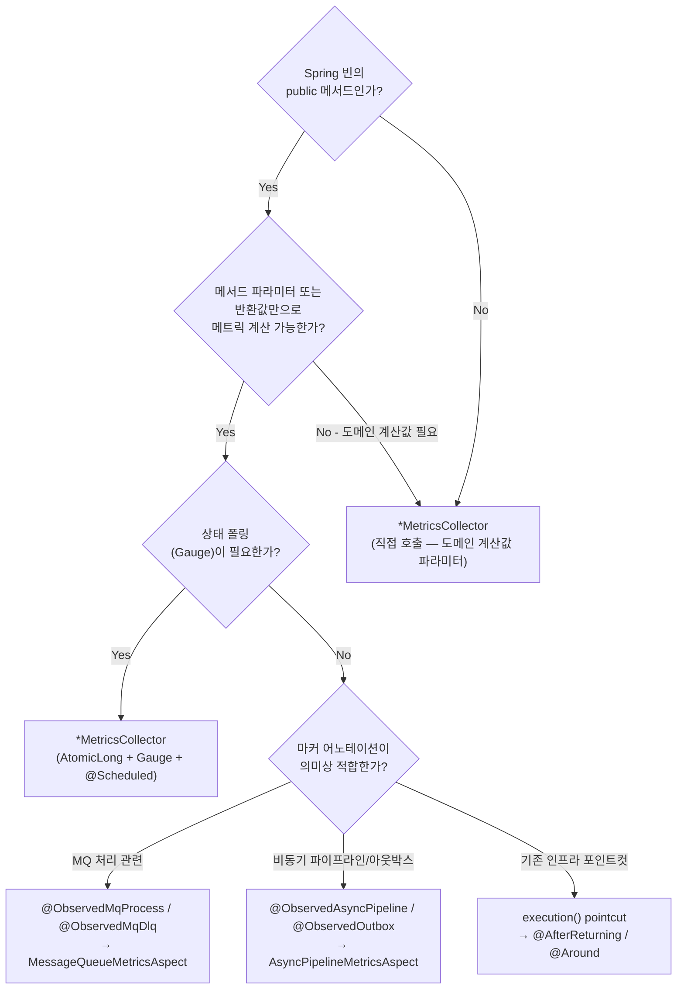

---

# **[8] 파일 구조 참조**

```
global/
└── aop/
    ├── MessageQueueMetricsAspect.java   # Phase1 AfterReturning + Phase2 Around
    ├── AsyncPipelineMetricsAspect.java  # @ObservedAsyncPipeline, @ObservedOutbox
    ├── ObservedMqProcess.java           # 마커 어노테이션
    ├── ObservedMqDlq.java               # 마커 어노테이션
    ├── ObservedAsyncPipeline.java       # 마커 어노테이션
    └── ObservedOutbox.java              # 마커 어노테이션
└── metrics/
    └── MetricLabelPolicy.java           # 허용/금지 라벨 정책

domain/notification/
├── consumer/
│   ├── NotificationMessageQueueConsumer.java   # 재시도/DLQ 라우팅 (메트릭 無)
│   ├── NotificationMessageProcessor.java       # @ObservedMqProcess
│   └── NotificationDlqPublisher.java           # @ObservedMqDlq
├── event/
│   └── ChatNotificationMetricsCollector.java   # Collector 패턴 유지
└── outbox/
    └── NotificationOutboxMetricsCollector.java  # Gauge + Collector 패턴 유지

domain/analytics/
└── resilience/
    ├── UserActivitySourceOutboxMetricsCollector.java  # Gauge + Collector
    └── UserActivityReplayMetricsCollector.java         # Collector

infra/messagequeue/
├── trace/
│   └── MessageQueueTraceService.java    # DB 저장만 — MeterRegistry 없음
├── TracingMessageQueueConsumer.java     # Decorator (new 생성, AOP 불가)
└── TracingMessageQueueProducer.java     # Decorator (new 생성, AOP 불가)
```

---

# **[9] 설계 원칙 요약**

| 원칙 | 내용 |
|---|---|
| **SRP** | `TraceService`는 DB 저장만, 메트릭 수집은 Aspect가 담당 |
| **AOP 우선** | Spring 빈의 public 메서드는 마커 어노테이션 + Aspect로 수집 |
| **Collector 유지** | Gauge / 도메인 계산값 파라미터는 AOP로 대체 불가, Collector 유지 |
| **카디널리티 제어** | 모든 라벨은 `MetricLabelPolicy`를 통과해야 등록됨 |
| **방어적 null 처리** | `MeterRegistry`는 `@Nullable`로 주입 — 테스트 환경에서 빈 미등록 시 안전하게 skip |
| **DLQ 예외 흡수** | `@ObservedMqDlq` Around는 DLQ 발행 실패를 re-throw하지 않고 로그 + 메트릭만 기록 |
