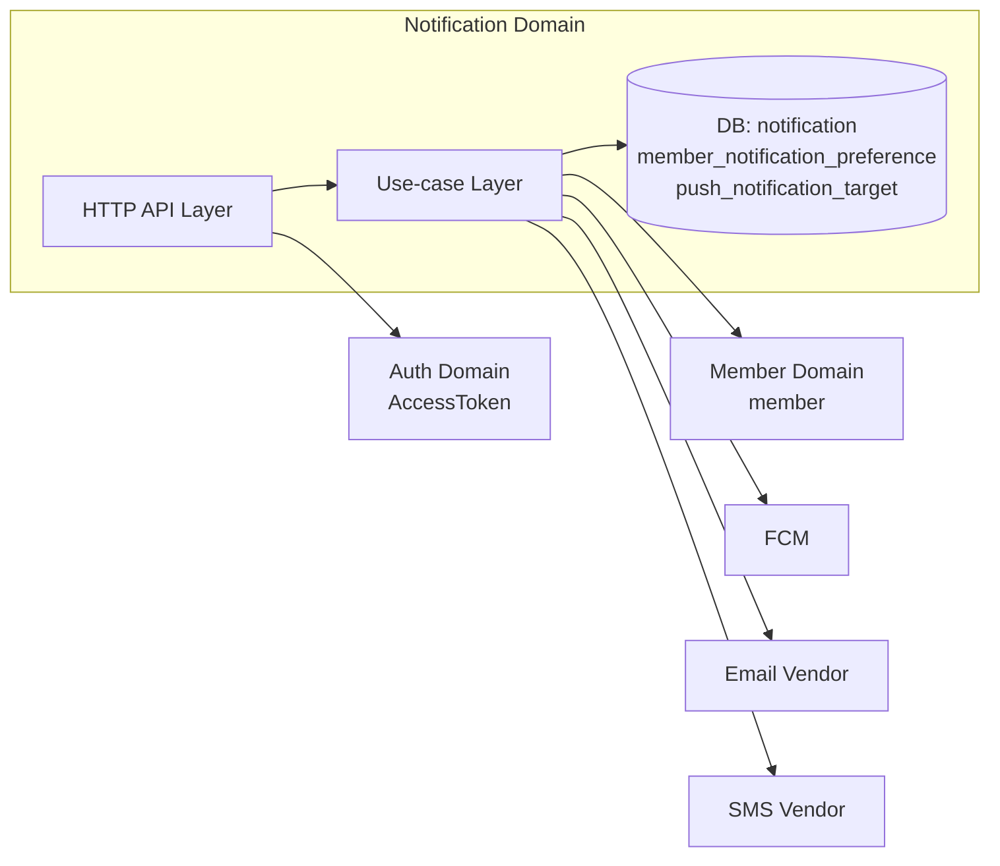
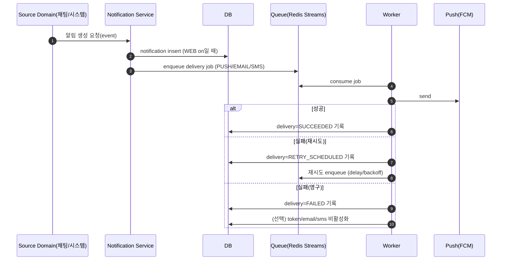

| 항목 | 내용 |
|---|---|
| 문서 제목 | 알림(Notification) 테크 스펙 |
| 문서 목적 | 알림 생성/조회/읽음 처리/선호도/푸시 대상(FCM 토큰) 관리 기능의 요구사항·데이터 모델·API 계약·처리 흐름·운영 <br> 기준을 정의하여 구현/리뷰/테스트 기준으로 활용한다. |
| 작성 및 관리 | Backend Team |
| 최초 작성일 | 2026.01.13 |
| 최종 수정일 | 2026.01.15 |
| 문서 버전 | v1.5 |

<br>

# 알림(Notification) - BE 테크스펙

---

# **[1] 배경 (Background)**

## **[1-1] 프로젝트 목표 (Objective)**

사용자에게 중요한 이벤트를 “지연/누락 없이” 전달하고, 앱 내에서 조회·읽음 처리·선호도 설정이 가능한 알림 시스템을 제공한다.

- **핵심 결과 (Key Result) 1:** 알림 목록 조회 성능 p95 ≤ `200ms`, p99 ≤ `400ms`(기본 `size=10`, 최대 `100`)
- **핵심 결과 (Key Result) 2:** 알림 읽음 처리(개별/전체) 성공률 ≥ `99.99%`(5xx ≤ `0.01%`) + 중복 요청 `100%` 멱등 보장
- **핵심 결과 (Key Result) 3:** 푸시 발송(FCM) 성공률 ≥ `99.5%` + retry 후 최종 실패율 ≤ `0.3%`(영구 실패 토큰 제외 기준)
- **핵심 결과 (Key Result) 4:** 실시간성: 트리거 발생 → 인앱 알림 생성 p95 ≤ `1s`, 푸시 수신 p95 ≤ `5s`(채널별 SLA 정의)
- **핵심 결과 (Key Result) 5:** 관측성: `notification_delivery` 기준 `100%` 이벤트 로깅 + 에러 급증 알람 ≤ `1분` 내 탐지
- **핵심 결과 (Key Result) 6:** 토큰/채널 위생: 무효 토큰 정리율 ≥ `99%` + 토큰 중복률 ≤ `0.5%`(device_id + platform unique)
- **핵심 결과 (Key Result) 7:** 데이터 품질: unread-count와 목록의 미읽음 상태(`readAt`) 불일치율 ≤ `0.1%`

<br>

## **[1-2] 문제 정의 (Problem)**

- 알림은 “조회/읽음 처리”가 빈번하므로 인덱스/페이징/동시성 정책이 없으면 UX가 급격히 악화된다.
- 알림 읽음은 동시 요청(멀티 디바이스/재시도)에서 정합성이 깨지기 쉽다.
- 푸시는 토큰 만료/무효가 필연적으로 발생하므로, 토큰 관리/정리/관측이 필요하다.

<br>

## **[1-3] 가설 (Hypothesis)**

알림을 “DB가 단일 진실”로 두고, 읽음 처리의 멱등성과 선호도/토큰 관리 정책을 명문화하면 운영 안정성과 UX가 개선된다.

<br>

<br>

---

# **[2] 목표가 아닌 것 (Non-goals)**

**이번 작업에서 다루지 않는 내용:**

- 알림 발송 파이프라인의 “생성 트리거 전체”(리뷰/채팅/시스템 이벤트에서 어떤 알림을 언제 생성하는지 상세 정의)
- 알림 템플릿(다국어/i18n, 개인화 템플릿, 변수 치환 규칙)
- 마케팅/광고성 알림(수신 동의/법적 고지)
- 푸시 발송 재시도/지연 큐/배치(outbox, DLQ 등)의 상세 구현(확장 설계로 관리)

<br>

---

# **[3] 설계 및 기술 자료 (Architecture and Technical Documentation)**

- 인증: `Authorization: Bearer {accessToken}`
- API Prefix: `/api/v1`
- 단일 진실(Source of Truth): `notification`(인앱 알림, WEB)
- 역할 경계
  - Notification 도메인: 알림 저장/조회/읽음/선호도/푸시 대상(토큰) 관리
  - Source 도메인(예: 채팅/리뷰): 이벤트 발생 시 수신자 결정 + `notification` 생성(정책은 각 도메인 테크스펙에 고정)

## **알림 종류/채널(요약)**

### 알림 채널(Channel)

- `WEB`: 앱/웹 인앱 알림(알림함/배지) — **DB(`notification`)가 단일 진실**
- `PUSH`: 모바일 Push(FCM). iOS는 FCM이 내부적으로 APNs로 전달
- `EMAIL`: 이메일 알림(벤더 확정 필요)
- `SMS`: 문자 알림(벤더 확정 필요)

### 알림 유형(NotificationType)

- `CHAT`: 채팅 관련 알림(예: 새 메시지, 멘션 등)
- `SYSTEM`: 시스템 이벤트(예: 정책 변경, 보안 알림, 점검)
- `NOTICE`: 공지/운영 알림(예: 운영 공지, 공지사항)

### “알림 카탈로그”(이벤트 → 타입/채널/딥링크) 초안

| 이벤트 | 알림 타입 | WEB | PUSH | EMAIL | SMS | deepLink |
|---|---|---:|---:|---:|---:|---|
| 새 채팅 메시지 | `CHAT` | on | on | off | off | `/chat/rooms/{chatRoomId}` |
| 새 리뷰 작성(하위그룹) | `NOTICE` | on | on | off | off | `/restaurants/{restaurantId}?tab=reviews&reviewId={reviewId}` |
| 시스템 공지 | `NOTICE` | on | on | off | off | `/notices/{noticeId}` |
| 보안 경고(중요) | `SYSTEM` | on | on | on | (선택) | `/settings/security` |

> 위 카탈로그는 “최소 세트”이며, 실제 트리거/템플릿/채널은 확정 후 본 문서에 고정한다.

## **모듈 구성(구현 단서)**

- HTTP 레이어
  - Public API: 알림 목록, 읽지 않은 개수, 개별/전체 읽음, 선호도 조회/수정, 푸시 대상 등록
- Application 레이어(유스케이스)
  - 알림 목록 조회 유스케이스: 멤버 식별 → page/size 기반 조회 → 응답 매핑
  - 읽음 처리 유스케이스(개별/전체): 멱등/동시성 정책 적용 → update 실행
  - 선호도 유스케이스: 입력 검증 → upsert(채널×유형) → 204
  - 푸시 대상 등록 유스케이스: 토큰 검증 → 중복 방지 → 저장/갱신
- Persistence 레이어
  - Notification/Preference/PushTarget에 대한 조회·저장 책임 분리
- External/Infra
  - Push: FCM(확정) — 발송 자체는 별도 파이프라인(이 문서에서는 “토큰 등록/관리” 중심)
  - Email/SMS: 벤더 확정 필요(전송 파이프라인/실패 처리 정책은 본 문서에서 고정)

## **의존성 관계(Dependency Graph)**



<br>

## **외부 3rd Party 연동(채널별)**

### PUSH (FCM/APNs)

- 사용: `FCM` (iOS는 FCM이 APNs로 전달)
- 입력: `push_notification_target.fcm_token`
- 발송 단위: “알림 1건” 또는 “멀티캐스트(동일 payload를 여러 토큰)”(정책 확정)
- 실패 처리
  - **영구 실패(토큰 무효/삭제):** 해당 토큰을 비활성화/삭제(추후 재등록 유도)
  - **일시 실패(타임아웃/5xx/429):** 재시도(지수 backoff) + 최대 횟수 초과 시 실패 확정

### EMAIL (NotificationAPI -> AWS SES)

- **권장안(단계적 적용)**
    1. **초기: NotificationAPI**
        - 큰 무료 제공량으로 **초기 비용 최소화**
        - Email/SMS **통합 API**로 빠른 초기 구현
        - 사용처: PoC, 초기 런칭, 저발송량 구간
    2. **확장: AWS SES로 전환**
        - 발송량 증가 시 **최저 단가로 비용 최적화**
        - AWS 인프라(S3/CloudFront)와 **운영 일관성** 확보
        - 전환 기준: 무료 한도 초과 또는 장기 운영 단계 진입
- **연동 방식**
    - 초기: NotificationAPI API
    - 전환: **SES API 또는 SMTP 중 하나로 통일**
    - 벤더 교체를 고려해 **발송 인터페이스 추상화**
- **실패 처리(공통)**
    - **영구 실패:** 이메일 알림 비활성화 또는 운영 플래그
    - **일시 실패:** 지수 backoff 기반 재시도

### SMS (벤더 확정 필요)

- 권장안(초안): **국내 벤더(예: NCP SENS) 또는 Twilio**
  - 선택 기준: 국내 번호/발송 정책, 가격, 운영/대시보드, 장애 대응(SLA), API 안정성
- 실패 처리
  - **영구 실패(번호 오류/차단):** SMS 비활성화 또는 운영 플래그(정책 확정)
  - **일시 실패:** 재시도(지수 backoff)

### 공통: 실패 에러 처리 분류(채널 공통)

> “어떤 실패는 재시도하고, 어떤 실패는 즉시 중단/정리할지”를 채널별로 동일한 기준으로 분류한다.

- **영구 실패(Non-retryable)**
  - PUSH: 토큰 무효/삭제(벤더 응답 기준)
  - EMAIL: 주소 오류/하드 바운스
  - SMS: 번호 오류/차단
  - 조치: 대상(토큰/채널)을 비활성화/정리하고, 동일 대상 재시도 금지
- **일시 실패(Retryable)**
  - 네트워크 타임아웃, 5xx, 429(rate limit), 일시적 서비스 장애
  - 조치: 재시도 스케줄링 + 최대 횟수 초과 시 “실패 확정”

<br>

## **알림 설정(선호도) 상세 정책**

### 1) 저장 모델

- 저장 테이블: `member_notification_preference`
- 키: `(member_id, channel, notification_type)`
- 값: `is_enabled` (true/false)

### 2) 기본값(Default)

> “저장 row가 없을 때 어떻게 보이게 할지”를 확정해야 UX가 고정된다.

- 기본값: `WEB=true`, `PUSH=true`, `EMAIL=false`, `SMS=false`

### 3) 적용 우선순위

1. 사용자 설정(`member_notification_preference`)이 있으면 그 값을 따른다.
2. 없으면 “기본값(Default)”을 적용한다.

### 4) 채널별 동작 의미

- `WEB` off: 알림함/배지에 노출하지 않음(= `notification`을 생성하지 않음) **또는** 생성하되 숨김 처리(추가 모델 필요) 중 선택
- `PUSH/EMAIL/SMS` off: 해당 채널로는 발송하지 않음(단, `WEB`은 독립)

> 현재 ERD에는 “알림 자체를 생성했으나 WEB에서 숨김” 모델이 없으므로, 1차는 “채널별로 생성/발송 여부를 결정”하는 방식이 단순하다.

<br>

## **알림 전송 흐름(Async Dispatch)**

> 목표: “사용자 UX 우선(지연/누락 최소화)” + “DB가 단일 진실” + “재시도/관측 가능”.

### Flow A. 알림 생성(도메인 이벤트 → notification 생성)

1. 트리거 발생(예: 채팅 메시지 저장 완료)
2. 수신 대상 사용자 결정(예: 채팅방 참여자)
3. 사용자 선호도 조회(또는 기본값 적용)
4. `WEB`이 on이면 `notification` insert(인앱 알림 생성)
5. `PUSH/EMAIL/SMS`가 on이면 “전송 작업”을 큐에 적재(비동기)

### Flow B. 전송 워커(큐 컨슈밍 → 3rd party 발송)

1. 큐에서 전송 작업 수신(예: Redis Streams)
2. 멱등 처리(동일 작업 중복 수신 방지): `delivery` 상태 기반으로 중복 발송 방지
3. 채널별로 발송 수행(FCM/Email/SMS)
4. 결과 기록(성공/실패/재시도 예정)
5. 영구 실패(예: 토큰 무효)면 대상 비활성화/정리 수행

### 예시 시퀀스



<br>

## **실패/재시도/저장 정책 기본값**

> 목표: “UX 우선(누락 최소화)”를 위해 재시도는 하되, 무한 재시도는 금지한다(운영 비용/폭주 방지).

- 공통
  - 타임아웃: 3~5s(채널별 조정)
  - 최대 재시도: 3회(총 4회 시도)
  - backoff: 1s → 5s → 30s(지수)
  - 최대 지연 한도: 5분
  - 실패 확정 시: `notification_delivery.status=FAILED`로 저장 + 알람/대시보드에 집계
- PUSH 토큰 무효 처리
  - “영구 실패”로 분류되면 `push_notification_target`에서 토큰 삭제(또는 비활성화 컬럼을 추가해 soft disable)
- EMAIL/SMS 영구 실패 처리
  - 누적 기준으로 off

<br>

## **[3-1] 데이터베이스 스키마 (ERD)**

- ERD Cloud: [ERD Cloud](https://www.erdcloud.com/d/TXZ3CApePpKwEyacT)
- ERD 테이블 정의서: [ERD 테이블 정의서](https://github.com/100-hours-a-week/3-team-tasteam-wiki/wiki/%5BERD%5D-%ED%85%8C%EC%9D%B4%EB%B8%94-%EC%A0%95%EC%9D%98%EC%84%9C)

### 주요 테이블 요약

- `notification`: 사용자별 알림(제목/본문/딥링크/생성시각/읽음시각)
- `member_notification_preference`: 사용자별 알림 수신 설정(채널×알림유형 on/off)
- `push_notification_target`: 사용자 푸시 수신 대상(FCM 토큰)
  - 전송 작업/시도 추적 테이블(아래 “추가 설계” 참고)

### 테이블별 핵심 컬럼/정책

| 테이블 | 목적 | 주요 컬럼 | 제약/정합성 | 비고 |
|---|---|---|---|---|
| `notification` | 알림 인박스 | `member_id`, `notification_type`, `title`, `body`, `deep_link?`, `created_at`, `read_at?` | FK: `member_id -> member.id` | `notification_type`: `CHAT|SYSTEM|NOTICE` |
| `member_notification_preference` | 선호도 | `member_id`, `channel`, `notification_type`, `is_enabled`, `updated_at` | FK: `member_id -> member.id` | `channel`: `PUSH|EMAIL|SMS|WEB` |
| `push_notification_target` | FCM 토큰 | `member_id`, `fcm_token`, `created_at` | FK: `member_id -> member.id` | 멀티 디바이스 허용, `fcm_token` 전역 유니크 |

### 인덱스/제약

- `notification(member_id, id)` 또는 `notification(member_id, created_at, id)`
  - 목록 조회(page/size) 및 정렬 기준과 일치하도록 선택
- `notification(member_id, read_at, id)` (선택)
  - “안 읽은 개수” 및 “안 읽은 것 우선” 정렬이 필요하면 고려
- `UNIQUE(member_notification_preference.member_id, member_notification_preference.channel, member_notification_preference.notification_type)`
  - 동일 조합 중복 row 방지(선호도 upsert 기반)
- `UNIQUE(push_notification_target.fcm_token)`
  - 토큰 중복 등록 방지(멀티 디바이스 허용)
- `push_notification_target(member_id, created_at)`
  - 사용자 토큰 조회/정리

### 추가 설계 — 실패/재시도를 “저장”하기 위한 테이블

> 1차 범위에는 미포함. 추후 확장 설계로 유지한다.

> 현재 ERD에는 전송 실패/재시도/상태 추적을 저장할 곳이 없다. 멀티 인스턴스/비동기 전송에서는 “실패를 저장”하지 않으면 운영이 불가능해진다.

- `notification_delivery`
  - 목적: “알림 1건”의 채널별 발송 상태를 추적(관측/재시도/운영 대응)
  - 최소 컬럼
    - `id`, `member_id`, `notification_id?`(WEB 알림과 연결 가능 시), `channel`, `provider`, `status`, `attempt_count`, `last_attempt_at`, `next_retry_at`, `error_code?`, `error_message?`, `created_at`, `updated_at`
  - 유니크: `(member_id, notification_id, channel)` 또는 `(member_id, event_id, channel)` (event_id 도입 시)
- `notification_outbox` 또는 `event_id` 컬럼
  - 목적: DB 저장과 큐 적재를 원자적으로 보장(outbox 패턴)
  - 최소 컬럼: `id`, `event_type`, `event_key`, `payload`, `status`, `created_at`, `published_at`

### 확장 설계(제안) — `notification_delivery` / `notification_outbox` 스키마(DDL 초안)

> 아래는 구현/리뷰에 필요한 수준으로 정리한 스키마 초안이다. 실제 적용 시 마이그레이션 파일로 분리한다.

**(A) notification_delivery**

```sql
-- 채널별 전송 상태(재시도/실패 사유 포함)
CREATE TABLE notification_delivery (
  id BIGSERIAL PRIMARY KEY,
  member_id BIGINT NOT NULL,
  notification_id BIGINT NULL, -- WEB(in-app) 알림과 연결 가능한 경우
  channel VARCHAR(20) NOT NULL, -- ENUM('PUSH','EMAIL','SMS')
  provider VARCHAR(30) NOT NULL, -- ENUM('FCM','SES','SMS_VENDOR')
  event_key VARCHAR(200) NOT NULL, -- 멱등/중복 방지 키(도메인 이벤트 기반)
  status VARCHAR(30) NOT NULL, -- ENUM('PENDING','IN_PROGRESS','SUCCEEDED','RETRY_SCHEDULED','FAILED','CANCELED')
  attempt_count INT NOT NULL DEFAULT 0,
  last_attempt_at TIMESTAMP NULL,
  next_retry_at TIMESTAMP NULL,
  last_error_category VARCHAR(20) NULL, -- ENUM('RETRYABLE','NON_RETRYABLE')
  last_error_code VARCHAR(100) NULL, -- 벤더/내부 코드
  last_error_message VARCHAR(500) NULL,
  vendor_message_id VARCHAR(200) NULL, -- 벤더가 제공하면 저장(추적용)
  payload_hash VARCHAR(64) NULL, -- 동일 payload 재전송 여부 확인(선택)
  created_at TIMESTAMP NOT NULL,
  updated_at TIMESTAMP NOT NULL
);

-- event_key는 동일 채널에서 중복 발송을 막기 위한 핵심 유니크
CREATE UNIQUE INDEX uq_notification_delivery_event
  ON notification_delivery(event_key, channel);

-- 워커가 “해야 할 일”만 빠르게 찾기 위한 인덱스
CREATE INDEX idx_notification_delivery_pending
  ON notification_delivery(status, next_retry_at, id);

-- 사용자별 발송 이력 조회(운영/CS)
CREATE INDEX idx_notification_delivery_member
  ON notification_delivery(member_id, created_at, id);
```

**(B) notification_outbox**

```sql
-- DB 트랜잭션 내에서 “큐에 발행할 이벤트”를 저장(outbox)
CREATE TABLE notification_outbox (
  id BIGSERIAL PRIMARY KEY,
  event_type VARCHAR(50) NOT NULL, -- e.g. 'NOTIFICATION_DELIVERY_REQUESTED'
  event_key VARCHAR(200) NOT NULL, -- delivery.event_key와 동일
  payload JSONB NOT NULL,
  status VARCHAR(20) NOT NULL, -- ENUM('PENDING','PUBLISHED','FAILED')
  created_at TIMESTAMP NOT NULL,
  published_at TIMESTAMP NULL,
  failure_reason VARCHAR(500) NULL
);

CREATE UNIQUE INDEX uq_notification_outbox_event_key
  ON notification_outbox(event_key);

CREATE INDEX idx_notification_outbox_pending
  ON notification_outbox(status, created_at, id);
```

### 확장 설계(제안) — event_key 규칙(멱등/중복 방지)

- 원칙: “같은 도메인 이벤트로 같은 사용자에게 같은 채널로 보내는 전송”은 1번만 수행된다.
- 규칙
  - 채팅 새 메시지: `CHAT_MESSAGE:{chatMessageId}:TO:{memberId}`
  - 시스템 공지: `NOTICE:{noticeId}:TO:{memberId}`
  - 보안 경고: `SECURITY_ALERT:{alertId}:TO:{memberId}`
- `notification_delivery(event_key, channel)` 유니크로 중복 발송 방지

### 확장 설계(제안) — 워커 처리 규칙(멀티 인스턴스)

- Queue: Redis Streams consumer group을 사용(멀티 인스턴스 scale-out)
- 처리 순서
  1. outbox publisher가 `notification_outbox(PENDING)` → Streams에 publish → outbox를 `PUBLISHED`로 마킹
  2. worker가 Streams에서 메시지 consume
  3. `notification_delivery`를 `IN_PROGRESS`로 전이(조건부 업데이트로 “1개 워커만” 잡도록)
  4. 채널별 벤더 호출(FCM/SES/SMS)
  5. 성공: `SUCCEEDED` + `vendor_message_id` 저장
  6. 실패(일시): `RETRY_SCHEDULED` + `next_retry_at` 계산 + 재큐잉(지연 큐 전략)
  7. 실패(영구): `FAILED` + 대상 정리(예: 토큰 삭제) + 알람 집계

### 확장 설계(제안) — 지연 재시도(Delay) 구현 옵션

- (안 1) DB 기반 스케줄러
  - `notification_delivery(status=RETRY_SCHEDULED AND next_retry_at <= now())`를 주기적으로 조회해 outbox/queue에 재발행
- (안 2) Redis ZSET 기반 지연 큐
  - `score=next_retry_at`, due 된 job을 poll → Streams로 옮김

<br>

## **[3-2] API 명세 (API Specifications)**

- **목차:**
  - [알림 목록 조회](#알림-목록-조회)
  - [개별 알림 읽음](#개별-알림-읽음)
  - [전체 알림 읽음](#전체-알림-읽음)
  - [읽지 않은 알림 개수 조회](#읽지-않은-알림-개수-조회)
  - [알림 선호도 목록 조회](#알림-선호도-목록-조회)
  - [알림 선호도 목록 수정](#알림-선호도-목록-수정)
  - [푸시 알림 대상 등록(FCM 토큰)](#푸시-알림-대상-등록fcm-토큰)

<br>

---

### **알림 목록 조회**

- **API 명세:**
  - `GET /api/v1/members/me/notifications`
  - API 문서 링크: [API 명세서(3-47)](https://github.com/100-hours-a-week/3-team-tasteam-wiki/wiki/%5BBE-%E2%80%90-API%5D-API-%EB%AA%85%EC%84%B8%EC%84%9C#user-content-api-47)
- **권한:** `USER`
- **구현 상세:**
  - **요청**
    - **Query Params(선택):**
      - `page`: number (default: 0)
      - `size`: number (default: 10, max: 100)
  - **응답**
    - status: `200`
    - body 스키마(요약)
      - `data[]`: array
        - `id`: number
        - `notificationType`: string (예: `CHAT|SYSTEM|NOTICE`)
        - `title`: string
        - `body`: string
        - `deepLink`: string | null
        - `createdAt`: string (ISO-8601)
        - `readAt`: string | null (ISO-8601)
    - 예시(JSON)
      ```json
      {
        "data": [
          {
            "id": 101,
            "notificationType": "CHAT",
            "title": "새 메시지가 도착했습니다",
            "body": "팀 채팅방에 새로운 메시지가 있습니다.",
            "deepLink": "/chat/rooms/12",
            "createdAt": "2026-01-09T10:15:30Z",
            "readAt": null
          }
        ]
      }
      ```
  - **처리 로직:**
    1. 인증/인가: access token 검증
    2. `notification`에서 `member_id=me`의 알림을 최신순으로 조회(`id desc`) + `page/size` 적용
    3. 응답 매핑
       - `notificationType`은 `notification.notification_type` 매핑
       - `deepLink`는 그대로 노출(없으면 null)
       - `readAt`은 `notification.read_at` 매핑
    4. `data[]`로 응답(API 명세서 기준)
- **트랜잭션 관리:** 없음(읽기)
- **동시성/멱등성(필요시):** 조회 API는 멱등
- **비고(성능):** 인덱스 `notification(member_id, id)`
- **에러 코드(주요, API 명세서 기준):** `AUTHENTICATION_REQUIRED`(401), `ACCESS_DENIED`(403), `TOO_MANY_REQUESTS`(429), `INTERNAL_SERVER_ERROR`(500)

<br>

### **개별 알림 읽음**

- **API 명세:**
  - `PATCH /api/v1/members/me/notifications/{id}`
  - API 문서 링크: [API 명세서(3-48)](https://github.com/100-hours-a-week/3-team-tasteam-wiki/wiki/%5BBE-%E2%80%90-API%5D-API-%EB%AA%85%EC%84%B8%EC%84%9C#user-content-api-48)
- **권한:** `USER`
- **구현 상세:**
  - **요청**
    - **Path Params:** `id: number`
    - **Request Body:** 없음 (서버 `now()`로 `read_at` 고정)
  - **응답**
    - status: `204`
  - **처리 로직:**
    1. 인증/인가
    2. `notification`에 대해 “본인 소유” 조건으로 update(멱등)
       - `update notification set read_at = now() where id=:id and member_id=:me and read_at is null`
       - rowCount=1이면 정상 처리(204)
       - rowCount=0이면 아래 중 하나
         - 이미 읽은 알림: 204(멱등)
         - 존재하지 않거나(또는 본인 소유가 아닌) 알림: 404
    3. 204 반환
- **트랜잭션 관리:** update 단일 트랜잭션
- **동시성/멱등성(필요시):** `read_at is null` 조건부 업데이트로 “최초 1회만” 읽음 처리
- **에러 코드(주요):** `INVALID_REQUEST`(400), `AUTHENTICATION_REQUIRED`(401), `ACCESS_DENIED`(403), `TOO_MANY_REQUESTS`(429), `INTERNAL_SERVER_ERROR`(500)

<br>

### **전체 알림 읽음**

- **API 명세:**
  - `PATCH /api/v1/members/me/notifications`
  - API 문서 링크: [API 명세서(3-49)](https://github.com/100-hours-a-week/3-team-tasteam-wiki/wiki/%5BBE-%E2%80%90-API%5D-API-%EB%AA%85%EC%84%B8%EC%84%9C#user-content-api-49)
- **권한:** `USER`
- **구현 상세:**
  - **요청**
    - **Request Body:** 없음 (서버 `now()`로 `read_at` 고정)
  - **응답**
    - status: `204`
  - **처리 로직:**
    1. 인증/인가
    2. `notification`에서 `member_id=me AND read_at is null` 대상만 bulk update (update 시각 기준)
       - `read_at = now()`
    3. 204 반환
- **트랜잭션 관리:** bulk update 단일 트랜잭션
- **동시성/멱등성(필요시):** 중복 요청은 204(멱등). “동시 전송된 신규 알림”은 update 실행 시점 기준으로만 포함된다.
- **비고(성능):** 인덱스 `notification(member_id, read_at, id)` (대량 update 대상 검색 최적화)
- **에러 코드(주요, API 명세서 기준):** `INVALID_REQUEST`(400), `AUTHENTICATION_REQUIRED`(401), `ACCESS_DENIED`(403), `TOO_MANY_REQUESTS`(429), `INTERNAL_SERVER_ERROR`(500)

<br>

### **읽지 않은 알림 개수 조회**

- **API 명세:**
  - `GET /api/v1/members/me/notifications/unread`
  - API 문서 링크: [API 명세서(3-50)](https://github.com/100-hours-a-week/3-team-tasteam-wiki/wiki/%5BBE-%E2%80%90-API%5D-API-%EB%AA%85%EC%84%B8%EC%84%9C#user-content-api-50)
- **권한:** `USER`
- **구현 상세:**
  - **요청:** 없음
  - **응답(요약, API 명세서 기준):** body `{ count: number }`
  - **처리 로직:**
    1. 인증/인가
    2. `notification`에서 `member_id=me AND read_at is null` count
    3. 200 반환(`count`)
- **트랜잭션 관리:** 없음(읽기)
- **동시성/멱등성(필요시):** 조회 API는 멱등
- **비고(성능):** 미읽음이 많아지는 경우를 대비해 인덱스/캐시 여부를 고려
- **에러 코드(주요, API 명세서 기준):** `AUTHENTICATION_REQUIRED`(401), `ACCESS_DENIED`(403), `TOO_MANY_REQUESTS`(429), `INTERNAL_SERVER_ERROR`(500)

<br>

### **알림 선호도 목록 조회**

- **API 명세:**
  - `GET /api/v1/members/me/notification-preferences`
  - API 문서 링크: [API 명세서(3-51)](https://github.com/100-hours-a-week/3-team-tasteam-wiki/wiki/%5BBE-%E2%80%90-API%5D-API-%EB%AA%85%EC%84%B8%EC%84%9C#user-content-api-51)
- **권한:** `USER`
- **구현 상세:**
  - **요청:** 없음
  - **응답**
    - status: `200`
    - body 스키마(요약)
      - `data[]`: array
        - `channel`: string (예: `PUSH`)
        - `notificationType`: string (예: `CHAT`)
        - `isEnabled`: boolean
    - 예시(JSON)
      ```json
      {
        "data": [
          {
            "channel": "PUSH",
            "notificationType": "CHAT",
            "isEnabled": false
          }
        ]
      }
      ```
  - **처리 로직:**
    1. 인증/인가
    2. `member_notification_preference`에서 `member_id=me` 조회
    3. (정책) 누락 조합(채널×유형)은 기본값으로 응답에 포함
       - 기본값: `WEB=true`, `PUSH=true`, `EMAIL=false`, `SMS=false`
    4. 200 반환(`data[]`)(API 명세서 기준)
- **트랜잭션 관리:** 없음(읽기)
- **동시성/멱등성(필요시):** 조회 API는 멱등
- **에러 코드(주요, API 명세서 기준):** `AUTHENTICATION_REQUIRED`(401), `ACCESS_DENIED`(403), `TOO_MANY_REQUESTS`(429), `INTERNAL_SERVER_ERROR`(500)

<br>

### **알림 선호도 목록 수정**

- **API 명세:**
  - `PATCH /api/v1/members/me/notification-preferences`
  - API 문서 링크: [API 명세서(3-52)](https://github.com/100-hours-a-week/3-team-tasteam-wiki/wiki/%5BBE-%E2%80%90-API%5D-API-%EB%AA%85%EC%84%B8%EC%84%9C#user-content-api-52)
- **권한:** `USER`
- **구현 상세:**
  - **요청**
    - **Request Body:** `notificationPreferences: [{channel, notificationType, isEnabled}]`
  - **응답**
    - status: `204`
  - **정책:** 부분 업데이트(PATCH). 전달된 항목만 upsert하고, 미전달 조합은 기존 값(없으면 기본값) 유지.
  - **처리 로직:**
    1. 인증/인가
    2. 요청 검증
       - `notificationPreferences` 필수
       - enum 값 검증(`channel`, `notificationType`)
    3. upsert 수행 (부분 업데이트)
       - `(member_id, channel, notification_type)` 기준으로 insert or update
       - `is_enabled`, `updated_at` 갱신
    4. 204 반환
- **트랜잭션 관리:** upsert(여러 row) 단일 트랜잭션
- **동시성/멱등성(필요시):** 동일 요청 반복은 멱등. 동시 수정 충돌은 “마지막 쓰기 승리”로 단순화(정책 확정).
- **비고(정합성):** 유니크 `UNIQUE(member_id, channel, notification_type)`
- **에러 코드(주요, API 명세서 기준):** `INVALID_REQUEST`(400), `AUTHENTICATION_REQUIRED`(401), `ACCESS_DENIED`(403), `TOO_MANY_REQUESTS`(429), `INTERNAL_SERVER_ERROR`(500)

<br>

### **푸시 알림 대상 등록(FCM 토큰)**

- **API 명세:**
  - `POST /api/v1/members/me/push-notification-targets`
  - API 문서 링크: [API 명세서(3-53)](https://github.com/100-hours-a-week/3-team-tasteam-wiki/wiki/%5BBE-%E2%80%90-API%5D-API-%EB%AA%85%EC%84%B8%EC%84%9C#user-content-api-53)
- **권한:** `USER`
- **구현 상세:**
  - **요청**
    - **Request Body:** `fcmToken: string`
  - **응답**
    - status: `204`
  - **처리 로직:**
    1. 인증/인가
    2. 요청 검증: `fcmToken` 필수, 길이 제한(예: 최대 255)
    3. 저장 정책(확정: 멀티 디바이스)
       - member는 여러 token 보유 가능(멀티 디바이스)
       - `fcm_token`은 전역 유니크(동일 토큰이 다른 member에 있으면 이전 row를 삭제/이전)
    4. insert 또는 upsert 후 204 반환
- **트랜잭션 관리:** insert/upsert 단일 트랜잭션
- **동시성/멱등성(필요시):** 동일 토큰 반복 등록은 204(멱등) 처리(유니크 제약 기반)
- **비고(정합성):** 유니크 `UNIQUE(fcm_token)` + member별 다중 토큰 허용
- **에러 코드(주요, API 명세서 기준):** `INVALID_REQUEST`(400), `AUTHENTICATION_REQUIRED`(401), `ACCESS_DENIED`(403), `TOO_MANY_REQUESTS`(429), `INTERNAL_SERVER_ERROR`(500)

<br>

---

## **[3-3] 도메인 에러 코드(공통 정의)**

| code | status | 의미(요약) | retryable | 비고 |
|---|---:|---|---|---|
| `INVALID_REQUEST` | 400 | validation 실패 | no | `errors[]` 포함 |
| `AUTHENTICATION_REQUIRED` | 401 | 인증 필요(토큰 누락/만료) | no | API 명세서 기준 |
| `ACCESS_DENIED` | 403 | 접근 권한 없음 | no | API 명세서 기준 |
| `TOO_MANY_REQUESTS` | 429 | 요청 제한 초과 | yes | backoff/retry 필요 |
| `INTERNAL_SERVER_ERROR` | 500 | 서버 오류 | yes | 관측/알람 |

<br>

## **[3-4] 기술 스택 (Technology Stack)**

- **Backend:** Spring Boot 3, JPA
- **Database:** PostgreSQL
- **Cache:** Redis
- **Async/Queue:** Redis Streams(기본), 필요 시 Kafka
- **Infrastructure:** AWS(S3, CloudFront)
- **외부 연동:** FCM(iOS는 APNs 경유), Email Vendor(TBD), SMS Vendor(TBD)

<br>

---

# **[4] 이외 고려사항들 (Other Considerations)**

## **[4-1] 고려사항 체크리스트(성능/외부연동/정합성/보안/운영)**

- **성능**
  - 알림 목록 API는 `page/size` 방식으로 확정했다(기본 size=10, 최대 100).
  - 미읽음 개수(`read_at is null` count)는 인덱스가 없으면 느려질 수 있다 → `notification(member_id, read_at, id)` 고려.
  - “전체 읽음” bulk update는 대상 row가 많아질 수 있어, 배치/limit 처리 필요 여부를 검토한다.
- **데이터 정합성**
  - 개별 읽음/전체 읽음은 멱등하게 동작해야 한다(중복 요청/동시 요청 고려).
  - `readAt`은 서버 `now()`로 고정한다.
- **외부 연동/토큰 위생**
  - FCM 토큰은 만료/무효가 필연 → 실패 응답(예: NotRegistered)을 관측하고 토큰 정리 정책을 둔다.
  - 토큰 중복 정책: member별 다중 토큰 허용 + `fcm_token` 전역 유니크.
- **보안**
  - deepLink는 allowlist 기반으로만 허용한다(허용 패턴/도메인 검증).
  - 로그에 알림 body/title을 남길 경우 개인정보/민감정보 마스킹 정책이 필요.
- **운영/관측**
  - 로그 키: `requestId/traceId`, `memberId`, `notificationId`, `notificationType`, `channel`, `provider`, `eventKey`
  - 메트릭(최소): `notification.list.latency`, `notification.read.single.fail`, `notification.read.bulk.fail`, `notification.delivery.*`, `push_token.invalidated`
  - 알람: 5xx/429 급증, retry backlog 증가(큐 lag), 영구 실패 급증(토큰 무효/바운스/번호 오류)
  - 보관/정리: `notification`/`notification_delivery` 보관 기간 정책 확정 후 배치 정리
- **릴리즈/마이그레이션**
  - Step 1: 인덱스/유니크 추가
    - `notification(member_id, id)` 또는 `notification(member_id, created_at, id)`
    - `UNIQUE(member_notification_preference(member_id, channel, notification_type))`
    - `UNIQUE(push_notification_target.fcm_token)`
  - Step 2: 전송 상태 저장 도입(확장 설계, 1차 범위 미포함)
    - `notification_delivery` 테이블 추가(채널별 발송 상태/재시도/에러 저장)
    - (선택) `notification_outbox` 도입(outbox 패턴)
  - Step 3: 워커/관측 적용
    - Redis Streams consumer group(멀티 인스턴스) + 재시도 스케줄링(백오프)
  - 롤백 원칙: 발송 파이프라인은 feature flag로 on/off 가능해야 한다(문제가 생기면 “WEB만 유지”로 강등 가능).

<br>

## **[4-2] 리스크 및 대응 (Risks & Mitigations)**

- **성능 리스크:** 미읽음 집계 및 목록 조회가 인덱스 없이 느려질 수 있다. → `notification(member_id, id)` 및 필요 시 `(member_id, read_at)` 인덱스 추가.
- **정합성 리스크:** 개별/전체 읽음이 동시에 수행될 때 `read_at`이 덮어써질 수 있다. → `read_at is null` 조건부 업데이트 또는 서버 `now()`로 고정.
- **토큰 리스크:** FCM 토큰 무효가 누적되면 발송 실패/비용 증가. → 무효 응답 관측 후 토큰 삭제/비활성화 정책.
- **UX 리스크:** 알림 선호도 누락 조합의 기본값이 불명확하면 사용자 설정 UI와 불일치. → 기본값 정책을 문서에 고정(미저장 조합의 응답 규칙).
- **운영 리스크:** 전송 실패/재시도를 저장할 곳이 없으면 “재발송/장애 분석/정리”가 불가능. → `notification_delivery` + (선택) outbox 추가 설계.

<br>

---

# **[5] 테스트 (Testing)**

- 알림 목록: 본인(member_id) 필터 + 정렬(최신순) + 대량 데이터에서 성능(인덱스 적용 전/후)
- 개별 읽음: 멱등(이미 읽음 → 204) + 동시 요청(조건부 update 1회만)
- 전체 읽음: 멱등 + 신규 알림 동시 도착 시 범위 정책(업데이트 시점 기준) 시나리오
- 미읽음 개수: `read_at` 업데이트 반영, 대량 데이터에서 성능
- 선호도 조회/수정: upsert 정상 동작 + 누락 조합 기본값 응답 규칙 + enum validation(400)
- 푸시 대상 등록: 중복 토큰 등록 멱등 + 토큰 유니크 정책(계정 전환/멀티 디바이스) 시나리오
- (선택) delivery/outbox: `event_key` 중복 발송 방지 + retry/backoff + 영구 실패 시 토큰 정리

<br>

---

# **[6] 함께 논의하고 싶은 내용 (Open Questions)**

**결정 기록(요약)**

| 항목 | 결정 | 근거 | 상태 |
|---|---|---|---|
| Push Provider | FCM(iOS는 APNs 경유) | 확정 스택 | 확정 |
| Queue | Redis Streams | 확정 스택 | 확정 |
| Email Provider | AWS SES(초안) | AWS 인프라 일관성 | TBD |
| SMS Provider | 국내 벤더/Twilio(초안) | 비용/정책/안정성 기준 | TBD |
| Pagination | `page/size` 방식 | 성능/명확성 | 확정 |
| ReadAt 저장 | 서버 `now()` 고정 | 정합성/감사 | 확정 |
| 전체 읽음 범위 | update 시각 기준 | 동시성 단순화 | 확정 |
| 선호도 수정 방식 | `PATCH` 부분 업데이트 | 사용성/명확성 | 확정 |
| 선호도 기본값 | `WEB=true`, `PUSH=true`, `EMAIL=false`, `SMS=false` | UX 일관성 | 확정 |
| 푸시 토큰 정책 | 멀티 디바이스 + `fcm_token` 전역 유니크 | 멀티 디바이스 대응 | 확정 |
| deepLink 정책 | allowlist 기반 허용 | 보안 | 확정 |
| 실패 저장 | 확장 설계로 유지(1차 미포함) | 범위/일정 | 확정 |
| 404 표준 | `NOTIFICATION_NOT_FOUND` (404) 반환 | 컨벤션 일관성 | 확정 |

1) 알림 보관/정리 정책(보관 기간, 자동 삭제/아카이브) (Owner: @Backend, Due: TBD)  
2) Email/SMS 벤더/프로토콜을 무엇으로 확정할까? (Owner: @Backend, Due: TBD)  
3) `event_key` 포맷을 도메인별로 어떻게 표준화할까? (Owner: @Backend, Due: TBD)  
4) (리뷰 알림) `notification_type`을 `NOTICE`로 유지할지, `REVIEW` 타입 신설이 필요한지(ERD enum 확장) (Owner: @Backend, Due: TBD)

<br>

---

# **[7] 용어 정의 (Glossary)**

- **Notification(알림):** 사용자에게 노출되는 이벤트 메시지(제목/본문/딥링크).
- **readAt(읽음 시각):** 알림을 읽었음을 나타내는 시각. `null`이면 미읽음.
- **NotificationPreference(선호도):** 채널×알림유형에 대한 수신 허용 여부.
- **Push Notification Target(푸시 대상):** 푸시 수신을 위한 디바이스 토큰(FCM).
- **deepLink:** 앱 내 특정 화면으로 이동시키는 링크(라우팅 경로).
- **event_key:** 동일 이벤트의 중복 발송/중복 저장을 방지하기 위한 멱등 키.

<br>

---

# **[8] 변경이력**

| 버전 | 일자 | 작성자 | 변경 내역 | 비고 |
|---|---|---|---|---|
| v1.0 | 2026.01.13 | Backend Team | 알림(Notification) 테크스펙 초안 작성 | - |
| v1.1 | 2026.01.13 | Backend Team | 알림 종류/채널 요약, 설정 정책/전송 흐름, 실패 저장(추가 설계) 보강 | - |
| v1.2 | 2026.01.13 | Backend Team | 3rd party 벤더 권장안/재시도 기본값/선호도 PUT 의미(명세 이슈) 보강 | - |
| v1.3 | 2026.01.13 | Backend Team | 품질/운영 및 마이그레이션/결정 기록 보강 | - |
| v1.4 | 2026.01.13 | Backend Team | `notification_delivery/outbox` 확장 설계(DDL/워커/멱등/지연 재시도) 초안 추가 | - |
| v1.5 | 2026.01.15 | Backend Team | 템플릿([1]~[8]) 구조 정렬 + `API 명세서` 링크/경로 반영 + 리뷰 작성 알림 카탈로그 추가 | - |
