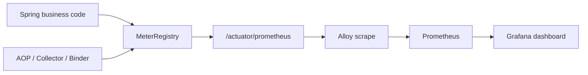
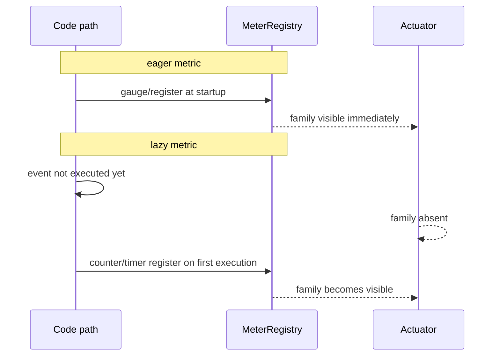

# Prometheus Endpoint 노출 감사

## 배경과 목적

이 문서는 `app-api`가 정의한 메트릭이 실제로 `/actuator/prometheus`에 노출되는지 점검한 감사 결과다.
검증 기준일은 `2026-03-11`이며, 로컬 `local` 프로필에서 실행 중인 애플리케이션을 대상으로 확인했다.

감사 범위는 아래 두 축이다.

- 코드에서 `MeterRegistry`에 메트릭을 등록하는 지점
- 현재 JVM이 `/actuator/prometheus`에서 실제로 노출한 family

이 문서에서 쓰는 분류 기준은 다음과 같다.

- `정상 노출`: 현재 `/actuator/prometheus`에서 family가 확인됨
- `조건부`: 코드 정의는 있으나 feature flag 또는 bean 조건 때문에 현재 JVM에 미등록
- `이벤트 미발생`: 코드 정의는 있으나 현재 검증 중 해당 경로를 밟지 않아 family가 아직 생성되지 않음
- `비대상`: AOP/컴포넌트는 있으나 Prometheus 메트릭이 아니라 로그 또는 trace 대상
- `버그 후보`: 활성 조건과 실행 경로를 만족했는데도 family가 끝내 생성되지 않는 경우

현재 감사 결과상 `버그 후보`는 없다.

## 모듈 구조

| 영역 | 대표 클래스 | 책임 |
|---|---|---|
| API/트랜잭션 AOP | `global.aop.ApiMetricsAspect`, `global.aop.TransactionMetricsAspect` | HTTP/API 및 `@Transactional` 메서드 메트릭 기록 |
| 비동기/아웃박스 AOP | `global.aop.AsyncPipelineMetricsAspect`, `global.aop.MessageQueueMetricsAspect` | async pipeline, outbox snapshot, MQ 처리 메트릭 기록 |
| 캐시/실행기 바인더 | `global.metrics.LocalCacheMetricsBinder`, `global.metrics.ThreadPoolExecutorMetricsSupport` | 캐시 상태와 executor 상태를 eager 등록 |
| 알림/분석 outbox collector | `domain.notification.outbox.NotificationOutboxMetricsCollector`, `domain.analytics.*OutboxMetricsCollector` | outbox gauge와 snapshot error/counter 기록 |
| 웹소켓/알림/레이트리밋 collector | `domain.chat.ws.WebSocketMetricsCollector`, `domain.notification.event.ChatNotificationMetricsCollector`, `global.ratelimit.RedisRateLimiter` | 특정 기능 이벤트 기반 메트릭 기록 |
| Actuator endpoint | Spring Boot Actuator + Prometheus registry | Micrometer meter를 `/actuator/prometheus` 텍스트 포맷으로 노출 |

## 런타임 흐름

`/actuator/prometheus`에 보인다는 말은 "코드에 문자열 상수가 있다"가 아니라 "현재 JVM에 meter가 실제 등록되었다"는 뜻이다.

Micrometer 등록 타이밍은 크게 두 가지다.

- `eager 등록`: `@PostConstruct`, binder 초기화 시점에 바로 등록. 예: cache gauge, outbox gauge, websocket active gauge
- `lazy 등록`: `counter()`, `Timer.builder().register()`가 실제 실행될 때 처음 등록. 예: chat push 카운터, websocket disconnect 카운터

로컬 검증은 아래 순서로 수행했다.

1. `build.gradle`과 `application*.yml`에서 Actuator/Prometheus 노출 여부 확인
2. `/actuator/prometheus`에서 현재 family 목록 추출
3. analytics ingest에 유효 요청을 보내 client ingest 경로 실제 실행 확인
4. 코드 정의 위치와 endpoint 결과를 비교해 분류

## 설정 계약

현재 `/actuator/prometheus` 노출을 성립시키는 핵심 계약은 아래와 같다.

| 항목 | 현재 상태 | 근거 |
|---|---|---|
| Actuator 의존성 | 활성 | `app-api/build.gradle`의 `spring-boot-starter-actuator` |
| Prometheus registry | 활성 | `app-api/build.gradle`의 `micrometer-registry-prometheus` |
| Prometheus endpoint 노출 | 활성 | `application.yml`, `application.prod.yml`, `application.stg.yml`의 `include: health,info,prometheus,caches` |
| MQ 기반 consumer 경로 | 비활성 | `application.yml`의 `MQ_ENABLED=false` |
| PostHog dispatch 경로 | 비활성 | `application.yml`의 `ANALYTICS_POSTHOG_ENABLED=false` |

이 계약 때문에 `Spring -> /actuator/prometheus 노출 -> Alloy scrape` 구조는 이미 성립해 있다.
따라서 현재 분류의 핵심은 "Actuator가 못 내보낸다"보다 "meter가 JVM에 등록되었는가"다.

## 노출 감사 결과

### 요약

| 분류 | 판정 |
|---|---|
| 정상 노출 | API, transaction, cache, executor, notification outbox, analytics outbox gauge, outbox snapshot, websocket active |
| 조건부 | MQ, notification consumer, analytics replay, analytics dispatch batch |
| 이벤트 미발생 | chat notification, websocket event counters, mail/rate-limit/redis error, snapshot error |
| 비대상 | logging AOP, tracing AOP |
| 버그 후보 | 없음 |

### 정상 노출

| 코드 정의 metric | 현재 endpoint family | 정의 위치 | 현재 상태 | 근거 |
|---|---|---|---|---|
| `tasteam.api.request.duration`, `tasteam.api.request.total` | `tasteam_api_request_duration_seconds`, `tasteam_api_request_total` | `global.aop.ApiMetricsAspect` | 정상 노출 | 현재 endpoint에서 family 확인 |
| `tasteam.transaction.duration`, `tasteam.transaction.query.count`, `tasteam.transaction.total` | `tasteam_transaction_duration_seconds`, `tasteam_transaction_query_count`, `tasteam_transaction_total` | `global.aop.TransactionMetricsAspect` | 정상 노출 | 현재 endpoint에서 family 확인 |
| `tasteam.cache.ttl.seconds`, `tasteam.cache.size`, `tasteam.cache.capacity`, `tasteam.cache.utilization.ratio`, `tasteam.cache.requests`, `tasteam.cache.evictions` | `tasteam_cache_ttl_seconds`, `tasteam_cache_size`, `tasteam_cache_capacity`, `tasteam_cache_utilization_ratio`, `tasteam_cache_requests_total`, `tasteam_cache_evictions_total` | `global.metrics.LocalCacheMetricsBinder` | 정상 노출 | binder가 startup에 gauge/function counter 등록 |
| executor 계열 | `executor_active_threads`, `executor_completed_tasks_total`, `executor_idle_seconds_*`, `executor_pool_*`, `executor_queue_remaining_tasks`, `executor_queue_utilization`, `executor_queued_tasks`, `executor_rejected_tasks_total`, `executor_seconds_*` | `global.metrics.ThreadPoolExecutorMetricsSupport` | 정상 노출 | executor family 다수 확인 |
| `outbox.<name>.snapshot`, `outbox.<name>.snapshot.latency` | `outbox_notification_snapshot_total`, `outbox_notification_snapshot_latency_seconds`, `outbox_analytics_source_snapshot_total`, `outbox_analytics_source_snapshot_latency_seconds`, `outbox_analytics_dispatch_snapshot_total`, `outbox_analytics_dispatch_snapshot_latency_seconds` | `global.aop.AsyncPipelineMetricsAspect` + `@ObservedOutbox` 적용 메서드 | 정상 노출 | `notification`, `analytics_source`, `analytics_dispatch` 3종 확인 |
| `notification.outbox.*` | `notification_outbox_pending`, `notification_outbox_published`, `notification_outbox_failed`, `notification_outbox_retrying` | `domain.notification.outbox.NotificationOutboxMetricsCollector` | 정상 노출 | `@PostConstruct` gauge 등록 |
| `analytics.user-activity.source.outbox.*` gauge | `analytics_user_activity_source_outbox_pending`, `analytics_user_activity_source_outbox_failed`, `analytics_user_activity_source_outbox_published`, `analytics_user_activity_source_outbox_retrying` | `domain.analytics.resilience.UserActivitySourceOutboxMetricsCollector` | 정상 노출 | `@PostConstruct` gauge 등록 |
| `analytics.user-activity.dispatch.outbox.*` gauge | `analytics_user_activity_dispatch_outbox_pending`, `analytics_user_activity_dispatch_outbox_failed` | `domain.analytics.dispatch.UserActivityDispatchOutboxMetricsCollector` | 정상 노출 | 현재 로컬에서 visible family 확인 |
| `ws.connections.active` | `ws_connections_active` | `domain.chat.ws.WebSocketMetricsCollector` | 정상 노출 | startup 시 gauge 등록 |

### 조건부

| 코드 정의 metric | 기대 Prometheus family | 정의 위치 | 현재 분류 | 비노출 이유 |
|---|---|---|---|---|
| `async.pipeline.notification.outbox_scan.process`, `async.pipeline.notification.outbox_scan.latency` | `async_pipeline_notification_outbox_scan_process`, `async_pipeline_notification_outbox_scan_latency_seconds` | `domain.notification.outbox.NotificationOutboxScanner` | 조건부 | `MQ_ENABLED=true`일 때만 bean 생성 |
| `notification.consumer.process`, `notification.consumer.process.latency`, `notification.consumer.dlq` | `notification_consumer_process`, `notification_consumer_process_latency_seconds`, `notification_consumer_dlq` | `domain.notification.consumer.NotificationMessageProcessor`, `NotificationDlqPublisher`, `global.aop.MessageQueueMetricsAspect` | 조건부 | notification MQ consumer가 현재 비활성 |
| `mq.publish.count`, `mq.consume.count`, `mq.consume.latency`, `mq.end_to_end.latency` | `mq_publish_count`, `mq_consume_count`, `mq_consume_latency_seconds`, `mq_end_to_end_latency_seconds` | `global.aop.MessageQueueMetricsAspect` | 조건부 | MQ trace service 호출 경로가 비활성 |
| `async.pipeline.analytics.replay_batch.process`, `async.pipeline.analytics.replay_batch.latency`, `analytics.user-activity.replay.*` | `async_pipeline_analytics_replay_batch_process`, `async_pipeline_analytics_replay_batch_latency_seconds`, `analytics_user_activity_replay_*` | `domain.analytics.resilience.UserActivityReplayRunner`, `UserActivityReplayMetricsCollector`, `infra.messagequeue.UserActivityReplayScheduler` | 조건부 | `MQ_ENABLED=true`일 때만 재처리 러너/스케줄러 활성 |
| `async.pipeline.analytics.dispatch_batch.process`, `async.pipeline.analytics.dispatch_batch.latency`, `analytics.user-activity.dispatch.enqueue`, `analytics.user-activity.dispatch.execute`, `analytics.user-activity.dispatch.retry`, `analytics.user-activity.dispatch.circuit` | `async_pipeline_analytics_dispatch_batch_process`, `async_pipeline_analytics_dispatch_batch_latency_seconds`, `analytics_user_activity_dispatch_enqueue`, `analytics_user_activity_dispatch_execute`, `analytics_user_activity_dispatch_retry`, `analytics_user_activity_dispatch_circuit` | `infra.analytics.UserActivityDispatchScheduler`, `domain.analytics.dispatch.UserActivityDispatchOutboxMetricsCollector`, `infra.analytics.posthog.UserActivityDispatchOutboxEnqueueHook` | 조건부 | `ANALYTICS_POSTHOG_ENABLED=true`일 때만 dispatch 경로 활성 |

### 이벤트 미발생

| 코드 정의 metric | 기대 Prometheus family | 정의 위치 | 현재 분류 | 설명 |
|---|---|---|---|---|
| `analytics.user-activity.outbox.enqueue`, `analytics.user-activity.outbox.publish`, `analytics.user-activity.outbox.retry` | `analytics_user_activity_outbox_enqueue`, `analytics_user_activity_outbox_publish`, `analytics_user_activity_outbox_retry` | `domain.analytics.resilience.UserActivitySourceOutboxService`, `UserActivitySourceOutboxMetricsCollector` | 이벤트 미발생 | 이 family는 `client ingest`가 아니라 `ReviewCreatedEvent`, `GroupMemberJoinedEvent` 같은 도메인 이벤트가 `ActivityDomainEventListener -> ActivityEventOrchestrator -> UserActivitySourceOutboxSink` 경로를 탈 때 생성된다. 이번 검증에서는 client ingest 성공만 확인했으므로 family 미생성은 정상이다. |
| `notification.chat.created.total`, `notification.chat.push.skipped.online.total`, `notification.chat.push.sent.total` | `notification_chat_created_total`, `notification_chat_push_skipped_online_total`, `notification_chat_push_sent_total` | `domain.notification.event.ChatNotificationMetricsCollector` | 이벤트 미발생 | 채팅 알림 생성/발송 흐름을 이번 검증에서 실행하지 않음 |
| `ws.connect.total`, `ws.disconnect.total`, `ws.reconnect.total`, `ws.disconnect.by.reason.total`, `ws.heartbeat.timeout.total`, `ws.session.lifetime` | `ws_connect_total`, `ws_disconnect_total`, `ws_reconnect_total`, `ws_disconnect_by_reason_total`, `ws_heartbeat_timeout_total`, `ws_session_lifetime_seconds` | `domain.chat.ws.WebSocketMetricsCollector` | 이벤트 미발생 | active gauge는 startup 등록이지만 event counter/timer는 실제 websocket 연결 이벤트 후 등록 |
| `mail_send_request_count`, `rate_limited_count` | `mail_send_request_count`, `rate_limited_count` | `domain.group.service.GroupAuthService` | 이벤트 미발생 | 메일 발송 또는 rate limit 초과 경로를 밟지 않음 |
| `redis_errors_count` | `redis_errors_count` | `global.ratelimit.RedisRateLimiter` | 이벤트 미발생 | Redis 오류를 의도적으로 발생시키지 않음 |
| `notification.outbox.snapshot.error`, `analytics.user-activity.source.outbox.snapshot.error`, `analytics.user-activity.dispatch.outbox.snapshot.error` | `notification_outbox_snapshot_error_total`, `analytics_user_activity_source_outbox_snapshot_error_total`, `analytics_user_activity_dispatch_outbox_snapshot_error_total` | 각 outbox metrics collector | 이벤트 미발생 | 스냅샷 수집 실패가 발생해야 생성되는 error counter |

### 비대상

아래 AOP는 `/actuator/prometheus` 대상이 아니다.

| 클래스 | 분류 | 이유 |
|---|---|---|
| `global.aop.ApiLoggingAspect` | 비대상 | 로그 목적 |
| `global.aop.ServicePerformanceAspect` | 비대상 | 로그 목적 |
| `global.aop.ExceptionLoggingAspect` | 비대상 | 로그 목적 |
| `global.aop.TransactionalQueryLoggingAspect` | 비대상 | 로그 목적 |
| `global.aop.AiAnalysisPerformanceAspect` | 비대상 | 로그 목적 |
| `global.aop.WebhookExceptionAspect` | 비대상 | 로그/웹훅 목적 |
| `global.aop.TransactionTracingAspect` | 비대상 | `ObservationRegistry` 기반 tracing 목적 |

### 버그 후보

현재 기준 버그 후보는 없다.

이전에는 `analytics_user_activity_outbox_*`가 "코드에는 있는데 endpoint에 안 보인다"는 점 때문에 의심 대상이었지만, 실제로는 검증 경로가 달랐다.
유효한 `POST /api/v1/analytics/events` 요청은 성공했으나 이 경로는 `UserActivityStoredHook` 기반 dispatch outbox 흐름과 이벤트 저장만 수행하며, source outbox counter를 올리는 경로와는 다르다.

## 확장 및 이행 전략

새 메트릭을 추가할 때는 아래 원칙을 따른다.

1. 대시보드에서 family 존재 자체가 중요하면 startup 시점에 meter를 선등록한다.
2. 이벤트 기반 counter/timer만 두는 경우, "처음 이벤트 전에는 family가 안 보인다"는 점을 문서와 대시보드 쿼리에 반영한다.
3. feature flag에 묶인 메트릭은 dashboard panel에도 flag 의존성을 같이 명시한다.
4. cloud 쪽은 Alloy가 `/actuator/prometheus`를 scrape 하므로, backend는 endpoint 노출과 meter 등록만 책임진다.

현재 코드에서 선등록이 적합한 후보는 "패널이 항상 보여야 하는데 lazy 등록이라 빈 화면이 될 수 있는 counter/timer" 계열이다.
필요하면 `MeterRegistry.counter(...)`를 startup에 미리 한번 등록하거나, zero-state gauge로 전환하는 방식이 가능하다.

## 리뷰 체크리스트

- `build.gradle`에 Actuator + Prometheus registry 의존성이 있는가
- `application*.yml`에 `prometheus` endpoint exposure가 포함되는가
- 메트릭 정의 코드가 `MeterRegistry`를 실제 받는가
- lazy metric이면 테스트/더미 요청으로 최초 등록 경로를 실제 실행했는가
- 조건부 metric이면 현재 profile/환경변수가 bean 생성을 막고 있지 않은가
- Grafana panel이 zero/fallback 없이 family 부재를 그대로 `No data`로 해석하지 않는가

## 검증 메모

이번 감사에서 사용한 핵심 검증은 아래와 같다.

- `curl http://127.0.0.1:8080/actuator/prometheus`
- analytics ingest 유효 요청 전송 후 endpoint 재조회
- `rg` 기반 코드 정의 위치 재확인

이 문서는 로컬 감사 결과 문서이며, staging/prod는 동일 코드라도 feature flag와 실제 트래픽 유무에 따라 노출 family 구성이 달라질 수 있다.
