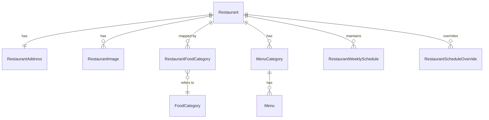

## 문서 메타 정보

| 항목 | 내용 |
| --- | --- |
| 문서 제목 | 음식점(Restaurant) 도메인 테크 스펙 |
| 문서 목적 | 음식점 도메인의 요구사항·데이터 모델·위치 기반 조회 규약·AI 연계·배치 정책을 정의하여 구현/리뷰/테스트의 기준 문서로 활용한다. |
| 작성 및 관리 | Backend Team |
| 최초 작성일 | 2026.01.16 |
| 최종 수정일 | 2026.01.28 |
| 문서 버전 | **v1.2** |

---

# [1] 배경 (Background)

### [1-1] 프로젝트 목표 (Objective)

### 기능적 목표 (Functional Objectives)

- **사용자 위치 기준 반경 내 음식점 탐색 제공**
    - 사용자의 현재 위치(latitude, longitude)를 기준으로 지정된 반경 내 음식점을 조회한다.
    - 반경 검색은 **거리 오름차순 정렬**을 기본으로 하며, 필요 시 음식 카테고리 필터를 함께 적용할 수 있어야 한다.
    - 위치 기반 조회 결과는 좌표가 정상적으로 확보된 음식점만을 대상으로 한다.
- **음식점 상세 화면을 위한 통합 조회 흐름 제공**
    - 음식점 상세 화면에서는 다음 정보를 **단일 조회 흐름**으로 제공한다.
        - 음식점 기본 정보
        - 대표 이미지 및 카테고리
        - 리뷰 요약 정보
        - AI 분석 결과
    - 각 데이터는 조회 시점 기준의 **스냅샷 데이터**로 결합되며, 개별 도메인의 상태 변경이 상세 조회 트랜잭션에 영향을 주지 않도록 한다.
- **운영자 입력을 전제로 한 음식점 데이터 관리**
    - 음식점 데이터는 일반 사용자가 아닌 **운영자(내부 사용자)** 입력을 전제로 관리한다.
    - 단건 등록뿐 아니라 **엑셀 파일 기반의 대량 등록**을 통해 음식점 데이터를 일괄 수집할 수 있어야 한다.
    - 대량 등록 과정에서 좌표, AI 분석과 같은 부가 정보는 동기 입력 대상이 아니다.
- **주소 기반 음식점 데이터의 좌표 자동 조회**
    - 음식점 데이터 입력 시 **위도/경도 좌표는 입력받지 않는다.**
    - 주소 정보를 기반으로 외부 Geocoding API를 통해 **좌표를 조회**한다.
    - 좌표 조회가 불가능한 음식점은 등록할 수 없다.
- **음식점 생성 이후 AI 분석 및 추천 파이프라인 연계**
    - 음식점 생성 이후, 음식점 강점 분석을 위한 AI 분석 요청을 수행한다.
    - AI 분석은 **비동기 이벤트 기반**으로 처리되며, 실패 또는 지연이 음식점 생성·조회 API에 영향을 주지 않도록 한다.
    - 주기적인 배치 작업을 통해 AI 추천 음식점 데이터를 생성하여 조회 시 계산 부담을 최소화한다.

### 비기능적 목표 (Non-Functional Objectives)

- **KR-1 (성능)**
    - 위치 기반 음식점 목록 조회 API `GET /api/v1/restaurants`의 p95 응답 시간은 운영 환경 기준 TBD ms 이하를 유지한다.
- **KR-2 (안정성)**
    - 음식점 목록 및 상세 조회 API의 5xx 에러 비율을 TBD% 이하로 유지한다.
    - 외부 지도 API, AI 서버 장애가 **핵심 조회 경로에 전파되지 않도록 격리**한다.
- **KR-3 (운영 가시성)**
    - 음식점 조회 API의 4xx 에러 분포(400/403/404)를 지속적으로 관측한다.
    - 좌표 보정 실패, AI 분석 실패 건수는 **별도 메트릭**으로 수집하여 운영자가 즉시 인지 가능하도록 한다.
    - 비동기 실패 건에 대해서는 도메인 식별자 기반 로그를 남겨 원인 분석 및 재처리가 가능하도록 한다.
- **KR-4 (확장성)**
    - 음식점 데이터가 대량으로 증가하더라도 위치 기반 반경 검색은 **PostGIS 공간 인덱스를 전제로 선형 확장 가능**하도록 설계한다.
    - 엑셀 기반 대량 입력, 좌표 보정, AI 분석, 추천 배치는 **조회 API와 독립적으로 확장 가능**해야 한다.

> ※ 성능 및 안정성 임계값(TBD)은 운영 환경과 부하 테스트 결과를 기준으로 확정한다.
>

---

### [1-2] 문제 정의 (Problem)

- **위치 기반 조회 정책의 불명확성**
    - 기준 좌표, 거리 단위, 반경 포함 규칙, 정렬 기준이 명시되지 않으면
      동일한 요청이라도 구현자·쿼리별로 서로 다른 결과가 반환될 수 있다.
- **운영자 입력 환경에서의 데이터 수집 한계**
    - 음식점 데이터는 초기 단계에서 **수십~수백 건 단위로 일괄 입력**되는 경우가 많다.
      단건 API 호출 중심의 입력 방식은 운영 효율이 낮고 오류 가능성이 높다.
- **주소 기반 데이터의 좌표 품질 문제**
    - 운영자가 입력하는 음식점 데이터는 주소 문자열 중심이며,
      좌표를 수동으로 입력하거나 보정하는 것은 현실적으로 어렵다.
    - 좌표 품질이 보장되지 않으면 반경 검색 결과의 정확성과 일관성이 크게 저하된다.
- **도메인 간 책임 혼재 위험**
    - 좌표 조회, 위치 계산, AI 분석, 추천 로직이 음식점 도메인 내부에 무분별하게 섞일 경우
      도메인 책임이 흐려지고 변경 비용이 급격히 증가한다.

---

### [1-3] 가설 (Hypothesis)

- 음식점 데이터를 운영자 입력(단건·대량)을 전제로 수집하고,
  주소 기반 데이터에 대해 **좌표 보정을 외부 Geocoding API를 호출하는 비동기 파이프라인으로 분리**하면
  운영 효율성과 좌표 품질을 동시에 확보할 수 있다.
- 위치 기반 조회에 필요한 기준 좌표, 거리 단위, 반경 포함 규칙, 정렬 기준을
  **음식점 도메인 차원의 조회 규약으로 명시**하면,
  구현자·쿼리·도메인별 해석 차이로 인한 결과 불일치를 방지할 수 있다.
- 음식점 생성 이후의 좌표 보정, AI 분석, 추천 데이터 생성 작업을
  **핵심 트랜잭션과 분리된 비동기/배치 처리로 구성**하면,
  외부 시스템 장애나 지연이 사용자 핵심 조회 경로에 전파되지 않도록 할 수 있다.
- 음식점 도메인의 책임을 “식별·조회·상태 관리”로 한정하고,
  지도 API·AI 분석·추천 알고리즘을 **도메인 외부 책임으로 명확히 분리**하면,
  기능 확장 및 정책 변경 시 변경 영향 범위를 국소화할 수 있다.

---

## [2] 목표가 아닌 것 (Non-goals)

- 음식점 사진 업로드/검증(S3, presigned URL)
- 사용자 주도 음식점 생성 및 수정
- 외부 지도 API 연동(카카오/네이버 지도)
- 지도 UI 및 지도 상 상호작용
- 대량 데이터 입력 UI 및 포맷 검증 상세
- AI 분석 및 추천 알고리즘의 내부 로직
- 캐시 전략의 세부 구현

---

## [3] 설계 및 기술 자료 (Architecture and Technical Documentation)

### [3-1] 음식점 도메인 모델 개요

도메인 책임 범위

- 음식점 기본 정보(이름, 위치, 주소)의 식별 및 조회
- 사용자 위치를 기준으로 한 **반경 내 음식점 검색**
- 음식점–음식 카테고리 관계 관리
- 음식점 대표 이미지 및 정렬 순서 관리

조회 특성

- 음식점 도메인은 홈 화면, 검색 결과, 상세 페이지 진입 시 반복 호출되는 **Read-heavy 도메인**이다.
- 조회 성능과 결과 일관성이 핵심 품질 속성이다.

---

### [3-2] 도메인 및 외부 모듈 간 의존성

**도메인 간 의존성**

- Review 도메인은 Restaurant, Group, SubGroup, Member를 읽기 전용으로 참조한다.
- Review 도메인은 다른 도메인의 상태를 변경하지 않는다.
- Review는 반드시 Restaurant에 종속된다.
- Group/SubGroup 도메인은 리뷰의 맥락 제공자이며, 리뷰 데이터의 소유자는 아니다.
- 리뷰는 특정 Group 맥락에서 작성되며, Group은 항상 필수이다.
- 리뷰는 선택적으로 SubGroup 맥락을 가질 수 있다.


**외부 모듈 간 의존성**

- 음식점 도메인은 외부 시스템과의 결합을 최소화하기 위해 이벤트 기반 비동기 연계를 기본 원칙으로 한다.


---

### [3-2] 위치 기반 조회 모델

### 좌표 및 타입 규약

- 좌표계: **WGS84 (SRID 4326)**
- 저장 타입: `geometry(Point, 4326)`
- 기준 좌표: 사용자 현재 위치 (`latitude`, `longitude`)
- 거리 단위: **meter**
- 거리 계산 책임: **DB(PostGIS)**

> ⚠️ geometry 타입 사용으로 인해,
>
>
> **거리 계산 및 반경 필터링 시 반드시 `::geography` 캐스팅을 사용한다.**
>

```sql
ST_Distance(
  r.location::geography,
  :user_point::geography
)
```

---

### [3-3] 위치 기반 조회 정책

### 반경 제한

- 기본 반경: **3,000m**
- 최대 반경: **20,000m**
- 반경 초과 요청 시: `INVALID_REQUEST (400)`

---

### 좌표 요청 규칙

- 위치 기반 조회 API는 **HTTP GET**을 사용한다.
- 사용자 좌표는 반드시 **Query Parameter**로 전달한다.
- Request Body를 통한 좌표 전달은 허용하지 않는다.

```
GET /api/v1/restaurants?latitude=37.395&longitude=127.11&radiusMeter=3000
```

### 유효성 규칙

- `latitude`, `longitude`는 **항상 함께 전달되어야 한다**
- 하나만 전달된 경우: `INVALID_LOCATION (400)`
- 범위:
    - `-90.0 ≤ latitude ≤ 90.0`
    - `-180.0 ≤ longitude ≤ 180.0`

---

### [3-3-1] 영업 시간(정기/예외) 설계

음식점의 영업 시간은 “요일 단위의 정기 정책(weekly)”과 “특정 날짜의 예외 정책(override)”으로 분리한다.

- 정기 영업 시간: `restaurant_weekly_schedules`
  - `day_of_week(1=월 ~ 7=일)` 기준으로 오픈/마감 및 휴무 여부 관리
  - `effective_from/effective_to`로 정책 유효 기간 관리(시즌별 시간표 교체 대응)
- 예외 영업 시간: `restaurant_schedule_overrides`
  - 특정 날짜(`date`)에 한해 정기 정책을 덮어쓴다(휴무, 단축 영업, 임시 연장 등)

#### 우선순위 규칙(중요)

1) 동일 날짜에 override가 존재하면 **override가 우선**이다.  
2) override가 없으면, 해당 날짜의 요일에 대해 weekly 스케줄을 선택한다.  
3) weekly 스케줄이 여러 건 매칭되면(기간 겹침 등) 아래 tie-breaker로 1건을 선택한다.
   - `effective_from`이 더 최신인 레코드 우선(둘 다 NULL이면 동일)
4) weekly 스케줄이 없으면 응답에서는 `source=NONE`으로 내려 “정보 없음”으로 표시한다.

#### 응답에서 “주간 영업 시간”을 보여주는 방식

UI/클라이언트는 보통 “이번 주/다가오는 7일” 형태로 표시한다.  
따라서 상세 API에서는 **오늘(서버 기준, Asia/Seoul)부터 7일치**를 계산해 내려준다.

- 응답 필드명(권장): `businessHoursWeek`
- 길이: 7 (오늘 포함 7일)
- 각 원소는 “날짜 기반”으로 제공(요일만 제공하면 override 표시가 어려움)

`businessHoursWeek` 아이템(권장)

- `dayOfWeek`: `MON|TUE|WED|THU|FRI|SAT|SUN` (클라이언트에서 요일 텍스트/표시를 위해 반드시 포함)
- `isClosed`: boolean
- `openTime`: `HH:mm` | null
- `closeTime`: `HH:mm` | null
- `source`: `OVERRIDE|WEEKLY|NONE` (필요 시)
- `reason`: string | null (override의 휴무/변경 사유, 필요한 경우만)
- `date`: `YYYY-MM-DD` (필요한 경우만, 부가 정보)
- `isClosed`: boolean
- `openTime`: `HH:mm` | null
- `closeTime`: `HH:mm` | null
- `source`: `OVERRIDE|WEEKLY|NONE`
- `reason`: string | null (override의 휴무/변경 사유)

#### 계산 로직(요약)

1) `restaurantId`로 음식점 존재 확인(`deleted_at is null`)
2) 기준 날짜 `today`를 Asia/Seoul로 계산
3) `[today .. today+6]` 각각에 대해
   - override 조회: `restaurant_schedule_overrides(restaurant_id, date)`
     - 있으면 그 값을 사용(`source=OVERRIDE`)
   - 없으면 weekly 조회: `restaurant_weekly_schedules`
     - `restaurant_id`, `day_of_week`, `effective_from/to` 조건으로 1건 선택(`source=WEEKLY`)
   - 둘 다 없으면 `source=NONE`(영업시간 미정)

#### 조회 쿼리(권장, 개념)

1) overrides는 범위로 한 번에 조회
2) weekly는 요일 7개에 대해 “현재 유효한 정책”을 가져오도록 조회(또는 애플리케이션에서 필터)

> NOTE: `updated_at`은 DB에서 자동 갱신되지 않을 수 있으므로, 스케줄 변경 시 애플리케이션에서 명시적으로 갱신한다(또는 DB 트리거 도입).

---

### [3-3-2] 메뉴(카테고리/메뉴) 설계

음식점 메뉴는 “카테고리(메인/음료 등) → 메뉴 항목”의 2단 구조로 관리한다.

- 메뉴 카테고리: `menu_categories`
  - 정렬: `display_order asc`
- 메뉴 항목: `menus`
  - 정렬: `display_order asc`, tie-breaker `id asc`
  - 추천 메뉴: `is_recommended=true` (배지/상단 노출에 활용 가능)
  - 소속 음식점: `menus.category_id -> menu_categories.restaurant_id`로 유도(정합성 우선)

#### “음식점 메뉴 디스플레이” 규칙(권장)

1) 카테고리 단위로 섹션을 구성한다. (예: “메인”, “음료”)
2) 각 카테고리 내부에서 메뉴는 `display_order asc`로 정렬한다.
3) `is_recommended=true`는 “추천” 배지로 표시한다.
   - (옵션) 추천 메뉴는 카테고리 상단에 먼저 노출하고, 그 다음 일반 메뉴를 노출한다.
4) `image_url`이 존재하면 썸네일을 노출한다(없으면 placeholder).


### 음식 카테고리 필터

- 음식 카테고리는 **`food_category` 기준 데이터(엔티티)**로 관리한다.
- 음식점은 `restaurant_food_category` 매핑을 통해 카테고리를 가진다.
- 필터는 `foodCategoryIds`(복수)로 전달하며 OR 조건으로 동작한다.

예시

```
GET /api/v1/restaurants?latitude=37.395&longitude=127.11&radiusMeter=3000&foodCategoryIds=1,3,9
```

- 요청 시 존재하지 않는 `foodCategoryId`가 포함되면:
    - `INVALID_REQUEST (400)` (권장)

---

### 정렬 기준

1. 거리 오름차순
2. 음식점 이름 오름차순

---

### 페이징 정책

❌ 기존 문구

> 생성일 기준 cursor 방식 적용
>

✅ 수정된 정책

- **정렬 기준과 동일한 키를 기반으로 cursor를 구성한다.**
- cursor는 다음 정렬 키를 포함한다.

```
(distance, restaurantName, restaurantId)
```

- cursor는 Base64 인코딩된 opaque 값으로 전달된다.
- 다음 페이지 조건은 **정렬 기준과 동일한 비교 규칙**을 따른다.

> ※ 단순 created_at cursor는 정렬 기준과 불일치하므로 사용하지 않는다.
>

---

### [3-4] AI 연계 설계

음식점 강점 AI 분석

- 트리거 시점
    - **음식점 생성 트랜잭션 커밋 이후**
- 호출 방식
    - **비동기 이벤트 기반 호출**
- 트리거 이벤트
    - `RestaurantCreatedEvent(restaurantId)`
- AI 서버 호출 실패 시
    - AI 분석 실패는 음식점 생성 성공 여부에 영향을 주지 않는다
    - 성공/실패 건수와 지연시간 메트릭을 남긴다
    - 실패 대상 ID와 작업명, 실패 이유를 로그로 남긴다

---

### [3-5] AI 추천 음식점 배치 설계

- 실행 주기
    - 기본: **1일 1회**
- 대상 데이터
    - 삭제되지 않은 음식점
- 입력 데이터
    - 음식점 위치
    - 카테고리
    - AI 분석 결과
    - 리뷰 요약 정보
- 배치 실패 시
    - 이전 성공 결과를 유지
- 배치 결과는 create 방식으로 갱신

---

### [3-6] 데이터베이스 스키마 (ERD)



---

### [3-7] 테이블 정의서

### [3-7-1] **restaurant**

테이블 정의

- [https://github.com/100-hours-a-week/3-team-tasteam-wiki/wiki/[ERD]-테이블-정의서#restaurant](https://github.com/100-hours-a-week/3-team-tasteam-wiki/wiki/%5BERD%5D-%ED%85%8C%EC%9D%B4%EB%B8%94-%EC%A0%95%EC%9D%98%EC%84%9C#restaurant)

역할

- 음식점 도메인의 **마스터 테이블**
- 모든 음식점 조회·위치 기반 탐색의 **기준 엔티티**

핵심 구현 전제

- 모든 사용자 대상 조회는 `restaurant` 테이블을 기준으로 한다.
- Review 등 다른 도메인은 Restaurant를 **읽기 전용으로만 참조**한다.
- 사용자 조회 쿼리에는 `deleted_at IS NULL` 조건이 **필수**다.

삭제 정책

- `deleted_at` 기반 **Soft Delete**
- 삭제된 음식점은 사용자에게 노출되지 않는다.
- 내부 분석용 조회는 별도 경로로 분리한다.

위치 기반 조회 규칙

```sql
SELECT
  r.id,
  r.name,
  r.location,
  ST_Distance(
    r.location::geography,
    :user_point::geography
  )AS distance
FROM restaurant r
WHERE r.deleted_at IS NULL
AND ST_DWithin(
    r.location::geography,
    :user_point::geography,
    :radiusMeter
  )
ORDER BY r.location <-> :user_point
LIMIT :size;
```

1. `ST_DWithin` → **반경 필터링**
2. `<->` → **KNN 정렬**
3. `ST_Distance` → **표시 목적**
4. 거리 계산은 **LIMIT 이후 결과 집합에 대해서만 수행**

인덱스 사용 규칙

- 조회 성능을 위해 PostGIS **Partial GIST Index 사용 필수**이다.

    ```sql
    CREATE INDEX idx_restaurant_location_active
    ON restaurant
    USING GIST (location)
    WHERE deleted_at IS NULL;
    ```


설계 근거

- PostGIS Point(4326) + Partial GIST Index로 데이터 증가 시에도 조회 성능 저하 최소화
- 주소 정보는 별도 테이블로 분리하여 확장성 확보

---

### [3-7-2] **restaurant_image**

테이블 정의

- [https://github.com/100-hours-a-week/3-team-tasteam-wiki/wiki/[ERD]-테이블-정의서#restaurant_image](https://github.com/100-hours-a-week/3-team-tasteam-wiki/wiki/%5BERD%5D-%ED%85%8C%EC%9D%B4%EB%B8%94-%EC%A0%95%EC%9D%98%EC%84%9C#restaurant_image)

역할

- 음식점의 **대표 이미지 및 보조 이미지 정보 관리 테이블**
- 음식점 상세 화면 및 목록 화면에서 사용되는 이미지 정렬 기준 제공

핵심 구현 전제

- 모든 이미지는 반드시 하나의 `restaurant`에 종속된다.
- 사용자 대상 조회 시 `deleted_at IS NULL` 조건은 **항상 포함**되어야 한다.
- 이미지 정렬 순서는 `sort_order ASC` 기준을 따른다.
- 이미지 데이터는 **조회 전용 리소스**로 취급하며, 직접 수정은 허용하지 않는다.

삭제 정책

- `deleted_at` 기반 **Soft Delete**
- 음식점 삭제 시 연관 이미지도 함께 Soft Delete 된다.
- 삭제된 이미지는 사용자에게 노출되지 않는다.

조회 규칙

- 음식점 상세 조회 시:
    - `restaurant_id` 기준으로 조회
    - `sort_order ASC` 정렬
- 목록/상세 화면 모두 동일한 정렬 규칙을 사용한다.

인덱스 사용 규칙

- 다음 Partial Index 사용을 전제로 조회 쿼리를 작성한다.
    - `(restaurant_id, sort_order ASC) WHERE deleted_at IS NULL`
- 이미지 정렬은 DB 정렬 결과를 그대로 사용하며,

  애플리케이션 레벨에서 재정렬하지 않는다.


설계 근거

- 대표 이미지 개수 확장 및 순서 변경 요구에 대비해 별도 테이블로 분리
- `sort_order` 기반 정렬로 UI 요구사항 변경에 유연하게 대응 가능

---

### [3-7-3] **restaurant_food_category**

테이블 정의

- [https://github.com/100-hours-a-week/3-team-tasteam-wiki/wiki/[ERD]-테이블-정의서#restaurant_food_category](https://github.com/100-hours-a-week/3-team-tasteam-wiki/wiki/%5BERD%5D-%ED%85%8C%EC%9D%B4%EB%B8%94-%EC%A0%95%EC%9D%98%EC%84%9C#restaurant_food_category)

역할

- 음식점과 음식 카테고리 간 **다대다(M:N) 관계를 표현하는 매핑 테이블**
- 음식점의 분류 기준을 명시적으로 관리

핵심 구현 전제

- 음식점은 하나 이상의 음식 카테고리를 가질 수 있다.
- 카테고리는 음식점의 **조회 필터링 기준**으로 사용된다.
- 이 테이블은 **순수 매핑 테이블**이며 도메인 로직을 포함하지 않는다.

삭제 정책

- `restaurant` 또는 `food_category` 물리 삭제 시 **연쇄 물리 삭제**
- 별도의 Soft Delete 정책은 적용하지 않는다.

조회 규칙

- 음식점 상세 조회 시:
    - `restaurant_id` 기준으로 카테고리 목록 조회
- 음식점 목록 조회 시:
    - `food_category_id` 기준으로 음식점 필터링

인덱스 사용 규칙

- 다음 인덱스를 전제로 조회 성능을 보장한다.
    - `INDEX (restaurant_id)`
    - `INDEX (food_category_id)`

설계 근거

- 음식점–카테고리 관계를 명확히 분리하여 확장성 확보
- 카테고리 기준 검색, 통계, 추천 로직 확장에 유리한 구조

---

### [3-7-4] **food_category**

테이블 정의

- [https://github.com/100-hours-a-week/3-team-tasteam-wiki/wiki/[ERD]-테이블-정의서#food_category](https://github.com/100-hours-a-week/3-team-tasteam-wiki/wiki/%5BERD%5D-%ED%85%8C%EC%9D%B4%EB%B8%94-%EC%A0%95%EC%9D%98%EC%84%9C#food_category)

역할

- 음식점 분류에 사용되는 **정적 기준 데이터(Master Data)** 관리
- 사용자 및 운영자에게 노출되는 음식 카테고리 정의

핵심 구현 전제

- 카테고리 데이터는 **운영자가 관리하는 기준 데이터**다.
- 사용자 생성/수정은 허용하지 않는다.
- 카테고리는 `food_category` 엔티티로 관리하며, 음식점과의 관계는 `restaurant_food_category` 매핑으로 표현한다.
- 조회/필터링/저장은 **ID 기반**으로 동작한다. (권장)
  - 사용자 응답에는 `id + name` 형태로 제공한다.
- 기준 데이터이므로 운영 환경에서는 값 변경을 최소화하고, 변경이 필요한 경우 별도 정책(비활성화/마이그레이션)을 둔다.

삭제 정책

- 물리 삭제 가능
- 단, 운영 환경에서는 삭제보다는 **사용 중지 정책**을 우선 고려한다.

조회 규칙

- 전체 음식 카테고리 목록 조회
- 음식점 생성/수정 시 선택지로 제공

설계 근거

- 음식 분류 기준을 독립 테이블로 관리하여 정책 변경에 유연
- 향후 카테고리 그룹화, 노출 순서, 다국어 확장 가능

---

### [3-7-5] **restaurant_address**

테이블 정의

- [https://github.com/100-hours-a-week/3-team-tasteam-wiki/wiki/[ERD]-테이블-정의서#restaurant_address](https://github.com/100-hours-a-week/3-team-tasteam-wiki/wiki/%5BERD%5D-%ED%85%8C%EC%9D%B4%EB%B8%94-%EC%A0%95%EC%9D%98%EC%84%9C#restaurant_address)

역할

- 음식점의 **행정구역 기반 주소 정보 관리**
- 지역 기반 검색, 집계, 통계 기능의 기준 데이터 제공

핵심 구현 전제

- 음식점당 주소는 **1개를 기본 전제**로 한다.
- 주소 정보는 위치 좌표(`restaurant.location`)와 **역할을 분리**한다.
- 사용자 조회에서는 주소 문자열을 그대로 노출한다.

삭제 정책

- 음식점 물리 삭제 시 **연쇄 물리 삭제**
- 음식점 Soft Delete 상태에서는 주소 데이터는 유지된다.

조회 규칙

- 음식점 상세 조회 시:
    - `restaurant_id` 기준 단건 조회
- 지역 기반 검색/집계 시:
    - `sido`, `sigungu` 컬럼 기준 필터링

인덱스 사용 규칙

- `INDEX (restaurant_id)` 사용
- 지역 기반 검색이 빈번해질 경우 추가 인덱스 확장 가능

설계 근거

- 주소 체계 변경(도로명/지번/상세 주소)에 대비해 분리 설계
- 행정구역 컬럼 분리로 지역 통계·필터링 성능 확보
- 향후 주소 이력 관리 테이블로 확장 가능

---

### [3-7-6] **menu_categories**

역할

- 음식점별 메뉴 카테고리(예: 메인/음료)를 관리한다.
- 카테고리 노출 순서(`display_order`)를 관리하여 UI 정렬 기준을 제공한다.

핵심 구현 전제

- 카테고리의 소속은 `restaurant_id`로 결정된다.
- 카테고리 정렬은 `display_order asc`, tie-breaker `id asc`를 따른다.
- `display_order`는 0 이상 정수(권장).

인덱스 사용 규칙

- `INDEX (restaurant_id, display_order)` 기반으로 조회한다.

---

### [3-7-7] **menus**

역할

- 음식점 메뉴 항목(이름/가격/설명/이미지/추천 여부)을 관리한다.

핵심 구현 전제

- 메뉴의 소속 음식점은 `menus.category_id -> menu_categories.restaurant_id`로 유도한다. (정합성 우선)
- 메뉴 정렬은 `display_order asc`, tie-breaker `id asc`를 따른다.
- `price`는 0 이상 정수(권장), `display_order`는 0 이상 정수(권장).

인덱스 사용 규칙

- `INDEX (category_id, display_order)` 기반으로 조회한다.

---

### [3-7-8] **restaurant_weekly_schedules**

역할

- 요일별 정기 영업 시간(오픈/마감/휴무)을 관리한다.
- `effective_from/effective_to`로 정책 유효 기간을 관리한다.

핵심 구현 전제

- `day_of_week`는 1~7(월~일) 범위를 사용한다.
- `is_closed=true`이면 `open_time/close_time`은 NULL(권장), `is_closed=false`이면 둘 다 NOT NULL + `open_time < close_time`(권장).
- `effective_from/effective_to`가 둘 다 존재하면 `effective_from <= effective_to`(권장).

인덱스 사용 규칙

- `INDEX (restaurant_id, day_of_week, effective_from, effective_to)` 기반으로 “현재 유효한 정책”을 조회한다.

---

### [3-7-9] **restaurant_schedule_overrides**

역할

- 특정 날짜 단위로 정기 영업 시간을 덮어쓰는 예외 정책(휴무/단축 영업)을 관리한다.

핵심 구현 전제

- 동일 음식점의 동일 날짜에는 예외 정책이 1건만 존재해야 한다. (권장: `UNIQUE (restaurant_id, date)`)
- `is_closed=true`이면 `open_time/close_time`은 NULL(권장), `is_closed=false`이면 둘 다 NOT NULL + `open_time < close_time`(권장).
- 예외 정책은 상세 응답의 `businessHoursWeek` 계산에서 최우선으로 적용한다.

인덱스 사용 규칙

- `UNIQUE (restaurant_id, date)` 기반으로 조회한다.

---

### [3-8] API 명세 (API Specifications)

### [3-8-1] 음식점 단건 조회 (GET /api/v1/restaurants/{restaurantId}?latitude=37.395&longitude=127.11)

- **권한**
    - PUBLIC
- **요청/응답 및 에러 코드**
    - [8. 음식점 단건 조회 (GET /api/v1/restaurants/{restaurantId})](https://github.com/100-hours-a-week/3-team-tasteam-wiki/wiki/%5BBE-%E2%80%90-API%5D-API-%EB%AA%85%EC%84%B8%EC%84%9C#api-8)
	- **처리 로직**
	    1. restaurantId로 음식점 단건 조회 (deleted_at IS NULL)
	    2. 조회 실패 시 RESTAURANT_NOT_FOUND (404)
	    3. latitude/longitude가 전달된 경우
	    4. DB에서 거리 계산 (ST_Distance)
	    5. 전달되지 않은 경우 distanceMeter = null
	    6. 음식 카테고리 목록 조회
	    7. 영업 시간 조회 및 `businessHoursWeek` 계산
	        - 정기 정책(`restaurant_weekly_schedules`) + 예외 정책(`restaurant_schedule_overrides`) 조합
	        - 오늘부터 7일치(총 7개) 생성, override 우선 적용
	    8. 사용자 컨텍스트가 있는 경우
	    9. 즐겨찾기 여부 조회
	    10. 추천 통계 집계
	    11. AI 분석/요약 데이터 조회 (Optional)
	    12. 이미지 목록 조회
    13. deleted_at IS NULL
    14. sort_order ASC
    15. 이미지 storage_key → 조회용 URL 조합
    16. DTO 변환

    ```json
    {
      "data": {
        "id": 10,
        "name": "판교 버거킹",
        "address": "경기 성남시 분당구 대왕판교로 660",
        "location": {
          "latitude": 37.395,
          "longitude": 127.11
        },
	        "distanceMeter": 870,
        "foodCategories": [
          "패스트푸드"
        ],
	        "businessHoursWeek": [
	          {
	            "date": "2026-01-28",
	            "dayOfWeek": "WED",
	            "isClosed": false,
	            "openTime": "09:00",
	            "closeTime": "22:00",
	            "source": "WEEKLY",
	            "reason": null
	          }
	        ],
        "images": [
          {
            "id": "a3f1c9e0-7a9b...",
            "url": "https://cdn.xxx..."
          }
        ],
        "isFavorite": true,   
        "recommendStat": {
          "recommendedCount": 78,
          "notRecommendedCount": 12,
          "positiveRatio": 87
        },
        "aiSummary": "가성비가 좋고....",
        "aiFeatures": "주변 음식점 대비...",
        "createdAt": "2025-12-01T10:15:00Z",
        "updatedAt": "2026-01-12T11:20:00Z"
      }
    }
    ```

	- 주의사항
	    - 단건 조회에서는 **반경 필터링(ST_DWithin)을 수행하지 않는다.**
	    - 단건 조회는 **거리 계산만 수행 가능**하다.
    - 메뉴 목록은 별도 API(`GET /api/v1/restaurants/{restaurantId}/menus`)로 조회한다.
	    - 외부 도메인 데이터(AI, 추천)는 조회 실패 시:
	        - 전체 API 실패로 전파하지 않는다.
- **트랜잭션 범위**
    - 없음 (Read-only)
- **동시성/멱등성**
    - Read API로서 멱등
    - 외부 도메인 데이터는 조회 시점 기준 스냅샷이다.

---

### [3-8-2] 음식점 목록 조회 (GET /api/v1/restaurants?latitude=...&longitude=...&radiusMeter=...&foodCategoryIds=...&cursor=…)

- **권한**
    - PUBLIC
- **요청/응답 및 에러 코드**
    - [9. 음식점 목록 조회 (GET /api/v1/restaurants)](https://github.com/100-hours-a-week/3-team-tasteam-wiki/wiki/%5BBE-%E2%80%90-API%5D-API-%EB%AA%85%EC%84%B8%EC%84%9C#api-9)
- **처리 로직**
    1. `latitude/longitude` 필수 검증
    2. 반경 제한 적용 (기본 3000m, 최대 20000m)
    3. 음식 카테고리 필터 적용 (OR)
    4. 정렬 (거리 → 이름)
    5. 정렬 키 기반 cursor 페이징 적용
    6. 요약 DTO 반환

        ```json
        {
          "data": [
            {
              "id": 10,
              "name": "판교 버거킹",
              "address": "경기 성남시 분당구",
              "distanceMeter": 870,
	              "foodCategories": [
	                "패스트푸드"
	              ],
              "thumbnailImage": {
                "id": "a3f1c9e0-7a9b...",
                "url": "https://cdn.xxx..."
              },
            }
          ],
          "page": {
            "nextCursor": "opaque...",
            "size": 10,
            "hasNext": true
          }
        }
        ```

- **트랜잭션 범위**
    - 없음 (Read-only)
- **동시성/멱등성**
    - Read API로서 멱등
    - 동일 조건 요청은 동일 의미의 결과를 반환한다.

---

### [3-8-3] 음식점 메뉴 목록 조회 (GET /api/v1/restaurants/{restaurantId}/menus)

- **권한**
    - PUBLIC
- **요청**
    - Path Variable
        - `restaurantId`: number
    - Query (optional)
        - `includeEmptyCategories`: boolean (default: false)
        - `recommendedFirst`: boolean (default: true)
- **응답**
    - status: 200
    - body (요약)
        - `data.restaurantId`: number
        - `data.categories[]`
            - `id`: number
            - `name`: string
            - `displayOrder`: number
            - `menus[]`
                - `id`: number
                - `name`: string
                - `description`: string | null
                - `price`: number
                - `imageUrl`: string | null
                - `isRecommended`: boolean
                - `displayOrder`: number
    - 예시(JSON)
      ```json
      {
        "data": {
          "restaurantId": 10,
          "categories": [
            {
              "id": 3,
              "name": "메인",
              "displayOrder": 0,
              "menus": [
                {
                  "id": 101,
                  "name": "와퍼",
                  "description": "불맛 패티와 신선한 야채",
                  "price": 7900,
                  "imageUrl": "https://cdn.xxx/menu/101.png",
                  "isRecommended": true,
                  "displayOrder": 0
                }
              ]
            }
          ]
        }
      }
      ```
- **처리 로직(요약)**
    1. `restaurantId`로 음식점 존재 확인(`deleted_at is null`)
    2. `menu_categories` 조회 (`restaurant_id = :restaurantId`, `display_order asc, id asc`)
    3. `menus` 조회 (`category_id in (...)`)
        - 기본 정렬: `display_order asc, id asc`
        - `recommendedFirst=true`면 (권장) `is_recommended desc`를 우선 적용하고 나머지 정렬을 유지
    4. 카테고리별로 메뉴를 그룹핑하여 DTO 반환
- **트랜잭션 범위**
    - 없음 (Read-only)
- **동시성/멱등성**
    - Read API로서 멱등

---

### [3-8-4] 음식점 리뷰 목록 조회 (GET /restaurants/{restaurantId}/reviews)

- 권한
    - **PUBLIC**
- 처리 로직 (상세)
    1. **Path Variable 검증**
        - `restaurantId`가 양의 정수인지 검증한다.
        - 형식 오류 시 `INVALID_REQUEST (400)`을 반환한다.
    2. **음식점 존재 여부 검증**
        - `restaurant` 테이블을 기준으로 `restaurantId`를 조회한다.
        - `deleted_at IS NOT NULL` 인 경우도 **존재하지 않는 음식점으로 간주**한다.
        - 존재하지 않을 경우 `RESTAURANT_NOT_FOUND (404)`를 반환한다.
    3. **리뷰 조회 조건 구성**
        - 리뷰는 반드시 특정 음식점(`restaurant_id`)에 종속된다.
        - 다음 조건을 기본 필터로 적용한다.
            - `restaurant_id = :restaurantId`
            - `deleted_at IS NULL`
            - (필요 시) 공개 상태(`status = ACTIVE`)
        - 리뷰는 **음식점 기준 최신순 정렬**을 기본으로 한다.
    4. **페이징 조건 적용**
        - cursor 기반 페이징을 사용한다.
        - cursor는 정렬 기준과 동일한 키를 포함한다.
            - 예: `(created_at, review_id)`
        - cursor가 전달되지 않은 경우 **첫 페이지**로 간주한다.
    5. **리뷰 목록 조회**
        - 페이징 조건을 적용하여 리뷰 목록을 조회한다.
        - 리뷰 작성자 정보(Member)는 **읽기 전용 참조**로만 포함한다.
        - Review 도메인은 Restaurant 상태를 변경하지 않는다.
    6. **DTO 변환 및 반환**
        - 조회 결과를 ReviewSummary DTO 목록으로 변환한다.
        - 페이징 메타 정보(cursor, hasNext)를 함께 반환한다.
- 트랜잭션 범위
    - 없음 (Read-only)
    - 단일 조회 흐름 내에서 일관된 스냅샷을 반환한다.
- 동시성 / 멱등성
    - Read API로서 **멱등**하다.
    - 리뷰 생성/삭제와 동시에 호출될 경우:
        - **조회 시점 기준 스냅샷**을 반환한다.
        - 중복/누락 리뷰가 발생하지 않음을 보장하지 않는다 (허용).
- 설계 주의 사항
    - 음식점 존재 여부 검증을 **리뷰 조회 쿼리로 대체하지 않는다.**
    - 음식점 Soft Delete 상태는 리뷰 조회 대상에서 **항상 제외**된다.
    - Review → Restaurant 관계는 **읽기 전용 참조**이다.

---

### [3-8-5] 음식점 생성(내부) (POST /restaurants)

- 권한
    - **ADMIN**
- 처리 로직 (상세)
    1. **요청 Body 기본 검증**
        - 필수 필드 누락 여부를 검증한다.
            - 음식점 이름
            - 주소 정보
            - 음식 카테고리 목록
        - 누락 시 `INVALID_REQUEST (400)`을 반환한다.
    2. **카테고리 유효성 검증**
        - 요청된 음식 카테고리가 모두 `food_category` 기준 데이터에 존재하는지 검증한다.
        - 존재하지 않는 카테고리 포함 시 `INVALID_REQUEST (400)`을 반환한다.
    3. **주소 정보 검증**
        - 주소 문자열 형식 자체의 유효성만 검증한다.
        - 좌표 변환(Geocoding)은 **이 단계에서 수행하지 않는다.**
    4. **음식점 엔티티 생성**
        - `restaurant` 엔티티를 생성한다.
        - 초기 상태:
            - `location = NULL`
            - `deleted_at = NULL`
    5. **주소 정보 저장**
        - `restaurant_address` 테이블에 주소 정보를 저장한다.
        - 음식점과 주소는 1:1 관계를 유지한다.
    6. **음식 카테고리 매핑 저장**
        - `restaurant_food_category` 매핑 데이터를 생성한다.
        - 매핑 테이블은 **순수 관계 테이블**로 취급한다.
    7. **이미지 메타 정보 저장**
        - 이미지 정보가 포함된 경우:
            - `restaurant_image`에 메타 정보만 저장한다.
            - 실제 이미지 업로드는 본 API의 책임이 아니다.
    8. **트랜잭션 커밋**
        - 음식점 및 연관 데이터 생성은 **단일 트랜잭션으로 원자적 처리**된다.
    9. **비동기 이벤트 발행**
        - 트랜잭션 커밋 이후 `RestaurantCreatedEvent(restaurantId)`를 발행한다.
        - 이벤트는 다음 작업의 트리거로 사용된다.
            - Geocoding 좌표 보정
            - AI 분석 요청
- 트랜잭션 범위
    - 단일 트랜잭션
    - 이벤트 발행은 **트랜잭션 커밋 이후** 수행한다.
- 동시성 / 멱등성
    - 멱등하지 않다.
    - 동일 요청 반복 시 중복 음식점이 생성될 수 있다.
    - 중복 방지는 본 API의 책임이 아니다.
- 설계 주의 사항
    - 음식점 생성 API는 **좌표를 직접 입력받지 않는다.**
    - 외부 시스템(Geocoding, AI) 실패는 음식점 생성 성공 여부에 영향을 주지 않는다.

---

### [3-8-6] 음식점 수정(내부) (PATCH /restaurants/{restaurantId})

- 권한
    - **ADMIN**
- 처리 로직 (상세)
    1. **Path Variable 검증**
        - `restaurantId` 형식 검증
        - 오류 시 `INVALID_REQUEST (400)`
    2. **음식점 존재 여부 검증**
        - `restaurantId` 기준 조회
        - `deleted_at IS NOT NULL` 인 경우:
            - 수정 불가
            - `RESTAURANT_NOT_FOUND (404)` 반환
    3. **요청 Body 검증**
        - 수정 가능한 필드만 허용한다.
            - 이름
            - 주소
            - 음식 카테고리
            - 이미지 정렬 순서
        - 허용되지 않은 필드 포함 시 `INVALID_REQUEST (400)`
    4. **주소 변경 처리**
        - 주소가 변경된 경우:
            - 기존 주소를 갱신한다.
            - 좌표 재보정은 **비동기 이벤트로 위임**한다.
    5. **음식점 정보 갱신**
        - 변경된 필드만 부분 업데이트한다.
        - `updated_at`은 항상 갱신된다.
    6. **연관 데이터 갱신**
        - 음식 카테고리 변경 시:
            - 기존 매핑 삭제 후 재생성
        - 이미지 정보 변경 시:
            - 정렬 순서만 갱신
- 트랜잭션 범위
    - 단일 트랜잭션
- 동시성 / 멱등성
    - 멱등하지 않다.
    - 동일 요청이라도 `updated_at` 갱신으로 인해 결과는 동일하지 않을 수 있다.
- 설계 주의 사항
    - 음식점 수정은 **상태 변경 API**로 취급한다.
    - 부분 수정이 원칙이며 전체 교체는 허용하지 않는다.

---

### [3-8-7] 음식점 삭제(내부) (DELETE /restaurants/{restaurantId})

- 권한
    - **ADMIN**
- 처리 로직 (상세)
    1. **Path Variable 검증**
        - `restaurantId` 형식 검증
        - 오류 시 `INVALID_REQUEST (400)`
    2. **음식점 존재 여부 조회**
        - `restaurantId` 기준 조회
        - 존재하지 않는 경우에도:
            - **멱등성 보장을 위해 성공 처리**
    3. **Soft Delete 처리**
        - `restaurant.deleted_at`을 현재 시각으로 설정한다.
        - 연관 이미지(`restaurant_image`)도 함께 Soft Delete 처리한다.
    4. **후속 처리**
        - 리뷰, 통계, AI 데이터는 물리 삭제하지 않는다.
        - 사용자 조회 경로에서만 제외된다.
- 트랜잭션 범위
    - 단일 트랜잭션
- 동시성 / 멱등성
    - **멱등**
    - 이미 삭제된 음식점에 대한 재요청도 동일한 결과를 반환한다.
- 설계 주의 사항
    - 음식점 삭제는 논리적 삭제(Soft Delete)다.
    - 복구 가능성을 고려하여 물리 삭제는 수행하지 않는다.

---

### [3-9] 기술 스택 (Technology Stack)

Backend

- **Spring Boot 3**
- **Spring Data JPA**
- **Hibernate ORM**
- **Hibernate Spatial**
    - PostGIS 공간 타입(`geometry(Point, 4326)`) 및 공간 함수 지원
    - `ST_Distance`, `ST_DWithin`, KNN(`<->`) 연산 사용
- **JDBC / Native SQL**
    - PostGIS 기반 위치 조회, 반경 검색, 거리 계산에 사용
    - 공간 인덱스 및 실행 계획을 명시적으로 제어하기 위함
- **QueryDSL (선택적)**
    - 단순 조건 조회 또는 비공간 쿼리에 한해 사용
    - PostGIS 공간 쿼리 및 Aggregate Read Model에는 사용하지 않는다

Database

- **PostgreSQL**
- **PostGIS**
    - 공간 인덱스: `GIST`
    - 좌표계: `WGS84 (SRID 4326)`
    - 저장 타입: `geometry(Point, 4326)`

Cache

- **Redis**
    - 조회 결과 캐시 (선택)
    - AI 분석 결과, 추천 통계 등 파생 데이터 캐시 가능

Infra

- **AWS**
    - EC2 / RDS / S3
    - 배치 및 비동기 작업을 위한 별도 실행 환경 고려

---

## [4] 이외 고려사항들 (Other Considerations)

### [4-1] 외부 Geocoding API 의존성

- 주소 기반 좌표 보정은 외부 Geocoding API 품질과 가용성에 직접 의존한다.
- 주소 형식 불일치, 오타, 건물명 중심 주소 등으로 인해 **좌표 조회 실패율이 일정 수준 이상 발생할 수 있음**을 전제로 한다.
- 좌표 조회 실패는 단순 오류가 아닌 **데이터 품질 이슈**로 분류되어야 한다.

### [4-2] 음식점 중복 데이터 발생 가능성

- 음식점 이름은 중복 가능성이 매우 높으며, **이름 단독 기준으로는 중복 판단이 불가능**하다.
- 주소 문자열 역시 표현 방식(도로명/지번/건물명 포함 여부)에 따라 단순 문자열 비교로는 중복 탐지가 어렵다.
- 중복 데이터는 리뷰, 추천, 통계 전반에 **장기적인 데이터 왜곡을 유발**한다.

### [4-3] 빈번하게 변경되는 정보의 관리 문제

- 운영 시간, 휴무일, 임시 휴업 정보는 **정적 데이터가 아니며 변경 빈도가 높다**.
- 음식점 기본 정보와 동일 테이블에 포함될 경우,
    - 잦은 UPDATE 발생
    - 캐시 무효화 비용 증가
    - 변경 이력 관리 어려움

      등의 문제가 발생할 수 있다.


### [4-4] 폐점/휴업 상태의 신뢰성 문제

- 음식점 폐점 여부는 내부 입력만으로는 정확한 실시간 반영이 어렵다.
- 폐점 정보 반영이 지연될 경우,
    - 사용자 신뢰도 저하
    - 추천/리뷰 데이터의 왜곡

      문제가 발생할 수 있다.


### [4-5] “현재 영업 중” 판단의 복잡성

- “영업 중 여부”는 단순 Boolean 값이 아니라 다음 요소의 조합이다.
    - 요일별 운영 시간
    - 휴무일
    - 임시 휴업 여부
    - 현재 시각 및 타임존
- 실시간 계산 비용과 조회 성능 간의 균형을 고려한 설계가 필요하다.

---

## [5] 테스트 전략 (Testing)

- 위치 기반 반경 경계값 테스트 (경계 포함/제외)
- 잘못된 위·경도 값 요청 처리 검증
- Geocoding API 실패 케이스 재현 및 처리 흐름 검증
- 중복 음식점 탐지 테스트
- 페이징 일관성 (동시 데이터 변경 시 cursor 안정성)

---

## [6] 함께 논의하고 싶은 내용 (Open Questions)

- Geocoding API 실패 시 **재시도를 허용할 것인가?**
- 초기 음식점 데이터는 어떤 경로로 확보할 것인가?
- 운영 시간/휴업/폐점 정보의 **신뢰 가능한 출처를 어디로 둘 것인가?**
- Soft Delete 데이터는 어느 시점에 아카이빙 혹은 테이블 분리할 것인가?

---

## [7] 용어 정의 (Glossary)

- **음식점 강점 분석**

  AI 서버가 리뷰 및 메타 데이터를 기반으로 해당 음식점이 다른 음식점과 차별화되는 특징을 도출하는 분석 작업

- **Geocoding**

  주소 문자열을 위도/경도 좌표로 변환하는 과정

- **Soft Delete**

  데이터를 물리적으로 삭제하지 않고 삭제 상태로 관리하는 방식


## **[8] 변경이력**

| 버전 | 일자 | 작성자 | 변경 내역 | 비고 |
| --- | --- | --- | --- | --- |
| v1.0 | 2026.01.16 | Backend Team | 최초 작성 |  |
| **v1.1** | 2026.01.17 | Backend Team | 카테고리 정책, AI 연계, 배치 정책 추가 |  |
