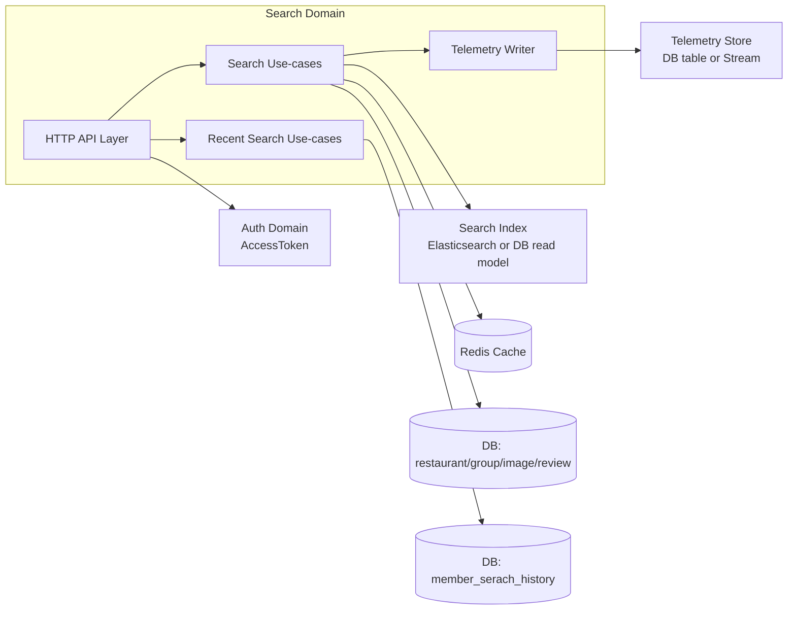
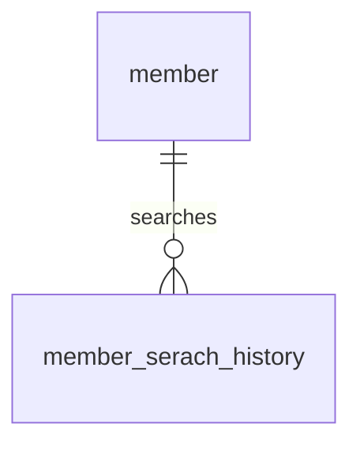

| 항목 | 내용 |
|---|---|
| 문서 제목 | 검색(Search) 테크 스펙 |
| 문서 목적 | 키워드 기반 통합 검색 API의 데이터 모델·결과 조합·운영·모니터링 기준을 명문화해 구현/리뷰/운영팀이   일관된 방향으로 개발/점검하도록 한다. |
| 작성 및 관리 | Backend Team |
| 최초 작성일 | 2026.01.14 |
| 최종 수정일 | 2026.01.18 |
| 문서 버전 | v1.2 |

 

# 검색(Search) - BE 테크스펙

 

---

# **[1] 배경 (Background)**

## **[1-1] 프로젝트 목표 (Objective)**

사용자가 키워드를 입력하면 “그룹/음식점/추천” 등 관련된 대상이 빠르게 묶여서 돌아오는 통합 검색 경험을 제공하고, 추후 search engine/추천/자동완성 고도화를 통해 검색 품질을 강화하며 정렬·페이징·캐싱 정책으로 p95를 관리한다.

- **핵심 결과 (Key Result) 1:** `/api/v1/search` 응답 p95 150ms 이하 유지(거리/캐싱 포함, 99% 슬라이딩 윈도우)
- **핵심 결과 (Key Result) 2:** 검색 쿼리당 5xx 비율 0.5% 미만 유지 + `TOO_MANY_REQUESTS` 트리거 발생 시 1분 이내 알람
- **핵심 결과 (Key Result) 3:** `Hot`/`AI 추천` 등 section별 결과 누락률 <0.5% (로그/모니터링으로 주기적 검증)

 

## **[1-2] 문제 정의 (Problem)**

- 검색에는 음식점 + 그룹 + AI 추천처럼 복수 도메인이 포함되어 있는데, 응답이 느리거나 일관되지 않으면 UX가 크게 떨어진다.
- 키워드/커서/페이지를 해석하는 로직이 명문화되어 있지 않으면 클라이언트와 서버 간 차이가 생기고, 멱등/캐싱 정책이 불명확하다.
- 예상보다 트래픽이 많아지면 PostGIS 거리 계산/복합 조인에서 병목이 생기고, sections별 결과 조합도 무거워져 500이 증가할 수 있다.

 

## **[1-3] 가설 (Hypothesis)**

검색 결과를 “검색 인덱스(키워드 → 그룹/음식점 매핑) + 방어 인프라(Cursor+rate limit+cache) + 검색 telemetry(쿼리/클릭) 수집”으로 나누어 정리하면 p95/에러/운영 알람뿐 아니라 향후 recommendation/analytics 고도화도 가능하다.

 

---

# **[2] 목표가 아닌 것 (Non-goals)**

- **이번 작업은 MVP 검색 API**를 중심으로 하고, 아래의 고도화/추천/자동완성은 **추후 단계에서 Search 도메인의 확장 항목**으로 다룬다.
  - 이유: 통합 검색 API를 먼저 안정화한 뒤 `search_index`/AI/Autocomplete 등을 순차 확장
- 추후 확장 시 고려될 내용:
-  - 검색 엔진(Elasticsearch, vector store 등)을 활용한 추천 키워드/자동완성/패턴 분석
-  - 사용자별 search telemetry 저장(쿼리+result+click) → personalization/analytics
-  - 검색 결과 품질 평가(정답률, click-through) → AI/ML 학습 파이프라인
- 결과 랭킹 개선(랭킹 점수, 순위 조정)
  - Ranking은 리뷰/음식점/그룹 도메인 책임이며, 검색은 이미 정렬된 결과 조회
- 최근 검색어(히스토리)의 “고도화”
  - 이유: MVP에서는 “검색 결과 제공”이 우선이며, 최근 검색어는 보조 기능으로 포함하되 추천/자동완성/개인화까지 확장하는 고도화는 다음 단계로 둔다.

 

---

# **[3] 설계 및 기술 자료 (Architecture and Technical Documentation)**

## **[3-1] 모듈 구성**

- HTTP 레이어
  - Public API: 통합 검색, 최근 검색어 조회/삭제
- Application 레이어(유스케이스)
  - 통합 검색 유스케이스
    - 입력 검증 → (best effort) 최근 검색어 upsert → 검색 인덱스 조회 → 결과 enrichment(썸네일/거리 등) → sections 조합 → 응답
  - 최근 검색어 조회 유스케이스
    - `member_serach_history` cursor 조회
  - 최근 검색어 삭제 유스케이스
    - `member_serach_history` soft delete(멱등)
  - 검색 telemetry 수집(확장 포인트)
    - query/click 이벤트 저장 → personalization/자동완성/sections 학습에 활용
- Persistence/Infra
  - Search Index Client(예: Elasticsearch/DB read model)
  - Cache(예: Redis)
  - Telemetry Store(DB/Stream)

 

## **[3-2] 의존성 관계 (Dependency Graph)**

- 모듈/책임 요약: `Search API`(통합 검색), `History API`(최근 검색어), `Telemetry Writer`(쿼리/클릭 수집)
- 주요 의존성: PostgreSQL(PostGIS), Redis Cache, Search Index(검색 read model), Auth Domain
- 핵심 흐름(요약): 키워드 검색 → 인덱스 조회 → 섹션 조합 → 응답, 최근 검색어 upsert

 

## **[3-3] 데이터베이스 스키마 (ERD)**

- ERD: [ERD Cloud](https://www.erdcloud.com/d/TXZ3CApePpKwEyacT)
- DDL: [ERD 테이블 정의서](https://github.com/100-hours-a-week/3-team-tasteam-wiki/wiki/%5BERD%5D-%ED%85%8C%EC%9D%B4%EB%B8%94-%EC%A0%95%EC%9D%98%EC%84%9C)

**주요 테이블 요약**

- `member_serach_history`: 최근 검색어(회원별 keyword, count, 시각)

**관계 요약**

- `member_serach_history.member_id -> member.id` (N:1, 삭제정책 `RESTRICT(기본)`, 비고: 최근 검색어 소유자)

**ERD(Mermaid)**

**테이블 정의서**

#### `member_serach_history`

| 컬럼 | 타입 | Nullable | 기본값 | 설명 | 제약/고려사항 |
|---|---|---|---|---|---|
| `id` | `BIGINT` | N | `SEQUENCE` | 식별자 | `PK_MEMBER_SERACH_HISTORY` |
| `member_id` | `BIGINT` | N | - | 회원 ID | FK(`member.id`) |
| `keyword` | `VARCHAR(100)` | N | - | 검색어 | - |
| `count` | `BIGINT` | N | - | 누적 검색 횟수 | - |
| `created_at` | `TIMESTAMP` | N | - | 생성 시각 | - |
| `updated_at` | `TIMESTAMP` | N | - | 수정 시각 | - |
| `deleted_at` | `TIMESTAMP` | Y | - | soft delete 시각 | - |

**주요 인덱스(권장)**

| 테이블 | 인덱스 명 | 컬럼 | 목적 |
|---|---|---|---|
| `member_serach_history` | `IDX_member_search_member_updated` | `member_id, updated_at, id` | 최근 검색어 조회 |

 

## **[3-4] API 명세 (API Specifications)**

- **목차:**
  - [최근 검색어 조회 (GET /api/v1/me/recent-searches)](#최근-검색어-조회)
  - [최근 검색어 삭제 (DELETE /api/v1/me/recent-searches/{id})](#최근-검색어-삭제)
  - [통합 검색 (GET /api/v1/search)](#통합-검색)

 

---

### **최근 검색어 조회**

- **API 명세:**
  - `GET /api/v1/me/recent-searches`
  - API 문서 링크: [API 명세(섹션 7)](프로젝트 정의서/API/API_명세_컨벤션_검토_수정본.md#7)
- **권한:** 로그인 사용자
- **구현 상세:**
  - **요청**
    - Query Params: `cursor?: string`, `size?: number`(default 10, max 100)
  - **응답**
    - status: `200`
    - body 스키마(요약)
      - `data[]`: array
        - `id`: number
        - `keyword`: string
        - `count`: number
        - `updatedAt`: string (ISO-8601)
      - `page.nextCursor`: string
      - `page.size`: number
      - `page.hasNext`: boolean
  - **처리 로직**
    1. 인증/인가
    2. `member_serach_history`에서 `member_id=me AND deleted_at is null` 기준 커서 조회
    3. 200 반환(`data + page`)
  - **트랜잭션 관리:** 없음(읽기)
  - **동시성/멱등성:** 조회 API는 멱등
  - **에러 코드(주요):** `INVALID_REQUEST`(400), `UNAUTHORIZED`(401), `INTERNAL_SERVER_ERROR`(500)

 

---

### **최근 검색어 삭제**

- **API 명세:**
  - `DELETE /api/v1/me/recent-searches/{id}`
  - API 문서 링크: [API 명세(섹션 8)](프로젝트 정의서/API/API_명세_컨벤션_검토_수정본.md#8)
- **권한:** 로그인 사용자
- **구현 상세:**
  - **요청**
    - Path Params
      - `id`: number
  - **응답**
    - status: `204`
  - **처리 로직**
    1. 인증/인가
    2. `member_serach_history`에서 `id=:id AND member_id=me AND deleted_at is null` 조회
    3. soft delete: `deleted_at=now()`, `updated_at=now()`
    4. 204 반환
  - **트랜잭션 관리:** 단일 update 트랜잭션
  - **동시성/멱등성:** 이미 삭제된 경우 204(멱등) 또는 404 기준 확정 필요
  - **에러 코드(주요):** `INVALID_REQUEST`(400), `UNAUTHORIZED`(401), `RECENT_SEARCH_NOT_FOUND`(404), `INTERNAL_SERVER_ERROR`(500)

 

---

### **통합 검색**

- **API 명세:**
  - `GET /api/v1/search`
  - API 문서 링크: [API 명세(섹션 6)](프로젝트 정의서/API/API_명세_컨벤션_검토_수정본.md)
- **권한:** 로그인 사용자
- **구현 상세:**
  - **요청**
    - Query Params
      - `keyword`: string (trimmed, length 1~64)
      - `cursor`: string | null (base64 of `updated_at|entityId`)
      - `size`: number (default 10, max 100)
      - `focus`: string | null (enum `group|restaurant|ai`, 확장 포인트)
  - **응답**
    - status: `200`
    - body 스키마(요약)
      - `data.groups[]`: array
      - `data.restaurants.items[]`: array
      - `data.sections[]`: array
      - `page.*`: object
  - **처리 로직**
    1. 인증/인가
    2. 입력 검증(keyword non-empty, size range)
    3. 최근 검색어 기록(best effort)
       - `member_serach_history` upsert: `(member_id, keyword)` 기준으로 `count++`, `updated_at=now()`
       - 실패해도 검색 응답은 성공해야 한다(검색 결과 UX 우선)
    4. Search Index 호출(예: search_index/Elasticsearch)
    5. 결과를 section 단위로 재조합
       - `groups`: 가입 가능한 그룹 목록(`group.status=ACTIVE`, pagination)
       - `restaurants.items`: 거리/키워드 기준 클러스터 + 대표 이미지(`restaurant_image.sort_order=0`)
       - `sections[]`: `HOT`, `AI_RECOMMEND`, `SPONSORED` 등
    6. Cursor page 정보 구성(`nextCursor`, `size`, `hasNext`)
    7. 200 반환(`data` structure matching API 예시)
  - **트랜잭션 관리:** 없음(읽기, read-only search index)
  - **동시성/멱등성:** 동일 cursor 재요청은 동일 페이지를 반환
  - **에러 코드(주요):** `INVALID_REQUEST`(400), `UNAUTHORIZED`(401), `TOO_MANY_REQUESTS`(429), `INTERNAL_SERVER_ERROR`(500)

 

---

## **[3-5] 도메인 에러 코드(공통 정의)**

| code | status | 의미(요약) | retryable | 비고 |
|---|---:|---|---|---|
| `INVALID_REQUEST` | 400 | validation 실패 | no | errors[] 포함 |
| `UNAUTHORIZED` | 401 | 인증 실패 | no | bearer token invalid |
| `TOO_MANY_REQUESTS` | 429 | rate limit 초과 | yes | backoff + 지수 재시도 |
| `RECENT_SEARCH_NOT_FOUND` | 404 | 최근 검색어 없음 | no | 삭제 대상 없음/본인 아님 |
| `INTERNAL_SERVER_ERROR` | 500 | 검색 처리 실패 | yes | alert/지표 |

 

---

## **[3-6] 기술 스택 (Technology Stack)**

- **Backend:** Spring Boot 3, WebFlux (non-blocking search)
- **Search Index:** PostgreSQL + PostGIS, Elasticsearch/Kafka는 확장 항목
- **Cache:** Redis(검색어 결과 캐시)
- **Infra:** AWS
- **External/Async:** Search Indexer Worker(예: Kafka → Elasticsearch)

 

---

# **[4] 이외 고려사항들 (Other Considerations)**

## **[4-1] 고려사항 체크리스트(성능/외부연동/정합성/보안)**

- **성능:**
  - cursor 기반 pagination 적용(`size` 기본 10, 최대 100).
  - 트렌딩 키워드 프리웜 캐시 및 GIST 인덱스, `search_index` read replica 고려.
- **데이터 정합성:**
  - search_index는 batch/stream으로 갱신하며, 자료 부족 시 DB fallback 정책을 유지한다.
  - 최근 검색어는 best effort upsert로 처리하고 검색 응답 성공을 우선한다.
- **보안:**
  - keyword 로그는 민감 정보 마스킹 정책을 적용한다.
  - 회원 단위 rate limit을 적용한다.
- **운영/관측:**
  - 섹션 비활성화/feature flag(Hot/AI) 제공, AI 실패 시 `restaurants`만 반환하는 fallback 정책 유지.
  - 메트릭 수집: `search.query.latency(p95)`, `search.too_many_requests`, `search.sections.empty`, `search.telemetry.events`.

 

---

## **[4-2] 리스크 및 대응 (Risks & Mitigations)**

- **검색 실패 리스크:** external search index stale → fallback to DB queries + alert
- **Rate limit 리스크:** burst 대처 → leaky bucket + 429 지표
- **Sections 구성 리스크:** AI/HOT 결과 누락 → sections empty metric & dashboard

 

---

# **[5] 테스트 (Testing)**

- **공통 테스트 규약 링크**
  - `<프로젝트 테스트 컨벤션/드라이버/원칙 문서 링크>`
- **이 도메인에서 테스트해야 하는 것**
  - 통합 검색 응답 조합(그룹/음식점/sections) 및 커서 페이징 일관성
  - 최근 검색어 조회/삭제의 멱등성 및 soft delete 동작
  - rate limit 적용 및 429 응답/알람 연동
- **테스트에 필요한 준비물(추가해야 하는 것)**
  - 테스트 데이터(fixture/seed): `member`, `member_serach_history`, `restaurant`, `group`, `image`, `restaurant_image`
  - 테스트 더블(fake/mock/stub): Search Index Client, Cache Client

 

---

# **[6] 함께 논의하고 싶은 내용 (Open Questions)**

1. sections(`HOT`, `AI_RECOMMEND`, `SPONSORED`)을 어디서/어떤 기준으로 생성할까? (Owner: @Backend+PM, Due: TBD)  
2. Cursor 포맷(base64(`updated_at|entityId`) vs plain) 중 어느 쪽을 고정할까? (Owner: @Backend, Due: TBD)  
3. Search index 주기: 실시간(event-driven) vs 일괄(batch) 업데이트 중 무엇을 채택할까? (Owner: @Backend+Infra, Due: TBD)  
4. 검색 telemetry(쿼리/클릭)를 어느 저장소에 얼마나 보관하고, personalization/자동완성/sections 학습에 어떻게 연결할까? (Owner: @Backend+Data, Due: TBD)

 

---

# **[7] 변경이력**

| 버전 | 일자 | 작성자 | 변경 내역 | 비고 |
|---|---|---|---|---|
| `v1.2` | 2026.01.18 | Backend Team | 템플릿 정합성 반영(ERD/API/에러/테스트 섹션 정리) | - |
| `v1.1` | 2026.01.15 | Backend Team | 검색 중심 스펙 정리 | - |
