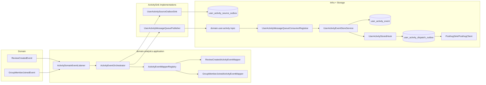
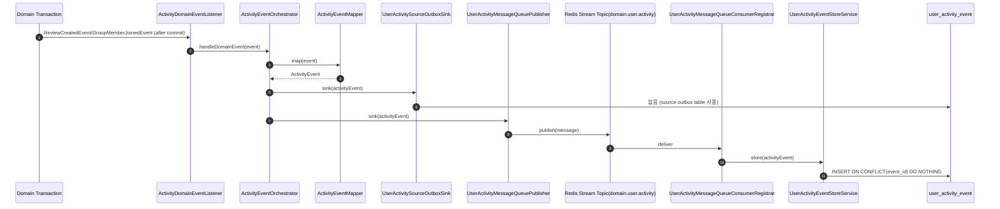
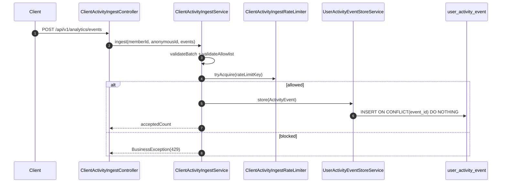
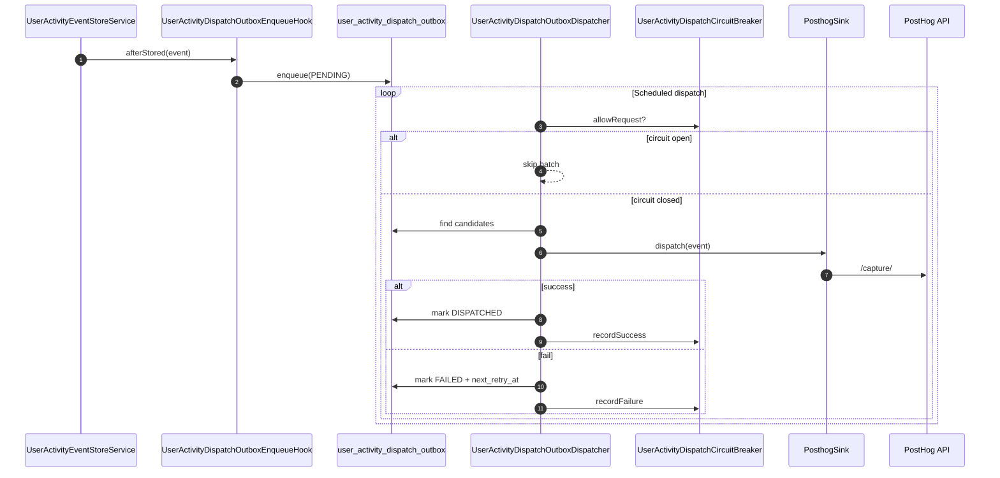

| 항목 | 내용 |
|---|---|
| 문서 제목 | 사용자 이벤트 수집(User Activity Collection) 모듈 구현 문서 |
| 문서 목적 | 현재 브랜치 기준의 실제 구현을 기준으로 수집 파이프라인 구조, 데이터 흐름, 확장 경계, 운영 추적 포인트를 명확히 정리한다. |
| 작성 및 관리 | Backend Team |
| 최초 작성일 | 2026.02.18 |
| 최종 수정일 | 2026.02.20 |
| 문서 버전 | v1.0 |

 

# 사용자 이벤트 수집(User Activity Collection) - 구현 현황

---

# **[1] 배경과 목표 (Background & Objective)**

## **[1-1] 배경**

- 사용자 이벤트 수집이 도메인 서비스 구현에 직접 결합되면 변경 비용과 회귀 위험이 커진다.
- 외부 분석 도구(PostHog) 장애가 핵심 비즈니스 기능으로 전파되면 안 된다.
- MQ 기반 수집은 중복/재시도/장애복구 운영 규칙이 없으면 장기 운영이 어렵다.

## **[1-2] 목표**

- 도메인 이벤트를 정규화(`ActivityEvent`)하여 확장 가능한 수집 경로를 제공한다.
- 내부 저장소(`user_activity_event`)를 기준 데이터(source of truth)로 유지한다.
- 장애를 격리하고 재처리 가능한 구조(source outbox, dispatch outbox)를 제공한다.
- 클라이언트 UI 이벤트도 동일 저장 경로에 수렴시킨다.

## **[1-3] 범위 / 비범위**

범위:
- 서버 도메인 이벤트 수집
- 클라이언트 ingest API 수집
- source outbox + MQ + 최종 저장
- PostHog 비동기 dispatch
- 운영 조회/재처리 경로

비범위:
- 이벤트 스키마 자동 버전 업그레이드
- PostHog 이외 다중 외부 sink 동시 운영
- 검색 이벤트(`search.executed`) 자동 수집 구현

---

# **[2] 모듈 구조 (Module Structure)**

## **[2-1] 패키지와 책임**

| 패키지 | 책임 | 대표 클래스 |
|---|---|---|
| `com.tasteam.domain.analytics.api` | 정규화 이벤트/확장 포트 계약 | `ActivityEvent`, `ActivitySink`, `ActivityEventMapper<T>` |
| `com.tasteam.domain.analytics.application` | 도메인 이벤트 매핑 및 sink 오케스트레이션 | `ActivityDomainEventListener`, `ActivityEventOrchestrator`, `ActivityEventMapperRegistry` |
| `com.tasteam.domain.analytics.persistence` | 최종 이벤트 저장 및 저장 후 hook 확장점 | `UserActivityEventStoreService`, `UserActivityEventJdbcRepository`, `UserActivityStoredHook` |
| `com.tasteam.domain.analytics.resilience` | source outbox 저장/상태관리/재처리 | `UserActivitySourceOutboxService`, `UserActivityReplayService`, `UserActivitySourceOutboxJdbcRepository` |
| `com.tasteam.infra.messagequeue` | MQ 발행/구독/관리 API/스케줄러 | `UserActivityMessageQueuePublisher`, `UserActivityMessageQueueConsumerRegistrar`, `UserActivityOutboxAdminController` |
| `com.tasteam.domain.analytics.dispatch` | dispatch outbox/재시도/서킷브레이커 | `UserActivityDispatchOutboxDispatcher`, `UserActivityDispatchOutboxService`, `UserActivityDispatchCircuitBreaker` |
| `com.tasteam.infra.analytics.posthog` | PostHog 어댑터 | `PosthogClient`, `PosthogSink`, `UserActivityDispatchOutboxEnqueueHook` |
| `com.tasteam.domain.analytics.ingest` | 클라이언트 ingest API 정책/검증/레이트리밋 | `ClientActivityIngestController`, `ClientActivityIngestService`, `ClientActivityIngestRateLimiter` |

## **[2-2] 의존 경계**

- 도메인 서비스는 analytics 구현체를 직접 참조하지 않는다.
- analytics는 도메인 이벤트 contract를 수신하여 자체 포트(`ActivitySink`)로 전달한다.
- 인프라 어댑터(MQ/PostHog)는 analytics 포트를 구현한다.

## **[2-3] 컴포넌트 흐름도**

## **[2-4] 공개 계약(Interfaces / Types)**

- `ActivityEvent`: 정규화 이벤트 계약
- `ActivitySink`: 수집 sink 확장 포트
- `ActivityEventMapper<T>`: 도메인 이벤트 -> `ActivityEvent` 매핑 포트
- `UserActivityStoredHook`: 최종 저장 후 후속 동작 확장 포트
- `UserActivityDispatchSink`: dispatch 타겟 확장 포트

---

# **[3] 런타임 흐름 (Runtime Flow)**

## **[3-1] 서버 도메인 이벤트 수집 흐름**

- 진입: `@TransactionalEventListener(phase = AFTER_COMMIT)`
- 매핑: registry에서 이벤트 타입별 mapper 조회
- sink 전달: 등록된 `ActivitySink` 순회, sink별 예외 격리
- source outbox 적재: `UserActivitySourceOutboxSink`
- MQ 발행: `UserActivityMessageQueuePublisher`
- 최종 저장: consumer -> `UserActivityEventStoreService` -> `user_activity_event`
- 저장 후 hook: PostHog 활성 시 dispatch outbox enqueue

## **[3-2] 클라이언트 ingest 흐름**

- API: `POST /api/v1/analytics/events`
- 인증/익명 정책:
  - 인증 사용자: `member:{id}` 키로 레이트리밋
  - 익명 사용자: `anonymousId` 필수
- 정책:
  - 배치 수 제한
  - allowlist 이벤트만 허용
  - 레이트리밋 초과 시 429
- 저장:
  - `UserActivityEventStoreService` 동일 경로 재사용

## **[3-3] PostHog dispatch 흐름**

- 트리거: 저장 성공 후 `UserActivityStoredHook`
- enqueue: `user_activity_dispatch_outbox`
- 배치 dispatch: `UserActivityDispatchScheduler` 주기 실행
- 실패 처리: backoff 재시도 + circuit breaker
- 격리: PostHog 실패가 내부 저장 롤백을 유발하지 않음

---

# **[4] 저장소 스키마 (Schema Reality)**

## **[4-1] 핵심 테이블**

| 테이블 | 용도 | 멱등 기준 |
|---|---|---|
| `user_activity_event` | 최종 이벤트 저장소 | `event_id` unique |
| `user_activity_source_outbox` | source 발행 보장/재처리 | `event_id` unique |
| `user_activity_dispatch_outbox` | 외부 sink 전송 대기열 | `(event_id, sink/target)` unique |

## **[4-2] 현재 코드 기준 의미**

- 최종 중복 제거는 `user_activity_event.event_id` 기준이다.
- source outbox는 `PENDING/PUBLISHED/FAILED` 상태를 사용한다.
- dispatch outbox는 코드 기준 `PENDING/FAILED/DISPATCHED` 상태를 사용한다.

주의:
- migration/코드 컬럼·상태 명칭 불일치는 `TRACEABILITY.md` 갭 리포트에 별도 정리한다.

---

# **[5] 설정 계약 (Configuration Contract)**

## **[5-1] application.yml 기반 설정**

| 키 | 기본값 | 설명 |
|---|---|---|
| `tasteam.message-queue.enabled` | `false` | MQ 수집 경로 활성화 |
| `tasteam.message-queue.provider` | `none` | `none/redis-stream/kafka` |
| `tasteam.message-queue.topic-prefix` | `tasteam` | stream prefix |
| `tasteam.message-queue.default-consumer-group` | `tasteam-api` | 기본 consumer group |
| `tasteam.analytics.ingest.enabled` | `true` | 클라이언트 ingest API 활성화 |
| `tasteam.analytics.ingest.max-batch-size` | `50` | ingest 배치 최대 건수 |
| `tasteam.analytics.ingest.allowlist` | `ui.restaurant.viewed,ui.restaurant.clicked,ui.review.write_started,ui.review.submitted` | 허용 이벤트 |
| `tasteam.analytics.ingest.rate-limit.max-requests` | `120` | 윈도우당 요청 허용 수 |
| `tasteam.analytics.ingest.rate-limit.window` | `PT1M` | 레이트리밋 윈도우 |
| `tasteam.analytics.dispatch.enabled` | `true` | dispatch 워커 논리 활성화 |
| `tasteam.analytics.dispatch.batch-size` | `100` | dispatch 배치 크기 |
| `tasteam.analytics.dispatch.fixed-delay` | `PT1M` | dispatch 주기 |
| `tasteam.analytics.dispatch.retry.base-delay` | `PT10S` | 재시도 base delay |
| `tasteam.analytics.dispatch.retry.max-delay` | `PT10M` | 재시도 max delay |
| `tasteam.analytics.dispatch.circuit.failure-threshold` | `5` | circuit open 임계치 |
| `tasteam.analytics.dispatch.circuit.open-duration` | `PT1M` | circuit open 유지 시간 |
| `tasteam.analytics.posthog.enabled` | `false` | PostHog 경로 활성화 |
| `tasteam.analytics.posthog.host` | `https://app.posthog.com` | PostHog host |
| `tasteam.analytics.posthog.api-key` | 비어있음 | API key |

## **[5-2] 코드에서 직접 참조되는 추가 키**

| 키 | 기본값(코드) | 위치 |
|---|---|---|
| `tasteam.analytics.outbox.enabled` | `true` (`matchIfMissing=true`) | `UserActivitySourceOutboxSink` |
| `tasteam.analytics.replay.batch-size` | `100` | `UserActivityReplayScheduler` |
| `tasteam.analytics.replay.fixed-delay` | `PT1M` | `UserActivityReplayScheduler` |

---

# **[6] 이벤트 카탈로그 (Current vs TODO)**

## **[6-1] 현재 구현된 서버 이벤트**

| 이벤트명 | 생성 경로 | 매퍼 |
|---|---|---|
| `review.created` | `ReviewCreatedEvent` | `ReviewCreatedActivityEventMapper` |
| `group.joined` | `GroupMemberJoinedEvent` | `GroupMemberJoinedActivityEventMapper` |

## **[6-2] 현재 구현된 클라이언트 allowlist 기본값**

- `ui.restaurant.viewed`
- `ui.restaurant.clicked`
- `ui.review.write_started`
- `ui.review.submitted`

## **[6-3] 문서/백로그에 있으나 미구현**

- `search.executed` 서버 이벤트 매퍼/연계

---

# **[7] 코드 경로 맵 (Code Path Map)**

## **[7-1] API 엔드포인트**

- `POST /api/v1/analytics/events` -> `ClientActivityIngestController`
- `GET /api/v1/admin/user-activity/outbox/summary` -> `UserActivityOutboxAdminController`
- `POST /api/v1/admin/user-activity/outbox/replay` -> `UserActivityOutboxAdminController`
- `GET /api/v1/admin/mq-traces` -> `MessageQueueTraceAdminController`

## **[7-2] 보안 정책 연결**

- 공개 엔드포인트 허용: `ApiEndpointSecurityPolicy.publicEndpoints()`
- URL 상수: `ApiEndpoints.ANALYTICS_EVENTS`

## **[7-3] 스토리지/재처리/dispatch 핵심 클래스**

- 최종 저장: `UserActivityEventJdbcRepository`, `UserActivityEventStoreService`
- source outbox: `UserActivitySourceOutboxJdbcRepository`, `UserActivitySourceOutboxService`, `UserActivityReplayService`
- dispatch outbox: `UserActivityDispatchOutboxJdbcRepository`, `UserActivityDispatchOutboxService`, `UserActivityDispatchOutboxDispatcher`

---

# **[8] 전달 보장과 장애 격리 (Guarantees & Best Effort)**

| 구간 | 보장 수준 | 근거 |
|---|---|---|
| 도메인 이벤트 리스닝 | 핵심 트랜잭션과 분리 | `AFTER_COMMIT`, listener/orchestrator 예외 격리 |
| source outbox 적재 | 중복 억제 + 재처리 가능 | `ON CONFLICT(event_id) DO NOTHING`, status/replay |
| MQ 전달 | at-least-once 성향 | consumer 성공 시 ACK |
| 최종 저장 | effectively-once | `user_activity_event` unique(event_id) |
| PostHog 전송 | at-least-once best effort | dispatch outbox + retry + circuit |

Best effort 구간:
- 외부 PostHog 전달 성공 시점
- MQ 비활성(`provider=none`) 환경의 source outbox 적체 해소

---

# **[9] 확장 전략 (Extension Strategy)**

## **[9-1] 신규 서버 이벤트 추가**

1. `ActivityEventMapper<NewDomainEvent>` 구현 추가
2. `sourceType()`으로 타입 등록
3. 필요 시 properties 스키마 정의

기존 오케스트레이터/레지스트리 수정 없이 확장 가능.

## **[9-2] 신규 외부 sink 추가**

1. `UserActivityDispatchTarget` 확장
2. `UserActivityDispatchSink` 구현 추가
3. outbox enqueue hook 또는 라우팅 규칙 추가

## **[9-3] 클라이언트 이벤트 확장**

1. allowlist 설정에 이벤트명 추가
2. 프론트 이벤트 payload 스키마 합의
3. 필요 시 ingest validation 규칙 강화

---

# **[10] 리뷰 체크리스트 (Review Checklist)**

- 도메인 서비스가 analytics 구현체를 직접 import하지 않는가
- mapper 중복 등록이 없는가 (`ActivityEventMapperRegistry`)
- `event_id` 멱등 저장이 모든 저장 경로에 적용되는가
- source/dispatch outbox 상태 전이가 운영 가능한가
- PostHog 장애가 내부 저장 성공을 훼손하지 않는가
- ingest allowlist/rate-limit/anonymous 정책이 테스트로 보장되는가
- 문서의 클래스/설정키/엔드포인트가 실제 코드와 일치하는가

---

# **[11] 구현 상태 및 검증 근거 (Status & Validation)**

- Issue #350~#355 구현분은 PR #356~#362에서 `develop` 머지 완료.
- 단위/통합 테스트가 주요 경로를 커버한다.

대표 검증 클래스:
- `UserActivityMessageQueueFlowIntegrationTest`
- `UserActivityEventJdbcRepositoryTest`
- `UserActivityEventStoreServiceTest`
- `UserActivityReplayServiceTest`
- `UserActivityDispatchOutboxDispatcherTest`
- `UserActivityDispatchCircuitBreakerTest`
- `PosthogClientTest`
- `ClientActivityIngestServiceTest`
- `ClientActivityIngestRateLimiterTest`
- `ClientActivityIngestControllerTest`

자세한 이슈/PR/커밋/갭 추적은 `TRACEABILITY.md`를 따른다.
운영 대응 절차는 `RUNBOOK.md`를 따른다.
