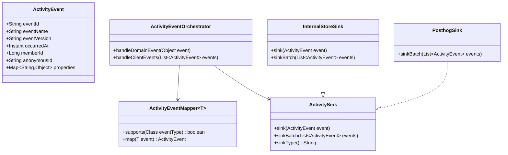

| 항목 | 내용 |
|---|---|
| 문서 제목 | 사용자 이벤트 수집(User Activity Collection) 모듈 테크 스펙 |
| 문서 목적 | 도메인 의존을 최소화한 내부 이벤트 수집 아키텍처를 정의하고, 장애 격리·중복/손실 관리·PostHog 확장을 포함한 운영 기준을 고정한다. |
| 작성 및 관리 | Backend Team |
| 최초 작성일 | 2026.02.18 |
| 최종 수정일 | 2026.02.18 |
| 문서 버전 | v0.2 |

<br>

# 사용자 이벤트 수집(User Activity Collection) - BE 테크스펙

---

# **[1] 배경 (Background)**

## **[1-1] 목표 (Objective)**

- 사용자 이벤트 수집 기능이 개별 도메인 서비스에 강결합되지 않도록 설계한다.
- 수집 장애가 API/도메인 핵심 트랜잭션을 실패시키지 않도록 격리한다.
- OCP 원칙으로 신규 이벤트/신규 외부 sink를 “기존 코드 수정 최소” 방식으로 확장한다.
- 내부 저장소를 source of truth로 두고, PostHog는 선택적 downstream sink로 둔다.

핵심 결과(초안):

- 도메인 트랜잭션에 대한 수집 기능 기인 장애 전파율: `0%`
- 서버 사실 이벤트(final store 기준) 중복률: `0%` (`event_id` unique)
- 서버 사실 이벤트 손실률(비재난 조건): `0%` 목표
- PostHog 전송 지연 p95: `10분` 이내

## **[1-2] 문제 정의 (Problem)**

- 이벤트 수집 로직이 도메인 서비스 내부로 스며들면 변경 비용과 회귀 위험이 증가한다.
- 외부 분석 도구(PostHog) 장애가 내부 기능 장애로 전이되면 안 된다.
- MQ는 기본적으로 at-least-once 경향이므로 중복/순서/손실 정책을 명시하지 않으면 운영 분쟁이 발생한다.

## **[1-3] 설계 원칙 (Design Principles)**

1. **Dependency Inversion**
   - 도메인은 `analytics` 구현체를 모른다.
   - analytics 모듈이 도메인 이벤트를 “구독”하고 매핑한다.
2. **Open/Closed Principle**
   - 신규 이벤트 추가 시 `Mapper` 클래스 추가만으로 확장한다.
   - 신규 sink(PostHog 외) 추가 시 `ActivitySink` 구현 추가로 확장한다.
3. **Failure Isolation**
   - 수집 실패는 도메인 응답 성공/실패와 분리한다.
   - 외부 sink 실패는 내부 저장 성공을 롤백하지 않는다.
4. **Idempotent At-least-once**
   - 전송은 at-least-once를 채택하되 최종 저장은 `effectively-once`(중복제거)로 수렴한다.

---

# **[2] 모듈 구조 (Module Structure)**

## **[2-1] 경계와 의존 방향**

- Domain Layer
  - 기존 도메인 이벤트 발행 책임만 유지
  - analytics 구현 세부사항 참조 금지
- Analytics Application Layer
  - 도메인 이벤트 -> Canonical Activity Event 변환
  - 내부 저장/외부 전송 오케스트레이션
- Infra Layer
  - MQ/DB/PostHog 어댑터 구현

의존 방향: `domain -> (none)` / `analytics -> domain event contract` / `infra -> analytics port`

## **[2-2] 패키지 설계 (Target)**

- `app-api/src/main/java/com/tasteam/domain/analytics/api`
  - `ActivityEvent` (정규화 이벤트 계약)
  - `ActivitySink` (내부 저장/외부 전송 공통 포트)
  - `ActivityEventMapper<T>` (도메인 이벤트 -> ActivityEvent 변환 포트)
- `app-api/src/main/java/com/tasteam/domain/analytics/application`
  - `ActivityEventOrchestrator`
  - `ActivityEventMapperRegistry`
  - `ActivityIngestPolicy`
- `app-api/src/main/java/com/tasteam/domain/analytics/persistence`
  - `UserActivityEventLog` / `UserActivityEventRepository`
  - `UserActivityDispatchOutbox` / `UserActivityDispatchOutboxRepository`
- `app-api/src/main/java/com/tasteam/infra/messagequeue`
  - `UserActivityMessageQueuePublisher`
  - `UserActivityMessageQueueConsumerRegistrar`
  - `MessageQueueTopics.USER_ACTIVITY`
- `app-api/src/main/java/com/tasteam/infra/analytics/posthog`
  - `PosthogSink` (`ActivitySink` 구현)
  - `PosthogClient`

## **[2-3] OCP 확장점**

- 신규 도메인 이벤트 추가:
  - `ActivityEventMapper<NewDomainEvent>` 1개 클래스 추가
  - 기존 orchestrator 수정 없음
- 신규 외부 도구 추가:
  - `ActivitySink` 구현체 추가 (`AmplitudeSink` 등)
  - 기존 publisher/collector 수정 없음

## **[2-4] 아키텍처 다이어그램**


## **[2-5] 클래스 계약 다이어그램**



---

# **[3] 실행 흐름 (Runtime Flow)**

## **[3-1] 서버 사실 이벤트 경로 (권장 기본)**

설명:

1. 도메인은 기존 방식대로 커밋 후 도메인 이벤트 발행
2. Analytics Mapper가 정규화 이벤트로 변환
3. MQ 토픽 `domain.user.activity`에 발행
4. Consumer가 내부 저장소(`user_activity_event`)에 멱등 저장
5. ACK는 DB 커밋 후 수행


## **[3-2] 장애 격리 흐름 (PostHog 실패 시)**

원칙:

- 내부 저장 성공이 우선
- PostHog 실패는 outbox 재시도로 흡수
- 사용자 요청 흐름에는 영향 없음


---

# **[4] 설정 계약 (Configuration Contract)**

## **[4-1] 기존 설정 활용**

- `tasteam.message-queue.enabled`
- `tasteam.message-queue.provider`
- `tasteam.message-queue.topic-prefix`
- `tasteam.message-queue.default-consumer-group`
- `tasteam.message-queue.poll-timeout-millis`

## **[4-2] 신규 설정 제안**

```yaml
tasteam:
  analytics:
    enabled: ${ANALYTICS_ENABLED:true}
    mode: ${ANALYTICS_MODE:INTERNAL_ONLY} # INTERNAL_ONLY | INTERNAL_PLUS_POSTHOG
    client-ingest-enabled: ${ANALYTICS_CLIENT_INGEST_ENABLED:false}
    ingest-max-batch-size: ${ANALYTICS_INGEST_MAX_BATCH_SIZE:100}
    ingest-rate-limit-per-minute: ${ANALYTICS_INGEST_RATE_LIMIT_PER_MINUTE:120}
    strict-server-event-lossless: ${ANALYTICS_STRICT_SERVER_EVENT_LOSSLESS:true}
    pii:
      keyword-mode: ${ANALYTICS_KEYWORD_MODE:HASH}
      store-ip: ${ANALYTICS_STORE_IP:false}
      store-user-agent: ${ANALYTICS_STORE_USER_AGENT:false}
    posthog:
      enabled: ${ANALYTICS_POSTHOG_ENABLED:false}
      host: ${ANALYTICS_POSTHOG_HOST:https://app.posthog.com}
      project-api-key: ${ANALYTICS_POSTHOG_PROJECT_API_KEY:}
      batch-size: ${ANALYTICS_POSTHOG_BATCH_SIZE:100}
      timeout-ms: ${ANALYTICS_POSTHOG_TIMEOUT_MS:3000}
      max-retries: ${ANALYTICS_POSTHOG_MAX_RETRIES:5}
      circuit-open-seconds: ${ANALYTICS_POSTHOG_CIRCUIT_OPEN_SECONDS:60}
```

기본 운영값:

- 내부 수집 ON
- 클라이언트 ingest OFF
- PostHog OFF (점진 활성화)

---

# **[5] 확장/마이그레이션 전략 (Extension & Migration Strategy)**

## **[5-1] 단계별 도입**

1. **Phase 1 (내부 저장 우선)**
   - `review.created`, `group.joined`, `search.executed` 수집
   - `user_activity_event` 구축 + 멱등 insert
2. **Phase 1.5 (신뢰성 강화)**
   - 재처리 잡 + 관리자 조회 API
   - 컨슈머 ACK-after-commit 검증
3. **Phase 2 (PostHog 연계)**
   - `dispatch_outbox` + dispatcher
   - circuit breaker / retry / dead-letter 정책 반영
4. **Phase 3 (클라이언트 ingest)**
   - allowlist/스키마 버전/rate-limit
   - anonymousId + sessionId 정책 고정

## **[5-2] 이벤트 카탈로그 v1**

- `review.created`
  - `reviewId`, `restaurantId`, `groupId`, `subgroupId`, `hasImage`
- `group.joined`
  - `groupId`, `joinType`, `joinedAt`
- `search.executed`
  - `queryHash`, `resultGroupCount`, `resultRestaurantCount`, `hasLocation`

---

# **[6] 전달 보장·중복·손실 정책 (Delivery Semantics)**

## **[6-1] 목표 전달 보장**

- 내부 저장소 기준 목표: **effectively-once**
  - 전송 계층은 **at-least-once**
  - 저장 계층에서 `event_id` 멱등으로 중복 제거
- 외부(PostHog) 기준 목표: **at-least-once best effort**
  - 중복 허용(도구 측 distinct id로 보정)

## **[6-2] 허용치 (SLO/에러 버짓)**

| 분류 | 손실 허용 | 중복 허용 | 목표 보장 |
|---|---:|---:|---|
| 서버 사실 이벤트(내부 DB) | `0%` (비재난 조건) | raw는 허용, 최종 저장 `0%` | at-least-once + idempotent |
| 클라이언트 UI 이벤트(내부 DB) | `<= 1.0%` | `<= 0.5%` | at-least-once best effort |
| PostHog 전송 | 내부 손실 `0%`, 외부 지연 허용 | 허용 | at-least-once best effort |

비고:

- “정확히 한 번(exactly-once)”은 인프라 전체에서 강제하지 않는다.
- 대신 저장소 최종 상태를 effectively-once로 정의한다.

## **[6-3] 중복 제거 전략**

- `event_id`는 producer에서 UUID(v7 권장) 생성
- DB 제약: `UNIQUE(event_id)`
- SQL: `INSERT ... ON CONFLICT(event_id) DO NOTHING`

## **[6-4] 손실 최소화 전략**

- Consumer는 DB 커밋 성공 후 ACK
- 컨슈머 실패는 재시도 큐/미처리 pending으로 회수
- PostHog 실패는 outbox 재시도(지수 백오프)로 흡수

## **[6-5] Source Publish 보장 점검 (중요)**

- 현재 방식(커밋 후 즉시 MQ publish)은 프로세스 크래시 타이밍에 따라 소량 손실 가능성이 있다.
- 서버 사실 이벤트 손실 `0%` 목표를 유지하려면 source-side transactional outbox가 필요하다.

결론:

1. 서버 사실 이벤트(`review.created`, `group.joined`)는 **source-side outbox 도입 권장(필수에 가깝다)**.
2. UI/제품 분석 이벤트는 best-effort publish 허용 가능.

---

# **[7] 장애 격리 설계 (Failure Isolation)**

## **[7-1] 격리 정책**

- 도메인 요청 경로와 analytics sink 호출을 동기 결합하지 않는다.
- 외부 sink(PostHog)는 별도 워커/스레드풀/서킷브레이커로 분리한다.
- 내부 저장 실패 시에도 도메인 기능 영향은 정책적으로 차단한다.
  - 단, 동일 DB 전면 장애와 같은 공통 인프라 장애는 예외

## **[7-2] 장애 시 동작**

1. MQ publish 실패
   - trace 기록 + 경고
   - 도메인 트랜잭션은 유지(커밋 이후 경로)
2. Consumer 저장 실패
   - ACK 미수행 -> 재전달
   - 중복은 `event_id`로 흡수
3. PostHog 장애
   - dispatcher circuit open
   - outbox 적체 허용, 내부 저장 유지

---

# **[8] 저장소 스키마 제안 (Schema)**

## **[8-1] `user_activity_event`**

- 목적: 감사/재처리 가능한 정규화 이벤트 저장소
- 핵심 제약: `UNIQUE(event_id)`
- 권장 인덱스:
  - `(member_id, occurred_at DESC)`
  - `(event_name, occurred_at DESC)`
  - `(occurred_at DESC)`

권장 컬럼:

- `id BIGSERIAL`
- `event_id VARCHAR(64) NOT NULL`
- `event_name VARCHAR(100) NOT NULL`
- `event_version VARCHAR(20) NOT NULL`
- `occurred_at TIMESTAMPTZ NOT NULL`
- `member_id BIGINT NULL`
- `anonymous_id VARCHAR(100) NULL`
- `session_id VARCHAR(100) NULL`
- `source VARCHAR(20) NOT NULL`
- `request_path VARCHAR(255) NULL`
- `request_method VARCHAR(10) NULL`
- `device_id VARCHAR(100) NULL`
- `platform VARCHAR(30) NULL`
- `app_version VARCHAR(30) NULL`
- `locale VARCHAR(20) NULL`
- `properties JSONB NOT NULL`
- `created_at TIMESTAMPTZ NOT NULL DEFAULT NOW()`

## **[8-2] `user_activity_dispatch_outbox`**

- 목적: 외부 sink 전달/재시도 추적
- 핵심 컬럼:
  - `event_id`, `sink_type`, `status`, `retry_count`, `next_retry_at`, `last_error`, `updated_at`

---

# **[9] 보안/개인정보 정책 (PII Policy)**

- 저장 금지:
  - JWT/AccessToken/RefreshToken
  - 이메일/전화번호 원문
  - 리뷰 본문 원문
- 검색어는 기본 `HASH` 저장
- IP/User-Agent는 기본 미저장(필요 시 해시)
- 로그 출력 시 `properties` 전체 출력 금지(allowlist 필드만)

---

# **[10] 리뷰 체크리스트 (Review Checklist)**

- 모듈화
  - 도메인 서비스가 analytics 구현체를 import하지 않는가
  - mapper/sink 추가만으로 확장이 가능한가(OCP)
- 안정성
  - ACK-after-commit이 보장되는가
  - `event_id` unique + upsert가 적용되는가
  - PostHog 장애가 내부 저장/요청 처리에 전파되지 않는가
- 운영성
  - trace/metric/dashboard로 적체·실패 확인이 가능한가
  - 재처리(runbook)가 문서화되어 있는가
- 보안
  - 금지 필드 마스킹/차단이 테스트되는가

---

# **[11] 구현 현황 (Implementation Status)**

## **[11-1] 현재 구현(이미 존재)**

- 도메인 이벤트 발행 + MQ 발행/소비 패턴 구현
- MQ trace/메트릭/운영 조회 API 구현
- 검색 히스토리 기능 단위 수집 구현

## **[11-2] 본 모듈 TODO**

- `domain.user.activity` 토픽 추가
- mapper registry + orchestrator + sink 포트 구현
- `user_activity_event` / `user_activity_dispatch_outbox` 마이그레이션 추가
- `InternalStoreSink` 멱등 저장 구현
- PostHog dispatcher(옵션) 구현

## **[11-3] 검증 계획**

- 단위 테스트
  - mapper 매핑, idempotency, 마스킹 정책
- 통합 테스트
  - domain event -> MQ -> DB end-to-end
  - 중복 재전달 시 최종 row 1건 보장
  - PostHog 실패 시 내부 저장 성공 보장

---

# **[12] Open Questions**

1. `search.executed`를 기존 서비스 로직에서 직접 발행할지, 별도 AOP/Interceptor로 수집할지
2. 서버 사실 이벤트 손실 `0%`를 위해 source-side transactional outbox를 즉시 도입할지, 2차 단계로 둘지
3. 클라이언트 ingest를 익명 허용으로 시작할지, 인증 사용자 전용으로 시작할지
4. PostHog sink 대상 이벤트를 전량으로 할지 allowlist로 시작할지

---

# **[13] 변경이력**

| 버전 | 일자 | 작성자 | 변경 내역 | 비고 |
|---|---|---|---|---|
| `v0.2` | 2026.02.18 | Devon.woo(우승화) | 의존성 역전/OCP/장애 격리/전달 보장·손실 예산 정책 반영 | 확장 |
| `v0.1` | 2026.02.18 | Devon.woo(우승화) | 사용자 이벤트 내부 수집 + PostHog 확장 전략 초기 설계 문서 작성 | 신규 |
