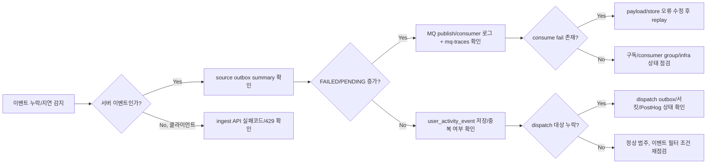
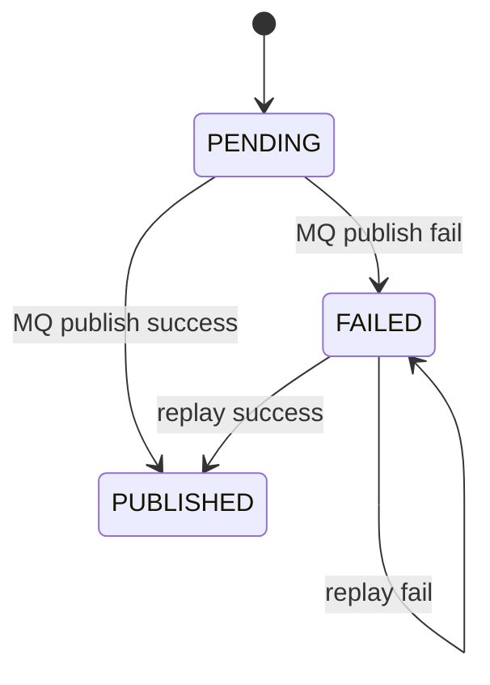
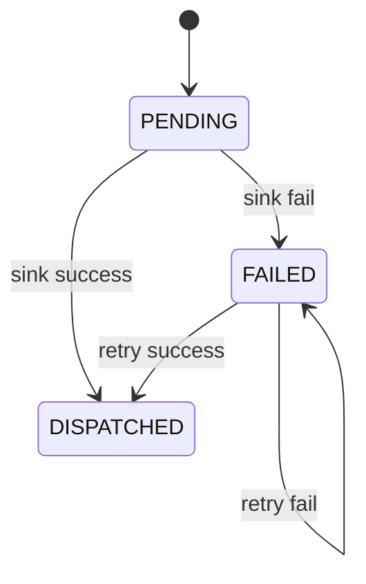

| 항목 | 내용 |
|---|---|
| 문서 제목 | 사용자 이벤트 수집 운영 런북 |
| 문서 목적 | 장애 상황에서 source outbox/MQ/store/dispatch 중 어디서 문제가 발생했는지 빠르게 분류하고 복구 절차를 표준화한다. |
| 작성 및 관리 | Backend Team |
| 최종 수정일 | 2026.02.20 |
| 문서 버전 | v1.0 |

<br>

# 사용자 이벤트 수집 운영 런북

---

# **[1] 핵심 신호 (Operational Signals)**

## **[1-1] 애플리케이션 로그 신호**

- source outbox 적재/발행 실패
  - `사용자 이벤트 outbox payload 직렬화에 실패했습니다`
  - `메시지큐 provider가 none이라 User Activity 발행을 건너뜁니다`
- MQ 소비 실패
  - `메시지큐 수신 처리 실패`
- 최종 저장 중복/저장 후 hook 실패
  - `중복 사용자 이벤트를 감지하여 저장을 건너뜁니다`
  - `사용자 이벤트 저장 후 hook 실행에 실패했습니다`
- dispatch 실패
  - `사용자 이벤트 dispatch에 실패했습니다`
  - `사용자 이벤트 dispatch payload 역직렬화에 실패했습니다`

## **[1-2] 메트릭 신호**

| 메트릭 | 태그 | 의미 |
|---|---|---|
| `analytics.user-activity.outbox.enqueue` | `result=inserted/duplicate/fail` | source outbox 적재 결과 |
| `analytics.user-activity.outbox.publish` | `result=success/fail` | source outbox 발행 결과 |
| `analytics.user-activity.outbox.retry` | `result=scheduled` | source 재시도 예약 횟수 |
| `analytics.user-activity.dispatch.enqueue` | `result=inserted/duplicate/fail,target=*` | dispatch outbox 적재 결과 |
| `analytics.user-activity.dispatch.execute` | `result=success/fail,target=*` | dispatch 실행 결과 |
| `analytics.user-activity.dispatch.retry` | `result=scheduled,target=*` | dispatch 재시도 예약 |
| `analytics.user-activity.dispatch.circuit` | `state=open,target=*` | 서킷 오픈 횟수 |
| `mq.publish.count` | `topic/provider/result` | MQ 발행 결과 |
| `mq.consume.count` | `topic/provider/result` | MQ 소비 결과 |
| `mq.consume.latency` | `topic/provider` | MQ 소비 지연 |

## **[1-3] 관리자 API 신호**

- outbox 요약: `GET /api/v1/admin/user-activity/outbox/summary`
- outbox 수동 재처리: `POST /api/v1/admin/user-activity/outbox/replay?limit=...`
- MQ trace 조회: `GET /api/v1/admin/mq-traces?messageId=...&limit=...`

---

# **[2] 장애 분류 매트릭스 (Failure Matrix)**

| 증상 | 1차 의심 구간 | 확인 포인트 | 즉시 대응 |
|---|---|---|---|
| 도메인 기능은 정상인데 이벤트가 안 쌓임 | source outbox 또는 MQ publish | source outbox 요약, publish 실패 로그 | outbox 상태 확인 후 수동 replay |
| source outbox `FAILED` 증가 | MQ publish 경로 | MQ provider 설정, publish 예외 | MQ 복구 후 replay |
| MQ trace에 publish만 있고 consume 없음 | MQ consumer/구독 | consumer group, 구독 등록 로그 | consumer 재기동, subscription 확인 |
| consume fail 증가 | payload 역직렬화 또는 store 실패 | consume fail 로그, payload 검증 | 실패 원인 수정 후 재처리 |
| 최종 저장 건수 급감 + dispatch fail 증가 | dispatch/PostHog | dispatch outbox 상태, 서킷 상태 | PostHog 장애 복구까지 내부 저장 우선 |
| ingest API 429 급증 | rate limit 설정 과도 | ingest rate-limit 설정값 | 임시 상향 + 트래픽 패턴 점검 |
| ingest API 400 event not allowed 증가 | allowlist 누락 | allowlist 설정/배포값 | 이벤트명 합의 후 allowlist 반영 |

---

# **[3] 장애 탐지 절차 (Detection Order)**



---

# **[4] 조사 체크리스트 (Investigation Checklist)**

1. 발생 시각과 영향 이벤트명을 확정한다.
2. source outbox 요약(`pending/failed/published`)을 조회한다.
3. 해당 `event_id` 또는 `messageId` 기준 MQ trace를 조회한다.
4. `user_activity_event` 저장 여부와 중복 여부를 조회한다.
5. PostHog 활성 환경이면 dispatch outbox 상태를 확인한다.
6. 재처리 실행 전 원인(설정/네트워크/payload)을 먼저 제거한다.
7. 재처리 후 저장/전송/로그/메트릭 정상화를 검증한다.

---

# **[5] 관리자 API 사용 절차 (Admin API Procedures)**

## **[5-1] Outbox 요약 확인**

```bash
curl -X GET "https://<host>/api/v1/admin/user-activity/outbox/summary" \
  -H "Authorization: Bearer <ADMIN_TOKEN>"
```

확인 지표:
- `pendingCount`
- `failedCount`
- `publishedCount`
- `maxRetryCount`

## **[5-2] 수동 재처리 실행**

```bash
curl -X POST "https://<host>/api/v1/admin/user-activity/outbox/replay?limit=200" \
  -H "Authorization: Bearer <ADMIN_TOKEN>"
```

응답:
- `processedCount`
- `successCount`
- `failedCount`

## **[5-3] MQ trace 조회**

```bash
curl -X GET "https://<host>/api/v1/admin/mq-traces?messageId=<MESSAGE_ID>&limit=50" \
  -H "Authorization: Bearer <ADMIN_TOKEN>"
```

---

# **[6] DB 점검 쿼리 (SQL Playbook)**

## **[6-1] 최종 저장 누락/중복 점검**

```sql
-- 최근 이벤트 저장 건수
SELECT event_name, COUNT(*) AS cnt
FROM user_activity_event
WHERE occurred_at >= NOW() - INTERVAL '30 minutes'
GROUP BY event_name
ORDER BY cnt DESC;
```

```sql
-- event_id 중복 점검 (0건이 정상)
SELECT event_id, COUNT(*) AS dup_cnt
FROM user_activity_event
GROUP BY event_id
HAVING COUNT(*) > 1;
```

## **[6-2] source outbox 적체 점검**

```sql
SELECT status, COUNT(*) AS cnt, MAX(retry_count) AS max_retry
FROM user_activity_source_outbox
GROUP BY status;
```

```sql
SELECT id, event_id, status, retry_count, next_retry_at, last_error, updated_at
FROM user_activity_source_outbox
WHERE status IN ('PENDING', 'FAILED')
ORDER BY id ASC
LIMIT 200;
```

## **[6-3] dispatch outbox 점검**

운영 DB 스키마 확인 후 컬럼명에 맞는 쿼리를 선택한다.

옵션 A: 컬럼이 `dispatch_target`인 경우

```sql
SELECT dispatch_target, status, COUNT(*) AS cnt
FROM user_activity_dispatch_outbox
GROUP BY dispatch_target, status
ORDER BY dispatch_target, status;
```

옵션 B: 컬럼이 `sink_type`인 경우

```sql
SELECT sink_type, status, COUNT(*) AS cnt
FROM user_activity_dispatch_outbox
GROUP BY sink_type, status
ORDER BY sink_type, status;
```

---

# **[7] 상태 전이 모델 (State Transition)**

## **[7-1] Source Outbox 상태 전이**



## **[7-2] Dispatch Outbox 상태 전이**



---

# **[8] 재처리 실행 가이드 (Replay Guide)**

1. 장애 원인을 먼저 제거한다.
2. `outbox/summary`에서 `failedCount`와 `pendingCount`를 확인한다.
3. `replay`를 작은 배치(`50~200`)부터 실행한다.
4. replay 후 `failedCount` 감소와 `publishedCount` 증가를 확인한다.
5. `mq-traces`에서 consume success를 확인한다.
6. `user_activity_event` 저장 증가를 확인한다.

안전장치:
- 재처리는 멱등 저장(`event_id` unique) 기반이므로 중복 삽입은 억제된다.
- 다만 payload 손상 케이스는 재처리로도 자동 복구되지 않으므로 원인 수정이 선행되어야 한다.

---

# **[9] Ingest 정책 이슈 대응 (RateLimit / Allowlist)**

## **[9-1] 429 급증 대응**

1. 특정 사용자/익명 키 편중 트래픽인지 확인한다.
2. `tasteam.analytics.ingest.rate-limit.max-requests`와 `window` 값을 점검한다.
3. 임시 완화 후 프론트 전송 빈도(배치화/디바운스) 정책을 조정한다.

## **[9-2] 허용되지 않은 이벤트 증가 대응**

1. 실제 수집 이벤트명을 샘플링한다.
2. allowlist 미정의인지 오타인지 분류한다.
3. 합의된 이벤트명만 allowlist에 반영한다.

---

# **[10] 복구 후 검증 절차 (Post-Recovery Validation)**

1. source outbox `FAILED`가 안정적으로 감소하는지 확인
2. MQ consume fail 로그가 중단되었는지 확인
3. `user_activity_event` 신규 적재량이 기대치로 회복되는지 확인
4. dispatch 경로 활성 시 `FAILED` 비율과 circuit open 빈도가 감소하는지 확인
5. 동일 장애가 재발하지 않도록 설정/코드/인프라 조치사항을 기록

---

# **[11] 사후 기록 템플릿 (Incident Note Template)**

```markdown
# 사용자 이벤트 수집 장애 리포트

- 발생 시각:
- 종료 시각:
- 영향 범위(이벤트명/사용자군):
- 1차 원인 구간(source outbox / MQ / store / dispatch / ingest):
- 근본 원인:
- 즉시 조치:
- 재처리 실행 여부 및 결과:
- 손실/중복 영향 추정:
- 재발 방지 액션:
- 관련 로그/대시보드/쿼리 링크:
```
