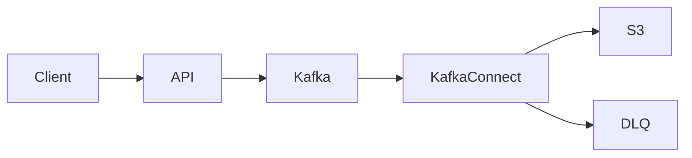
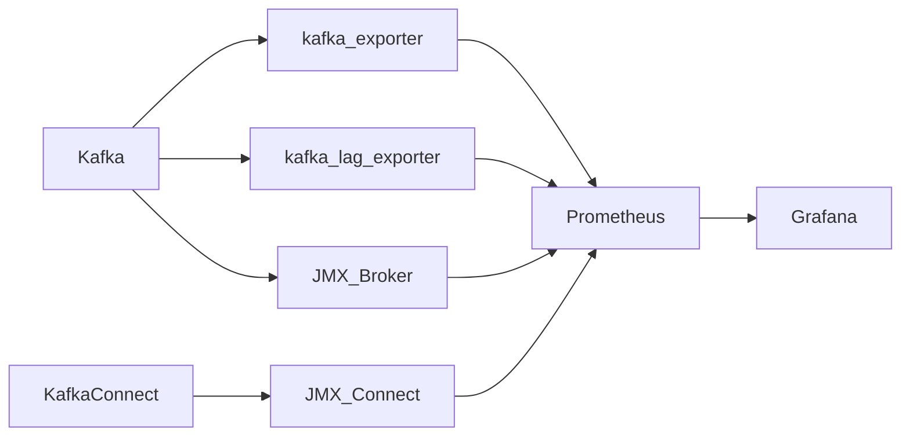

# Kafka + Kafka Connect 핵심 모니터링 지표

```
consumer lag
lag seconds
connector task status
DLQ message rate
```

---

# 1. 목적

Kafka 기반 **사용자 이벤트 → S3 적재 파이프라인**의 상태를 모니터링하여 다음을 빠르게 파악한다.

* Kafka broker 정상 여부
* Kafka Connect connector / task 상태
* Consumer lag (파이프라인 backlog)
* DLQ 발생 여부 (데이터 품질 문제)

목표

* **Kafka → S3 파이프라인 이상 지점 빠르게 식별**
* **데이터 유실 및 처리 지연 감지**

---

# 2. 모니터링 대상 파이프라인



모니터링 포인트

| 위치            | 확인 내용               |
| ------------- | ------------------- |
| Kafka         | broker 상태           |
| Kafka         | topic offset 증가     |
| Kafka Connect | connector / task 상태 |
| Kafka Connect | consumer lag        |
| DLQ topic     | 에러 데이터 발생           |

---

# 3. 사용 Exporter

| Exporter           | 대상            |
| ------------------ | ------------- |
| JMX Exporter       | Kafka Broker  |
| JMX Exporter       | Kafka Connect |
| kafka_exporter     | Kafka cluster |
| kafka-lag-exporter | consumer lag  |

역할

| Exporter           | 목적                         |
| ------------------ | -------------------------- |
| JMX Exporter       | broker / connect 내부 상태     |
| kafka_exporter     | topic / partition / offset |
| kafka-lag-exporter | consumer lag               |

---

# 4. 전체 구조



---

# 5. 핵심 모니터링 지표

Tasteam 파이프라인에서 **실제로 중요한 지표만 선정**

| 영역        | Metric                                           | 목적               |
| --------- | ------------------------------------------------ | ---------------- |
| Broker    | kafka_brokers                                    | broker 정상 여부     |
| Topic     | kafka_topic_partition_current_offset             | 이벤트 증가           |
| Lag       | kafka_consumergroup_group_lag                    | pipeline backlog |
| Lag       | kafka_consumergroup_lag_seconds                  | 처리 지연            |
| Connector | kafka.connect.task.status                        | connector 상태     |
| DLQ       | kafka_topic_partition_current_offset (DLQ topic) | 에러 데이터 발생        |

---

# 6. Grafana Dashboard

## Kafka 상태

확인

* broker 수
* JVM memory
* request latency

목적

* Kafka cluster 정상 여부 확인

---

## Pipeline Lag

확인

* consumer lag
* lag seconds
* topic offset 증가

목적

* Kafka → Connect backlog 탐지

---

## Kafka Connect

확인

* connector status
* task status
* task failure

목적

* connector 장애 탐지

---

## DLQ Dashboard

확인

* DLQ message rate
* DLQ total message

metric

```text
rate(kafka_topic_partition_current_offset{topic="*-dlq"}[5m])
```

의미

| 값 | 의미 |
| - | -- |
| 0 | 정상 |

> 0 | 에러 데이터 발생 |

---

# 7. Alert 규칙

## Broker 장애

조건

```
kafka_brokers < expected_brokers
```

---

## Consumer lag 증가

조건

```
kafka_consumergroup_group_lag > threshold
```

예

```
> 10000
```

---

## Connector task failure

조건

```
kafka_connect_task_status != running
```

---

## DLQ 발생

조건

```
rate(kafka_topic_partition_current_offset{topic="*-dlq"}[5m]) > 0
```

의미

→ Kafka Connect 처리 실패 발생

---

# 8. 장애 분석 순서

문제 발생 시 확인 순서

1️⃣ Broker 상태 확인
2️⃣ Topic offset 증가 확인
3️⃣ Consumer lag 확인
4️⃣ Connector task 상태 확인
5️⃣ DLQ 발생 여부 확인

---

# 9. TODO 리스트

## Exporter 구축

* [ ] Kafka Broker JMX exporter 설정
* [ ] Kafka Connect JMX exporter 설정
* [ ] kafka_exporter container 실행
* [ ] kafka-lag-exporter container 실행

---

## Prometheus

* [ ] exporter scrape 설정
* [ ] Kafka metric 수집 확인

---

## Grafana

* [ ] Kafka cluster dashboard
* [ ] Kafka lag dashboard
* [ ] Kafka Connect dashboard
* [ ] DLQ dashboard

---

## Alert

* [ ] broker down alert
* [ ] connector task failure alert
* [ ] consumer lag alert
* [ ] DLQ 발생 alert

---

# 10. 운영 목표

Kafka 이벤트 파이프라인에서 다음을 **1분 이내 식별**할 수 있도록 한다.

* broker 장애
* connector failure
* pipeline backlog
* DLQ 발생

