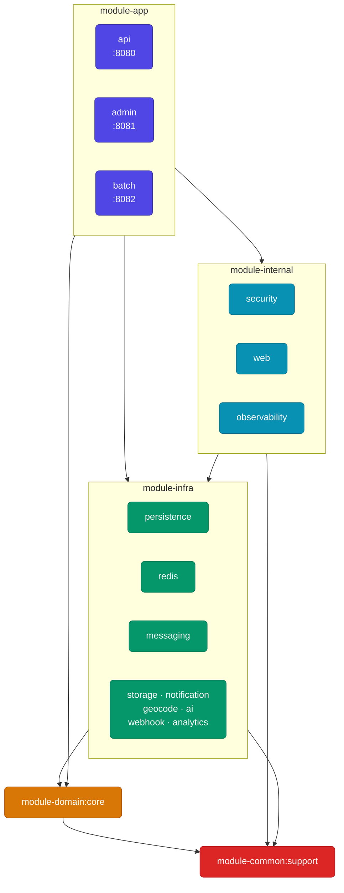

# module-app

## 이 레이어는 무엇인가

**실행 가능한 Spring Boot 애플리케이션** 레이어다.
하위 레이어(domain, infra, internal, common)를 조합하여 사용자 또는 시스템에 실제 서비스를 제공한다.
각 모듈은 독립적으로 배포·실행 가능한 `bootJar`를 생성한다.

이 레이어에만 존재해야 하는 것: **서비스 오케스트레이션, 컨트롤러, 앱 전용 설정, 스케줄러**

---

## 의존성 위치



이 레이어를 의존하는 모듈은 없다 (최상위 실행 레이어).

---

## 포함된 모듈

| 모듈 | 포트 | 역할 |
|---|---|---|
| `module-app:api` | 8080 | 모바일 앱 사용자 대상 REST API |
| `module-app:admin` | 8081 | 관리자 전용 패널 |
| `module-app:batch` | 8082 | 배치 처리 및 스케줄링 |

### module-app:api

모바일 앱 사용자에게 제공하는 메인 REST API 서버.

```
com.tasteam/
├── api/           ApiApplication (진입점)
├── domain/        각 도메인 Controller, Service, 앱 전용 DTO
│   ├── auth/      로그인, 토큰 갱신
│   ├── member/    회원 프로필
│   ├── restaurant/식당 조회, 메뉴
│   ├── review/    리뷰 작성/조회
│   ├── group/     그룹 관리
│   ├── chat/      채팅
│   ├── file/      파일 업로드
│   ├── search/    식당 검색
│   ├── notification/ 알림
│   └── ...
├── global/        앱 전용 설정 (캐시, 비동기, Kafka Consumer 등)
├── infra/         앱 전용 인프라 (analytics 이벤트, Redis 키 정의 등)
└── batch/         배치 Job (추천, AI 리뷰, 이미지 최적화)
```

**특이사항:**
- **Flyway 마이그레이션 단독 실행** — DB 스키마 변경은 이 모듈만 적용
- **testFixtures 제공** — 다른 모듈 테스트에서 `testFixtures(project(':module-app:api'))`로 공유 픽스처 사용

### module-app:admin

관리자가 사용하는 내부 패널 서버.

```
com.tasteam/
├── admin/         AdminApplication (진입점)
└── domain/
    ├── admin/     관리자 대시보드, 잡 실행
    ├── restaurant/식당 등록, 메뉴 관리
    ├── member/    회원 관리
    ├── review/    리뷰 관리
    ├── promotion/ 프로모션 관리
    ├── announcement/ 공지사항
    ├── file/      파일 관리
    └── notification/ 알림 발송
```

**특이사항:**
- `module-app:api`와 달리 Kafka, AI, 웹훅 모듈 미사용 (불필요 의존 최소화)
- Flyway `enabled: false` — `module-app:api`가 DB 마이그레이션 담당

### module-app:batch

주기적 배치 작업 및 스케줄러 서버 (현재 api와 동일 코드베이스, 추후 점진적 분리 예정).

```
com.tasteam/
└── batch/app/     BatchApplication (진입점)
```

**현재 포함 예정 배치 작업:**
- 식당 추천 갱신 (Materialized View refresh)
- AI 기반 리뷰 키워드 추출
- 이미지 WebP 최적화
- 더미 데이터 시딩 (dev/stg 환경)

**특이사항:**
- Flyway `enabled: false` — `module-app:api`가 DB 마이그레이션 담당
- 포트 8082 (기본값, `SERVER_PORT` 환경변수로 변경 가능)

---

## 포함되면 안 되는 것

| 금지 항목 | 이유 |
|---|---|
| 재사용 가능한 인프라 클라이언트 | → module-infra:* 에 이동 |
| 공통 기술 프레임워크 (인증, 메트릭 등) | → module-internal:* 에 이동 |
| 도메인 엔티티, 비즈니스 정책 | → module-domain:core 에 이동 |
| `module-app:*` 간 상호 의존 | 각 앱은 독립 배포 단위 |

---

## 의존 관계

### 이 레이어가 의존할 수 있는 것

- `module-common:support`, `module-domain:core` — 기본
- `module-infra:*` — 필요한 인프라 모듈만 선택적으로
- `module-internal:security`, `module-internal:web`, `module-internal:observability` — 공통 기술 프레임워크

### 이 레이어를 의존하는 것

없음. 이 레이어는 최상위 실행 단위다.
단, `testFixtures`는 타 모듈 테스트에서 참조 가능:
```gradle
testImplementation(testFixtures(project(':module-app:api')))
```

---

## 배포 및 실행

각 모듈은 독립적인 `bootJar`를 생성한다:
```bash
# API 서버
./gradlew :module-app:api:bootJar

# Admin 패널
./gradlew :module-app:admin:bootJar

# Batch 서버
./gradlew :module-app:batch:bootJar
```

환경별 프로파일:
| 프로파일 | 용도 |
|---|---|
| `local` | 로컬 개발 (Docker Compose) |
| `dev` | 개발 서버 |
| `stg` | 스테이징 서버 |
| `prod` | 프로덕션 서버 |
| `test` | 테스트 (Testcontainers) |

---

## 새 앱 모듈 추가 가이드

1. `module-app/<name>/` 디렉터리 생성
2. `settings.gradle`에 `include 'module-app:<name>'` 추가
3. `build.gradle`에 `id 'org.springframework.boot'` + `id 'io.spring.dependency-management'` 플러그인 적용 (root build.gradle에서 자동 적용됨)
4. Application 진입점 생성:
   ```java
   @SpringBootApplication(scanBasePackages = {"com.tasteam"})
   public class <Name>Application {
       public static void main(String[] args) {
           SpringApplication.run(<Name>Application.class, args);
       }
   }
   ```
5. 패키지명이 `com.tasteam.<기존 도메인>` 과 충돌하면 하위 패키지 사용 (`com.tasteam.<name>.app`)
6. Flyway는 `module-app:api`만 실행 — 새 앱의 yml에 `flyway.enabled: false` 설정
