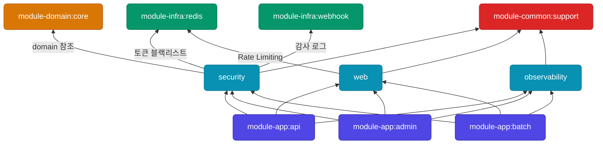

# module-internal

## 이 레이어는 무엇인가

**횡단관심사(Cross-cutting concerns) 프레임워크** 레이어다.
인증, HTTP 설정, 모니터링처럼 여러 애플리케이션에서 공통으로 필요하지만 비즈니스 로직은 아닌 기술 프레임워크를 제공한다.
`module-app:*`에 pluggable하게 주입되며, 각 모듈은 독립적으로 사용할 수 있다.

---

## 의존성 위치



---

## 포함된 모듈

| 모듈 | 역할 |
|---|---|
| `module-internal:security` | JWT 인증, OAuth2 로그인, Spring Security 설정 |
| `module-internal:web` | HTTP 설정, 전역 예외처리, OpenAPI, Rate Limiting |
| `module-internal:observability` | AOP 메트릭, Prometheus, 분산 추적, 요청 로깅 |

### module-internal:security

인증/인가에 관한 모든 기술 프레임워크를 포함한다.

```
global/security/
├── config/      SecurityConfig, CorsConfig, PasswordEncoderConfig
├── jwt/         JwtTokenProvider, JwtAuthenticationFilter, JwtProperties
│   ├── filter/  Token 검증 필터
│   ├── resolver 파라미터 주입 (@CurrentUser 등)
│   └── logout/  토큰 블랙리스트 (Redis)
├── oauth/       OAuth2 로그인 핸들러, 프로바이더 (Google, Kakao)
├── user/        UserRepositoryPort, CustomUserDetails
├── logout/      LogoutHandler, CustomLogoutFilter
├── exception/   CustomAuthenticationEntryPoint, FilterChainExceptionFilter
└── common/      ApiEndpoints, SecurityConstants, 보안 유틸리티
```

- JJWT 0.13.0 기반 JWT 발급/검증
- OAuth2 Client (Google, Kakao)
- Redis 기반 토큰 블랙리스트(로그아웃)
- 보안 이벤트는 `module-infra:webhook`으로 감사 로그 발송
- **testFixtures 제공**: JWT 테스트 토큰 생성 유틸 포함

### module-internal:web

HTTP 계층의 공통 인프라를 담당한다.

```
global/
├── config/           WebMvcConfig, SchedulingConfig
├── exception/handler GlobalExceptionHandler (전역 예외 → HTTP 응답 변환)
├── health/           HealthCheckController, 헬스 프로브 응답
├── ratelimit/        RedisRateLimiter, RateLimitPolicy, ClientIpResolver
└── swagger/
    ├── config/       SpringDoc OpenAPI 설정
    ├── annotation/   SwaggerTagOrder, @SwaggerErrorResponseDescription
    └── error/code/   도메인별 에러 코드 문서화 (auth, member, restaurant 등)
```

- Rate Limiting: Redis 기반 고정 윈도우 정책
- Swagger: 도메인별 에러 코드 카탈로그 자동 문서화
- Health Check: Kubernetes liveness/readiness 프로브 지원

### module-internal:observability

AOP 기반 운영 가시성(Observability)을 담당한다.

```
global/
├── aop/
│   ├── Observed*.java         마킹 어노테이션 (ObservedExecutor, ObservedOutbox 등)
│   ├── ApiMetricsAspect       HTTP 요청 메트릭
│   ├── DbQueryCountAspect     트랜잭션당 쿼리 횟수 추적
│   ├── TransactionTracingAspect  분산 추적 연동
│   ├── ServicePerformanceAspect  서비스 메서드 소요시간
│   ├── ExceptionLoggingAspect    예외 로그
│   └── ApiLoggingAspect          요청/응답 로그
├── diagnostics/  ApplicationLifecycleDiagnosticsLogger
├── filter/       TraceIdFilter (X-Trace-Id 헤더 전파)
└── metrics/
    ├── ThreadPoolExecutorMetricsSupport  스레드풀 메트릭
    ├── LocalCacheMetricsBinder           Caffeine 캐시 메트릭
    └── postgres/  PostgresMetricsCollector
```

- Micrometer Prometheus 익스포트
- AOP 설정은 yml 프로퍼티(`tasteam.aop.logging.*`)로 on/off 가능

---

## 포함되면 안 되는 것

| 금지 항목 | 이유 |
|---|---|
| 특정 앱 전용 설정 (특정 도메인 Bean 등) | → 해당 module-app으로 이동 |
| 도메인 비즈니스 로직 | → module-domain:core |
| `module-internal:*` 간 순환 의존 | 예: observability → security 금지 |
| 직접 DB 쿼리, 직접 Kafka 발행 | → module-infra:* 에서 담당 |

---

## 의존 관계

### 이 레이어가 의존할 수 있는 것

| 모듈 | 허용 조건 |
|---|---|
| `module-common:support` | 전체 허용 |
| `module-domain:core` | `security`만 (회원/인증 엔티티 참조) |
| `module-infra:redis` | `web` (Rate Limiting), `security` (토큰 블랙리스트) |
| `module-infra:webhook` | `security`만 (보안 이벤트 감사 로그) |
| `module-internal:*` | 순환 의존 금지 |

### 이 레이어를 의존하는 것

| 의존 주체 | 사용 모듈 |
|---|---|
| `module-app:api` | security, web, observability 전체 |
| `module-app:admin` | security, web, observability 전체 |
| `module-app:batch` | security, web, observability 전체 |

---

## 새 internal 모듈 추가 기준

아래 두 조건을 모두 만족할 때 이 레이어에 추가한다:
1. **여러 module-app에서 공통으로 사용**하는 기술 프레임워크
2. **비즈니스 도메인 로직을 포함하지 않음**

조건 불만족 시:
- 특정 앱에서만 사용 → 해당 module-app 내부에 구현
- 도메인 로직 포함 → module-domain:core 또는 module-app으로 이동
